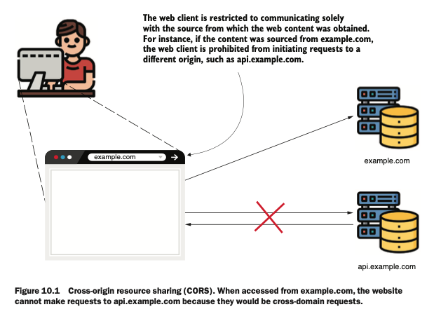
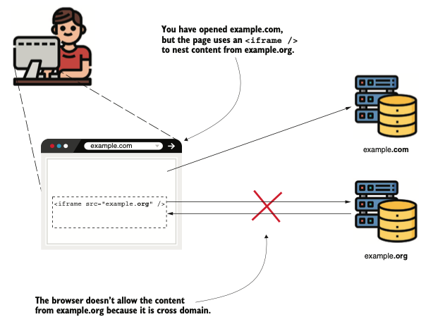
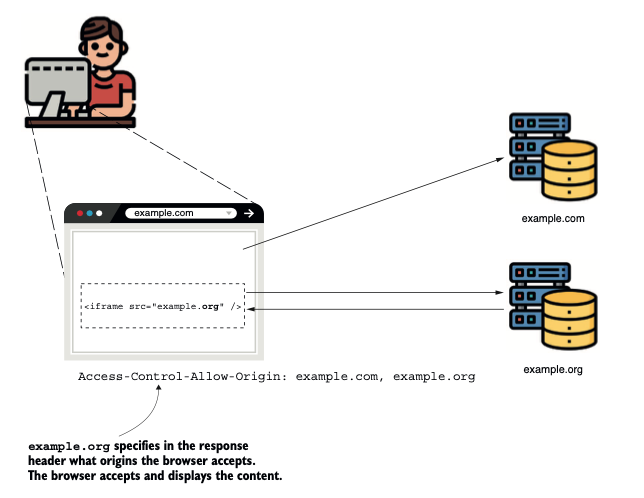
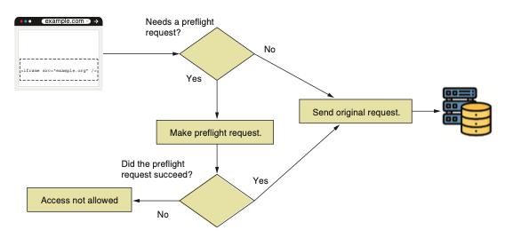

# **Configurando CORS**

### Este capítulo cubre
- Definición de CORS
- Aplicación de configuraciones de CORS

En este capítulo, analizamos el intercambio de recursos de origen cruzado `(CORS)` y cómo aplicarlo 
con Spring Security. Primero, `¿qué es CORS y por qué debería importarle?` La necesidad de `CORS` surge 
de las aplicaciones web. Por defecto, los navegadores no permiten solicitudes a ningún dominio 
distinto del que cargó el sitio. Por ejemplo, si accede al sitio desde example.com, el navegador no
permitirá que el sitio realice solicitudes a api.example.com. La siguiente figura ilustra este concepto.



Intercambio de recursos entre orígenes `(CORS)`. Cuando se accede desde example.com, el sitio web no 
puede realizar solicitudes a api.example.com porque serían solicitudes entre dominios diferentes. 
Podemos decir brevemente que una aplicación utiliza el mecanismo `CORS` para relajar esta política 
estricta y permitir solicitudes entre diferentes orígenes bajo ciertas condiciones. Debe conocerlo
porque es probable que tenga que usarlo en sus aplicaciones, especialmente en la actualidad, donde
el frontend y el backend son aplicaciones separadas. Es común que una aplicación frontend se 
desarrolle con frameworks como Angular, ReactJS o Vue y se aloje en un dominio como example.com, 
pero que llame a endpoints del backend alojado en otro dominio, como api.example.com.

Este capítulo proporciona algunos ejemplos para aprender a aplicar políticas CORS en sus 
aplicaciones web. También muestra cómo evitar dejar brechas de seguridad en sus aplicaciones.

## 10.1 ¿Cómo funciona CORS?

Esta sección explica cómo se aplica `CORS` a las aplicaciones web. Si usted es el propietario de 
example.com, y por alguna razón los desarrolladores de example.org deciden llamar a sus puntos 
finales `REST (api.example.com)` desde su sitio web, no podrán hacerlo. La misma situación puede 
ocurrir si un dominio carga su aplicación mediante un iframe (véase la siguiente figura).

`NOTA` Un iframe es un elemento HTML utilizado para integrar contenido generado por una página web 
dentro de otra página web (por ejemplo, para incluir contenido de example.org dentro de una página 
de example.com).

Cualquier situación en la que una aplicación realice llamadas entre dos dominios diferentes está 
prohibida. Por supuesto, puede enfrentarse a situaciones en las que necesite realizar dichas 
llamadas, y es entonces cuando CORS le permitirá especificar desde qué dominio su aplicación acepta
solicitudes y qué detalles pueden compartirse. El mecanismo CORS funciona basándose en cabeceras HTTP.



Incluso si la página de example.org se carga en un iframe desde el dominio example.com, las llamadas
desde el contenido cargado en example.org no se realizarán. Además, incluso si la aplicación realiza
una solicitud, el navegador no aceptará la respuesta.

Los más importantes son
- Access-Control-Allow-Origin: Especifica los dominios externos (orígenes) que pueden acceder a los 
recursos de su dominio.
- Access-Control-Allow-Methods: Permite referirse solo a ciertos métodos HTTP cuando se desea 
permitir el acceso desde un dominio diferente, pero únicamente a métodos HTTP específicos. 
Por ejemplo, se utiliza esto si se desea permitir que example.com llame a un punto final, pero solo
con el método HTTP GET.
- Access-Control-Allow-Headers: Añade limitaciones sobre qué cabeceras se pueden usar en una 
solicitud específica. Por ejemplo, no se desea que el cliente pueda enviar una cabecera específica 
para una solicitud determinada.



Habilitación de solicitudes entre orígenes. El servidor de example.org añade la cabecera 
Access-Control-Allow-Origin para especificar los orígenes de la solicitud cuya respuesta debe ser 
aceptada por el navegador. Si el dominio desde el que se realizó la llamada está incluido en los 
orígenes enumerados, el navegador acepta la respuesta.

Con Spring Security, por defecto, ninguna de estas cabeceras se añade a la respuesta.
Así que empecemos desde el principio: ¿qué ocurre cuando se realiza una llamada entre orígenes si 
no se ha configurado CORS en su aplicación? Cuando la aplicación realiza la solicitud, espera que 
la respuesta incluya una cabecera Access-Control-Allow-Origin que contenga los orígenes aceptados 
por el servidor. Si esto no sucede, como es el caso del comportamiento predeterminado de Spring 
Security, el navegador no aceptará la respuesta. Demostremos esto con una pequeña aplicación web. 
Creamos un nuevo proyecto utilizando las dependencias presentadas en el siguiente fragmento de 
código (puede encontrar este ejemplo en el proyecto ssia-ch10-ex1):
```xml
<dependency>
    <groupId>org.springframework.boot</groupId>
    <artifactId>spring-boot-starter-security</artifactId>
</dependency>
<dependency>
    <groupId>org.springframework.boot</groupId>
    <artifactId>spring-boot-starter-web</artifactId>
</dependency>
<dependency>
    <groupId>org.springframework.boot</groupId>
    <artifactId>spring-boot-starter-thymeleaf</artifactId>
</dependency>
```
Definimos una clase controladora con una acción para la página principal y un punto final REST. 
Dado que la clase es una clase normal de Spring MVC anotada con @Controller, también debemos agregar
explícitamente la anotación @ResponseBody al punto final. La siguiente lista define el controlador.

The definition of the controller class: 
```java
@Controller
public class MainController {
    //Utiliza un registrador (logger) para observar cuándo se llama al metodo test().
    private Logger logger =
            Logger.getLogger(MainController.class.getName());

    //Define una página main.htm que realiza la solicitud al endpoint /test.
    @GetMapping("/")
    public String main() {
        return "main.html";
    }

    @PostMapping("/test")
    @ResponseBody
    //Define un punto final al que llamamos desde un origen diferente para demostrar cómo funciona CORS.
    public String test() {
        logger.info("Test method called");
        return "HELLO";
    }
}
```
Además, necesitamos definir la clase de configuración donde desactivamos la protección CSRF para 
simplificar el ejemplo y permitirle concentrarse únicamente en el mecanismo CORS. Asimismo, 
permitimos el acceso sin autenticación a todos los endpoints. La siguiente lista define esta clase
de configuración.

The definition of the configuration class:
```java
@Configuration
public class ProjectConfig {
    @Bean
    public SecurityFilterChain securityFilterChain(HttpSecurity http)
            throws Exception {
        http.csrf(
                c -> c.disable()
        );
        http.authorizeHttpRequests(
                c -> c.anyRequest().permitAll()
        );
        return http.build();
    }
}
```
Por supuesto, también necesitamos definir el archivo main.html en la carpeta resources/templates del
proyecto. El archivo main.html contiene el código JavaScript que llama al punto de acceso /test. 
Para simular la llamada entre orígenes, podemos acceder a la página desde un navegador utilizando 
el dominio localhost. Desde el código JavaScript, realizamos la llamada utilizando la dirección 
IP 127.0.0.1. Aunque localhost y 127.0.0.1 se refieren al mismo equipo, el navegador interpreta 
estas cadenas de forma diferente y las considera dominios distintos. La siguiente lista define la 
página main.html.

The main.html page:
```html
<!DOCTYPE HTML>
<html lang=»en»>
    <head>
        <script>
            const http = new XMLHttpRequest();
            const url='http://127.0.0.1:8080/test';
            http.open("POST", url);
            http.send();
            http.onreadystatechange = (e) => {
                document
                        .getElementById("output")
                        .innerHTML = http.responseText;
            }
        </script>
    </head>
    <body>
        <div id="output"></div>
    </body>
</html>
```
Al iniciar la aplicación y abrir la página en un navegador con localhost:8080, podemos observar que 
la página no muestra nada. Esperábamos ver HELLO en la página porque eso es lo que devuelve el punto
de acceso /test. Sin embargo, cuando revisamos la consola del navegador, vemos un error impreso por 
la llamada JavaScript. El error es el siguiente:

`Access to XMLHttpRequest at 'http://127.0.0.1:8080/test' from origin
'http://localhost:8080' has been blocked by CORS policy: No 'Access-
Control-Allow-Origin' header is present on the requested resource.`

El mensaje de error nos indica que la respuesta no fue aceptada porque no existe el encabezado 
HTTP Access-Control-Allow-Origin. Este comportamiento ocurre porque no configuramos nada relacionado
con CORS en nuestra aplicación Spring Boot, y por defecto, no establece ningún encabezado relacionado
con CORS. Por lo tanto, el comportamiento del navegador al no mostrar la respuesta es correcto. Sin 
embargo, quiero que notes que en la consola de la aplicación, el registro demuestra que el método 
fue llamado. El siguiente fragmento de código muestra lo que encontrarás en la consola de la 
aplicación:

`INFO 25020 --- [nio-8080-exec-2]
➥c.l.s.controllers.MainController :
➥Test method called`

Este aspecto es importante. Conozco a muchos desarrolladores que entienden CORS como una restricción
similar a la autorización o a la protección CSRF. En lugar de ser una restricción, CORS ayuda a 
relajar una limitación rígida para llamadas entre dominios. E incluso con restricciones aplicadas, 
en algunas situaciones, el punto de acceso puede ser llamado. Este comportamiento no siempre ocurre.
A veces, el navegador primero realiza una llamada utilizando el método HTTP OPTIONS para probar si 
la solicitud debe permitirse. Llamamos a esta solicitud de prueba una solicitud preflight. Si la 
solicitud preflight falla, el navegador no intentará ejecutar la solicitud original. La solicitud 
preflight y la decisión de realizarla son responsabilidad del navegador. No tienes que implementar 
esta lógica. Sin embargo, es importante entenderla para que no te sorprenda recibir llamadas de 
origen cruzado en el backend, incluso si no especificaste ninguna política CORS para dominios 
específicos. Esto también puede ocurrir cuando tienes una aplicación del lado del cliente 
desarrollada con un framework como Angular o ReactJS. La figura 10.4 presenta este flujo de 
solicitud. Cuando el navegador omite hacer la solicitud preflight si el método HTTP es GET, POST 
u OPTIONS, y solo tiene algunos encabezados básicos, como se describe en la documentación oficial 
en `https://fetch.spec.whatwg.org/#http-cors-protocol.`



Para solicitudes simples, el navegador envía la solicitud original directamente al servidor. El 
navegador rechaza la respuesta si el servidor no permite el origen. En algunos casos, el navegador 
envía una solicitud preflight para verificar si el servidor acepta el origen. Si la solicitud 
preflight tiene éxito, el navegador envía la solicitud original. En nuestro ejemplo, el navegador 
realiza la solicitud, pero no aceptamos la respuesta si el origen no está especificado, como se 
muestra en las figuras 10.1 y 10.2. El mecanismo CORS está, en definitiva, relacionado con el 
navegador y no es una forma de proteger los puntos de acceso. Lo único que garantiza es que solo los 
dominios de origen que permitas puedan realizar solicitudes desde páginas específicas en el navegador.

## **Aplicar políticas CORS con la anotación @CrossOrigin**

Esta sección explica cómo configurar `CORS` para permitir solicitudes desde diferentes dominios 
utilizando la anotación `@CrossOrigin`. Puedes colocar la anotación `@CrossOrigin` directamente sobre el
método que define el punto de acceso y configurarla mediante los orígenes y métodos permitidos. Como
aprenderás en esta sección, la ventaja de usar la anotación @CrossOrigin es que facilita la 
configuración de CORS para cada punto de acceso.
Usamos la aplicación que creamos en la sección 10.1 para demostrar cómo funciona `@CrossOrigin`. Para 
que la llamada entre orígenes funcione en la aplicación, lo único que necesitas hacer es agregar la 
anotación `@CrossOrigin` sobre el método `test()` en la clase del controlador. La siguiente lista 
muestra cómo usar la anotación para hacer que localhost sea un origen permitido.

Making localhost an allowed origin:
```java
@PostMapping("/test")
@ResponseBody
//Permite el origen localhost para solicitudes de origen cruzado
@CrossOrigin("http://localhost:8080")
public String test() {
    logger.info("Test method called");
    return "HELLO";
}
```
Puedes volver a ejecutar y probar la aplicación. Ahora debería mostrarse en la página la cadena 
devuelta por el punto de acceso /test: HELLO.

El parámetro value de `@CrossOrigin` recibe un array para permitirte definir múltiples orígenes; por 
ejemplo, `@CrossOrigin({"example.com", "example.org"})`. También puedes establecer los encabezados y 
métodos permitidos usando los atributos allowedHeaders y methods de la anotación. Tanto para orígenes
como para encabezados, puedes usar el asterisco (*) para representar todos los encabezados o todos 
los orígenes. Sin embargo, te recomiendo tener precaución con este enfoque. Siempre es mejor filtrar
los orígenes y encabezados que deseas permitir y nunca permitir que cualquier dominio ejecute código 
que acceda a los recursos de tu aplicación.

Al permitir todos los orígenes, expones la aplicación a solicitudes de scripting entre sitios `(XSS)`,
lo que eventualmente puede derivar en ataques de denegación de servicio `(DDoS)`. Personalmente, evito
permitir todos los orígenes incluso en entornos de prueba. Sé que a veces las aplicaciones terminan 
ejecutándose en infraestructuras mal definidas que usan los mismos centros de datos para entornos de
prueba y producción. Es más prudente tratar de forma independiente todas las capas en las que se 
aplica la seguridad, como discutimos en el capítulo 1, y evitar asumir que la aplicación no tiene 
vulnerabilidades particulares porque la infraestructura no lo permite.

La ventaja de usar @CrossOrigin para especificar las reglas directamente donde se definen los puntos
de acceso es que genera una buena transparencia de las reglas. La desventaja es que puede volverse 
repetitivo, obligándote a repetir mucho código. También impone el riesgo de que el desarrollador 
olvide añadir la anotación en puntos de acceso recién implementados. En la sección 10.3, discutimos 
la aplicación de la configuración CORS de forma centralizada dentro de la clase de configuración.

## **Aplicar CORS usando un CorsConfigurer**

Aunque usar la anotación `@CrossOrigin` es sencillo, como aprendiste en la sección 10.2, en muchos 
casos puede resultar más cómodo definir la configuración de CORS en un solo lugar. En esta sección, 
modificamos el ejemplo trabajado en las secciones 10.1 y 10.2 para aplicar la configuración de `CORS` 
en la clase de configuración utilizando un Customizer. La siguiente lista muestra los cambios que 
debemos realizar en la clase de configuración para definir los orígenes que deseamos permitir.

Definir configuraciones CORS centralizadas en la clase de configuración:
```java
@Configuration
public class ProjectConfig {
    @Bean
    public SecurityFilterChain securityFilterChain(HttpSecurity http)
    throws Exception {
        http.cors(c -> {
            CorsConfigurationSource source = request -> {
                CorsConfiguration config = new CorsConfiguration();
                config.setAllowedOrigins(
                        List.of("example.com", "example.org"));
                config.setAllowedMethods(
                        List.of("GET", "POST", "PUT", "DELETE"));
                config.setAllowedHeaders(List.of("*"));
                return config;
                };
                c.configurationSource(source);
            });
            http.csrf(
                    c -> c.disable()
            );
            http.authorizeHttpRequests(
                    c -> c.anyRequest().permitAll()
            );
            return http.build();
    }

}
```
El método `cors()` que llamamos desde el objeto `HttpSecurity` recibe como parámetro un objeto 
`Customizer`. Para este objeto, establecemos una `CorsConfigurationSource`, que devuelve una 
`CorsConfiguration` para una solicitud HTTP. `CorsConfiguration` es el objeto que indica cuáles son los
orígenes, métodos y encabezados permitidos. Si usas este enfoque, debes especificar al menos los 
orígenes y los métodos. Si solo especificas los orígenes, tu aplicación no permitirá las solicitudes.
Este comportamiento ocurre porque un objeto `CorsConfiguration` no define ningún método por defecto. 
En este ejemplo, para hacer la explicación sencilla, proporciono la implementación de 
`CorsConfigurationSource` como una expresión lambda directamente en el bean `SecurityFilterChain`. 
Recomiendo encarecidamente separar este código en una clase diferente en tus aplicaciones. En 
aplicaciones reales, el código podría ser mucho más extenso, por lo que se volvería difícil de leer
si no se separa de la clase de configuración.

### Resumen

- CORS se refiere a la situación en la que una aplicación web alojada en un dominio específico 
intenta acceder a contenido desde otro dominio.
- Por defecto, el navegador no permite solicitudes de origen cruzado. Por lo tanto, la configuración
de `CORS` permite que una parte de tus recursos sea accesible desde un dominio diferente en una 
aplicación web que se ejecuta en el navegador.
- Puedes configurar `CORS` para un punto de acceso usando la anotación @CrossOrigin o de forma 
centralizada en la clase de configuración utilizando el método `cors()` del objeto `HttpSecurity`.