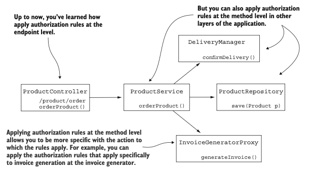
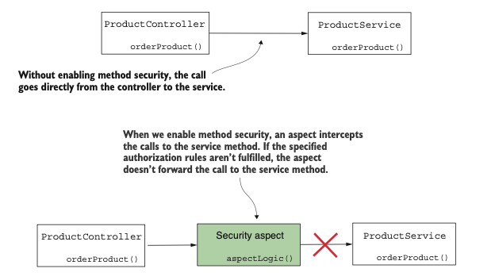
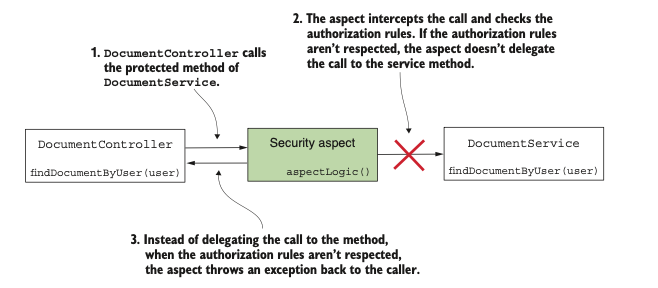
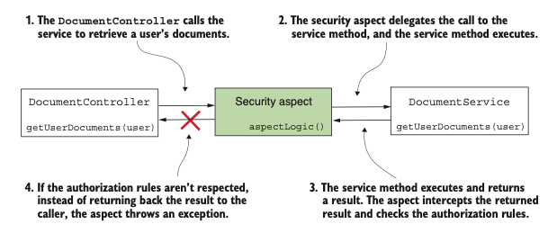
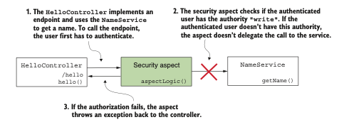
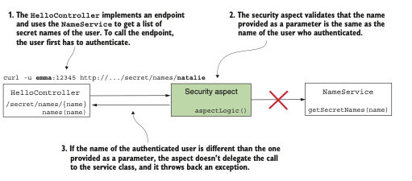
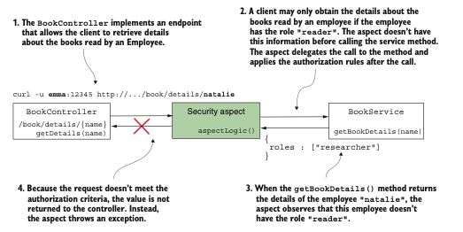

# **Implementación de la autorización a nivel de método**

### Este capítulo trata sobre

- La seguridad a nivel de método en aplicaciones Spring
- La preautorización de métodos basada en autoridades, roles y permisos
- La postautorización de métodos basada en autoridades, roles y permisos

Hasta ahora, hemos analizado diversas formas de configurar la autenticación. Comenzamos con el 
enfoque más sencillo, HTTP Basic, en el capítulo 2, y luego mostré cómo configurar el inicio de 
sesión mediante formulario en el capítulo 6. Sin embargo, en cuanto a la autorización, solo hemos 
discutido la configuración a nivel de punto de acceso. Supongamos que tu aplicación no es una 
aplicación web: ¿tampoco puedes usar Spring Security para autenticación y autorización? Spring 
Security es adecuado para escenarios en los que tu aplicación no se utiliza a través de puntos de 
acceso HTTP. En este capítulo, aprenderás cómo configurar la autorización a nivel de método. Usaremos
este enfoque para configurar la autorización tanto en aplicaciones web como no web, y lo llamaremos 
seguridad a nivel de método.



La seguridad a nivel de método te permite ser más granular y aplicar reglas de autorización en 
cualquier nivel específicamente elegido de tu aplicación.

Para aplicaciones no web, la seguridad a nivel de método nos permite implementar reglas de 
autorización incluso si no tenemos puntos de acceso. En aplicaciones web, este enfoque nos brinda la
flexibilidad de aplicar reglas de autorización a diferentes capas de la aplicación, no solo a nivel 
de punto de acceso.

Profundicemos en el capítulo y aprendamos cómo aplicar autorización a nivel de método con la 
seguridad a nivel de método.

## 11.1 Habilitar la seguridad a nivel de método

Esta sección muestra cómo habilitar la autorización a nivel de método y las diferentes opciones que 
Spring Security ofrece para aplicar diversas reglas de autorización. Este enfoque proporciona mayor 
flexibilidad al implementar autorización, siendo una habilidad esencial para resolver situaciones 
donde no basta con configurarla solo a nivel de punto de acceso.

Por defecto, la seguridad a nivel de método está deshabilitada, por lo que para usar esta 
funcionalidad primero debes activarla, generalmente mediante la anotación @EnableMethodSecurity en 
una clase de configuración. Además, Spring Security ofrece varios enfoques para aplicar autorización,
entre los que destacan:

Llamada a autorización: Determina si un usuario puede invocar un método según reglas de privilegio 
(preautorización) o si puede acceder al valor devuelto tras la ejecución del método (postautorización).
Filtrado: Controla qué datos puede recibir un método por sus parámetros (prefiltrado) y qué puede 
devolver al llamador tras su ejecución (postfiltrado). El filtrado se aborda en detalle en el 
capítulo 12.

### 11.1.1 Comprender la autorización de llamadas

Uno de los enfoques para configurar reglas de autorización con seguridad a nivel de método es la 
autorización de llamadas. Este enfoque consiste en aplicar reglas que deciden si se puede invocar un
método (preautorización) o si el llamador puede acceder al valor devuelto tras su ejecución 
(postautorización). A menudo necesitamos decidir si alguien puede acceder a una lógica específica 
según los parámetros proporcionados o según su resultado.

¿Cómo funciona la seguridad a nivel de método? ¿Cuál es el mecanismo detrás de la aplicación de las 
reglas de autorización? Cuando habilitamos la seguridad a nivel de método en nuestra aplicación, 
activamos un aspecto de Spring. Este aspecto intercepta las llamadas al método al que aplicamos 
reglas de autorización y, según dichas reglas, decide si permite o no que la llamada continúe hacia 
el método.


Cuando habilitamos la seguridad a nivel de método, un aspecto intercepta la llamada al método 
protegido. Si no se cumplen las reglas de autorización especificadas, el aspecto no delega la 
llamada al método protegido.

Numerosas implementaciones en el framework Spring se basan en la programación orientada a aspectos 
(AOP). La seguridad a nivel de método es solo uno de los muchos componentes en aplicaciones Spring 
que dependen de aspectos. Si necesitas repasar los aspectos y AOP, te recomiendo leer el capítulo 6
del libro Spring Start Here (Manning, 2021), otro libro que escribí. Breve resumen: clasificamos la 
autorización de llamadas como:

- Preautorización: El framework verifica las reglas de autorización antes de la ejecución del método.
- Postautorización: El framework verifica las reglas de autorización después de que el método se ejecuta.

Analicemos ambos enfoques, los describamos e implementémoslos con algunos ejemplos.

#### Uso de la preautorización para proteger el acceso a métodos

Supongamos que tenemos un método `findDocumentsByUser(String username)` que devuelve al llamador los 
documentos de un usuario específico. El llamador proporciona, mediante los parámetros del método, 
el nombre del usuario para el cual se recuperan los documentos. Supongamos que necesitas asegurarte
de que el usuario autenticado solo pueda obtener sus propios documentos. ¿Podemos aplicar una regla 
a este método para que solo se permitan las llamadas que reciban como parámetro el nombre de usuario
del usuario autenticado? Sí. Esto es precisamente lo que hacemos con la preautorización.

Cuando aplicamos reglas de autorización que prohíben completamente que alguien llame a un método en 
situaciones específicas, lo llamamos preautorización (siguiente figura). Este enfoque implica que el 
framework verifica las condiciones de autorización antes de ejecutar el método. Si el llamador no 
tiene los permisos según las reglas de autorización que definimos, el framework no delega la llamada
al método. En cambio, el framework lanza una excepción llamada AccessDeniedException. Este es, con 
mucho, el enfoque más utilizado en la seguridad a nivel de método. 



Con la preautorización, las reglas de autorización se verifican antes de delegar la llamada al método.
El framework no delegará la llamada si no se cumplen las reglas de autorización y, en su lugar, 
lanzará una excepción al llamador del método.

Normalmente, no queremos que una funcionalidad se ejecute en absoluto si no se cumplen ciertas 
condiciones. Puedes aplicar condiciones basadas en el usuario autenticado y también hacer referencia
a los valores que el método recibió a través de sus parámetros.

#### Usar la postautorización para proteger una llamada a un método

Cuando aplicamos reglas de autorización que permiten a alguien llamar a un método, pero no 
necesariamente obtener el resultado devuelto, estamos usando la postautorización (siguiente figura).
Con la postautorización, Spring Security verifica las reglas de autorización después de que el 
método se ejecuta. Puedes usar este tipo de autorización para restringir el acceso al valor devuelto
por el método bajo ciertas condiciones. Como la postautorización ocurre después de la ejecución del 
método, puedes aplicar las reglas de autorización sobre el resultado devuelto.



Con la postautorización, el aspecto delega la llamada al método protegido. Después de que el método
protegido finaliza su ejecución, el aspecto verifica las reglas de autorización. Si no se cumplen 
las reglas, en lugar de devolver el resultado al llamador, el aspecto lanza una excepción.

Normalmente, se usa la postautorización para aplicar reglas de autorización basadas en lo que el 
método devuelve tras su ejecución. Pero ¡ten cuidado con la postautorización! Si el método modifica
algo durante su ejecución, el cambio se produce independientemente de si la autorización tiene éxito.

`NOTA`: Incluso con la anotación `@Transactional`, un cambio no se deshace si la postautorización falla.
La excepción lanzada por la funcionalidad de postautorización ocurre después de que el administrador
de transacciones confirme la transacción. Para que la transacción se revierta, es necesario 
configurar explícitamente el orden de los aspectos de seguridad y transacción, asegurando que la 
verificación de seguridad ocurra dentro del límite de la transacción.

### 11.1.2 Habilitar la seguridad por métodos en tu proyecto

En esta sección trabajaremos en un proyecto para aplicar las características de preautorización y 
postautorización ofrecidas por la seguridad a nivel de método. La seguridad por métodos no está 
habilitada por defecto en un proyecto de Spring Security. Para usarla, primero debes activarla. 
Afortunadamente, habilitar esta funcionalidad es sencillo: simplemente debes usar la anotación 
`@EnableMethodSecurity` en la clase de configuración.

He creado un nuevo proyecto para este ejemplo, ssia-ch11-ex1. Para este proyecto, escribí una clase
de configuración llamada `ProjectConfig`, como se muestra en el siguiente codigo. En la clase de 
configuración, agregamos la anotación `@EnableMethodSecurity`. Esta anotación activa la seguridad 
basada en anotaciones para métodos, permitiendo que Spring Security aplique los aspectos necesarios 
para el control de acceso.

La seguridad por métodos ofrece tres enfoques para definir las reglas de autorización, que se 
discuten en este capítulo:
- Las anotaciones de pre/postautorización (habilitadas por defecto)
- La anotación JSR 250, `@RolesAllowed`
- La anotación `@Secured`

Dado que en casi todos los casos se utiliza únicamente el enfoque de anotaciones de
pre/postautorización, este es el que se aborda en el capítulo. Este enfoque se habilita 
automáticamente al agregar la anotación `@EnableMethodSecurity`. Al final del capítulo se incluye una
breve descripción de las otras dos opciones.

Enabling method security:
```java
@Configuration
@EnableMethodSecurity
public class ProjectConfig {}
```
Puedes usar la seguridad a nivel de método con cualquier enfoque de autenticación, desde 
autenticación `HTTP Basic` hasta `OAuth 2` (que aprenderás en la tercera parte de este libro). Para 
mantenerlo simple y permitirte concentrarte en los nuevos detalles, implementamos la seguridad a
nivel de método con autenticación `HTTP Basic`. Por esta razón, el archivo pom.xml de los proyectos 
en este capítulo solo necesita las dependencias de web y Spring Security, como muestra el siguiente
fragmento de código:
```xml
<dependency>
    <groupId>org.springframework.boot</groupId>
    <artifactId>spring-boot-starter-security</artifactId>
</dependency>
<dependency>
    <groupId>org.springframework.boot</groupId>
    <artifactId>spring-boot-starter-web</artifactId>
</dependency>
```
`NOTA` En versiones anteriores de Spring Security, se utilizaba la anotación 
`@EnableGlobalMethodSecurity`, y las funciones de pre y postautorización no estaban habilitadas por 
defecto. A partir de Spring Security 6, esta anotación ha sido reemplazada por 
`@EnableMethodSecurity`, que habilita por defecto las anotaciones `@PreAuthorize` y `@PostAuthorize`. 
Si necesitas trabajar con una versión anterior de Spring Security (anterior a la 6), puede ser 
útil consultar el capítulo 16 de la primera edición de Spring Security in Action.

## 11.2 Aplicar reglas de preautorización
En esta sección, implementamos un ejemplo de preautorización. Para nuestro ejemplo, continuamos con
el proyecto ssia-ch11-ex1 iniciado en la sección 11.1. Como se discutió en la sección 11.1, la 
preautorización implica definir reglas de autorización que Spring Security aplica antes de llamar a
un método específico. Si no se cumplen las reglas, el framework no llama al método. La aplicación 
que implementamos en esta sección tiene un escenario simple. Expone un punto de acceso, `/hello`, que
devuelve la cadena `"Hello"`, seguida de un nombre. Para obtener el nombre, el controlador llama a un 
método de servicio (siguiente figura). Este método aplica una regla de preautorización para verificar 
que el usuario tenga autoridad de escritura.



Para llamar al método `getName()` de `NameService`, el usuario autenticado necesita tener autoridad de 
escritura. Si el usuario no tiene esta autoridad, el framework no permitirá la llamada y lanzará 
una excepción.

Agregué un `UserDetailsService` y un `PasswordEncoder` para asegurarme de tener usuarios con los que 
autenticar. Para validar nuestra solución, necesitamos dos usuarios: uno con autoridad de escritura 
y otro sin ella. Demostraremos que el primer usuario puede llamar al endpoint con éxito, mientras 
que para el segundo, la aplicación lanzará una excepción de autorización al intentar llamar al 
método. El siguiente codigo muestra la definición completa de la clase de configuración, que define 
el `UserDetailsService` y el `PasswordEncoder`. 

The configuration class for UserDetailsService and PasswordEncoder:
```java
@Configuration
@EnableMethodSecurity //habilitando los metodos pre/postAuthorize
public class ProjectConfig {
    @Bean //Agrega un UserDetailsService al contexto de Spring con dos usuarios para pruebas
    public UserDetailsService userDetailsService() {
        var service = new InMemoryUserDetailsManager();
        var u1 = User.withUsername("natalie")
                .password("12345")
                .authorities("read")
                .build();
        var u2 = User.withUsername("emma")
                .password("12345")
                .authorities("write")
                .build();
        service.createUser(u1);
        service.createUser(u2);
        return service;
    }

    @Bean //Agrega un PasswordEncoder al contexto de Spring
    public PasswordEncoder passwordEncoder() {
        return NoOpPasswordEncoder.getInstance();
    }
}    
```
Para definir la regla de autorización de este método, usamos la anotación `@PreAuthorize`. La 
anotación `@PreAuthorize` recibe como valor una expresión del Lenguaje de Expresiones de `Spring (SpEL)`
que describe la regla de autorización. En este ejemplo, aplicamos una regla sencilla.

Puedes definir restricciones para los usuarios según sus autoridades utilizando el método 
`hasAuthority()`. Aprendiste sobre el método `hasAuthority()` en el capítulo 7, donde discutimos la 
aplicación de autorización a nivel de punto de acceso. El siguiente codigo define la clase de 
servicio, que proporciona el valor para el nombre.

La clase de servicio que define la regla de preautorización en el método:
```java
@RestController
public class HelloController {
    private final NameService nameService; //Inyecta el servicio desde el contexto

    // omitted constructor
    @GetMapping("/hello")
    public String hello() {
        return "Hello, " + nameService.getName(); //Llama al metodo al que aplicamos las reglas de preautorización
    }
}
```
Ahora puedes iniciar la aplicación y probar su comportamiento. Esperamos que solo la usuaria Emma 
esté autorizada para llamar al punto de acceso, ya que ella tiene la autorización de escritura. 
El siguiente fragmento de código muestra las llamadas al punto de acceso con nuestros dos usuarios,
Emma y Natalie. Para llamar al punto de acceso /hello y autenticarse con la usuaria Emma, usa este 
comando cURL:

`curl -u emma:12345 http://localhost:8080/hello`

El cuerpo de la respuesta es:

`Hello, Fantastico`

Para llamar al punto de acceso /hello y autenticarse con la usuaria Natalie, usa este comando cURL:

`curl -u natalie:12345 http://localhost:8080/hello`

El cuerpo de la respuesta es:
```json
{ 
  "status":403, 
  "error":"Forbidden", 
  "message":"Forbidden", 
  "path":"/hello"
}
```
De manera similar, puedes usar cualquiera de las otras expresiones que discutimos en el capítulo 7
para la autenticación a nivel de punto de acceso. Aquí tienes un breve resumen de ellas:
- `hasAnyAuthority()`: Especifica múltiples autoridades. El usuario debe tener al menos una de estas
autoridades para llamar al método.
- `hasRole()`: Especifica un rol que debe tener el usuario para llamar al método.
- `hasAnyRole()`: Especifica múltiples roles. El usuario debe tener al menos uno de ellos para 
llamar al método.

Extendamos ahora nuestro ejemplo para demostrar cómo puedes usar los valores de los parámetros del
método para definir las reglas de autorización (siguiente figura). Este ejemplo se encuentra en el 
proyecto llamado ssia-ch11-ex2.



Al implementar la preautorización, podemos usar los valores de los parámetros del método en las 
reglas de autorización. En nuestro ejemplo, solo el usuario autenticado puede recuperar información 
sobre sus nombres secretos.

Para este proyecto, definí la misma clase `ProjectConfig` que en nuestro primer ejemplo para poder 
seguir trabajando con nuestros dos usuarios, Emma y Natalie. El punto de acceso ahora recibe un 
valor a través de una variable de ruta y llama a una clase de servicio para obtener los "nombres 
secretos" de un nombre de usuario dado. Por supuesto, en este caso, los nombres secretos son solo 
una invención mía que hace referencia a una característica del usuario, algo que no todos pueden 
ver. Defino la clase controladora como se presenta en el siguiente codigo.

The controller class defining an endpoint for testing:
```java
@RestController
public class HelloController {
    private final NameService nameService; //Del contexto, inyecta una instancia de la clase de 
    // servicio que define el metodo protegido

    //omitted constructor
    
    //Define un punto de acceso que toma un valor de una variable de ruta
    @GetMapping("/secret/names/{name}")
    public List<String> names(@PathVariable String name) {
        //Llama al metodo protegido para obtener los nombres secretos de los usuarios
        return nameService.getSecretNames(name);
    }
}   
```
Ahora veamos cómo implementar la clase `NameService` en el siguiente codigo. La expresión que usamos
para la autorización ahora es `#name == authentication.principal.username`. En esta expresión, usamos 
`#name` para referirnos al valor del parámetro name del método `getSecretNames()`, y tenemos acceso 
directo al objeto `authentication` que podemos usar para referirnos al usuario autenticado actualmente.
La expresión que usamos indica que el método solo puede ser llamado si el nombre de usuario del usuario
autenticado es el mismo que el valor enviado a través del parámetro del método. En otras palabras, 
un usuario solo puede recuperar sus propios nombres secretos.

The NameService class defining the protected method:
```java
@Service
public class NameService {
    private Map<String, List<String>> secretNames =
            Map.of(
                    "natalie", List.of("Energico", "Perfecto"),
                    "emma", List.of("Fantastico"));
    //Usa #name para representar el valor del parámetro del metodo en la expresión de autorización
    @PreAuthorize
            ("#name == authentication.principal.username")
    public List<String> getSecretNames(String name) {
        return secretNames.get(name);
    }
}
```
Iniciamos la aplicación y la probamos para verificar que funciona como se desea. El siguiente 
fragmento de código muestra el comportamiento de la aplicación al llamar al punto de acceso, 
proporcionando un valor de la variable de ruta igual al nombre del usuario:

`curl -u emma:12345 http://localhost:8080/secret/names/emma`
El cuerpo de la respuesta es:

["Fantastico"]

Cuando se autentica con la usuaria Emma, intentamos obtener los nombres secretos de Natalie. 
La llamada no funciona:

`curl -u emma:12345 http://localhost:8080/secret/names/natalie`

El cuerpo de la respuesta es:

```json
{ "status":403,
  "error":"Forbidden", 
  "message":"Forbidden", 
  "path":"/secret/names/natalie"
}
```

Sin embargo, la usuaria Natalie puede obtener sus propios nombres secretos. El siguiente fragmento 
de código lo demuestra:

`curl -u natalie:12345 http://localhost:8080/secret/names/natalie`

El cuerpo de la respuesta es:

["Energico","Perfecto"]

`NOTA` Recuerda que puedes aplicar la seguridad por métodos a cualquier capa de tu aplicación. En los 
ejemplos presentados en este capítulo, encontrarás reglas de autorización aplicadas a métodos de 
clases de servicio. Sin embargo, puedes aplicar reglas de autorización con seguridad por métodos a 
cualquier parte de tu aplicación: controladores, repositorios, gestores, proxies, etc.

## 11.3 Aplicar reglas de postautorización

Supongamos que deseas permitir la llamada a un método, pero en ciertas circunstancias, quieres 
asegurarte de que el llamador no reciba el valor devuelto. Cuando queremos aplicar una regla de 
autorización que se verifica después de la ejecución de un método, usamos la postautorización. 
Puede sonar un poco extraño al principio: ¿por qué alguien podría ejecutar el código pero no obtener
el resultado? No se trata del método en sí, sino imagina que este método recupera datos de una 
fuente, como un servicio web o una base de datos. Las condiciones que necesitas añadir para la 
autorización dependen de los datos recibidos. Así que permites que el método se ejecute, validas lo
que devuelve y, si no cumple los criterios, no permites que el llamador acceda al valor devuelto.

Para aplicar reglas de postautorización con Spring Security, usamos la anotación @PostAuthorize, 
similar a `@PreAuthorize`, discutida en la sección 11.2. La anotación recibe una expresión SpEL como 
valor, definiendo una regla de autorización. Continuamos con un ejemplo que muestra cómo usar la 
anotación `@PostAuthorize` y definir reglas de postautorización para un método (siguiente figura).



Con la postautorización, no protegemos al método de que sea llamado, sino que protegemos el valor 
devuelto para que no se exponga si no se cumplen las reglas de autorización definidas.

El escenario de nuestro ejemplo, para el cual creé un proyecto llamado ssia-ch11-ex3, define un 
objeto `Employee`. Nuestro empleado tiene un nombre, una lista de libros y una lista de autoridades. 
Asociamos cada empleado a un usuario de la aplicación. Para mantener la coherencia con los otros 
ejemplos de este capítulo, definimos los mismos usuarios, `Emma y Natalie`. Queremos asegurarnos de 
que el llamador del método obtenga los detalles del empleado solo si este tiene autoridad de lectura.
Como no conocemos las autoridades asociadas con el registro del empleado hasta que lo recuperamos, 
necesitamos aplicar las reglas de autorización después de la ejecución del método. Por esta razón, 
usamos la anotación `@PostAuthorize`.

La clase de configuración es similar a la que usamos en los ejemplos anteriores. Pero para tu 
comodidad, la repito en el siguiente codigo.

Habilitar la seguridad por métodos y definir usuarios:
```java
@Configuration
@EnableMethodSecurity
public class ProjectConfig {
    @Bean
    public UserDetailsService userDetailsService() {
        var service = new InMemoryUserDetailsManager();
        var u1 = User.withUsername("natalie")
                .password("12345")
                .authorities("read")
                .build();
        var u2 = User.withUsername("emma")
                .password("12345")
                .authorities("write")
                .build();
        service.createUser(u1);
        service.createUser(u2);
        return service;
    }

    @Bean
    public PasswordEncoder passwordEncoder() {
        return NoOpPasswordEncoder.getInstance();
    }
}    
```
También necesitamos declarar una clase para representar el objeto Employee con su nombre, lista de 
libros y lista de roles. El siguiente codigo define la clase Employee.

The BookService class defining the authorized method:
```java
@Service
public class BookService {
    private Map<String, Employee> records =
            Map.of("emma",
                    new Employee("Emma Thompson",
                            List.of("Karamazov Brothers"),
                            List.of("accountant", "reader")),
                    "natalie",
                    new Employee("Natalie Parker",
                            List.of("Beautiful Paris"),
                            List.of("researcher"))
            );

    @PostAuthorize("returnObject.roles.contains('reader')") //Define la expresión para la postautorización
    public Employee getBookDetails(String name) {
        return records.get(name);
    }
}    
```
Vamos a escribir también un controlador e implementar un punto de acceso para llamar al método al 
que aplicamos la regla de autorización. El siguiente codigo presenta esta clase controladora.

The controller class implementing the endpoint:
```java
@RestController
public class BookController {
    private final BookService bookService;

    // omitted constructor
    @GetMapping("/book/details/{name}")
    public Employee getDetails(@PathVariable String name) {
        return bookService.getBookDetails(name);
    }
}
```
Ahora puedes iniciar la aplicación y llamar al punto de acceso para observar el comportamiento de 
la aplicación. En los siguientes fragmentos de código, encontrarás ejemplos de llamadas al punto de 
acceso. Cualquiera de los usuarios puede acceder a los detalles de Emma porque la lista devuelta de 
roles contiene la cadena "reader", pero ningún usuario puede obtener los detalles de Natalie. 
Llamando al punto de acceso para obtener los detalles de Emma y autenticándose con la usuaria Emma,
implementamos el siguiente comando: 

`curl -u emma:12345 http://localhost:8080/book/details/emma`

El cuerpo de la respuesta es:
```json
{
  "name":"Emma Thompson",
  "books":["Karamazov Brothers"],
  "roles":["accountant","reader"]
}
```
Llamando al punto de acceso para obtener los detalles de Emma y autenticándose con la usuaria 
Natalie, usamos

`curl -u natalie:12345 http://localhost:8080/book/details/emma`

El cuerpo de la respuesta es:
```json
{
  "name":"Emma Thompson",
  "books":["Karamazov Brothers"],
  "roles":["accountant","reader"]
}
```
Llamando al punto de acceso para obtener los detalles de Natalie y autenticándose con la usuaria 
Emma, usamos

`curl -u emma:12345 http://localhost:8080/book/details/natalie`

El cuerpo de la respuesta es:
```json
{
  "status":403,
  "error":"Forbidden",
  "message":"Forbidden",
  "path":"/book/details/natalie"
}
```
Llamando al punto de acceso para obtener los detalles de Natalie y autenticándose con la usuaria 
Natalie, usamos este comando:

`curl -u natalie:12345 http://localhost:8080/book/details/natalie`

El cuerpo de la respuesta es: 
```json
{
  "status":403,
  "error":"Forbidden",
  "message":"Forbidden",
  "path":"/book/details/natalie"
}
```
`NOTA` Puedes usar tanto @PreAuthorize como `@PostAuthorize` en el mismo método si tus requisitos 
necesitan tanto preautorización como postautorización.

## 11.4 Implementar permisos para métodos

Hasta ahora, has aprendido cómo definir reglas con expresiones simples para preautorización y 
postautorización. Ahora supongamos que la lógica de autorización es más compleja y no puedes 
escribirla en una sola línea. Definitivamente no es cómodo escribir grandes expresiones SpEL. 
Nunca recomiendo usar expresiones SpEL largas en ninguna situación, independientemente de si es una
regla de autorización o no. Simplemente crea código difícil de leer, lo que afecta la mantenibilidad
de la aplicación. Cuando necesitas implementar reglas de autorización complejas, en lugar de 
escribir largas expresiones SpEL, debes extraer la lógica a una clase separada. Spring Security 
proporciona el concepto de permiso, que facilita escribir las reglas de autorización en una clase 
independiente, haciendo que tu aplicación sea más fácil de leer y entender.

En esta sección, aplicamos reglas de autorización usando permisos en un proyecto. He nombrado este 
proyecto ssia-ch11-ex4. En este escenario, tienes una aplicación que gestiona documentos. Cada 
documento tiene un propietario, que es el usuario que creó el documento. Para obtener los detalles 
de un documento existente, un usuario debe ser administrador o debe ser el propietario del documento.
Implementamos un evaluador de permisos para resolver este requisito. La siguiente lista define el 
documento, que es solo un objeto Java simple. 

The Document class:
```java
public class Document {
    private String owner;
// Omitted constructor, getters, and setters
}
```
Para simular la base de datos y hacer nuestro ejemplo más corto para tu comodidad, creé una clase 
repositorio que gestiona algunas instancias de documentos en un Map. Esta clase se presenta en el 
siguiente codigo.

La clase DocumentRepository que gestiona algunas instancias de Documento:
```java
@Repository
public class DocumentRepository {
    //Identifica cada documento por un código único y nombra al propietario
    private Map<String, Document> documents =
            Map.of("abc123", new Document("natalie"),
                    "qwe123", new Document("natalie"),
                    "asd555", new Document("emma"));

    public Document findDocument(String code) {
        return documents.get(code); //Obtiene un documento utilizando su código de identificación único
    }
}    
```
Una clase de servicio define un método que utiliza el repositorio para obtener un documento por su 
código. El método en la clase de servicio es el que tiene aplicadas las reglas de autorización. La 
lógica de la clase es sencilla: define un método que devuelve el Documento por su código único. 
Anotamos este método con `@PostAuthorize` y usamos una expresión SpEL `hasPermission()`. Este método 
nos permite referirnos a una expresión de autorización externa que implementaremos más adelante en 
este ejemplo. Mientras tanto, observa que los parámetros que proporcionamos al método `hasPermission()` 
son el `returnObject`, que representa el valor devuelto por el método, y el nombre del rol para el 
cual permitimos el acceso, que es `'ROLE_admin'`. La definición de esta clase se presenta en el 
siguiente codigo. 

La clase DocumentService que implementa el método protegido:
```java
@Service
public class DocumentService {
    private final DocumentRepository documentRepository;

    // omitted constructor
    //Utiliza la expresión hasPermission() para referirse a una expresión de autorización
    @PostAuthorize
            ("hasPermission(returnObject, 'ROLE_admin')")
    public Document getDocument(String code) {
        return documentRepository.findDocument(code);
    }
}
```
Es nuestro deber implementar la lógica de permisos. Y lo hacemos escribiendo un objeto que 
implemente el contrato `PermissionEvaluator`. El contrato `PermissionEvaluator` proporciona dos formas 
de implementar la lógica de permisos:

- Por objeto y permiso: Utilizado en el ejemplo actual, asume que el evaluador de permisos recibe 
dos objetos: uno sujeto a la regla de autorización y otro que ofrece detalles adicionales necesarios
para implementar la lógica del permiso.

- Por ID del objeto, tipo de objeto y permiso: Asume que el evaluador de permisos recibe un ID del 
objeto, que puede usar para recuperar el objeto necesario. También recibe un tipo de objeto, que se 
puede usar si el mismo evaluador de permisos se aplica a múltiples tipos de objetos, y necesita un 
objeto que ofrezca detalles adicionales para evaluar el permiso.

En el siguiente codigo, encontrarás el contrato `PermissionEvaluator` con dos métodos.

The PermissionEvaluator contract definition:
```java
public interface PermissionEvaluator {
    boolean hasPermission(
            Authentication a,
            Object subject,
            Object permission);

    boolean hasPermission(
            Authentication a,
            Serializable id,
            String type,
            Object permission);
}
```
Para el ejemplo actual, es suficiente usar el primer método. Ya tenemos el sujeto, que en nuestro 
caso es el valor devuelto por el método. También enviamos el nombre del rol 'ROLE_admin', que, 
según el escenario del ejemplo, puede acceder a cualquier documento. Por supuesto, en nuestro 
ejemplo podríamos haber usado directamente el nombre del rol en la clase evaluadora de permisos y 
evitar enviarlo como valor del objeto hasPermission(). Aquí lo hacemos así solo a modo de ejemplo. 
En un escenario real, que podría ser más complejo, tendrías múltiples métodos y los detalles 
necesarios en el proceso de autorización podrían diferir entre ellos. Por esta razón, tienes un 
parámetro para enviar los detalles necesarios que se usarán en la lógica de autorización desde el 
nivel del método. 

Para tu conocimiento y para evitar confusiones, también me gustaría mencionar que 
no tienes que pasar el objeto Authentication. Spring Security proporciona automáticamente este valor
de parámetro al llamar al método hasPermission(). El framework conoce el valor de la instancia de 
autenticación porque ya está en el SecurityContext. En la siguiente lista, encontrarás la clase 
DocumentsPermissionEvaluator, que en nuestro ejemplo implementa el contrato PermissionEvaluator para
definir la regla de autorización personalizada.

Implementing the authorization rule:
```java
@Component
public class DocumentsPermissionEvaluator
implements PermissionEvaluator { //Implementa el contrato PermissionEvaluator
    @Override
    public boolean hasPermission(
            Authentication authentication,
            Object target,
            Object permission) {
        Document document = (Document) target; //Castea el objeto objetivo a Documento
        String p = (String) permission; //El objeto de permiso en nuestro caso es el nombre del rol,
        // por lo tanto lo convertimos (cast) a una cadena de texto (String).
        boolean admin =  //Verifica si el usuario autenticado tiene el rol que recibimos como parámetro
                authentication.getAuthorities()
                        .stream()
                        .anyMatch(a -> a.getAuthority().equals(p));
        return admin || //Si el usuario es administrador o el usuario autenticado es el propietario
                // del documento, se concede el permiso
                document.getOwner()
                        .equals(authentication.getName());
    }

    @Override
    public boolean hasPermission(Authentication authentication,
                                 Serializable targetId,
                                 String targetType,
                                 Object permission) {
        return false;  //No necesitamos implementar el segundo metodo porque no lo usamos.
    }
}    
```
Para que Spring Security reconozca nuestra nueva implementación de `PermissionEvaluator`, debemos 
definir un `bean MethodSecurityExpressionHandler` en la clase de configuración. El siguiente listado 
muestra cómo definir un `MethodSecurityExpressionHandler` para hacer que el `PermissionEvaluator` 
personalizado sea conocido.

Configurar el PermissionEvaluator en la clase de configuración:
```java
@Configuration
@EnableMethodSecurity
public class ProjectConfig {
    private final DocumentsPermissionEvaluator evaluator;

    // omitted constructor
    
    //Hace que el objeto MethodSecurityExpressionHandler devuelto sea un bean en el contexto de Spring
    @Bean
    protected MethodSecurityExpressionHandler createExpressionHandler() {
        var expressionHandler = //Crea un manejador de expresiones de seguridad predeterminado para 
                // configurar el evaluador de permisos personalizado
                new DefaultMethodSecurityExpressionHandler();
        expressionHandler.setPermissionEvaluator(
                evaluator); //Configura el evaluador de permisos personalizado
        return expressionHandler; //Devuelve el manejador de expresiones personalizado para ser 
        // agregado al contexto de Spring
    }
}
// Omitted definition of the UserDetailsService and PasswordEncoder beans
```
`NOTE` Aquí usamos una implementación de MethodSecurityExpressionHandler llamada 
`DefaultMethodSecurityExpressionHandler` que proporciona Spring Security. También podrías implementar
un `MethodSecurityExpressionHandler` personalizado para definir expresiones SpEL personalizadas que 
uses para aplicar las reglas de autorización. Rara vez necesitas hacer esto en un escenario real, y
por esta razón, no implementaremos un objeto personalizado en nuestros ejemplos. Solo quería hacerte
saber que esto es posible.
Separo la definición de `UserDetailsService` y `PasswordEncoder` para que puedas concentrarte únicamente
en el código nuevo. En el siguiente codigo puedes encontrar el resto de la clase de configuración. Lo 
único importante a tener en cuenta sobre los usuarios son sus roles. La usuaria Natalie es 
administradora y puede acceder a cualquier documento. La usuaria Emma es gerente y solo puede 
acceder a sus propios documentos.

La definición completa de la clase de configuración:
```java
@Configuration
@EnableMethodSecurity
public class ProjectConfig {
private final DocumentsPermissionEvaluator evaluator;
// Omitted constructor
@Override
protected MethodSecurityExpressionHandler createExpressionHandler() {
    var expressionHandler =
            new DefaultMethodSecurityExpressionHandler();
    expressionHandler.setPermissionEvaluator(evaluator);
    return expressionHandler;
}
    @Bean
    public UserDetailsService userDetailsService() {
        var service = new InMemoryUserDetailsManager();
        var u1 = User.withUsername("natalie")
                .password("12345")
                .roles("admin")
                .build();
        var u2 = User.withUsername("emma")
                .password("12345")
                .roles("manager")
                .build();
        service.createUser(u1);
        service.createUser(u2);
        return service;
    }
        @Bean
        public PasswordEncoder passwordEncoder () {
            return NoOpPasswordEncoder.getInstance();
        }
}    
```
Para probar la aplicación, definimos un punto de acceso. El siguiente codigo presenta esta definición.

Definir la clase controladora e implementar un punto de acceso:
```java
@RestController
public class DocumentController {
    private final DocumentService documentService;

    // Omitted constructor
    @GetMapping("/documents/{code}")
    public Document getDetails(@PathVariable String code) {
        return documentService.getDocument(code);
    }
}
```
Vamos a ejecutar la aplicación y llamar al punto de acceso para observar su comportamiento. La 
usuaria Natalie puede acceder a los documentos independientemente de su propietario. La usuaria Emma
solo puede acceder a los documentos que ella posee. Llamando al punto de acceso para un documento 
que pertenece a Natalie y autenticándose con la usuaria "natalie", usamos este comando:

`curl -u natalie:12345 http://localhost:8080/documents/abc123`

El cuerpo de la respuesta es:
```json
{
  "owner":"natalie"
}
```
Llamando al punto de acceso para un documento que pertenece a Emma y autenticándose con la usuaria 
"natalie", usamos

`curl -u natalie:12345 http://localhost:8080/documents/asd555`

El cuerpo de la respuesta es:
```json
{
  "owner":"emma"
}
```
Llamando al punto de acceso para un documento que pertenece a Emma y autenticándose con la usuaria 
"emma", usamos

`curl -u emma:12345 http://localhost:8080/documents/asd555`

El cuerpo de la respuesta es:
```json
{
  "owner":"emma"
}
```
Llamando al punto de acceso para un documento que pertenece a Natalie y autenticándose con la 
usuaria "emma", usamos

`curl -u emma:12345 http://localhost:8080/documents/abc123`

El cuerpo de la respuesta es:
```json
{
  "status":403,
  "error":"Forbidden",
  "message":"Forbidden",
  "path":"/documents/abc123"
}
```
De manera similar, puedes usar el segundo método de `PermissionEvaluator` para escribir tu expresión 
de autorización. El segundo método se refiere a usar un identificador y el tipo de objeto en lugar 
del propio objeto. Por ejemplo, supongamos que queremos cambiar el ejemplo actual para aplicar las
reglas de autorización antes de que se ejecute el método, usando `@PreAuthorize`. En este caso, aún no
tenemos el objeto devuelto. Pero en lugar del objeto mismo, tenemos el código del documento, que es 
su identificador único. El siguiente codigo te muestra cómo cambiar la clase evaluadora de permisos
para implementar este escenario. Separé los ejemplos en un proyecto llamado ssia-ch11-ex5, que 
puedes ejecutar individualmente.

Los cambios en la clase DocumentsPermissionEvaluator:
```java
@Component
public class DocumentsPermissionEvaluator
implements PermissionEvaluator {
    private final DocumentRepository documentRepository;

    // Omitted constructor
    @Override
    public boolean hasPermission(Authentication authentication,
                                 Object target,
                                 Object permission) {
        return false;//Ya no define las reglas de autorización a través del primer metodo
    }

    @Override
    public boolean hasPermission(Authentication authentication,
                                 Serializable targetId,
                                 String targetType,
                                 Object permission) {
        //En lugar de tener el objeto, tenemos su ID, y obtenemos el objeto utilizando el ID.
        String code = targetId.toString();
        Document document = documentRepository.findDocument(code);
        String p = (String) permission;
        boolean admin =
                authentication.getAuthorities()
                        .stream()
                        .anyMatch(a -> a.getAuthority().equals(p));
        //Si el usuario es administrador o el propietario del documento, puede acceder al documento
        return admin ||
                document.getOwner().equals(
                        authentication.getName());
    }
}    
```
Por supuesto, también necesitamos usar la llamada adecuada al evaluador de permisos con la anotación
`@PreAuthorize`. En el siguiente codigo, encontrarás el cambio que hice en la clase `DocumentService` 
para aplicar las reglas de autorización con el nuevo método.

The DocumentService class:
```java
@Service
public class DocumentService {
    private final DocumentRepository documentRepository;

    // Omitted contructor
    
    //Aplica las reglas de preautorización utilizando el segundo metodo del evaluador de permisos.
    @PreAuthorize
            ("hasPermission(#code, 'document', 'ROLE_admin')")
    public Document getDocument(String code) {
        return documentRepository.findDocument(code);
    }
}
```

Puedes volver a ejecutar la aplicación y comprobar el comportamiento del punto de acceso. Deberías 
ver el mismo resultado que en el caso en que usamos el primer método del evaluador de permisos para
implementar las reglas de autorización. La usuaria Natalie es administradora y puede acceder a los 
detalles de cualquier documento, mientras que la usuaria Emma solo puede acceder a los documentos 
que ella posee. Al llamar al punto de acceso para un documento que pertenece a Natalie y 
autenticarse con la usuaria "natalie", emitimos

`curl -u natalie:12345 http://localhost:8080/documents/abc123`

El cuerpo de la respuesta es:
```json
{"owner":"natalie"}
```
Llamando al punto de acceso para un documento que pertenece a Emma y autenticando con el usuario 
"natalie", emitimos

`curl -u natalie:12345 http://localhost:8080/documents/asd555`

El cuerpo de la respuesta es:
```json
{
  "owner":"emma"
}
```
Llamando al punto de acceso para un documento que pertenece a Emma y autenticando con el usuario 
"emma", emitimos

`curl -u emma:12345 http://localhost:8080/documents/asd555`

El cuerpo de la respuesta es:
```json
{
  "owner":"emma"
}
```
Llamando al punto de acceso para un documento que pertenece a Natalie y autenticando con el usuario
"emma", emitimos

`curl -u emma:12345 http://localhost:8080/documents/abc123`

El cuerpo de la respuesta es:
```json
{
  "status":403,
  "error":"Forbidden",
  "message":"Forbidden",
  "path":"/documents/abc123"
}
```

### Utilizando las anotaciones @Secured y @RolesAllowed

A lo largo de este capítulo, hemos discutido la aplicación de reglas de autorización con la 
seguridad global a nivel de métodos. Comenzamos aprendiendo que esta funcionalidad está 
deshabilitada por defecto y que puedes habilitarla usando la anotación `@EnableMethodSecurity` sobre 
la clase de configuración. Además, al usar preautorización y postautorización, no necesitas 
especificar una forma determinada de aplicar las reglas de autorización mediante un atributo de la 
anotación `@EnableMethodSecurity`. Usamos la anotación de esta manera:

`@EnableMethodSecurity`

La anotación `@EnableMethodSecurity` ofrece dos atributos que puedes usar para habilitar diferentes
anotaciones. Utilizas el atributo `jsr250Enabled` para habilitar la anotación `@RolesAllowed` y el 
atributo `securedEnabled` para habilitar la anotación `@Secured`. El uso de estas dos anotaciones es 
menos potente que usar `@PreAuthorize` y `@PostAuthorize`, y es poco probable que las encuentres en 
escenarios del mundo real. Aun así, me gustaría hacerte consciente de ambas, pero sin dedicar 
demasiado tiempo a los detalles.

Habilitas el uso de estas anotaciones de la misma manera que lo hicimos para la preautorización y 
postautorización, estableciendo en verdadero los atributos de la anotación `@EnableMethodSecurity`. 
Habilitas los atributos que representan el uso de un tipo de anotación, ya sea `@Secured` o 
`@RolesAllowed`. Puedes encontrar un ejemplo de cómo hacer esto en el siguiente fragmento de código:
```java
@EnableMethodSecurity(jsr250Enabled = true, securedEnabled = true)
```
Una vez que hayas habilitado estos atributos, puedes usar las anotaciones `@RolesAllowed` o `@Secured` 
para especificar qué roles o autoridades debe tener el usuario autenticado para poder llamar a un 
método determinado. El siguiente fragmento de código muestra cómo usar la anotación `@RolesAllowed `
para especificar que solo los usuarios con el rol `ADMIN` pueden llamar al método `getName()`:

```java
@Service
public class NameService {
    @RolesAllowed("ADMIN")
    public String getName() {
        return "Fantastico";
    }
}
```
De manera similar, puedes usar la anotación `@Secured` en lugar de la anotación `@RolesAllowed`:
```java
@Service
public class NameService {
    @Secured("ROLE_ADMIN")
    public String getName() {
        return "Fantastico";
    }
}
```
Ahora puedes probar tu ejemplo. El siguiente fragmento de código muestra cómo hacerlo:

`curl -u emma:12345 http://localhost:8080/hello`

El cuerpo de la respuesta es

`Hello, Fantastico`

Para llamar al punto de acceso y autenticarte con la usuaria Natalie, usa

`curl -u natalie:12345 http://localhost:8080/hello`

El cuerpo de la respuesta es: 
```json
{
  "status":403,
  "error":"Forbidden",
  "message":"Forbidden",
  "path":"/hello"
}
```
Puedes encontrar un ejemplo completo que utiliza las anotaciones @RolesAllowed y @Secured en el 
proyecto ssia-ch9-ex6.

### Resumen

- Spring Security permite aplicar reglas de autorización a cualquier capa de la aplicación, no solo 
a nivel de punto de acceso. Para ello, habilitamos la funcionalidad de seguridad a nivel de método. 
- Esta funcionalidad está deshabilitada por defecto. Para activarla, usamos la anotación 
@EnableMethodSecurity sobre la clase de configuración de la aplicación. 
- Puedes aplicar reglas de autorización que la aplicación verifica antes de llamar a un método. 
Si no se cumplen, el marco de trabajo no permite su ejecución. Cuando probamos las reglas antes de 
la llamada al método, usamos la preautorización. 
- Para implementar la preautorización, usamos la anotación @PreAuthorize con una expresión SpEL que 
define la regla de autorización. 
- Si queremos decidir únicamente después de la llamada al método si el llamador puede usar el valor 
devuelto y si el flujo de ejecución puede continuar, usamos la postautorización. 
- Para implementar la postautorización, usamos la anotación @PostAuthorize con una expresión SpEL 
que representa la regla de autorización. 
- Al implementar lógica de autorización compleja, debes separarla en otra clase para facilitar la 
lectura del código. En Spring Security, una forma común es implementar un PermissionEvaluator. 
- Spring Security ofrece compatibilidad con especificaciones anteriores, como las anotaciones 
@RolesAllowed y @Secured. Puedes usarlas, pero son menos potentes que @PreAuthorize y @PostAuthorize,
y es muy poco probable que las encuentres en escenarios reales con Spring. 