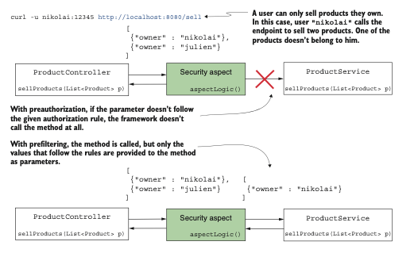
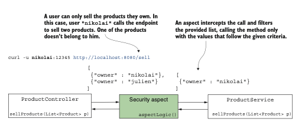
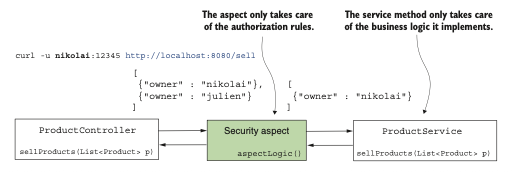
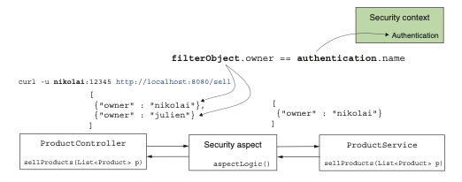
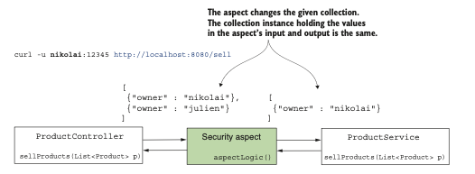
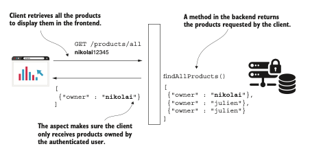
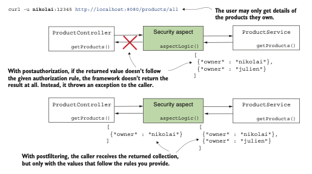
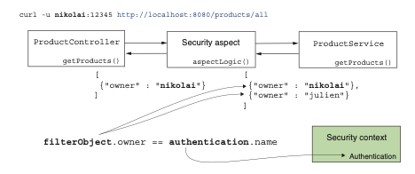
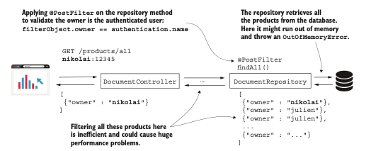
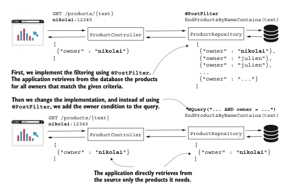

# Implementación del filtrado a nivel de método

### Este capítulo cubre 
- Usar prefiltrado para restringir los valores de parámetros que recibe un método 
- Usar postfiltrado para restringir lo que un método devuelve 
- Integrar el filtrado con Spring Data

En el capítulo 11, aprendiste cómo aplicar reglas de autorización usando la seguridad global a nivel
de método. Trabajamos en ejemplos usando las anotaciones `@PreAuthorize` y `@PostAuthorize`. Cuando 
usas estas anotaciones, la aplicación permite o rechaza completamente la llamada al método. 
Supón que no quieres prohibir la llamada a un método, pero deseas asegurarte de que los parámetros 
enviados al mismo sigan ciertas reglas. O, en otro escenario, quieres asegurarte de que, después de
que se llama al método, el llamador solo reciba una parte autorizada del valor devuelto. Esta 
funcionalidad se llama filtrado, y se clasifica en dos categorías: 

- Prefiltrado: el framework filtra los valores de los parámetros antes de llamar al método. 
- Postfiltrado: el framework filtra el valor devuelto después de la llamada al método.

El filtrado funciona de forma diferente a la autorización de llamadas (siguiente figura). Con el 
filtrado, el framework ejecuta la llamada y no lanza una excepción si un parámetro o el valor 
devuelto no cumplen con una regla de autorización que definas. En su lugar, elimina los elementos 
que no cumplen con las condiciones especificadas.



El cliente llama al endpoint proporcionando un valor que no sigue la regla de autorización. Con 
preautorización, el método no se llama en absoluto, y el llamador recibe una excepción. Con 
prefiltrado, el aspecto llama al método pero solo proporciona los valores que siguen las reglas dadas.

Es importante mencionar desde el principio que solo puedes aplicar filtrado a colecciones y arrays. 
Utilizas el prefiltrado solo si el método recibe como parámetro un array o una colección de objetos.
El framework filtra esta colección o array según las reglas que definas. Lo mismo es válido para el 
postfiltrado: solo puedes aplicar este enfoque si el método devuelve una colección o un array. El 
framework filtra el valor que devuelve el método en base a las reglas que especifiques.

## 12.1 Aplicación del prefiltrado para la autorización de métodos:

Esta sección analiza el mecanismo detrás del prefiltrado y luego implementamos el prefiltrado en un 
ejemplo. Puedes usar el filtrado para indicarle al framework que valide los valores enviados a 
través de los parámetros del método cuando alguien llama a un método. El framework filtra los 
valores que no coinciden con los criterios dados y llama al método solo con los valores que sí 
coinciden. Esta funcionalidad se llama prefiltrado (siguiente figura). 



Con el prefiltrado, un aspecto intercepta la llamada al método protegido. El aspecto filtra los 
valores que el llamador proporciona como parámetro y envía al método solo aquellos que cumplen con 
las reglas definidas.

Existen requisitos en ejemplos del mundo real donde el prefiltrado se aplica adecuadamente porque
desacopla las reglas de autorización de la lógica de negocio que implementa el método. Supongamos 
que implementas un caso de uso en el que solo procesas detalles específicos pertenecientes al 
usuario autenticado. Este caso de uso puede ser invocado desde múltiples lugares, pero su 
responsabilidad siempre indica que solo se pueden procesar los detalles del usuario autenticado, 
independientemente de quién lo invoque. En lugar de asegurarte de que el invocador aplique 
correctamente las reglas de autorización, haces que el caso de uso aplique sus propias reglas. Por 
supuesto, podrías hacer esto dentro del método, pero desacoplar la lógica de autorización de la 
lógica de negocio mejora la mantenibilidad del código y facilita su lectura y comprensión por parte
de otros.

Como en el caso de la autorización de llamadas, discutido en el capítulo 11, Spring Security también
implementa el filtrado mediante aspectos. Los aspectos interceptan llamadas específicas a métodos y 
pueden ampliarlas con otras instrucciones. Para el prefiltrado, un aspecto intercepta métodos 
anotados con la anotación @PreFilter y filtra los valores de la colección proporcionada como 
parámetro según los criterios definidos (siguiente figura).



Con el prefiltrado, desacoplamos la responsabilidad de autorización de la implementación de negocio.
El aspecto proporcionado por Spring Security se encarga únicamente de las reglas de autorización, y 
el método del servicio se encarga solo de la lógica de negocio del caso de uso que implementa.

De forma similar a las anotaciones @PreAuthorize y @PostAuthorize discutidas en el capítulo 11, 
estableces las reglas de autorización como valor de la anotación @PreFilter. En estas reglas, 
proporcionadas como expresiones SpEL, utilizas filterObject para referirte a cualquier elemento 
dentro de la colección o array proporcionado como parámetro al método.

Para ver el prefiltrado aplicado, trabajaremos en un proyecto que he llamado ssia-ch12-ex1. Imagina 
que tienes una aplicación para comprar y vender productos, cuyo backend implementa el endpoint /sell.
El frontend de la aplicación llama a este endpoint cuando un usuario vende un producto. Sin embargo,
el usuario conectado solo puede vender productos que posea. Implementaremos un escenario simple de 
un método de servicio que se llama para vender los productos recibidos como parámetro. Con este 
ejemplo, aprenderás a aplicar la anotación `@PreFilter`, ya que es lo que usamos para asegurarnos de 
que el método solo reciba productos pertenecientes al usuario actualmente autenticado.

Una vez creado el proyecto, escribimos una clase de configuración para asegurarnos de tener algunos
usuarios con los que probar nuestra implementación. En el siguiente codigo encontrarás la definición 
sencilla de la clase de configuración. La clase de configuración, que he llamado `ProjectConfig`, 
declara únicamente un `UserDetailsService` y un `PasswordEncoder`, y la anoto con `@EnableMethodSecurity.`
Para las anotaciones de filtrado, aún necesitamos usar la anotación @EnableMethodSecurity y 
habilitar las anotaciones de pre-/postautorización. El `UserDetailsService` proporcionado define los 
dos usuarios que necesitamos en nuestras pruebas: `Nikolai y Julien.`

Configuring users and enabling method security:
```java
@Configuration
@EnableMethodSecurity
public class ProjectConfig {
    @Bean
    public UserDetailsService userDetailsService() {
        var uds = new InMemoryUserDetailsManager();
        var u1 = User.withUsername("nikolai")
                .password("12345")
                .authorities("read")
                .build();
        var u2 = User.withUsername("julien")
                .password("12345")
                .authorities("write")
                .build();
        uds.createUser(u1);
        uds.createUser(u2);
        return uds;
    }

    @Bean
    public PasswordEncoder passwordEncoder() {
        return NoOpPasswordEncoder.getInstance();
    }
}
```
Describo el producto utilizando la clase modelo presentada en el siguiente codigo

The Product class definition:
```java
public class Product {
    private String name;
    //El atributo owner tiene el valor del nombre de usuario.
    private String owner;
// Omitted constructor, getters, and setters
}
```
La clase `ProductService` define el método de servicio que protegemos con `@PreFilter`. Puedes encontrar
la clase `ProductService` en el siguiente codigo. En ese codigo, antes del método `sellProducts()`, puedes 
observar el uso de la anotación `@PreFilter`. La expresión `Spring Expression Language (SpEL)` utilizada
con la anotación es `filterObject.owner == authentication.name`, la cual permite solo los valores en 
los que el atributo `owner` del `Product` es igual al nombre de usuario del usuario autenticado. En el 
lado izquierdo del operador de igualdad en la expresión SpEL, usamos `filterObject`. Con `filterObject`,
nos referimos a los objetos de la lista pasada como parámetro. Dado que tenemos una lista de 
productos, en nuestro caso `filterObject` es de tipo `Product`. Por esta razón, podemos referirnos al 
atributo owner del producto. En el lado derecho del operador de igualdad en la expresión, usamos el 
objeto authentication. Para las anotaciones `@PreFilter y @PostFilter`, podemos referirnos 
directamente al objeto authentication, que está disponible en el `SecurityContext` tras la 
autenticación (siguiente figura).



Al usar el prefiltrado con filterObject, nos referimos a los objetos dentro de la lista que el 
llamador proporciona como parámetro. El objeto authentication es el que se almacena tras el proceso 
de autenticación en el contexto de seguridad.

El método de servicio devuelve la lista exactamente como la recibe. De esta manera, podemos probar 
y verificar que el framework filtró la lista según lo esperado, examinando la lista devuelta en el 
cuerpo de la respuesta HTTP.

Using the @PreFilter annotation in the ProductService class:
```java
@Service
public class ProductService {
    //La lista dada como parámetro permite solo productos pertenecientes al usuario autenticado.
    @PreFilter("filterObject.owner == authentication.name")
    public List<Product> sellProducts(List<Product> products) {
// sell products and return the sold products list
        return products; //Devuelve los productos para fines de prueba
    }
}
```

Para facilitar nuestras pruebas, defino un endpoint para llamar al método de servicio protegido. El
siguiente codigo define este endpoint en una clase controlador llamada `ProductController`. Aquí, para
acortar la llamada al endpoint, creo una lista y la proporciono directamente como parámetro al 
método de servicio. En un escenario real, esta lista debería ser proporcionada por el cliente en el
cuerpo de la solicitud. También puedes observar que uso `@GetMapping` para una operación que sugiere 
una mutación, lo cual no es estándar. Pero ten en cuenta que hago esto para evitar tener que lidiar 
con la protección CSRF en nuestro ejemplo, lo que te permite centrarte en el tema en cuestión. 
Aprendiste sobre la protección CSRF en el capítulo 9.

The controller class implementing the endpoint we use for tests:
```java
@RestController
public class ProductController {
    private final ProductService productService;

    // omitted constructor
    @GetMapping("/sell")
    public List<Product> sellProduct() {
        List<Product> products = new ArrayList<>();
        products.add(new Product("beer", "nikolai"));
        products.add(new Product("candy", "nikolai"));
        products.add(new Product("chocolate", "julien"));
        return productService.sellProducts(products);
    }
}
```
Iniciemos la aplicación y veamos qué sucede cuando llamamos al endpoint /sell. Observa los tres 
productos de la lista que proporcionamos como parámetro al método del servicio. Asigno dos de los 
productos al usuario Nikolai y el otro al usuario Julien. Cuando llamamos al endpoint y nos
autenticamos con el usuario Nikolai, esperamos ver en la respuesta solo los dos productos asociados
a él. Cuando llamamos al endpoint y nos autenticamos con Julien, en la respuesta deberíamos 
encontrar únicamente el producto asociado a Julien. En el siguiente fragmento de código, encontrarás
las llamadas de prueba y sus resultados. Para llamar al endpoint /sell y autenticarte con el usuario
Nikolai, usa este comando:

`curl -u nikolai:12345 http://localhost:8080/sell`

El cuerpo de la respuesta es: 
```json
[
    {"name":"beer","owner":"nikolai"},
    {"name":"candy","owner":"nikolai"}
]
```
Para llamar al endpoint /sell y autenticarte con el usuario Julien, utiliza

`curl -u julien:12345 http://localhost:8080/sell`

El cuerpo de la respuesta es: 
```json
[
  {"name":"chocolate","owner":"julien"}
]
```
Debes tener cuidado con el hecho de que el aspecto modifica la colección proporcionada. En nuestro 
caso, no esperes que devuelva una nueva instancia de List. De hecho, es la misma instancia de la 
cual el aspecto eliminó los elementos que no cumplían con los criterios dados. Esto es importante 
tenerlo en cuenta. Siempre debes asegurarte de que la instancia de colección que proporcionas no 
sea inmutable. Proporcionar una colección inmutable para su procesamiento provoca una excepción en 
tiempo de ejecución, porque el aspecto de filtrado no podrá modificar el contenido de la colección
(siguiente figura).



El aspecto intercepta y modifica la colección proporcionada como parámetro. Debes proporcionar una 
instancia mutable de la colección para que el aspecto pueda modificarla.

El siguiente listado presenta el mismo proyecto en el que trabajamos anteriormente en esta sección,
pero cambié la definición de la lista por una instancia inmutable devuelta por el método List.of(), 
para probar qué sucede en esta situación.

Using an immutable collection:
```java
@RestController
public class ProductController {
    private final ProductService productService;

    // omitted constructor
    @GetMapping("/sell")
    public List<Product> sellProduct() {
        //List.of() retorna una instancia inmutable de la lista 
        List<Product> products = List.of(
                new Product("beer", "nikolai"),
                new Product("candy", "nikolai"),
                new Product("chocolate", "julien"));
        return productService.sellProducts(products);
    }
}
```
He separado este ejemplo en la carpeta del proyecto ssia-ch12-ex2 para que puedas probarlo tú mismo
también. Al ejecutar la aplicación y llamar al endpoint /sell, se obtiene una respuesta HTTP con el
estado 500 Internal Server Error y una excepción en el registro de la consola, como se muestra en 
el siguiente fragmento de código:

`curl -u julien:12345 http://localhost:8080/sell`

El cuerpo de la respuesta es:
```json
{
    "status":500,
    "error":"Internal Server Error",
    "path":"/sell"
}
```
En la consola de la aplicación, puedes encontrar una excepción similar a la que se muestra en el 
siguiente fragmento de código:
```java
java.lang.UnsupportedOperationException: null
at java.base/java.util.ImmutableCollections.uoe(ImmutableCollections.
java:73) ~[na:na]
...
```
## 12.2 Aplicación del postfiltrado para la autorización de métodos

En esta sección, implementamos el postfiltrado. Supongamos que tenemos el siguiente escenario: una 
aplicación que tiene un frontend implementado en Angular y un backend basado en Spring gestiona 
algunos productos. Los usuarios son propietarios de productos y solo pueden obtener detalles de sus
propios productos. Para obtener los detalles de sus productos, el frontend llama a endpoints 
expuestos por el backend (siguiente figura).



Escenario de postfiltrado. Un cliente llama a un endpoint para obtener los datos que necesita 
mostrar en el frontend. Una implementación de postfiltrado garantiza que el cliente solo obtenga 
datos pertenecientes al usuario autenticado actualmente.

En el backend, en una clase de servicio, el desarrollador escribió un método 
`List<Product> findProducts()` que recupera los detalles de los productos. La aplicación cliente 
muestra estos detalles en el frontend. ¿Cómo podría el desarrollador asegurarse de que cualquier 
persona que llame a este método solo reciba productos que le pertenezcan y no productos de otros 
usuarios? Una opción para implementar esta funcionalidad, manteniendo las reglas de autorización 
desacopladas de las reglas de negocio de la aplicación, se llama postfiltrado. Esta sección explica 
cómo funciona el postfiltrado y muestra su implementación en una aplicación.

De forma similar al prefiltrado, el postfiltrado también se basa en un aspecto. Este aspecto permite
la llamada a un método, pero una vez que el método devuelve un valor, el aspecto toma ese valor
devuelto y se asegura de que cumpla con las reglas definidas. Como en el caso del prefiltrado, el 
postfiltrado modifica una colección o un array devuelto por el método. Se proporcionan los criterios
que deben cumplir los elementos dentro de la colección devuelta. El aspecto de postfiltrado elimina
de la colección o array devuelto aquellos elementos que no cumplen con las reglas. Para aplicar el 
postfiltrado, se debe usar la anotación `@PostFilter`. La anotación `@PostFilter` funciona de forma 
similar a las demás anotaciones pre/post utilizadas en el capítulo 11 y en este capítulo. Se 
proporciona la regla de autorización como una expresión SpEL para el valor de la anotación, y es 
esta regla la que utiliza el aspecto de filtrado. Además, al igual que con el prefiltrado, el 
postfiltrado solo funciona con arrays y colecciones. Asegúrese de aplicar la anotación `@PostFilter` 
solo a métodos que tengan un array o una colección como tipo de retorno.



Postfiltrado. Un aspecto intercepta la colección devuelta por el método protegido y filtra los 
valores que no cumplen las reglas que proporcionas. A diferencia del postautorización, el 
postfiltrado no lanza una excepción al llamador cuando el valor devuelto no cumple las reglas de 
autorización. 

Vamos a aplicar el postfiltrado en un ejemplo para el cual creé un proyecto llamado ssia-ch12-ex3.
Para mantener la coherencia, conservé los mismos usuarios que en nuestros ejemplos anteriores de 
este capítulo, de modo que la clase de configuración no cambiará. Para tu comodidad, repito la 
configuración presentada en el siguiente codigo.

The configuration class:
```java
@Configuration
@EnableMethodSecurity
public class ProjectConfig {
    @Bean
    public UserDetailsService userDetailsService() {
        var uds = new InMemoryUserDetailsManager();
        var u1 = User.withUsername("nikolai")
                .password("12345")
                .authorities("read")
                .build();
        var u2 = User.withUsername("julien")
                .password("12345")
                .authorities("write")
                .build();
        uds.createUser(u1);
        uds.createUser(u2);
        return uds;
    }

    @Bean
    public PasswordEncoder passwordEncoder() {
        return NoOpPasswordEncoder.getInstance();
    }
}    
```
El siguiente fragmento de código muestra que la clase Product también permanece sin cambios:
```java
public class Product {
    private String name;
    private String owner;
// Omitted constructor, getters, and setters
}
```
En la clase `ProductService`, implementamos ahora un método que devuelve una lista de productos. En 
un escenario real, asumimos que la aplicación leería los productos desde una base de datos o 
cualquier otra fuente de datos. Para mantener nuestro ejemplo breve y permitirte centrarte en los 
aspectos que discutimos, usamos una colección simple, como se presenta en el siguiente codigo.

Anoto el método `findProducts()`, que devuelve la lista de productos, con la anotación `@PostFilter`. 
La condición que añado como valor de la anotación, `filterObject.owner == authentication.name`, solo
permite que se devuelvan productos cuyo propietario sea igual al usuario autenticado (siguiente figura).
En el lado izquierdo del operador de igualdad, usamos `filterObject` para referirnos a los elementos 
dentro de la colección devuelta. En el lado derecho del operador, usamos `authentication` para 
referirnos al objeto `Authentication` almacenado en el `SecurityContext`. 



En la `expresión SpEL` utilizada para la autorización, usamos `filterObject` para referirnos a los 
objetos en la colección devuelta, y usamos `authentication` para referirnos a la instancia de 
`Authentication` del contexto de seguridad.

The ProductService class:
```java
@Service
public class ProductService {
    //Agrega la condición de filtrado para los objetos en la colección devuelta por el metodo.
    @PostFilter("filterObject.owner == authentication.name")
    public List<Product> findProducts() {
        List<Product> products = new ArrayList<>();
        products.add(new Product("beer", "nikolai"));
        products.add(new Product("candy", "nikolai"));
        products.add(new Product("chocolate", "julien"));
        return products;
    }
}
```
Definimos una clase controlador para hacer que nuestro método sea accesible a través de un endpoint.
El siguiente listado presenta la clase controlador. 

The ProductController class:
```java
@RestController
public class ProductController {
    private final ProductService productService;

    // Omitted constructor
    @GetMapping("/find")
    public List<Product> findProducts() {
        return productService.findProducts();
    }
}
```

Es hora de ejecutar la aplicación y probar su comportamiento llamando al endpoint /find. Esperamos 
ver en el cuerpo de la respuesta HTTP solo los productos pertenecientes al usuario autenticado. Los 
siguientes fragmentos de código muestran el resultado de llamar al endpoint con cada uno de nuestros
usuarios, Nikolai y Julien. Para llamar al endpoint /find y autenticarse con el usuario Julien, use 
este comando cURL:

`curl -u julien:12345 http://localhost:8080/find`

El cuerpo de la respuesta es:
```json
[
  {"name":"chocolate","owner":"julien"}
]
```
Para llamar al endpoint /find y autenticarse con el usuario Nikolai, use este comando cURL:

`curl -u nikolai:12345 http://localhost:8080/find`

El cuerpo de la respuesta es:
```json
[
    {"name":"beer","owner":"nikolai"},
    {"name":"candy","owner":"nikolai"}
]
```
Uso de filtrado en repositorios Spring Data En esta sección, discutimos el filtrado aplicado con 
repositorios Spring Data. Es importante entender este enfoque porque a menudo usamos bases de datos 
para persistir los datos de una aplicación. Es bastante común implementar aplicaciones Spring Boot 
que usan Spring Data como una capa de alto nivel para conectarse a una base de datos, ya sea `SQL o 
NoSQL`. Analizamos dos enfoques para aplicar el filtrado a nivel de repositorio al usar Spring Data, 
y los implementamos con ejemplos.

El primer enfoque que tomamos es el que aprendiste anteriormente en este capítulo: usar las 
anotaciones `@PreFilter y @PostFilter`. El segundo enfoque que discutimos es la integración directa 
de las reglas de autorización en las consultas. Como aprenderás en esta sección, debes ser cuidadoso
al elegir la forma de aplicar el filtrado en los repositorios Spring Data. Como se mencionó, tenemos 
dos opciones: 

- Usar las anotaciones `@PreFilter y @PostFilter` 
- Aplicar directamente el filtrado dentro de las consultas

Usar la anotación `@PreFilter` en el caso de los repositorios es lo mismo que aplicar esta anotación 
en cualquier otra capa de tu aplicación. Pero cuando se trata de postfiltrado, la situación cambia. 
Usar `@PostFilter` en métodos de repositorio técnicamente funciona bien, pero rara vez es una buena 
opción desde el punto de vista del rendimiento.

Imagina que tienes una aplicación que gestiona los documentos de tu empresa. El desarrollador 
necesita implementar una función en la que todos los documentos se muestren en una página web 
después de que el usuario inicie sesión. El desarrollador decide usar el método `findAll()` del 
repositorio Spring Data y lo anota con `@PostFilter` para permitir que Spring Security filtre los 
documentos, de modo que el método devuelva solo aquellos pertenecientes al usuario autenticado 
actualmente. Este enfoque es claramente incorrecto porque permite que la aplicación recupere todos 
los registros de la base de datos y luego filtre los registros ella misma. Si tenemos un gran número
de documentos, llamar a `findAll()` sin paginación podría provocar directamente un `OutOfMemoryError`. 
Incluso si la cantidad de documentos no es suficiente para llenar la memoria, sigue siendo menos 
eficiente filtrar los registros en tu aplicación en lugar de recuperar desde el principio solo lo 
que necesitas de la base de datos (siguiente figura).



La anatomía de un mal diseño. Cuando necesitas aplicar filtrado a nivel de repositorio, es mejor 
asegurarte primero de recuperar solo los datos que necesitas. De lo contrario, tu aplicación podría 
enfrentar graves problemas de memoria y rendimiento.

A nivel de servicio, no tienes otra opción más que filtrar los registros en la aplicación. Sin 
embargo, si desde el nivel del repositorio sabes que necesitas recuperar solo los registros 
pertenecientes al usuario autenticado, deberías implementar una consulta que extraiga directamente 
desde la base de datos únicamente los documentos requeridos.

NOTA En cualquier situación en la que recuperes datos de una fuente de datos, ya sea una base de 
datos, un servicio web, un flujo de entrada o cualquier otra cosa, asegúrate de que la aplicación 
recupere únicamente los datos que necesita. Evita en lo posible la necesidad de filtrar datos dentro
de la aplicación.

Trabajemos en una aplicación donde primero usemos la anotación @PostFilter en el método del 
repositorio Spring Data, y luego cambiemos al segundo enfoque, en el que escribamos la condición 
directamente en la consulta. De esta manera, tendremos la oportunidad de experimentar con ambos 
enfoques y compararlos.

Creé un nuevo proyecto llamado ssia-ch12-ex4, donde uso la misma clase de configuración que en 
nuestros ejemplos anteriores de este capítulo. Como en los ejemplos anteriores, escribimos una 
aplicación que gestiona productos, pero esta vez recuperamos los detalles de los productos desde 
una tabla en nuestra base de datos. Para nuestro ejemplo, implementamos una funcionalidad de 
búsqueda de productos (siguiente figura). Escribimos un endpoint que recibe una cadena y devuelve 
la lista de productos que contienen dicha cadena en sus nombres. Sin embargo, necesitamos asegurarnos
de devolver solo los productos asociados al usuario autenticado.



En nuestro escenario, comenzamos implementando la aplicación usando `@PostFilter` para filtrar 
productos según su propietario. Luego cambiamos la implementación para agregar la condición 
directamente en la consulta. De esta manera, nos aseguramos de que la aplicación solo obtenga de la
fuente los registros necesarios.

Usamos `Spring Data JPA` para conectarnos a una base de datos. Por esta razón, también necesitamos 
agregar al archivo pom.xml la dependencia `spring-boot-starter-data-jpa` y un controlador de conexión 
según la tecnología del servidor de gestión de base de datos. El siguiente fragmento de código 
proporciona las dependencias que uso en el archivo pom.xml:
```xml
<dependency>
    <groupId>org.springframework.boot</groupId>
    <artifactId>spring-boot-starter-data-jpa</artifactId>
</dependency>
<dependency>
    <groupId>org.springframework.boot</groupId>
    <artifactId>spring-boot-starter-security</artifactId>
</dependency>
<dependency>
    <groupId>org.springframework.boot</groupId>
    <artifactId>spring-boot-starter-web</artifactId>
</dependency>
<dependency>
    <groupId>mysql</groupId>
    <artifactId>mysql-connector-java</artifactId>
    <scope>runtime</scope>
</dependency>
```
En el archivo `application.properties`, agregamos las propiedades que Spring Boot requiere para crear
el origen de datos. En el siguiente fragmento de código, se muestran las propiedades que añadí a mi
archivo `application.properties`:
```properties
spring.datasource.url=jdbc:mysql://localhost/
spring?useLegacyDatetimeCode=false&serverTimezone=UTC
spring.datasource.username=root
spring.datasource.password=
spring.datasource.initialization-mode=always
```
También necesitamos una tabla en la base de datos para almacenar los detalles de los productos que 
nuestra aplicación recupera. Definimos un archivo schema.sql donde escribimos el script para crear 
la tabla, y un archivo data.sql donde escribimos las consultas para insertar datos de prueba en la 
tabla. Necesitas colocar ambos archivos (schema.sql y data.sql) en la carpeta resources del proyecto
Spring Boot para que sean encontrados y ejecutados al inicio de la aplicación. El siguiente fragmento 
de código muestra la consulta utilizada para crear la tabla, que debemos escribir en el archivo 
schema.sql:
```sql
CREATE TABLE IF NOT EXISTS `spring`.`product` (
    `id` INT NOT NULL AUTO_INCREMENT,
    `name` VARCHAR(45) NULL,
    `owner` VARCHAR(45) NULL,
    PRIMARY KEY (`id`));
```
En el archivo data.sql, escribo tres sentencias INSERT, que se presentan en el siguiente fragmento 
de código. Estas sentencias crean los datos de prueba que necesitaremos más adelante para comprobar 
el comportamiento de la aplicación:
```sql
INSERT IGNORE INTO `spring`.`product` (`id`, `name`, `owner`) VALUES ('1',
'beer', 'nikolai');
INSERT IGNORE INTO `spring`.`product` (`id`, `name`, `owner`) VALUES ('2',
'candy', 'nikolai');
INSERT IGNORE INTO `spring`.`product` (`id`, `name`, `owner`) VALUES ('3',
'chocolate', 'julien');
```
`NOTA` Recuerda que hemos usado los mismos nombres de tablas en otros ejemplos a lo largo del libro.
Si ya tienes tablas con los mismos nombres de ejemplos anteriores, probablemente deberías eliminarlas
antes de comenzar con este proyecto. Una alternativa es usar un esquema diferente.

Para mapear la tabla de productos en nuestra aplicación, necesitamos escribir una clase entidad. 
El siguiente codigo define la entidad `Product`.

The Product entity class:
```java
@Entity
public class Product {
    @Id
    @GeneratedValue(strategy = GenerationType.IDENTITY)
    private int id;
    private String name;
    private String owner;
// Omitted getters and setters
}
```
Para la entidad `Product`, también escribimos una interfaz de repositorio Spring Data definida en el 
siguiente codigo. Observa que esta vez usamos la anotación `@PostFilter` directamente en el método 
declarado por la interfaz del repositorio.

The ProductRepository interface:
```java
public interface ProductRepository
extends JpaRepository<Product, Integer> {
    //Utiliza la anotación @PostFilter para el metodo declarado por el repositorio Spring Data.
    @PostFilter("filterObject.owner == authentication.name")
    List<Product> findProductByNameContains(String text);
}
```

El siguiente codigo muestra cómo definir una clase controlador que implementa el endpoint que 
usamos para probar el comportamiento.

The ProductController class:
```java
@RestController
public class ProductController {
    private final ProductRepository productRepository;

    // Omitted constructor
    @GetMapping("/products/{text}")
    public List<Product> findProductsContaining(
            @PathVariable String text) {
        return productRepository.findProductByNameContains(text);
    }
}
```
Iniciando la aplicación, podemos probar qué sucede al llamar al endpoint /products/{text}. Al buscar
la letra c mientras se autentica con el usuario Nikolai, la respuesta HTTP solo contiene el producto
candy. Aunque chocolate también contiene una c, como es propiedad de Julien, no aparecerá en la 
respuesta. En los siguientes fragmentos de código se muestran las llamadas y sus respuestas. Para 
llamar al endpoint /products y autenticarse con el usuario Nikolai, emite este comando:

`curl -u nikolai:12345 http://localhost:8080/products/c`

El cuerpo de la respuesta es:
```json
[
  {"id":2,"name":"candy","owner":"nikolai"}
]
```
Para llamar al endpoint /products y autenticarse con el usuario Julien, emite

`curl -u julien:12345 http://localhost:8080/products/c`

El cuerpo de la respuesta es:
```json
[
  {"id":3,"name":"chocolate","owner":"julien"}
]
```
Hemos discutido anteriormente en esta sección que usar `@PostFilter` en el repositorio no es la mejor
opción. En su lugar, debemos asegurarnos de no seleccionar de la base de datos lo que no necesitamos.
Entonces, ¿cómo podemos cambiar nuestro ejemplo para seleccionar solo los datos necesarios en lugar
de filtrarlos después de la selección? Podemos proporcionar expresiones `SpEL` directamente en las 
consultas utilizadas por las clases del repositorio. Para lograr esto, seguimos dos pasos simples:

Añadimos un objeto de tipo `SecurityEvaluationContextExtension` al contexto de Spring. Podemos hacer 
esto usando un método `@Bean` simple en la clase de configuración.
Ajustamos las consultas en nuestras clases de repositorio con las cláusulas adecuadas para la 
selección.
En nuestro proyecto, para añadir el bean `SecurityEvaluationContextExtension` al contexto, necesitamos
cambiar la clase de configuración como se presenta en el siguiente codigo. Para mantener todo el 
código asociado con los ejemplos del libro, uso aquí otro proyecto llamado ssia-ch12-ex5.

Adding the SecurityEvaluationContextExtension to the context:
```java
@Configuration
@EnableMethodSecurity
public class ProjectConfig {
    @Bean //Agrega un SecurityEvaluationContextExtension al contexto de Spring
    public SecurityEvaluationContextExtension
    securityEvaluationContextExtension() {
        return new SecurityEvaluationContextExtension();
    }
// Omitted declaration of the UserDetailsService and PasswordEncoder
}
```
En la interfaz `ProductRepository`, agregamos la consulta antes del método y ajustamos la cláusula 
`WHERE` con la condición adecuada usando una expresión SpEL. El siguiente listado presenta el cambio.

Using SpEL in the query in the repository interface:
```java
public interface ProductRepository
extends JpaRepository<Product, Integer> {
    Query("""SELECT p FROM Product p WHERE
    p.name LIKE %:text% AND
    p.owner=?#{authentication.name}
    """ //Utiliza SpEL en la consulta para agregar una condición sobre el propietario del registro.
    List<Product> findProductByNameContains(String text);
}
```

Ahora podemos iniciar la aplicación y probarla llamando al endpoint /products/{text}. Esperamos que 
el comportamiento sea el mismo que en el caso en que usamos @PostFilter. Pero ahora solo se 
recuperan de la base de datos los registros correspondientes al propietario correcto, lo que hace 
que la funcionalidad sea más rápida y confiable. Los siguientes fragmentos de código presentan las 
llamadas al endpoint. Para llamar al endpoint /products y autenticarse con el usuario Nikolai, usamos

`curl -u nikolai:12345 http://localhost:8080/products/c`

El cuerpo de la respuesta es:
```json
[
  {"id":2,"name":"candy","owner":"nikolai"}
]
```
Para llamar al endpoint /products y autenticarse con el usuario Julien, usamos

`curl -u julien:12345 http://localhost:8080/products/c`

El cuerpo de la respuesta es:
```json
[
  {"id":3,"name":"chocolate","owner":"julien"}
]
```
### Resumen

- El filtrado es un enfoque de autorización en el que el framework valida los parámetros de entrada 
de un método o el valor devuelto por este, y excluye los elementos que no cumplen con unos criterios
definidos. Como enfoque de autorización, el filtrado se centra en los valores de entrada y salida de
un método, y no en la ejecución del método en sí. 
- Se utiliza el filtrado para asegurarse de que un método no reciba valores distintos a los que está
autorizado a procesar y de que no devuelva valores que el llamador del método no debería obtener. 
- Al usar el filtrado, no se restringe el acceso al método, sino lo que se puede enviar a través de 
sus parámetros o lo que el método devuelve. Este enfoque permite controlar la entrada y salida del 
método. 
- Para restringir los valores que se pueden enviar a través de los parámetros del método, se utiliza
la anotación `@PreFilter`. La anotación `@PreFilter` recibe la condición que deben cumplir los valores 
para ser enviados como parámetros del método. El framework filtra de la colección dada como 
parámetro todos los valores que no cumplen la regla indicada. 
- Para usar la anotación `@PreFilter`, el parámetro del método debe ser una colección o un array. 
Desde la expresión SpEL de la anotación, que define la regla, se hace referencia a los objetos dentro
de la colección mediante `filterObject`. 
- Para restringir los valores devueltos por el método, se utiliza la anotación `@PostFilter`. Al usar 
la anotación `@PostFilter`, el tipo devuelto por el método debe ser una colección o un array. El 
framework filtra los valores de la colección devuelta según una regla definida como valor de la 
anotación `@PostFilter`. 
- Se pueden usar las anotaciones `@PreFilter y @PostFilter` también con repositorios Spring Data. 
Sin embargo, usar `@PostFilter` en un método de repositorio Spring Data rara vez es una buena opción. 
Para evitar problemas de rendimiento, en este caso el filtrado del resultado debería hacerse
directamente a nivel de base de datos. 
- Spring Security se integra fácilmente con Spring Data, y se utiliza esta característica para evitar
usar `@PostFilter` con métodos de repositorios Spring Data.