# Implementando un cliente OAuth 2.

### Este capítulo cubre

- Implementando un inicio de sesión `OAuth 2`
- Implementando un cliente `OAuth 2` de Spring Security
- Usando el tipo de concesión de credenciales de cliente

A menudo es necesario implementar la comunicación entre aplicaciones backend, especialmente para 
aplicaciones backend que involucran múltiples servicios. En tales casos, cuando los sistemas tienen 
autenticación y autorización construidas sobre `OAuth 2`, se recomienda que autentiques las llamadas 
entre aplicaciones usando el mismo enfoque. Mientras que los desarrolladores usan métodos de 
autenticación `HTTP Basic y API Key` (capítulo 6) por simplicidad en algunos casos para mantener el 
sistema consistente y más seguro, usar el tipo de concesión de credenciales de cliente `OAuth 2`es la
opción preferida.
¿Recuerdas los actores de `OAuth 2` (siguiente figura)? Discutimos el servidor de autorización en el 
capítulo 14 y el servidor de recursos en el capítulo 15. Este capítulo está dedicado al cliente. 
Discutiremos cómo usar Spring Security para implementar un cliente `OAuth 2` y cuándo y cómo una 
aplicación backend se convierte en un cliente en un sistema OAuth 2.

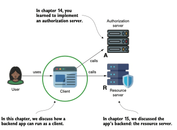

`Los actores de OAuth 2. En este capítulo, discutimos el cliente y cómo una aplicación backend puede 
actuar como un cliente en un sistema con autenticación y autorización diseñado como OAuth 2.`

De acuerdo, quizás la figura anterior no ilustra completamente lo que discutiremos. Comenzaremos 
discutiendo el inicio de sesión para el usuario, pero también nos enfocaremos en cómo hacer que una 
aplicación backend sea un cliente para otra aplicación backend. Las aplicaciones backend diseñadas 
con Spring Security también pueden convertirse en clientes. La figura siguiente muestra el otro caso
que discutiremos aquí. En el capítulo actual, resolveremos el problema de implementar la comunicación 
entre dos aplicaciones backend, convirtiendo una de ellas en un cliente OAuth 2 real. En tal caso, 
necesitamos usar Spring Security para construir un cliente `OAuth 2`.

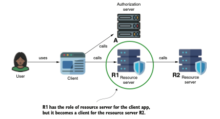

`Una aplicación backend puede convertirse en un cliente para otra aplicación backend. Discutimos este
caso en el capítulo actual.`

La sección 16.1 discute cómo implementar fácilmente un inicio de sesión `OAuth 2` para una aplicación 
`web Spring MVC` usando Spring Security. Usaremos un proveedor de servidor de autorización externo,
como `Google y GitHub`. Aprenderás cómo implementar un inicio de sesión para tu aplicación donde los 
usuarios pueden autenticarse usando sus credenciales de `Google o GitHub`. Usando el mismo enfoque, 
puedes implementar dicho inicio de sesión con un servidor de autorización personalizado (de tu propia
propiedad).
En la sección 16.2, empleamos una implementación personalizada del cliente a través de un servicio y
discutimos el uso del tipo de concesión de credenciales de cliente.

## 16.1 Implementando el inicio de sesión OAuth 2

Esta sección discute cómo implementar un inicio de sesión `OAuth 2` para tu aplicación web Spring. Con 
Spring Boot, es muy sencillo configurar la autenticación para casos estándar (casos donde el servidor
de autorización cumple correctamente con las especificaciones `OAuth 2 y OpenID Connect`). Comenzaremos
con un caso clásico (que puedes usar con la mayoría de los proveedores conocidos como `Google, GitHub`,
`Facebook y Okta`).
Luego te mostraré lo que hay detrás de escenas de la configuración proporcionada automáticamente para
que también puedas cubrir casos personalizados. Al final de esta sección, podrás implementar el inicio
de sesión para tu aplicación web Spring con cualquier proveedor `OAuth 2` e incluso permitir que tus 
usuarios elijan entre varios proveedores al autenticarse.

### 16.1.1 Implementando la autenticación con un proveedor común

En esta sección, implementaremos el caso de inicio de sesión más simple, permitiendo que los usuarios
de nuestra aplicación inicien sesión usando solo un proveedor. Para esta demostración, elegí Google 
como proveedor de autenticación de nuestros usuarios.
Comenzamos agregando algunos recursos a nuestro proyecto para implementar una aplicación web Spring 
simple con las capacidades de inicio de sesión mencionadas. El siguiente codigo muestra las dependencias
para la aplicación de demostración. Puedes encontrar la aplicación en este ejemplo en el proyecto 
ssia-ch16-ex1. Reconocerás una nueva dependencia que no hemos usado en capítulos anteriores: la 
dependencia del cliente `OAuth 2`.

Dependencies needed for our demonstration:
```xml
<dependency>
    <!-- La única dependencia nueva que observas es la dependencia del cliente OAuth 2. Necesitamos 
    esta dependencia para todas las capacidades del cliente OAuth 2 que configuramos en el proyecto.
    -->
    <groupId>org.springframework.boot</groupId>
    <artifactId>spring-boot-starter-oauth2-client</artifactId>
</dependency>
<dependency>
    <groupId>org.springframework.boot</groupId>
    <artifactId>spring-boot-starter-security</artifactId>
</dependency>
<dependency>
    <groupId>org.springframework.boot</groupId>
    <artifactId>spring-boot-starter-web</artifactId>
</dependency>
```
Si necesitas repasar la construcción de aplicaciones web con Spring Boot, los capítulos 7 y 8 de 
`Spring Start Here (Manning, 2020)`, otro libro que escribí, deberían ayudarte a recordar estas 
habilidades rápidamente. El siguiente fragmento de código muestra el controlador simple de nuestra 
aplicación web de demostración, que solo tiene una página de inicio:
```java
@Controller
public class HomeController {
    @GetMapping("/")
    public String home() {
        return "index.html";
    }
}
```
El siguiente fragmento de código muestra la pequeña página HTML de demostración a la que esperamos 
acceder una vez que la autenticación finalice exitosamente:
```html
<!DOCTYPE html>
<html lang="en">
<head>
    <meta charset="UTF-8">
    <title>Title</title>
</head>
<body>
    <h1>Home</h1>
</body>
</html>
```
El siguiente codigo presenta la configuración del inicio de sesión `OAuth 2` como método de autenticación 
para la aplicación web. Configurar la aplicación de esta manera seguirá automáticamente el tipo de 
concesión de código de autorización, redirigiendo al usuario para iniciar sesión en un servidor de 
autorización específico y redirigiéndolo de vuelta una vez que la autenticación sea exitosa. Este 
proceso sigue precisamente lo que discutimos en los capítulos 13 al 15 y demostramos múltiples veces
en esos capítulos usando cURL.

Configuring the OAuth 2 login:
```java
@Configuration
public class SecurityConfig {
    @Bean
    public SecurityFilterChain securityFilterChain(HttpSecurity http)
            throws Exception {
        //Para configurar la autenticación como inicio de sesión OAuth 2, usamos el metodo oauth2Login().
        http.oauth2Login(Customizer.withDefaults());
        http.authorizeHttpRequests(
                c -> c.anyRequest().authenticated());
        return http.build();
    }
}
```
Apuesto a que estás pensando: ¿No deberíamos aún tener que completar todos esos detalles que 
aprendimos en los capítulos 13 al 15, como la URL de autorización, la `URL del token`, el ID de cliente,
el secreto de cliente, y demás? Sí, todos estos detalles son necesarios. Afortunadamente, Spring 
Security puede ayudarte nuevamente. Si tu aplicación usa uno de los proveedores que Spring Security 
considera como bien conocidos, la mayoría de estos detalles están precompletados. Solo necesitas 
configurar las credenciales de cliente de la aplicación. Spring Security considera los siguientes 
proveedores como bien conocidos:

- Google
- GitHub
- Okta
- Facebook

Spring Security preconfigura los detalles para estos proveedores en la clase `CommonOAuth2Provider`. 
Por lo tanto, si usas alguno de estos, solo necesitas configurar las credenciales de cliente en las 
propiedades de tu aplicación, lo cual funciona. El siguiente fragmento de código muestra las dos 
propiedades que necesitas para configurar el ID de cliente y el secreto de cliente cuando usas Google
(truncé los valores de mis credenciales):

`spring.security.oauth2.client.registration.google.client-id=790…
spring.security.oauth2.client.registration.google.client-secret=GOC…`

Impliqué aquí que has registrado tu aplicación en la Consola de Desarrolladores de Google de ahí 
es donde obtienes el conjunto único de credenciales de tu aplicación. Si no has hecho esto antes y 
deseas configurar la autenticación usando Google para tu aplicación, puedes encontrar la documentación
detallada de Google sobre cómo registrar tu aplicación `OAuth 2` con Google en http://mng.bz/eEvz. 
La siguiente figura muestra cómo la aplicación muestra el inicio de sesión de Google cuando se 
configura correctamente este proveedor bien conocido.

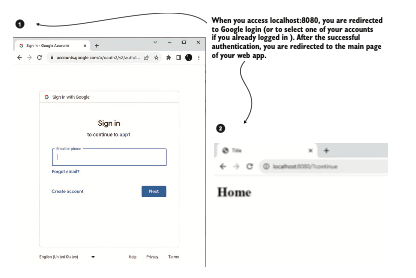

`Al acceder a la aplicación en un navegador web, el navegador te redirige a la página de inicio de 
sesión de Google. Si te autenticas correctamente con Google, eres redirigido de vuelta a la página 
principal de tu aplicación`.

### 16.1.2 Dando al usuario más posibilidades

Estoy seguro de que has navegado por internet lo suficiente como para observar que muchas aplicaciones
ofrecen más de una forma para que el usuario inicie sesión. A veces incluso puedes elegir entre 
cuatro o cinco proveedores para iniciar sesión en una aplicación. Este enfoque es ventajoso porque 
no todos tenemos ya una cuenta en una red social. Algunos tienen una cuenta de Facebook, pero otros 
prefieren usar LinkedIn. Algunos desarrolladores prefieren iniciar sesión usando su cuenta de GitHub,
pero otros usan su dirección de Gmail.
Con Spring Security, puedes hacer que esto funcione de manera sencilla, incluso usando múltiples 
proveedores. Supongamos que quiero permitir que los usuarios de mi aplicación inicien sesión con 
Google o GitHub. Solo necesito configurar las credenciales para ambos proveedores de manera similar.
El siguiente fragmento muestra las propiedades requeridas en el archivo application.properties para 
agregar GitHub como método de autenticación. Recuerda que debes mantener las que ya configuramos para
Google en la sección 16.1.1:

`spring.security.oauth2.client.registration.github.client-id=03…
spring.security.oauth2.client.registration.github.client-secret=c5d…`

De manera similar a cualquier otro proveedor, primero debes registrar tu aplicación, configurando el
ID de cliente y el secreto en el archivo application.properties. El enfoque para registrar la 
aplicación difiere de un proveedor a otro. Para GitHub, encuentras la documentación que te indica 
cómo registrar una aplicación en http://mng.bz/p1YG.
Antes de pedirte que te autentiques, la aplicación te da dos opciones de inicio de sesión: las que 
configuramos anteriormente (figura siguiente). Debes elegir entre Google o GitHub para iniciar sesión. 
Después de elegir tu proveedor preferido, la aplicación te redirige a la página de autenticación 
específica de ese proveedor.

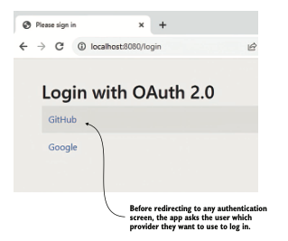

`La aplicación permite al usuario elegir entre GitHub y Google al autenticarse en la aplicación`.

### 16.1.3 Usando un servidor de autorización personalizado

Spring Security define una lista de cuatro proveedores comunes, como se discutió en las secciones 
16.1.1 y 16.1.2. ¿Pero qué pasa si deseas usar un proveedor que no está en la lista de proveedores 
comunes? Tienes muchas otras alternativas, como LinkedIn, Twitter, Yahoo y otros. Es posible que 
desees usar un servidor de autorización personalizado que construiste, como aprendiste en el 
capítulo 14.
Puedes configurar un inicio de sesión OAuth 2 con cualquier proveedor, incluido uno personalizado 
que hayas construido. En esta sección, vamos a usar un servidor de autorización que construimos en 
el capítulo 14 para mostrar la configuración de un inicio de sesión `OAuth 2` personalizado. Para 
facilitar tu aprendizaje y también mantener los ejemplos separados, he copiado el contenido del 
proyecto ssia-ch14-ex1 que discutimos en el capítulo 14 en un proyecto para este capítulo, al que 
nombré ssia-ch16-ex1-as.
Solo necesitamos asegurarnos de que la configuración de nuestro cliente coincida con lo que queremos
implementar en este capítulo. El siguiente codigo muestra el cliente registrado configurado en nuestro 
servidor de autorización. Lo más importante aquí es asegurarse de que la URI de redirección coincida
con la que esperamos para nuestra aplicación para la cual implementaremos el inicio de sesión:

`http://localhost:8080/login/oauth2/code/my_authorization_server`

La figura siguiente analiza la anatomía de la URI de redirección. Observa que la URI de redirección 
estándar usa la ruta /login/oauth2/code seguida del nombre del servidor de autorización. En este 
ejemplo, el nombre que le di al servidor de autorización es my_authorization_server.

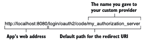

`El formato estándar de la URI de redirección. La última parte de su ruta es el nombre del proveedor.
El siguiente codigo muestra la parte de configuración del servidor de autorización, que registra los
detalles del cliente. Necesitarás estos detalles más adelante en esta sección; también los 
configuraremos en el lado de la aplicación`.

Los detalles del cliente registrados en el lado del servidor de autorización:
```java
@Bean
public RegisteredClientRepository registeredClientRepository() {
    var registeredClient = RegisteredClient
            .withId(UUID.randomUUID().toString())
            .clientId("client")
            .clientSecret("secret")
            .clientAuthenticationMethod(
                    ClientAuthenticationMethod.CLIENT_SECRET_BASIC)
            .authorizationGrantType(
                    AuthorizationGrantType.AUTHORIZATION_CODE)
            .redirectUri(
                    "http://localhost:8080/login/oauth2/code/my_authorization_server")
            .scope(OidcScopes.OPENID)
            .build();
    return new InMemoryRegisteredClientRepository(registeredClient);
}    
```
Recuerda que no puedes iniciar dos aplicaciones usando el mismo número de puerto en el mismo sistema.
Debido a que la aplicación web usa el puerto 8080, debemos cambiar el puerto del servidor de 
autorización a otro. Como se presenta en el siguiente fragmento de código, elegí 7070 para este 
ejemplo y lo configuré en el archivo application.properties:

`server.port=7070`

Ahora podemos pasar a la configuración de la aplicación web. Debido a que usamos un proveedor común 
en nuestros ejemplos de las secciones 16.1.1 y 16.1.2, no tuvimos que definirlo. Spring Security ya 
conoce todos los detalles que necesita sobre los proveedores comunes. Sin embargo, necesitamos 
configurar algunas cosas para usar un proveedor diferente. Spring Security necesita conocer lo 
siguiente (como se discutió en los capítulos 13 y 14):

- El endpoint de autorización del proveedor para saber a dónde redirigir al usuario durante el flujo 
de código de autorización.
- El endpoint de token que la aplicación debe llamar para obtener un token de acceso.
- El endpoint del conjunto de claves que la aplicación necesita para validar los tokens de acceso.

La buena noticia es que si tu proveedor (servidor de autorización) cumple correctamente con el 
protocolo `OpenID Connect`, solo necesitas configurar la URI del emisor. La aplicación entonces usa la
URI del emisor para encontrar todos los detalles que necesita, como la autorización, el token y la 
URI del conjunto de claves. Si el servidor de autorización no cumple con el protocolo `OpenID Connect`,
tendrás que configurar estos tres detalles explícitamente en el archivo `application.properties`.
Como los servidores de autorización que construimos en el capítulo 14 implementan correctamente el 
protocolo `OpenID Connect`, podemos confiar en la URI del emisor. El siguiente fragmento de código 
muestra cómo configurar la URI del emisor. Observa que le di un nombre al proveedor. Para este 
ejemplo, elegí identificarlo con el nombre my_authorization_server, pero puedes elegir cualquier 
nombre para identificar tu proveedor:

`spring.security.oauth2.client.provider.my_authorization_server.issuer-uri=http://127.0.0.1:7070`

`NOTA` Ejecutamos ambas aplicaciones, el servidor de autorización y la aplicación web que usamos en 
el sistema local. Ejecutar estas aplicaciones en el mismo sistema y acceder a ellas desde el navegador
puede causar problemas con las cookies que el navegador usa para almacenar la sesión del usuario. 
Por esta razón, recomiendo que uses la dirección `IP "127.0.0.1"` para referirte a una aplicación y el
nombre DNS "localhost" para referirte a la otra. Aunque las dos son idénticas desde un punto de vista
de red y se refieren al mismo sistema (el sistema local), el navegador las considerará diferentes,
pudiendo de esta manera gestionar las sesiones correctamente. En este ejemplo, uso "127.0.0.1" para 
referirme al servidor de autorización y "localhost" para la aplicación web.

El siguiente codigo muestra la configuración del registro del cliente. Además de declarar quién es 
el proveedor, el registro del cliente también es un poco más extenso que el que escribimos en las 
secciones 16.1.1 y 16.1.2, donde usamos proveedores comunes. Además del ID de cliente y el secreto 
de cliente, también necesitas completar lo siguiente:

- El nombre del proveedor — Un nombre que le das al proveedor que deseas usar en caso de que no sea 
común.
- El método de autenticación del cliente — El método de autenticación de la aplicación para llamar a
los endpoints protegidos del proveedor (generalmente HTTP Basic).
- La URI de redirección — La URI que la aplicación espera que el proveedor redirija al usuario después
de una autenticación correcta. Esta URI debe coincidir con una de las registradas en el lado del 
servidor de autorización (ver codigo anterior).
- El alcance solicitado de la aplicación web — El alcance que solicita la aplicación web solo puede
ser uno de los registrados en el lado del servidor de autorización (siguiente codigo).

The client registration configuration:
```properties
#El ID de cliente registrado en el lado del servidor de autorización.
spring.security.oauth2.client.registration.my_authorization_server.client-id=client
#El nombre de visualización del cliente.
spring.security.oauth2.client.registration.my_authorization_server.client-name=Custom
#The client secret registered at the authorization server side
Spring.security.oauth2.client.registration.my_authorization_server.client-secret=secret
#El nombre del proveedor personalizado.
spring.security.oauth2.client.registration.my_authorization_server.provider=my_authorization_server
#El metodo de autenticación de la aplicación para llamar a los endpoints protegidos del proveedor.
spring.security.oauth2.client.registration.my_authorization_server.client-authentication-method=client_secret_basic
#La URI a la que el proveedor redirige al usuario tras una autenticación exitosa.
spring.security.oauth2.client.registration.my_authorization_server.redirect-uri=http://localhost:8080/login/oauth2/code/my_authorization_server
#The scope the app requests
spring.security.oauth2.client.registration.my_authorization_server.scope[0]=openid
```
Puedes iniciar el servidor de autorización y la aplicación web. Recuerda que primero debes iniciar 
el servidor de autorización. Cuando la aplicación web se inicie, llamará a la URI del emisor para 
obtener el resto de los detalles que necesita. Una vez que inicies ambas aplicaciones, accede a la 
aplicación web en el navegador usando su dirección http://localhost:8080. La figura siguiente muestra
que el proveedor personalizado ahora aparece en la lista y puede ser elegido por el usuario para 
autenticarse.

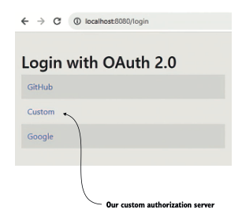

`El servidor de autorización personalizado ahora aparece en la lista de proveedores que el usuario 
puede seleccionar para autenticarse`.

### 16.1.4 Agregando flexibilidad a tus configuraciones

A menudo, necesitamos tener más flexibilidad de la que nos ofrecen los archivos de propiedades. A 
veces, necesitamos poder cambiar las credenciales dinámicamente sin volver a desplegar la aplicación.
En otros casos, queremos activar o desactivar proveedores específicos o incluso ofrecer acceso a 
estos basándose en una lógica determinada. Para tales casos, agregar las credenciales en el archivo 
de propiedades y permitir que Spring Boot haga la magia por nosotros ya no funciona.
Sin embargo, si sabes lo que ocurre detrás de escenas, puedes personalizar los detalles del proveedor
como desees. Los únicos dos tipos que debes recordar son:

- `ClientRegistration` — Este objeto se usa para definir los detalles que el cliente necesita para usar 
el servidor de autorización (credenciales, URI de redirección, URI de autorización, etc.).
- `ClientRegistrationRepository` — Este contrato se implementa para definir la lógica que recupera los 
registros del cliente. Por ejemplo, puedes implementar un repositorio de registro de clientes para 
indicarle a tu aplicación que obtenga los registros del cliente desde una base de datos o una bóveda
personalizada.

Para este ejemplo, mantengo las cosas simples. Continuaré usando el archivo `application.properties` 
pero con diferentes nombres para las propiedades para demostrar que ya no es Spring Boot quien 
configura las cosas por nosotros. Sin embargo, aunque es sencillo, este ejemplo muestra el mismo 
enfoque que usarías si quisieras almacenar los detalles en una base de datos u obtenerlos llamando a
un endpoint determinado. En cualquier caso, debes implementar apropiadamente el contrato 
`ClientRegistrationRepository`.

Defines el componente `ClientRegistrationRepository` como un bean de Spring. La aplicación usará tu 
implementación para obtener los detalles del registro del cliente. El siguiente codigo muestra un ejemplo
donde usé una implementación en memoria. En este ejemplo, hago tres cosas:

1. Inyectar los valores de las credenciales desde el archivo de propiedades.
2. Crear un objeto `ClientRegistration` con todos los detalles necesarios.
3. Configurarlo en una implementación en memoria de `ClientRegistrationRepository`.

Puedes encontrar este ejemplo en el proyecto ssia-ch16-ex2.

Implementing custom logic:
```java
@Configuration
public class SecurityConfig {
    //Inyectando los valores de las credenciales desde el archivo de propiedades.
    @Value("${client-id}")
    private String clientId;
    @Value("${client-secret}")
    private String clientSecret;

    @Bean
    public SecurityFilterChain securityFilterChain(HttpSecurity http)
            throws Exception {
        http.oauth2Login(Customizer.withDefaults());
        http.authorizeHttpRequests(
                c -> c.anyRequest().authenticated()
        );
        return http.build();
    }
    //Proporcionando una implementación del repositorio en memoria que contiene los detalles del 
    // registro del cliente.
    @Bean
    public ClientRegistrationRepository clientRegistrationRepository() {
        return new InMemoryClientRegistrationRepository(
                this.googleClientRegistration());
    }
    //Creando el registro del cliente basado en la plantilla del proveedor común Google.
    private ClientRegistration googleClientRegistration() {
        return CommonOAuth2Provider.GOOGLE.getBuilder("google")
                .clientId(clientId)
                .clientSecret(clientSecret)
                .build();
    }
}
```

### 16.1.5 Gestionando la autorización para un inicio de sesión OAuth 2

En esta sección, discutimos el uso de los detalles de autenticación. En la mayoría de los casos, tu 
aplicación necesita saber quién inició sesión. Este requisito es para mostrar las cosas de manera 
diferente o para aplicar diversas restricciones de autorización. Afortunadamente, usar el método de
autenticación oauth2Login() no difiere en este aspecto de cualquier otro método de autenticación.
¿Recuerdas el diseño de autenticación de Spring Security que discutimos comenzando en el capítulo 2 
(reproducido como siguiente figura)? Una autenticación exitosa siempre termina con la aplicación agregando
los detalles de autenticación al contexto de seguridad. Usar oauth2Login() no es una excepción.

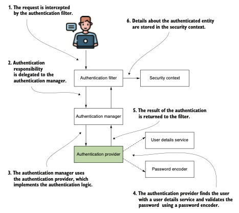

`Flujo de autenticación en Spring Security. Una autenticación exitosa termina con la aplicación 
agregando los detalles del principal autenticado al contexto de seguridad`.

Sabiendo que los detalles de autenticación están en el contexto de seguridad, puedes usarlos 
exactamente de la misma manera que para cualquier otro método de autenticación discutido 
anteriormente — `httpBasic(), formLogin() u oauth2ResourceServer()`:

- Puedes inyectar el objeto Authentication como parámetro de método (figura anterior).
- Puedes obtenerlo del contexto de seguridad en cualquier parte de la aplicación 
`(SecurityContextHolder.getContext().getAuthentication())`.
- Puedes usar anotaciones pre-/post-, como se discutió en los capítulos 11 y 12.

Puedes usar el contrato Authentication para obtener detalles estándar del usuario como el nombre de 
usuario y las autoridades. Si necesitas detalles personalizados, puedes usar la implementación del 
contrato directamente, como se presenta en el siguiente codigo. Para `OAuth 2`, la clase 
`OAuth2AuthenticationPrincipal` define la implementación del contrato. Sin embargo, recuerda que por 
razones de mantenibilidad, te recomiendo usar el contrato Authentication en todos los lugares 
posibles y depender de la implementación solo si no tienes otra opción (por ejemplo, si necesitas 
obtener un detalle que no puedes obtener ya usando la referencia del contrato).

Obtaining the authentication details:
```java
@Controller
public class HomeController {
    @GetMapping("/")
    //Inyectando los detalles de autenticación en el parámetro del metodo.
    public String home(
        [CA]OAuth2AuthenticationToken authentication) {
    // do something with the authentication
        return "index.html";
    }
}
```

## 16.2 Implementando un cliente OAuth 2

Esta sección discute la implementación de un servicio como cliente `OAuth 2`. En sistemas orientados a
servicios, las aplicaciones frecuentemente se comunican entre sí. En tales casos, la aplicación que 
envía la solicitud a otra aplicación se convierte en un cliente de esa aplicación en particular. En 
la mayoría de los casos, si decidimos implementar la autenticación para las solicitudes sobre 
`OAuth 2`, la aplicación usa el tipo de concesión de credenciales de cliente para obtener un token de 
acceso.
El tipo de concesión de credenciales de cliente no implica a un usuario. Por esta razón, no 
necesitarás una URI de redirección ni una URI de autorización. Las credenciales del cliente son 
suficientes para permitir que un cliente se autentique y obtenga un token de acceso enviando una 
solicitud a la URI del token. La figura siguiente te recuerda el tipo de concesión de credenciales de 
cliente que discutimos en el capítulo 13.

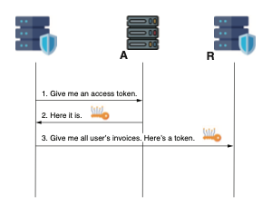

`El tipo de concesión de credenciales de cliente. El cliente envía una solicitud al endpoint de token
usando las credenciales del cliente para autenticarse. Tras una autenticación exitosa, el cliente 
recibe un token de acceso que puede usar para acceder a los recursos en el lado del servidor de 
recursos`.

Construyamos un ejemplo simple para mostrarte todo lo que necesitas saber sobre la implementación de
capacidades de cliente `OAuth 2` con Spring Security. Construiremos una aplicación que usa el tipo de 
concesión de credenciales de cliente para obtener un token de acceso de un servidor de autorización.
Esta aplicación obtendrá un token de acceso de un servidor de autorización. Para simplificar el 
ejemplo, solo discutiremos la recuperación del token de acceso. Es irrelevante para nuestra 
demostración cómo creas la solicitud. Siempre que sepas cómo obtener un token de acceso, puedes 
enviar la solicitud HTTP de cualquier manera, ya que cualquier tecnología te permite agregar 
fácilmente un valor de encabezado de solicitud (recuerda que agregas el valor del token de acceso 
al encabezado de solicitud Authorization con el prefijo "Bearer").
Entonces, lo que haremos precisamente en este ejemplo es configurar una aplicación para recuperar un
token de acceso de un servidor de autorización `OAuth 2` usando el tipo de concesión de credenciales 
de cliente. Para demostrar que recuperamos correctamente el token de acceso, lo retornaremos en el 
cuerpo de la respuesta de un endpoint de demostración. La figura siguiente ilustra lo que queremos 
construir. Los pasos mostrados en la figura son los siguientes:

1. El usuario (tú) llama a un endpoint de demostración que nombramos /token usando cURL (o una 
herramienta alternativa como Postman).

2. La herramienta (cURL) que simula una aplicación envía la solicitud a la aplicación que construimos 
para este ejemplo.

3. Nuestra aplicación usa el tipo de concesión de credenciales de cliente para recuperar un token de 
acceso de un servidor de autorización.

4. La aplicación retorna el valor del token de acceso al cliente en el cuerpo de la respuesta HTTP.

5. El usuario (tú) encuentra el valor del token de acceso en el cuerpo de la respuesta HTTP.

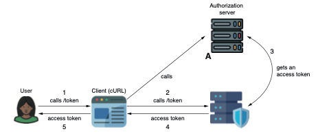

`Nuestra demostración construye una aplicación capaz de recuperar un token de acceso de un servidor 
de autorización usando el tipo de concesión de credenciales de cliente. Para demostrar que la
aplicación recuperó correctamente el token de acceso, la aplicación envía el valor del token en 
respuesta a una llamada al endpoint de demostración. Nombramos a este endpoint de demostración /token`.

Usaremos el mismo servidor de autorización que construiste en el capítulo 14, que puedes encontrar 
para este capítulo en el proyecto ssia-ch16-ex1-as. Recuerda primero agregar al servidor de 
autorización un registro de cliente que permita usar el tipo de concesión de credenciales de cliente.
Puedes cambiar el que configuraste previamente en el capítulo 14 (como se presenta en el siguiente 
codigo) o agregar un segundo registro de cliente que cumpla con este requisito.

The client details registered on the authorization server side:
```java
@Bean
public RegisteredClientRepository registeredClientRepository() {
    var registeredClient = RegisteredClient
            .withId(UUID.randomUUID().toString())
            .clientId("client")
            .clientSecret("secret")
            .clientAuthenticationMethod(
                    ClientAuthenticationMethod.CLIENT_SECRET_BASIC)
            .authorizationGrantType(
                    //Agregando un registro de cliente que permite el uso del tipo de concesión de 
                    // credenciales de cliente.
                    AuthorizationGrantType.CLIENT_CREDENTIALS)
            .scope(OidcScopes.OPENID)
            .build();
    return new InMemoryRegisteredClientRepository(registeredClient);
}
```
De manera similar a otros métodos de autenticación, Spring Security ofrece un método del objeto 
`HttpSecurity` para configurar una aplicación como cliente `OAuth 2`. Llama al método `oauth2Client()` 
presentado en el siguiente codigo para configurar la aplicación como un cliente `OAuth 2`.

Configuring OAuth 2 client authentication:
```java
@Configuration
public class ProjectConfig {
    @Bean
    public SecurityFilterChain securityFilterChain(HttpSecurity http)
            throws Exception {
        //Usar el metodo de autenticación oauth2Client() convierte esta aplicación en un cliente OAuth 2.
        http.oauth2Client(Customizer.withDefaults());
        http.authorizeHttpRequests(
                c -> c.anyRequest().permitAll()
        );
        return http.build();
    }
}
```
La aplicación también necesita conocer algunos detalles para enviar al servidor de autorización las
solicitudes de tokens de acceso. Como aprendiste en la sección 16.1, proporcionamos estos detalles 
usando un componente ClientRegistrationRepository. Puede que el código siguiente te resulte 
familiar, ya que se asemeja al código que escribimos en el codigo anterior.
Sin embargo, como no uso un proveedor común, tuve que especificar más detalles, como el alcance, la 
URI del token y el método de autenticación. Observa que configuré las credenciales de cliente como 
tipo de concesión.

Configurando los detalles del registro del cliente para la aplicación cliente:
```java
@Configuration
public class ProjectConfig {
    // Omitted code
    @Bean
    public ClientRegistrationRepository clientRegistrationRepository() {
        ClientRegistration c1 =
                ClientRegistration.withRegistrationId("1")
                        .clientId("client")
                        .clientSecret("secret")
                        .authorizationGrantType(AuthorizationGrantType.CLIENT_CREDENTIALS)
                        .clientAuthenticationMethod(
                                ClientAuthenticationMethod.CLIENT_SECRET_BASIC)
                        .tokenUri("http://localhost:7070/oauth2/token")
                        .scope(OidcScopes.OPENID)
                        .build();
        var repository =
                new InMemoryClientRegistrationRepository(c1);
        return repository;
    }
}
```
Un componente gestor de cliente realiza la solicitud necesaria para obtener un token de acceso. La 
figura siguiente ilustra la relación entre el controlador y el gestor de cliente (para nuestro ejemplo).

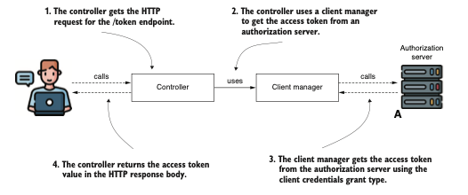

`El controlador usa un gestor de cliente para obtener el token de acceso del servidor de autorización.
El gestor de cliente es el componente de Spring Security responsable de conectarse al servidor de 
autorización y usar correctamente el tipo de concesión para obtener el token de acceso`.

La clase OAuth2AuthorizedClientManager define un gestor de cliente. El siguiente listado configura 
un gestor de cliente como un bean en el contexto de la aplicación.

Implementing an OAuth 2 client manager:
```java
@Configuration
public class ProjectConfig {
    // Omitted code
    @Bean
    public OAuth2AuthorizedClientManager oAuth2AuthorizedClientManager(
            ClientRegistrationRepository clientRegistrationRepository,
            OAuth2AuthorizedClientRepository auth2AuthorizedClientRepository
    ) {
        //Creando un objeto provider para especificar los tipos de concesión que se pretenden usar.
        var provider =
                OAuth2AuthorizedClientProviderBuilder.builder()
                        .clientCredentials()
                        .build();
        //Creando una instancia del gestor de cliente que manejará la lógica de solicitud del cliente.
        var cm = new DefaultOAuth2AuthorizedClientManager(
                clientRegistrationRepository,
                auth2AuthorizedClientRepository);
        //Estableciendo el provider para el client manager.
        cm.setAuthorizedClientProvider(provider);
        return cm;
    }
}
```
Ahora puedes usar el gestor de cliente donde necesites obtener un token de acceso. Como se muestra 
en la figura anterior, hice que el controlador use el gestor de cliente directamente para simplificar
este ejemplo y permitirte enfocarte en la discusión sobre la implementación de un cliente `OAuth 2`.
Recuerda que una aplicación del mundo real probablemente sería más compleja. En un diseño que segrega
correctamente las responsabilidades de los objetos, el gestor de cliente probablemente sería usado 
por un objeto proxy y no directamente por un controlador (figura siguiente).

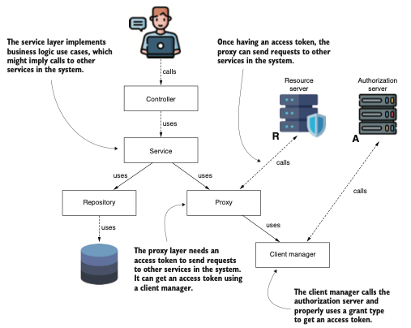

`Una aplicación del mundo real tendría responsabilidades mejor separadas. A diferencia de nuestro
ejemplo, una capa proxy usa el token que obtiene con la ayuda de un gestor de cliente para enviar 
solicitudes a otra aplicación en el sistema`.

El siguiente codigo muestra cómo inyectar la instancia del gestor de cliente y demuestra la 
recuperación de un token de acceso usando un endpoint. Al llamar al endpoint /token que expone la 
aplicación, el cuerpo de la respuesta debería contener el valor del token de acceso.

Using the OAuth 2 client manager to get a token:
```java
@RestController
public class DemoController {
    private final OAuth2AuthorizedClientManager clientManager;

    // Omitted constructor
    //Exponiendo un endpoint GET en la ruta /token.
    @GetMapping("/token")
    public String token() {
        OAuth2AuthorizeRequest request = OAuth2AuthorizeRequest
                .withClientRegistrationId("1")
                .principal("client")
                .build();//Creando una instancia de solicitud de autorización.
        //Enviando la solicitud, la aplicación retorna el valor del token de acceso.
        var client =
                clientManager.authorize(request);
        //La aplicación retorna el valor del token de acceso en el cuerpo de la respuesta.
        return client
                .getAccessToken().getTokenValue();
    }
}
```
Usa el siguiente comando cURL para llamar al endpoint que expone la aplicación:

`curl http://localhost:8080/token`

El cuerpo de la respuesta debería contener el valor de un token de acceso, similar a:

`eyJhbGciOiJIUzI1NiIsInR5cCI6IkpXVCJ9.eyJzdWIiOiIxMjM0NTY3ODkwIiwibmFtZSI6Im
JpbGwiLCJpYXQiOjE1MTYyMzkwMjJ9.zjL2JXw0TVgNgTMUKmP0-PTPklULUVmV_5re50eZoHw`

### Resumen

- Al implementar una aplicación web Spring, a menudo debemos configurar capacidades de autenticación.
Si bien podemos implementar un formulario de inicio de sesión rápidamente con el método `formLogin()`,
también podemos permitir que los usuarios se autentiquen usando otro sistema con una cuenta 
registrada.

- Permitir que los usuarios elijan un sistema diferente para iniciar sesión ofrece ventajas tanto para
el usuario como para nuestra aplicación. Los usuarios no necesitan recordar credenciales adicionales,
y nuestra aplicación no tiene que gestionar las credenciales de todos sus usuarios.

- Spring Security considera a GitHub, Google, Facebook y Okta como proveedores comunes. Para los 
proveedores comunes, Spring Security ya conoce todos los detalles necesarios para establecer 
solicitudes sobre el `framework OAuth 2`, por lo que solo necesitas configurar las credenciales de 
cliente que ofrece el proveedor para configurar la capacidad de inicio de sesión.

- Puedes configurar tu aplicación para usar proveedores distintos a los comunes, pero necesitas 
configurar explícitamente todos los detalles que la aplicación necesita para establecer los flujos 
del tipo de concesión para obtener tokens de acceso. Los principales detalles que necesitas configurar
son tres URIs: la de autorización, la del token y la del conjunto de claves.

- Una vez que el usuario inicia sesión en tu aplicación, incluso si se autentica a través de un sistema
externo, la aplicación obtiene detalles sobre él, almacenando los detalles en el contexto de 
seguridad. Este proceso sigue el diseño estándar de autenticación de Spring Security. Por esta razón,
puedes configurar la autorización de manera similar a todos los demás métodos de autenticación.

- A veces, un servicio backend se convierte en un cliente para otra aplicación backend. En tal caso, 
una aplicación que quiere llamar a otra aplicación y usar un enfoque `OAuth 2` necesita obtener un 
token de acceso para ser autenticada por esta última. Un servicio puede usar el tipo de concesión de
credenciales de cliente para obtener un token de acceso.

- Spring Security proporciona un objeto llamado gestor de cliente. Este objeto implementa la lógica 
para ejecutar un tipo de concesión específico y obtener un token de acceso. Una capa proxy de una 
aplicación que envía solicitudes a otra aplicación y necesita autenticar las solicitudes usando 
tokens de acceso utilizaría un gestor de cliente para obtener el token de acceso.