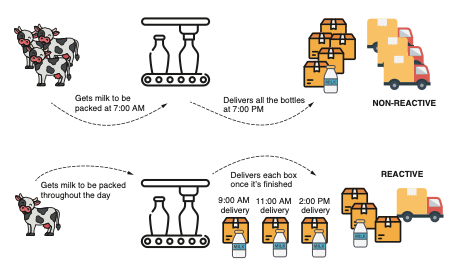
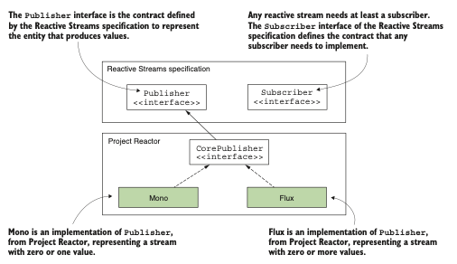
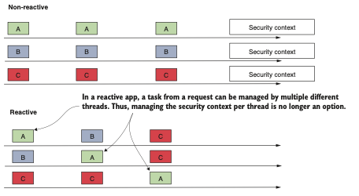
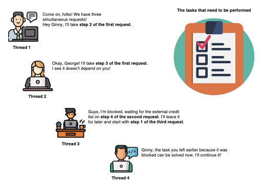
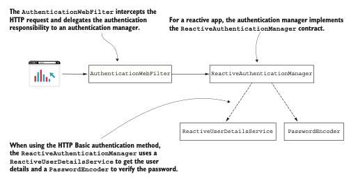
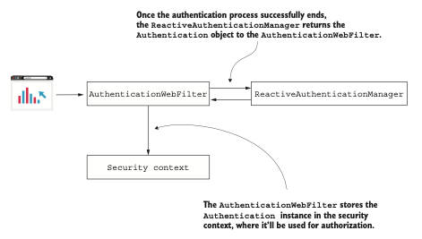
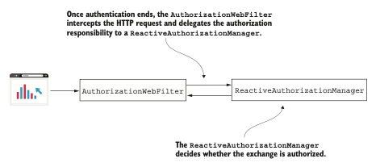
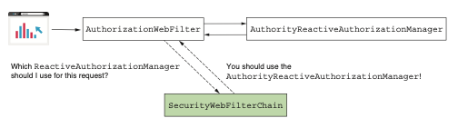
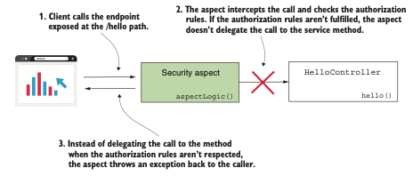

# Parte 5

## Yendo hacia lo reactivo

Con la tendencia de la industria del software hacia aplicaciones más receptivas y eficientes, la 
programación reactiva ha surgido como un paradigma convincente. En esta parte del libro, se te guiará
a través de los matices de la implementación de seguridad dentro de aplicaciones reactivas, 
equilibrando la capacidad de respuesta con una protección robusta.

El capítulo 17 discute el concepto de aplicaciones reactivas, sentando las bases para comprender su 
naturaleza distintiva. El capítulo te guiará a través de las complejidades de la gestión de usuarios
en un entorno reactivo, elaborando sobre la configuración de reglas de autorización precisas, tanto 
en la capa de endpoints como a través de la seguridad de métodos. Además, obtendrás información sobre
la creación de un servidor de recursos OAuth 2 reactivo, combinando lo mejor de los mundos reactivo 
y de seguridad.
Al culminar esta parte, estarás equipado para incorporar la seguridad de manera fluida en tus 
aplicaciones reactivas, asegurando que permanezcan ágiles sin comprometer la protección del usuario.

# Implementado Seguridad En Aplicaciones Reactivas

### Este capítulo cubre
- Usar Spring Security con aplicaciones reactivas
- Usar aplicaciones reactivas en un sistema diseñado con autenticación OAuth 2

Reactivo es un paradigma de programación donde aplicamos una forma diferente de pensar al desarrollar
nuestras aplicaciones. La programación reactiva es una forma poderosa de desarrollar aplicaciones web
que ha ganado una amplia aceptación. Incluso diría que se puso de moda hace algunos años, cuando 
cualquier conferencia importante tenía al menos varias presentaciones que discutían aplicaciones 
reactivas. Sin embargo, como cualquier otra tecnología en el desarrollo de software, la programación
reactiva no es una solución aplicable a todas las situaciones.
En algunos casos, un enfoque reactivo es una excelente opción. En otros casos, puede que solo 
complique su vida. Pero al final, el enfoque reactivo existe porque aborda algunas limitaciones de la
programación imperativa y, por lo tanto, se utiliza para evitar dichas limitaciones. Una de ellas 
implica la ejecución de tareas grandes que pueden fragmentarse. Con un enfoque imperativo, le das a 
la aplicación una tarea para ejecutar, y la aplicación tiene la responsabilidad de resolverla. Si la
tarea es grande, puede tomar una cantidad considerable de tiempo para que la aplicación la resuelva.
El cliente que asignó la tarea necesita esperar a que esta sea resuelta por completo antes de recibir
una respuesta. Con la programación reactiva, puedes dividir la tarea para que la aplicación tenga la
oportunidad de abordar algunas de las subtareas de forma simultánea. De esta manera, el cliente recibe
los datos procesados más rápido.

Este capítulo analiza la seguridad a nivel de aplicación en aplicaciones reactivas con Spring 
Security. Al igual que con cualquier otra aplicación, la seguridad es un aspecto importante de las 
aplicaciones reactivas. Sin embargo, debido a que las aplicaciones reactivas están diseñadas de manera
diferente, Spring Security ha adaptado la forma en que implementamos las funcionalidades discutidas 
anteriormente en este libro.
Comenzaremos con una breve descripción general de la implementación de aplicaciones reactivas con el
framework Spring en la sección 17.1. Luego aplicaremos las funcionalidades de seguridad que aprendiste
a lo largo de este libro en aplicaciones seguras. En la sección 17.2, discutiremos la gestión de 
usuarios en aplicaciones reactivas, y en la sección 17.3, continuaremos aplicando reglas de 
autorización. Finalmente, en la sección 17.4, aprenderás cómo implementar aplicaciones reactivas en 
un sistema diseñado sobre OAuth 2. Aprenderás qué cambia desde la perspectiva de Spring Security 
cuando se trata de aplicaciones reactivas y, por supuesto, aprenderás cómo aplicarlo a través de 
ejemplos.

## 17.1 ¿Qué son las aplicaciones reactivas?

En esta sección, analizamos brevemente las aplicaciones reactivas. Este capítulo trata sobre la 
aplicación de seguridad para aplicaciones reactivas, por lo que aquí quiero asegurarme de que 
comprendas los aspectos esenciales de las aplicaciones reactivas antes de profundizar en las 
configuraciones de Spring Security. Debido a que el tema de las aplicaciones reactivas es amplio, 
solo repaso los aspectos principales de las aplicaciones reactivas a modo de repaso. Si aún no sabes
cómo funcionan las aplicaciones reactivas, o necesitas comprenderlas con más detalle, te recomiendo 
leer la parte 3 de Spring in Action, Sexta Edición, de Craig Walls (Manning, 2022).
Cuando implementamos aplicaciones, usamos dos formas para implementar las funcionalidades. El
siguiente codigo detalla estos enfoques:

- Con el enfoque imperativo, tu aplicación procesa la mayor parte de tus datos de una sola vez. Por 
ejemplo, una aplicación cliente llama a un endpoint expuesto por el servidor y envía todos los datos
que necesitan ser procesados al backend. Supongamos que implementas una funcionalidad donde el usuario
sube archivos. Si el usuario selecciona varios archivos y todos son recibidos por la aplicación 
backend para ser procesados de una sola vez, estás trabajando con un enfoque imperativo.

- Con el enfoque reactivo, tu aplicación recibe y procesa los datos en fragmentos. No es necesario 
que todos los datos estén completamente disponibles desde el principio para ser procesados. El backend
recibe y procesa los datos a medida que los obtiene. Supongamos que el usuario selecciona algunos 
archivos y el backend necesita subirlos y procesarlos. El backend no espera recibir todos los archivos
a la vez antes de procesarlos. El backend puede recibir los archivos uno por uno y procesar cada uno
mientras espera que lleguen más archivos.

La siguiente figura presenta una analogía de los dos enfoques de programación. Imagina una fábrica que 
embotella leche. Si la fábrica recibe toda la leche por la mañana y entrega la leche una vez que 
termina el embotellado, decimos que es no reactiva (imperativa). Si la fábrica recibe la leche a lo 
largo del día y entrega los pedidos una vez que termina de embotellar suficiente leche, decimos que 
es reactiva. Claramente, para la fábrica de leche, es más ventajoso utilizar un enfoque reactivo en 
lugar de uno no reactivo.



`No reactivo vs. reactivo. En un enfoque no reactivo, la fábrica de leche recibe toda la leche que 
debe empaquetar por la mañana y entrega todas las cajas por la noche. En un enfoque reactivo, a medida
que la leche llega a la fábrica, se empaqueta y luego se entrega. Para este escenario, un enfoque 
reactivo es mejor ya que permite que la leche sea recolectada a lo largo del día y entregada más
pronto a los clientes`.

Para implementar aplicaciones reactivas, la especificación Reactive Streams 
(http://www.reactive-streams.org/) proporciona una forma estándar para el procesamiento asíncrono de
flujos. Una de las implementaciones de esta especificación es Project Reactor, que construye los 
fundamentos del modelo de programación reactiva de Spring. Project Reactor proporciona una API 
funcional para componer Reactive Streams.
Para tener una experiencia más práctica, comencemos con una implementación simple de una aplicación 
reactiva. Continuaremos con esta misma aplicación en la sección 17.2 cuando analicemos la gestión de
usuarios en aplicaciones reactivas. Creé un nuevo proyecto llamado ssia-ch17-ex1, y desarrollaremos 
una aplicación web reactiva que expone un endpoint de demostración. En el archivo pom.xml, debemos 
agregar la dependencia web reactiva como se presenta en el siguiente fragmento de código. Esta 
dependencia alberga Project Reactor y nos permite usar sus clases e interfaces relacionadas en nuestro
proyecto:
```xml
<dependency>
    <groupId>org.springframework.boot</groupId>
    <artifactId>spring-boot-starter-webflux</artifactId>
</dependency>
```
A continuación, definimos un simple HelloController para contener la definición de nuestro endpoint 
de demostración. El siguiente codigo muestra la definición de la clase HelloController. En la 
definición del endpoint, observarás que usé un Mono como tipo de retorno. Mono es uno de los conceptos
esenciales definidos por una implementación de Reactor. Cuando se trabaja con Reactor, frecuentemente
se usan Mono y Flux, ambos definiendo publicadores (fuentes de datos). En la especificación Reactive
Streams, un publicador es descrito por la interfaz Publisher. Esta interfaz describe uno de los 
contratos esenciales utilizados con Reactive Streams. El otro contrato es el Subscriber. Este contrato
describe el componente que consume los datos.
Al diseñar un endpoint que retorna algo, el endpoint se convierte en un publicador, por lo que debe 
retornar una implementación de Publisher. Si se usa Project Reactor, esto será un Mono o un Flux. 
Mono es un publicador para un único valor, mientras que Flux es un publicador para múltiples valores.
La siguiente figura describe estos componentes y las relaciones entre ellos.



`En un flujo reactivo, un publicador produce valores y un suscriptor los consume. Los contratos 
definidos por la especificación Reactive Streams describen a los publicadores y suscriptores. Project
Reactor implementa la especificación Reactive Streams y los contratos Publisher y Subscriber. En la 
figura, los componentes que usamos en los ejemplos de este capítulo están sombreados`.


Para hacer esta explicación aún más precisa, volvamos a la analogía de la fábrica de leche. La fábrica
de leche es una implementación de backend reactivo que expone un endpoint para recibir la leche que 
debe procesarse. Este endpoint produce algo (leche embotellada), por lo que necesita retornar un 
Publisher. Si se solicita más de una botella de leche, entonces la fábrica de leche necesita retornar
un Flux, que es la implementación de Publisher de Project Reactor que maneja cero o más valores 
producidos.

The definition of the HelloController class:
```java
@RestController
public class HelloController {
    //Crea y retorna una fuente de flujo Mono con un único valor en el flujo.
    @GetMapping("/hello")
    public Mono<String> hello() {
        return Mono.just("Hello!");
    }
}
```
Ahora puedes iniciar y probar la aplicación. Lo primero que observas al mirar en la terminal de la 
aplicación es que Spring Boot ya no configura un servidor Tomcat. Spring Boot solía configurar un 
Tomcat para una aplicación web de forma predeterminada, y es posible que hayas observado este aspecto
en cualquiera de los ejemplos desarrollados anteriormente en este libro. En cambio, Spring Boot ahora
autoconfigura Netty como el servidor web reactivo predeterminado para un proyecto Spring Boot.
Lo segundo que puedes haber observado al llamar al endpoint es que no se comporta de manera diferente
a un endpoint desarrollado con un enfoque no reactivo. Aún puedes encontrar en el cuerpo de la 
respuesta HTTP el mensaje Hello! que el endpoint retorna en su flujo Mono definido. El siguiente 
fragmento de código presenta el comportamiento de la aplicación al llamar al endpoint:

curl http://localhost:8080/hello

El cuerpo de la respuesta es:

Hello!


Pero ¿por qué el enfoque reactivo es diferente en términos de Spring Security? Detrás de escena, una
implementación reactiva usa múltiples hilos para resolver las tareas en el flujo. En otras palabras,
cambia la filosofía de un-hilo-por-solicitud, que usamos para una aplicación web diseñada con un 
enfoque imperativo (siguiente figura). Y a partir de aquí, hay más diferencias:

- La implementación de SecurityContext no funciona de la misma manera en las aplicaciones reactivas.
Recuerda, el SecurityContext está basado en un ThreadLocal, y ahora tenemos más de un hilo por 
solicitud.

- Debido al SecurityContext, cualquier configuración de autorización se ve afectada. Recuerda del 
capítulo 5 que las reglas de autorización generalmente dependen de la instancia de Authentication 
almacenada en el SecurityContext. Ahora las configuraciones de seguridad aplicadas en la capa del 
endpoint, así como la funcionalidad de seguridad global de métodos, se ven afectadas.

- El UserDetailsService, el componente responsable de recuperar los detalles del usuario, es una 
fuente de datos. Debido a esto, el servicio de detalles de usuario también necesita soportar un 
enfoque reactivo. (Aprendimos sobre este contrato en el capítulo 2.)

`En una aplicación web no reactiva, se asigna un hilo para cada solicitud. Por lo tanto, siempre 
sabemos que dentro del mismo hilo, siempre trabajamos con tareas para la misma solicitud. Por esta 
razón, la aplicación gestiona el contexto de seguridad por hilo`.



`En la figura, cada flecha representa la línea de tiempo de un hilo diferente, y los cuadrados
representan las tareas procesadas de las solicitudes A, B y C. Debido a que en una aplicación 
reactiva, las tareas de una solicitud pueden ser manejadas en múltiples hilos, los detalles de 
autenticación ya no pueden almacenarse a nivel del hilo`.

La siguiente figura presenta otra forma de ver este enfoque. Imagina un equipo de personas trabajando
en un conjunto de tareas. Cada una puede tomar una tarea y dejarla cuando está bloqueada. No siempre
es el mismo hilo el que continuará la tarea que fue dejada pendiente. Por lo tanto, el contexto de 
seguridad ya no puede estar asociado a un hilo, sino que debe estar de alguna manera vinculado a la
tarea.
Afortunadamente, Spring Security ofrece soporte para aplicaciones reactivas y cubre todos los casos 
donde ya no se pueden usar las implementaciones para aplicaciones no reactivas. Continuaremos en este
capítulo analizando la forma en que se implementan las configuraciones de seguridad con Spring 
Security para aplicaciones reactivas. Comenzaremos en la sección 17.2 con la implementación de la 
gestión de usuarios y continuaremos en la sección 17.3 con la aplicación de reglas de autorización 
de endpoints, donde descubriremos cómo funciona el contexto de seguridad en las aplicaciones 
reactivas. Luego continuaremos nuestra discusión con la seguridad reactiva de métodos, que reemplaza
la seguridad global de métodos de las aplicaciones imperativas.



Una analogía de la forma en que funciona una aplicación reactiva. Un hilo no toma las tareas de una 
solicitud en orden y espera cuando está bloqueado. En cambio, todas las tareas de todas las 
solicitudes están en una lista de pendientes. Cualquier hilo disponible puede trabajar en tareas de 
cualquier solicitud. De esta manera, las tareas independientes pueden resolverse en paralelo y los 
hilos no permanecen inactivos.

## 17.2 Gestión de usuarios en aplicaciones reactivas

Con frecuencia en las aplicaciones, la forma en que un usuario se autentica se basa en un par de 
credenciales de nombre de usuario y contraseña. Este enfoque es básico y lo hemos discutido, 
comenzando con la aplicación más sencilla que implementamos en el capítulo 2. Pero con las 
aplicaciones reactivas, la implementación del componente que se encarga de la gestión de usuarios 
también cambia. En esta sección, analizamos la implementación de la gestión de usuarios en una 
aplicación reactiva.
Continuamos la implementación de la aplicación ssia-ch17-ex1 que comenzamos en la sección 17.1 
agregando un `ReactiveUserDetailsService` al contexto de la aplicación. Queremos asegurarnos de que el
endpoint /hello solo pueda ser llamado por un usuario autenticado. Como su nombre lo sugiere, el 
contrato `ReactiveUserDetailsService` define el servicio de detalles de usuario para una aplicación 
reactiva.
La definición del contrato es tan simple como la del `UserDetailsService`. El 
`ReactiveUserDetailsService` define un método utilizado por Spring Security para recuperar un usuario
por su nombre de usuario. 
La diferencia es que el método descrito por el `ReactiveUserDetailsService` retorna directamente un 
`Mono<UserDetails>` y no el `UserDetails` como en el caso del `UserDetailsService`. El siguiente fragmento
de código muestra la definición de la interfaz `ReactiveUserDetailsService`:

```java
public interface ReactiveUserDetailsService {
    Mono<UserDetails> findByUsername(String username);
}
```
Al igual que en el caso del `UserDetailsService`, puedes escribir una implementación personalizada del
`ReactiveUserDetailsService` para darle a Spring Security una forma de obtener los detalles del usuario.
Para simplificar esta demostración, usamos una implementación proporcionada por Spring Security. La 
implementación `MapReactiveUserDetailsService` almacena los detalles del usuario en memoria (igual que
con el `InMemoryUserDetailsManager` que aprendiste en el capítulo 2). Modificamos el archivo pom.xml 
del proyecto ssia-ch17-ex1 y agregamos la dependencia de Spring Security, como muestra el siguiente 
fragmento de código:
```xml
<dependency>
    <groupId>org.springframework.boot</groupId>
    <artifactId>spring-boot-starter-security</artifactId>
</dependency>
<dependency>
    <groupId>org.springframework.boot</groupId>
    <artifactId>spring-boot-starter-webflux</artifactId>
</dependency>
```
Luego creamos una clase de configuración y agregamos un `ReactiveUserDetailsService` y un 
`PasswordEncoder` al contexto de Spring Security. Nombré la clase de configuración `ProjectConfig`. 
Puedes encontrar la definición de esta clase en el siguiente codigo. Usando un 
`ReactiveUserDetailsService`, definimos un usuario con su nombre de usuario john, la contraseña 12345 
y una autoridad que nombré read. Como puedes observar, es similar a trabajar con un 
`UserDetailsService`. La principal diferencia en la implementación del `ReactiveUserDetailsService` es 
que el método retorna un objeto `Publisher reactivo` que contiene el `UserDetails` en lugar de la 
instancia `UserDetails` en sí misma. Spring Security se encarga del resto de la integración.

The ProjectConfig class:
```java
@Configuration
public class ProjectConfig {
    @Bean //Agrega un ReactiveUserDetailsService al contexto de Spring.
    public ReactiveUserDetailsService userDetailsService() {
        //Crea un nuevo usuario con su nombre de usuario, contraseña y autoridades.
        var u = User.withUsername("john")
                .password("12345")
                .authorities("read")
                .build();
        //Crea un MapReactiveUserDetailsService para gestionar las instancias de UserDetails.
        var uds = new MapReactiveUserDetailsService(u);
        return uds;
    }
    //Agrega un PasswordEncoder al contexto de Spring.
    @Bean
    public PasswordEncoder passwordEncoder() {
        return NoOpPasswordEncoder.getInstance();
    }
}
```
Ahora, al iniciar y probar la aplicación, puedes notar que solo puedes llamar al endpoint cuando te 
autenticas usando las credenciales correctas. En nuestro caso, solo podemos usar john con su 
contraseña 12345, ya que es el único registro de usuario que agregamos. El siguiente fragmento de 
código muestra el comportamiento de la aplicación al llamar al endpoint con credenciales válidas:

curl -u john:12345 http://localhost:8080/hello

El cuerpo de la respuesta es:

Hello!

La siguiente figura explica la arquitectura que usamos en esta aplicación. Detrás de escena, un 
`AuthenticationWebFilter` intercepta la solicitud HTTP. Este filtro delega la responsabilidad de 
autenticación a un gestor de autenticación. El gestor de autenticación implementa el contrato 
`ReactiveAuthenticationManager`. A diferencia de las aplicaciones no reactivas, no tenemos proveedores
de autenticación. El `ReactiveAuthenticationManager` implementa directamente la lógica de autenticación.



`Un AuthenticationWebFilter intercepta la solicitud y delega la responsabilidad de autenticación a un
 ReactiveAuthenticationManager. Si la lógica de autenticación involucra usuarios y contraseñas, el 
 ReactiveAuthenticationManager usa un ReactiveUserDetailsService para encontrar los detalles del 
 usuario y un PasswordEncoder para verificar la contraseña`.

Si deseas crear tu propia lógica de autenticación personalizada, implementa la interfaz 
`ReactiveAuthenticationManager`. La arquitectura para aplicaciones reactivas no es muy diferente de la
de las aplicaciones no reactivas que ya discutimos a lo largo de este libro. Como se presenta en la 
siguiente figura, si la autenticación involucra credenciales de usuario, entonces usamos un 
`ReactiveUserDetailsService` para obtener los detalles del usuario y un `PasswordEncoder` para verificar
la contraseña.
Además, el framework aún sabe cómo inyectar una instancia de autenticación cuando se solicita. 
Solicitas los detalles de `Authentication` agregando `Mono<Authentication>` como parámetro al método en 
la clase controladora. El siguiente codigo presenta los cambios realizados en la clase controladora.
Nuevamente, el cambio significativo es que usas publicadores reactivos. Observa que necesitamos usar
`Mono<Authentication>` en lugar del Authentication simple como lo hacíamos en las aplicaciones no 
reactivas.

The HelloController class:
```java
@RestController
public class HelloController {
    @GetMapping("/hello")
    //Solicita al framework que proporcione el objeto de autenticación.
    public Mono<String> hello(
            Mono<Authentication> auth) {
        //Retorna el nombre del principal en la respuesta.
        Mono<String> message =
                auth.map(a -> "Hello " + a.getName());
        return message;
    }
}
```
Al volver a ejecutar la aplicación y llamar al endpoint, observas que el comportamiento es el que se
presenta en el siguiente fragmento de código:

curl -u john:12345 http://localhost:8080/hello

El cuerpo de la respuesta es:

Hello john

Y ahora probablemente te estás preguntando, ¿de dónde vino el objeto `Authentication?` Dado que esta es
una aplicación reactiva, no podemos permitirnos usar un `ThreadLocal` anymore porque el framework está
diseñado para gestionar el `SecurityContext`. Pero Spring Security nos ofrece una implementación 
diferente del contenedor de contexto para aplicaciones reactivas, `ReactiveSecurityContextHolder`. 
Usamos este para trabajar con el `SecurityContext` en una aplicación reactiva. Entonces todavía tenemos
el `SecurityContext`, pero ahora se gestiona de manera diferente. La siguiente figura describe el 
final del proceso de autenticación una vez que el `ReactiveAuthenticationManager` autentica exitosamente
la solicitud.



`Una vez que el ReactiveAuthenticationManager autentica exitosamente la solicitud, retorna el objeto 
Authentication al filtro. El filtro almacena la instancia de Authentication en el SecurityContext`.

El siguiente codigo muestra cómo reescribir la clase controladora si deseas obtener los detalles de 
autenticación directamente desde el contexto de seguridad. Este enfoque es una alternativa a permitir
que el framework lo inyecte a través del parámetro del método. Encontrarás este cambio implementado 
en el proyecto ssia-ch17-ex2.

Working with a ReactiveSecurityContextHolder:
```java
@RestController
public class HelloController {
    @GetMapping("/hello")
    public Mono<String> hello() {
        //Desde el ReactiveSecurityContextHolder, obtiene un Mono<SecurityContext>.
        Mono<String> message =
                ReactiveSecurityContextHolder.getContext()
                        //Mapea el SecurityContext al objeto Authentication.
                        .map(ctx -> ctx.getAuthentication())
                        //Mapea el objeto Authentication al mensaje retornado.
                        .map(auth -> "Hello " + auth.getName());
        return message;
    }
}
```
Si vuelves a ejecutar la aplicación y pruebas el endpoint nuevamente, puedes observar que se comporta
de la misma manera que en los ejemplos anteriores de esta sección. Aquí está el comando:

curl -u john:12345 http://localhost:8080/hello

El cuerpo de la respuesta es:

Hello john

Ahora que sabes que Spring Security ofrece una implementación para gestionar correctamente el 
`SecurityContext` en un entorno reactivo, sabes que así es como tu aplicación aplica las reglas de 
autorización. Y estos detalles que acabas de aprender abren el camino para configurar las reglas de 
autorización, que analizaremos en la sección 17.3.

## 17.3 Configuración de reglas de autorización en aplicaciones reactivas

En esta sección, analizamos la configuración de reglas de autorización. Como ya sabes de los capítulos
anteriores, la autorización sigue a la autenticación. Analizamos en las secciones 17.1 y 17.2 cómo 
Spring Security gestiona los usuarios y el SecurityContext en aplicaciones reactivas. Pero una vez que
la aplicación finaliza la autenticación y almacena los detalles de la solicitud autenticada en el 
`SecurityContext`, es momento de la autorización.
Al igual que con cualquier otra aplicación, probablemente necesites configurar reglas de autorización
al desarrollar aplicaciones reactivas. Para enseñarte cómo establecer reglas de autorización en 
aplicaciones reactivas, primero analizaremos en la sección 17.3.1 la forma en que realizas 
configuraciones en la capa del endpoint. Una vez que terminemos de analizar la configuración de 
autorización en la capa del endpoint, aprenderás en la sección 17.3.2 cómo aplicarla en cualquier 
otra capa de tu aplicación usando seguridad de métodos.

### 17.3.1 Aplicación de autorización en la capa del endpoint en aplicaciones reactivas

En esta sección, analizamos la configuración de autorización en la capa del endpoint en aplicaciones
reactivas. Establecer las reglas de autorización en la capa del endpoint es el enfoque más común para
configurar la autorización en una aplicación web. Ya descubriste esto mientras trabajabas en los 
ejemplos anteriores de este libro. La configuración de autorización en la capa del endpoint es 
esencial, la usas en casi todas las aplicaciones. Por lo tanto, también necesitas saber cómo aplicarla
para aplicaciones reactivas.
Aprendiste en capítulos anteriores a establecer las reglas de autorización agregando un bean de tipo
`SecurityFilterChain` al contexto de la aplicación. Este enfoque no funciona en aplicaciones reactivas.
Para enseñarte cómo configurar correctamente las reglas de autorización para la capa del endpoint en
aplicaciones reactivas, comenzamos trabajando en un nuevo proyecto, al que nombré ssia-ch17-ex3.
En las aplicaciones reactivas, Spring Security usa un contrato llamado `SecurityWebFilterChain` para 
aplicar las configuraciones que solíamos hacer usando un bean de tipo `SecurityFilterChain`, como se 
analizó en capítulos anteriores. Con las aplicaciones reactivas, agregamos un bean de tipo 
`SecurityWebFilterChain` en el contexto de Spring. Para enseñarte cómo hacer esto, implementemos una 
aplicación básica que tenga dos endpoints que aseguramos de forma independiente. En el archivo pom.xml
de nuestro proyecto ssia-ch17-ex3 recién creado, agrega las dependencias para aplicaciones web 
reactivas y, por supuesto, Spring Security:
```xml
<dependency>
    <groupId>org.springframework.boot</groupId>
    <artifactId>spring-boot-starter-security</artifactId>
</dependency>
<dependency>
    <groupId>org.springframework.boot</groupId>
    <artifactId>spring-boot-starter-webflux</artifactId>
</dependency>
```
Crea una clase controladora para definir los dos endpoints para los cuales configuramos las reglas de
autorización. Estos endpoints son accesibles en las rutas /hello y /ciao. Para llamar al 
endpoint /hello, un usuario necesita autenticarse, pero puedes llamar al endpoint /ciao sin 
autenticación. El siguiente codigo presenta la definición del controlador.

La clase HelloController que define los endpoints a asegurar:
```java
@RestController
public class HelloController {
    @GetMapping("/hello")
    public Mono<String> hello(Mono<Authentication> auth) {
        Mono<String> message = auth.map(a -> "Hello " + a.getName());
        return message;
    }

    @GetMapping("/ciao")
    public Mono<String> ciao() {
        return Mono.just("Ciao!");
    }
}
```
En la clase de configuración, nos aseguramos de declarar un `ReactiveUserDetailsService` y un 
`PasswordEncoder` para definir un usuario, como aprendiste en la sección 17.2. El siguiente codigo 
define estas declaraciones.

La clase de configuración que declara los componentes para la gestión de usuarios:
```java
@Configuration
public class ProjectConfig {
    @Bean
    public ReactiveUserDetailsService userDetailsService() {
        var u = User.withUsername("john")
                .password("12345")
                .authorities("read")
                .build();
        var uds = new MapReactiveUserDetailsService(u);
        return uds;
    }

    @Bean
    public PasswordEncoder passwordEncoder() {
        return NoOpPasswordEncoder.getInstance();
    }
// ...
}
```
En el siguiente codigo, trabajamos en la misma clase de configuración que declaramos en el codigo anterior,
pero omitimos la declaración del `ReactiveUserDetailsService` y el `PasswordEncoder` para que puedas 
enfocarte en la configuración de autorización que analizamos. En el siguiente codigo, puedes notar que
agregamos un `bean` de tipo `SecurityWebFilterChain` al contexto de Spring. El método recibe como 
parámetro un objeto de tipo `ServerHttpSecurity`, que es inyectado por Spring. `ServerHttpSecurity` nos 
permite construir una instancia de `SecurityWebFilterChain`. `ServerHttpSecurity` proporciona métodos de
configuración similares a los que usaste cuando configurabas la autorización para aplicaciones no 
reactivas.

Configuración de autorización de endpoints para aplicaciones reactivas:
```java
@Configuration
public class ProjectConfig {
    // Omitted code
    @Bean
    public SecurityWebFilterChain securityWebFilterChain(
            ServerHttpSecurity http) {
        http.httpBasic(Customizer.withDefaults());
        //Inicia la configuración de autorización de endpoints.
        http.authorizeExchange(
                //Selecciona las solicitudes a las cuales aplicamos las reglas de autorización.
                c -> c.pathMatchers(HttpMethod.GET, "/hello")
                        //Configura las solicitudes seleccionadas para que solo sean accesibles 
                        // cuando el usuario está autenticado.
                        .authenticated()
                        //Se refiere a cualquier otra solicitud.
                        .anyExchange()
                        //Permite que las solicitudes sean llamadas sin necesidad de autenticación.
                        .permitAll()
        );
        //Construye el objeto SecurityWebFilterChain que será retornado.
        return http.build();
    }
}
```
Comenzamos la configuración de autorización con el método authorizeExchange(). Llamamos a este método
de manera similar a como llamamos al método authorizeHttpRequests() cuando configuramos la 
autorización de endpoints para aplicaciones no reactivas. Luego continuamos usando el método 
pathMatchers(). Puedes considerar este método como el equivalente de usar requestMatchers() cuando 
configuramos la autorización de endpoints para aplicaciones no reactivas.
Al igual que con las aplicaciones no reactivas, una vez que usamos el método matcher para agrupar las
solicitudes a las que aplicamos la regla de autorización, especificamos cuál es la regla de 
autorización. En nuestro ejemplo, llamamos al método authenticated(), que establece que solo se 
aceptan solicitudes autenticadas. También usaste un método llamado authenticated() cuando configurabas
la autorización de endpoints para aplicaciones no reactivas. Los métodos para aplicaciones reactivas 
tienen el mismo nombre para hacerlos más intuitivos. De manera similar al método authenticated(), 
también puedes llamar a estos métodos:

- permitAll()—Configura la aplicación para permitir solicitudes sin autenticación
- denyAll()—Deniega todas las solicitudes
- hasRole() y hasAnyRole()—Aplican reglas basadas en roles
- hasAuthority() y hasAnyAuthority()—Aplican reglas basadas en autoridades

Parece que falta algo, ¿verdad? ¿También tenemos un método `access()` como teníamos para configurar 
reglas de autorización en aplicaciones no reactivas? Sí. Pero es un poco diferente, por lo que 
trabajaremos en un ejemplo separado para demostrarlo. Otra similitud en la nomenclatura es el método
`anyExchange()` que toma el rol de lo que solía ser `anyRequest()` en las aplicaciones no reactivas.

`NOTA` ¿Por qué se llama `anyExchange()` y por qué los desarrolladores no mantuvieron el mismo nombre 
para el método `anyRequest()?` ¿Por qué `authorizeExchange()` y no `authorizeHttpRequests()?` Esta 
diferencia surge de la terminología utilizada con las aplicaciones reactivas. Generalmente nos 
referimos a la comunicación entre dos componentes de forma reactiva como intercambio de datos. Esto 
refuerza la imagen de datos siendo enviados segmentados en un flujo continuo y no como un gran bloque
en una sola solicitud.

También necesitamos especificar el método de autenticación como cualquier otra configuración 
relacionada. Hacemos esto con la misma instancia de `ServerHttpSecurity`, usando métodos con el mismo 
nombre y de la misma manera que aprendiste a usar para aplicaciones no reactivas: `httpBasic()`, 
`formLogin(), csrf(), cors()`, agregando filtros y personalizando la cadena de filtros, y así 
sucesivamente. Al final, llamamos al método `build()` para crear la instancia de `SecurityWebFilterChain`,
que finalmente retornamos para agregar al contexto de Spring.
Te dije anteriormente en esta sección que también puedes usar el método `access()` en la configuración 
de autorización de endpoints de aplicaciones reactivas, al igual que puedes hacerlo para aplicaciones
no reactivas. Pero como dije cuando analizamos la configuración de aplicaciones no reactivas en los 
capítulos 7 y 8, usa el método `access()` solo cuando no puedas aplicar tu configuración de otra manera.
El método `access()` te ofrece gran flexibilidad, pero también hace que la configuración de tu 
aplicación sea más difícil de leer. Siempre prefiere la solución más simple sobre la más compleja.
Sin embargo, encontrarás situaciones en las que necesitas esta flexibilidad. Por ejemplo, supón que
tienes que aplicar una regla de autorización más compleja y usar `hasAuthority()` o `hasRole()` y sus 
métodos complementarios no es suficiente. Por esta razón, también te enseñaré cómo usar el método 
`access()`. Creé un nuevo proyecto llamado ssia-ch17-ex4 para este ejemplo. En el siguiente listado, 
puedes ver cómo construí el objeto `SecurityWebFilterChain` para permitir el acceso a la ruta /hello 
solo si el usuario tiene el rol de administrador. Además, el acceso solo puede ser permitido antes 
del mediodía. Para todos los demás endpoints, restrinjo el acceso por completo.

Uso del método `access()` al implementar reglas de configuración:
```java
@Configuration
public class ProjectConfig {
    // Omitted code
    @Bean
    public SecurityWebFilterChain
    securityWebFilterChain(ServerHttpSecurity http) {
        http.httpBasic(Customizer.withDefaults());
        //Para cualquier solicitud, aplica una regla de autorización personalizada.
        http.authorizeExchange(
                c -> c.anyExchange()
                        .access(this::getAuthorizationDecisionMono)
        );
        return http.build();
    }
    //El metodo que define la regla de autorización personalizada recibe la Authentication y el 
    // contexto de la solicitud como parámetros.
    private Mono<AuthorizationDecision>
    getAuthorizationDecisionMono(
            Mono<Authentication> a,
            AuthorizationContext c) {
        //Del contexto, obtiene la ruta de la solicitud.
        String path = getRequestPath(c);
        boolean restrictedTime =
                LocalTime.now().isAfter(LocalTime.NOON);
        //Para la ruta /hello, aplica la regla de autorización personalizada.
        if (path.equals("/hello")) {
            return a.map(isAdmin())
                    .map(auth -> auth && !restrictedTime)
                    .map(AuthorizationDecision::new);
        }
        return Mono.just(new AuthorizationDecision(false));
    }
// Omitted code
}
```
Puede parecer difícil, pero no es tan complicado. Cuando usas el método `access()`, proporcionas una 
función que recibe todos los detalles posibles sobre la solicitud, que son el objeto Authentication 
y el AuthorizationContext. Usando el objeto Authentication, tienes los detalles del usuario 
autenticado: nombre de usuario, roles o autoridades, y otros detalles personalizados dependiendo de 
cómo implementes la lógica de autenticación. El AuthorizationContext proporciona la información sobre
la solicitud: la ruta, encabezados, parámetros de consulta, cookies, y así sucesivamente.

La función que proporcionas como parámetro al método `access()` debe retornar un objeto de tipo 
AuthorizationDecision. Como puedes suponer, AuthorizationDecision es la respuesta que le indica a la
aplicación si la solicitud está permitida. Cuando creas una instancia con new 
`AuthorizationDecision(true)`, significa que permites la solicitud. Si la creas con new 
`AuthorizationDecision(false)`, significa que rechazas la solicitud.
En el siguiente codigo, encuentras los dos métodos que omití en el codigo anterior para tu conveniencia: 
`getRequestPath()` e `isAdmin()`. Al omitirlos, te permití enfocarte en la lógica utilizada por el método
`access()`. Como puedes observar, los métodos son simples. El método `isAdmin()` retorna una función que
devuelve true para una instancia de `Authentication` que tiene el atributo `ROLE_ADMIN`. El método 
`getRequestPath()` simplemente retorna la ruta de la solicitud.

La definición de los métodos `getRequestPath() e isAdmin()`:
```java
@Configuration
public class ProjectConfig {
    // Omitted code
    private String getRequestPath(AuthorizationContext c) {
        return c.getExchange()
                .getRequest()
                .getPath()
                .toString();
    }

    private Function<Authentication, Boolean> isAdmin() {
        return p ->
                p.getAuthorities().stream()
                        .anyMatch(e -> e.getAuthority().equals("ROLE_ADMIN"));
    }
}
```
Al ejecutar la aplicación y llamar al endpoint, el resultado es un estado de respuesta `403 Forbidden`
si alguna de las reglas de autorización que aplicamos no se cumple, o simplemente muestra un mensaje
en el cuerpo de la respuesta HTTP:

curl -u john:12345 http://localhost:8080/hello

El cuerpo de la respuesta es

Hello john

¿Qué sucedió detrás de escena en los ejemplos de esta sección? Cuando la autenticación finalizó, otro
filtro interceptó la solicitud. El `AuthorizationWebFilter` delega la responsabilidad de autorización 
a un `ReactiveAuthorizationManager` (siguiente figura).



`Después de que el proceso de autenticación finaliza exitosamente, otro filtro, llamado 
AuthorizationWebFilter, intercepta la solicitud. Este filtro delega la responsabilidad de 
autorización a un ReactiveAuthorizationManager`.

¡Espera! ¿Esto significa que solo tenemos un `ReactiveAuthorizationManager?` ¿Cómo sabe este componente
cómo autorizar una solicitud basándose en las configuraciones que realizamos? Para responder a la 
primera pregunta: no, en realidad hay múltiples implementaciones del `ReactiveAuthorizationManager`. 
El `AuthorizationWebFilter` usa el bean `SecurityWebFilterChain` que agregamos al contexto de Spring. 
Con este bean, el filtro decide a qué implementación de `ReactiveAuthorizationManager` delegar la 
responsabilidad de autorización (siguiente figura).



El `AuthorizationFilter` usa el bean `SecurityWebFilterChain` (sombreado) que agregamos al contexto 
para saber qué `ReactiveAuthorizationManager` utilizar.

### 17.3.2 Uso de seguridad de métodos en aplicaciones reactivas

En esta sección, analizamos la aplicación de reglas de autorización para todas las capas de las 
aplicaciones reactivas. Para las aplicaciones no reactivas, usamos la seguridad de métodos y, en los
capítulos 11 y 12, aprendiste diferentes enfoques para aplicar reglas de autorización a nivel de 
método. Poder aplicar reglas de autorización en capas distintas a la capa del endpoint te ofrece 
gran flexibilidad y te permite aplicar autorización para aplicaciones no web. Para enseñarte cómo 
usar la seguridad de métodos para aplicaciones reactivas, trabajamos en un ejemplo separado, al que 
nombré ssia-ch17-ex5.
En lugar de la seguridad global de métodos, cuando trabajamos con aplicaciones no reactivas, llamamos
al enfoque seguridad reactiva de métodos, donde aplicamos reglas de autorización directamente a nivel
del método. Para nuestro ejemplo, usamos @PreAuthorize para validar que un usuario tiene un rol 
específico para llamar a un endpoint de prueba. Para mantener el ejemplo simple, usamos la anotación
@PreAuthorize directamente sobre el método que define el endpoint. Pero puedes usarla de la misma 
manera que analizamos en los capítulos 11 y 12 para aplicaciones no reactivas: en cualquier otro 
método de componente en tu aplicación reactiva. El listado 17.10 muestra la definición de la clase 
controladora. Observa que usamos @PreAuthorize, similar a lo que aprendiste en el capítulo 11. Usando
expresiones SpEL, declaramos que solo un administrador puede llamar al método anotado.

The definition of the controller class:
```java
@RestController
public class HelloController {
    @GetMapping("/hello")
    //Usa @PreAuthorize para restringir el acceso al metodo.
    @PreAuthorize("hasRole('ADMIN')")
    public Mono<String> hello() {
        return Mono.just("Hello");
    }
}
```
Aquí encontramos la clase de configuración en la que usamos la anotación 
`@EnableReactiveMethodSecurity`
para habilitar la funcionalidad de seguridad reactiva de métodos. De manera similar a la seguridad de
métodos, necesitamos usar explícitamente una anotación para habilitarla. Además de esta anotación, en
la clase de configuración también encontrarás la definición habitual de gestión de usuarios.

The configuration class:
```java
@Configuration
//Habilita la funcionalidad de seguridad reactiva de métodos.
@EnableReactiveMethodSecurity
public class ProjectConfig {
    @Bean
    public ReactiveUserDetailsService userDetailsService() {
        var u1 = User.withUsername("john")
                .password("12345")
                .roles("ADMIN")
                .build();
        var u2 = User.withUsername("bill")
                .password("12345")
                .roles("REGULAR_USER")
                .build();
        var uds = new MapReactiveUserDetailsService(u1, u2);
        return uds;
    }
    @Bean
    public PasswordEncoder passwordEncoder() {
        return NoOpPasswordEncoder.getInstance();
    }
}
```
Ahora puedes iniciar la aplicación y probar el comportamiento del endpoint llamándolo para cada 
usuario. Deberías observar que solo John puede llamar al endpoint porque lo definimos como 
administrador. Bill es solo un usuario regular, por lo que si intentamos llamar al endpoint 
autenticándonos como Bill, obtenemos una respuesta con el estado HTTP 403 Forbidden. Llamar al 
endpoint /hello autenticándose con el usuario John se ve así:

curl -u john:12345 http://localhost:8080/hello

El cuerpo de la respuesta es:

Hello!

Llamar al endpoint /hello autenticándose con el usuario Bill se ve así:

curl -u bill:12345 http://localhost:8080/hello

El cuerpo de la respuesta es:

Access Denied

Detrás de escena, esta funcionalidad funciona de la misma manera que para las aplicaciones no 
reactivas. En los capítulos 11 y 12, aprendiste que un aspecto intercepta la llamada al método e 
implementa la autorización. Si la llamada no cumple con las reglas de preautorización especificadas,
el aspecto no delega la llamada al método (siguiente figura).



`Cuando se usa la seguridad de métodos, un aspecto intercepta la llamada a un método protegido. Si la
llamada no cumple con las reglas de preautorización, el aspecto no delega la llamada al método.`

## 17.4 Creación de un servidor de recursos OAuth 2 reactivo

Probablemente te estés preguntando ahora si podríamos usar aplicaciones reactivas en un sistema 
diseñado sobre el framework OAuth 2. En esta sección, analizamos la implementación de un servidor de
recursos como una aplicación reactiva. Aprenderás cómo configurar tu aplicación reactiva para 
depender de un enfoque de autenticación implementado sobre OAuth 2. Dado que el uso de OAuth 2 es tan
común hoy en día, puedes encontrar requisitos donde tu aplicación de servidor de recursos necesite 
estar diseñada como un servidor reactivo. Creé un nuevo proyecto llamado ssia-ch17-ex6, y 
implementaremos una aplicación de servidor de recursos reactivo. Necesitas agregar las dependencias 
en pom.xml, como ilustra el siguiente fragmento de código:
```xml
<dependency>
    <groupId>org.springframework.boot</groupId>
    <artifactId>spring-boot-starter-webflux</artifactId>
</dependency>
<dependency>
    <groupId>org.springframework.boot</groupId>
    <artifactId>spring-boot-starter-security</artifactId>
</dependency>
<dependency>
    <groupId>org.springframework.cloud</groupId>
    <artifactId>spring-cloud-starter-oauth2</artifactId>
</dependency>
<dependency>
    <groupId>org.springframework.boot</groupId>
    <artifactId>spring-boot-starter-oauth2-resource-server</artifactId>
</dependency>
```
Necesitamos un endpoint para probar la aplicación, por lo que agregamos una clase controladora. El 
siguiente fragmento de código presenta la clase controladora:
```java
@RestController
public class HelloController {
    @GetMapping("/hello")
    public Mono<String> hello() {
        return Mono.just("Hello!");
    }
}
```
Y ahora la parte más importante del ejemplo: la configuración de seguridad. Para este ejemplo, 
configuramos el servidor de recursos para usar la clave pública expuesta por el servidor de 
autorización para la validación de la firma del token.
Para configurar el método de autenticación, usamos el `SecurityWebFilterChain`, como aprendiste en la 
sección 17.3. Sin embargo, en lugar de usar el método `httpBasic()`, llamamos al método 
`oauth2ResourceServer()`. Luego, al llamar al método `jwt()`, definimos el tipo de token que usamos, y 
usando un objeto `Customizer`, especificamos la forma en que se valida la firma del token. En el 
siguiente codigo, puedes encontrar la definición de la clase de configuración.

Defining the security web filter chain configuration:
```java
@Configuration
public class ProjectConfig {
    @Value("${jwk.endpoint}")
    private String jwkEndpoint;

    @Bean
    public SecurityWebFilterChain securityWebFilterChain(
            ServerHttpSecurity http) {
        ////Configura el metodo de autenticación del servidor de recursos.
        http.oauth2ResourceServer(
                c -> c.jwt(
                        //Especifica la forma en que el token es validado.
                        j -> j.jwkSetUri(jwkEndpoint)
        )
    );
        http.authorizeExchange(
                c -> c.anyExchange().authenticated()
        );
        return http.build();
    }
}
```
De la misma manera, podríamos haber configurado la clave pública en lugar de especificar una URI 
donde se expone la clave pública. El único cambio era llamar al método publicKey() de la instancia 
jwtSpec y proporcionar una clave pública válida como parámetro. Puedes usar cualquiera de los 
enfoques que analizamos en el capítulo 13, donde analizamos en detalle los enfoques para que el 
servidor de recursos valide el token de acceso.
A continuación, modificamos el archivo application.properties para agregar el valor de la URI donde
se expone el conjunto de claves, así como cambiar el puerto del servidor a 9090. De esta manera, 
permitimos que el servidor de autorización se ejecute en el puerto 8080. En el siguiente fragmento
de código, encontrarás el contenido del archivo application.properties:
```terminaloutput
server.port=9090
jwk.endpoint=http://localhost:8080/
auth/realms/master/protocol/openid-connect/certs
```
Ejecutemos y comprobemos que la aplicación tiene el comportamiento esperado que deseamos. Generamos 
un token de acceso usando el servidor de autorización:
```terminaloutput
curl -XPOST 'http://localhost:8080/auth/
➥realms/master/protocol/openid-connect/token' \
-H 'Content-Type: application/x-www-form-urlencoded' \
--data-urlencode 'grant_type=password' \
--data-urlencode 'username=bill' \
--data-urlencode 'password=12345' \
--data-urlencode 'client_id=fitnessapp' \
--data-urlencode 'scope=fitnessapp'
```
En el cuerpo de la respuesta HTTP, recibimos el token de acceso como se presenta aquí:
```json
{
  "access_token": "eyJhbGciOiJSUzI1NiIsInR5cCI…",
  "expires_in": 6000,
  "refresh_expires_in": 1800,
  "refresh_token": "eyJhbGciOiJIUzI1NiIsInR5c… ",
  "token_type": "bearer",
  "not-before-policy": 0,
  "session_state": "610f49d7-78d2-4532-8b13-285f64642caa",
  "scope": "fitnessapp"
}
```
Usando el token de acceso, llamamos al endpoint /hello de nuestra aplicación de esta manera:
```terminaloutput
curl -H 'Authorization:
BearereyJhbGciOiJSUzI1NiIsInR5cCIgOiAiSldUIiwia2lkIiA6ICJMSE9zT0VRSmJuTmJVb
jhQbVpYQTlUVW9QNTZoWU90YzNWT2swa1V2ajVVIn…' \
'http://localhost:9090/hello'
The response body is
Hello!
```

### Resumen

- Las aplicaciones reactivas tienen un estilo diferente para procesar datos e intercambiar mensajes 
con otros componentes. Las aplicaciones reactivas pueden ser una mejor opción en algunas situaciones,
como cuando podemos dividir los datos en segmentos más pequeños separados para su procesamiento e 
intercambio.

- Al igual que con cualquier otra aplicación, también necesitas proteger las aplicaciones reactivas 
usando configuraciones de seguridad. Spring Security ofrece un excelente conjunto de herramientas 
que puedes usar para aplicar configuraciones de seguridad para aplicaciones reactivas, así como para
las no reactivas.

- Para implementar la gestión de usuarios en aplicaciones reactivas con Spring Security, usamos el 
contrato `ReactiveUserDetailsService`. Este componente tiene el mismo propósito que `UserDetailsService`
para aplicaciones no reactivas: le indica a la aplicación cómo obtener los detalles del usuario.

- Para implementar las reglas de autorización de `endpoints` para una aplicación web reactiva, 
necesitas crear una instancia de tipo `SecurityWebFilterChain` y agregarla al contexto de Spring. Creas
la instancia de `SecurityWebFilterChain` usando el constructor `ServerHttpSecurity`.

- En general, los nombres de los métodos que usas para definir las configuraciones de autorización 
son los mismos que los métodos que usas para las aplicaciones no reactivas. Sin embargo, encontrarás
diferencias menores de nomenclatura relacionadas con la terminología reactiva. Por ejemplo, en lugar
de usar `authorizeHttpRequests()`, el nombre de su contraparte para aplicaciones reactivas es 
`authorizeExchange()`.

- Spring Security también proporciona una forma de definir reglas de autorización a nivel de método,
llamada seguridad reactiva de métodos, y ofrece gran flexibilidad para aplicar las reglas de 
autorización en cualquier capa de una aplicación reactiva. Es similar a lo que llamamos seguridad 
global de métodos para aplicaciones no reactivas.