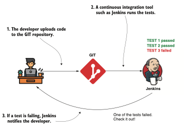
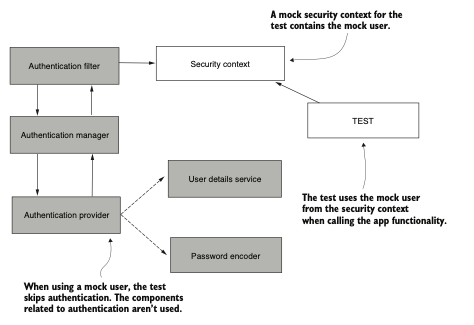
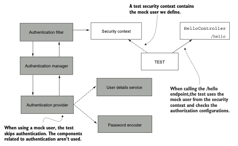
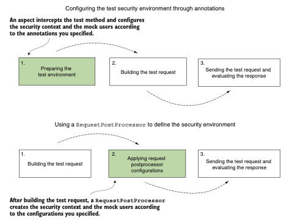
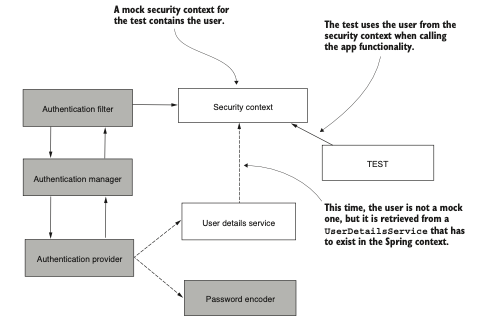
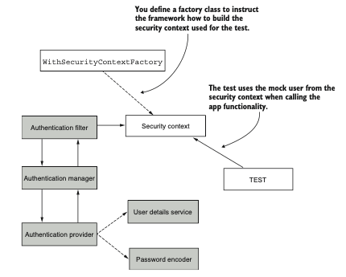
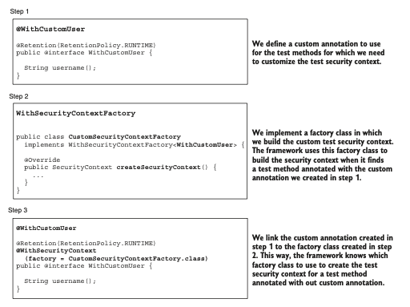
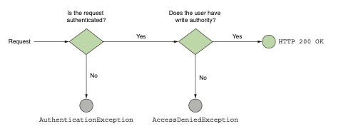
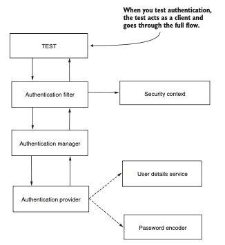

# Parte 6

## Pruebas de configuraciones de seguridad

En el mundo del desarrollo de software, las pruebas actúan como guardianas de la calidad, asegurando
que cada pieza de código no solo funcione según lo previsto, sino que también se integre sin problemas
con otros componentes. Esto es especialmente fundamental cuando se trata de configuraciones de 
seguridad, como las que ofrece Spring Security. Esta parte del libro está dedicada a inculcar las 
mejores prácticas para las pruebas de integración con Spring Security, asegurando que tus aplicaciones
cumplan con las directrices de seguridad que has establecido.
El capítulo 18, el último capítulo de este libro, sirve como una guía completa para validar tu 
configuración de seguridad. Aquí explorarás los ámbitos de las pruebas con usuarios simulados, 
profundizarás en los matices de la anotación @WithMockUser y comprenderás cómo validar usuarios 
gestionados. El capítulo extiende su alcance a las pruebas de seguridad de métodos, autenticaciones y
los desafíos únicos que plantean las pruebas de implementaciones reactivas.
Al concluir esta parte, habrás adquirido las habilidades para probar rigurosamente las capas de 
seguridad de tu aplicación, asegurando un despliegue fortificado listo para resistir posibles 
vulnerabilidades.

# Pruebas de configuración de seguridad

Este capítulo cubre
- Pruebas de integración con configuraciones de Spring Security para endpoints
- Definición de usuarios simulados para pruebas
- Pruebas de integración con Spring Security para seguridad a nivel de método
- Pruebas de implementaciones reactivas de Spring

La leyenda dice que la escritura de pruebas unitarias y de integración comenzó con el siguiente breve
verso:

    99 pequeños errores en el código,
    99 pequeños errores.
    Rastrea uno, aplica un parche,
    Ahora hay 113 pequeños errores en el código.

Con el tiempo, el software se volvió más complejo y los equipos se hicieron más grandes. Conocer 
todas las funcionalidades implementadas con el tiempo por otros se volvió imposible. Los 
desarrolladores necesitaban una forma de asegurarse de no romper las funcionalidades existentes 
mientras corregían errores o implementaban nuevas características.
Al desarrollar aplicaciones, continuamente escribimos pruebas para validar que las funcionalidades 
que implementamos funcionan como se desea. La razón principal por la que escribimos pruebas unitarias
y de integración es para asegurarnos de no romper las funcionalidades existentes cuando cambiamos el
código para corregir un error o implementar nuevas características. Esto también se denomina pruebas
de regresión.
Hoy en día, cuando un desarrollador termina de realizar un cambio, sube los cambios a un servidor 
utilizado por el equipo para gestionar el control de versiones del código. Esta acción activa 
automáticamente una herramienta de integración continua que ejecuta todas las pruebas existentes. 
Si alguno de los cambios rompe una funcionalidad existente, las pruebas fallan y la herramienta de 
integración continua notifica al equipo (siguiente figura). De esta manera, es menos probable entregar 
cambios que afecten las características existentes.



`Las pruebas son parte del proceso de desarrollo. Cada vez que un desarrollador sube código, las 
pruebas se ejecutan. Si alguna prueba falla, una herramienta de integración continua notifica al 
desarrollador`.

`NOTA` Al usar Jenkins en esta figura, no estoy diciendo que sea la única herramienta de integración
continua utilizada o que sea la mejor. Tienes muchas alternativas para elegir, como Bamboo, GitLab 
CI, CircleCI, y así sucesivamente.
Al probar aplicaciones, debes recordar que no es solo el código de tu aplicación lo que necesitas 
probar. También debes asegurarte de probar las integraciones con los frameworks y librerías que usas
(siguiente figura). En algún momento en el futuro, puedes actualizar ese framework o librería a una nueva
versión. Al cambiar la versión de la dependencia, quieres asegurarte de que tu aplicación todavía se
integre bien con la nueva versión de esa dependencia. Si tu aplicación no se integra de la misma 
manera, quieres encontrar fácilmente dónde necesitas realizar cambios para corregir los problemas de
integración.


`La funcionalidad de una aplicación depende de muchas dependencias. Cuando actualizas o cambias una 
dependencia, puedes afectar la funcionalidad existente. Tener pruebas de integración con dependencias
te ayuda a descubrir rápidamente si un cambio en una dependencia afecta la funcionalidad existente de
tu aplicación`.

Por eso necesitas saber lo que cubriremos en este capítulo: cómo probar la integración de tu 
aplicación con Spring Security. Spring Security, al igual que el ecosistema del framework Spring en 
general, evoluciona rápidamente. Probablemente actualices tu aplicación a nuevas versiones, y 
ciertamente quieres saber si actualizar a una versión específica causa vulnerabilidades, errores o 
incompatibilidades en tu aplicación. Recuerda lo que enfatizamos desde el primer capítulo: debes 
considerar la seguridad desde el primer diseño de la aplicación, y debes tomarla en serio. Implementar
pruebas para cualquiera de tus configuraciones de seguridad debería ser una tarea obligatoria y debe 
definirse como parte de tu definición de terminado. No deberías considerar una tarea terminada si las
pruebas de seguridad no están listas.
En este capítulo, analizaremos varias prácticas para probar la integración de una aplicación con 
Spring Security. Volveremos a algunos de los ejemplos en los que trabajamos en capítulos anteriores,
y aprenderás cómo escribir pruebas de integración para la funcionalidad implementada. Las pruebas, 
en general, son una historia crucial. Pero aprender este tema en detalle aporta muchos beneficios. 
En este capítulo, nos enfocaremos en probar la integración entre una aplicación y Spring Security. 
Antes de comenzar con nuestros ejemplos, me gustaría recomendar algunos recursos que me ayudaron a 
comprender este tema en profundidad. Si necesitas entender el tema con más detalle, o incluso como 
repaso, puedes leer estos libros. ¡Estoy seguro de que los encontrarás de gran ayuda!

- JUnit in Action, Tercera Edición de Cătălin Tudose et al. (Manning, 2020)
- Unit Testing Principles, Practices, and Patterns de Vladimir Khorikov (Manning, 2020)
- Testing Java Microservices de Alex Soto Bueno et al. (Manning, 2018)

Nuestra aventura en la escritura de pruebas para implementaciones de seguridad comienza con las 
pruebas de configuraciones de autorización. En la sección 18.1, aprenderás cómo omitir la 
autenticación y definir usuarios simulados para probar la configuración de autorización a nivel del
endpoint. Luego, en la sección 18.2, aprenderás cómo probar las configuraciones de autorización con 
usuarios de un UserDetailsService. En la sección 18.3, analizaremos cómo configurar el contexto de 
seguridad completo en caso de que necesites usar implementaciones específicas del objeto 
Authentication. Y finalmente, en la sección 18.4, aplicarás los enfoques que aprendiste en las 
secciones anteriores para probar la configuración de autorización en la seguridad de métodos.
Una vez que completemos nuestra discusión sobre las pruebas de autorización, la sección 18.5 te 
enseñará cómo probar el flujo de autenticación. Luego, en las secciones 18.6 y 18.7, analizaremos las
pruebas de otras configuraciones de seguridad, como la falsificación de solicitudes entre sitios 
(CSRF) y el intercambio de recursos de origen cruzado (CORS). El capítulo finaliza con la sección 
18.8, que analiza las pruebas de integración de Spring Security y las aplicaciones reactivas.

## 18.1 Uso de usuarios simulados para pruebas

Esta sección analiza el uso de usuarios simulados para probar la configuración de autorización. Este
enfoque es el método más sencillo y frecuentemente utilizado para probar configuraciones de 
autorización. Cuando se usa un usuario simulado, la prueba omite completamente el proceso de 
autenticación (siguiente figura).
Implementar pruebas para omitir la autenticación y enfocarse en la autorización es muy común. No 
necesitas validar el proceso de autenticación cada vez que validas que el sistema aplica correctamente
una regla de autorización. Recuerda que la autenticación y la autorización dependen una de la otra, 
pero están completamente desacopladas a través del contexto de seguridad. Por lo tanto, si deseas 
probar una configuración de autorización de forma aislada, puedes definir un contexto de seguridad 
simulado y controlarlo para probar todos los escenarios de autorización necesarios. Debido a que en 
la mayoría de los casos una aplicación implementa solo un número limitado de métodos de autenticación
(en la mayoría de los casos, en realidad, uno) pero tiene una gran variedad de reglas de autorización
que se aplican a casos de uso o endpoints, preferirás escribir pruebas de autorización de forma 
aislada para no tener que repetir las pruebas de autenticación cada vez que validas que la 
autorización para un elemento específico funciona correctamente.
El usuario simulado es válido solo para la ejecución de la prueba, y para este usuario, puedes 
configurar cualquier característica que necesites para validar un escenario específico. Por ejemplo,
puedes darle al usuario roles específicos (ADMIN, MANAGER, etc.) o usar diferentes autoridades para 
validar que la aplicación se comporta como se espera en estas condiciones.

`NOTA` Es importante saber qué componentes del framework están involucrados en una prueba de 
integración. De esta manera, sabes qué parte de la integración cubres con la prueba. Por ejemplo, un
usuario simulado solo puede usarse para cubrir la autorización. (En la sección 18.5, aprenderás cómo
manejar la autenticación.) A veces veo desarrolladores confundidos por este aspecto. Pensaban que 
también estaban cubriendo, por ejemplo, una implementación personalizada de un 
`AuthenticationProvider` cuando trabajaban con un usuario simulado, lo cual no es el caso. Asegúrate 
de comprender correctamente lo que estás probando.



`Omitimos los componentes sombreados en el flujo de autenticación de Spring Security cuando ejecutamos
una prueba. La prueba usa directamente un SecurityContext simulado, que contiene el usuario simulado
que defines para llamar a la funcionalidad probada`.

Para demostrar cómo escribir dicha prueba, volvamos al ejemplo más simple en el que trabajamos en 
este libro, el proyecto ssia-ch2-ex1. Este proyecto expone un endpoint para la ruta /hello con solo 
la configuración predeterminada de Spring Security. ¿Qué esperamos que suceda?

- Al llamar al endpoint sin un usuario, el estado de la respuesta HTTP debería ser 401 Unauthorized.

- Al llamar al endpoint con un usuario autenticado, el estado de la respuesta HTTP debería ser 200 
OK, y el cuerpo de la respuesta debería ser Hello!.

- Probemos estos dos escenarios! Necesitamos un par de dependencias en el archivo pom.xml para 
escribir las pruebas. El siguiente fragmento de código te muestra las clases que usamos a lo largo 
de los ejemplos en este capítulo. Debes asegurarte de tener estas en tu archivo pom.xml antes de 
comenzar a escribir las pruebas. Aquí están las dependencias:
```xml
<dependency>
    <groupId>org.springframework.boot</groupId>
    <artifactId>spring-boot-starter-test</artifactId>
    <scope>test</scope>
</dependency>
<dependency>
    <groupId>org.springframework.security</groupId>
    <artifactId>spring-security-test</artifactId>
    <scope>test</scope>
</dependency>
```
`NOTA` Para los ejemplos en este capítulo, usamos JUnit 5 para escribir pruebas. Sin embargo, no te 
desanimes si todavía trabajas con JUnit 4. Desde el punto de vista de la integración con Spring 
Security, las anotaciones y el resto de las clases que aprenderás funcionan de la misma manera. El 
capítulo 4 de JUnit in Action de Cătălin Tudose et al. (Manning, 2020), que es una discusión 
dedicada a la migración de JUnit 4 a JUnit 5, contiene algunas tablas interesantes que muestran la 
correspondencia entre las clases y anotaciones de las versiones 4 y 5. Aquí está el enlace: 
http://mng.bz/OPJn. 

En la carpeta de pruebas del proyecto Maven de Spring Boot, agregamos una clase 
llamada MainTests. Escribimos esta clase como parte del paquete principal de la aplicación. El 
nombre del paquete principal es com.laurentiuspilca.ssia. En el siguiente listado, puedes encontrar
la definición de la clase vacía para las pruebas. Usamos la anotación @SpringBootTest, que representa
una forma conveniente de gestionar el contexto de Spring para nuestro conjunto de pruebas.

A class for writing the tests:
```java
//Hace que Spring Boot sea responsable de gestionar el contexto de Spring para las pruebas.
@SpringBootTest
public class MainTests {
    
}
```
Una forma conveniente de implementar una prueba para el comportamiento de un endpoint es usando 
MockMvc de Spring. En una aplicación Spring Boot, puedes autoconfigurar la utilidad MockMvc para
probar llamadas a endpoints agregando una anotación sobre la clase, como ilustra el siguiente 
listado.

Adding MockMvc for implementing test scenarios:
```java
//Habilita a Spring Boot para autoconfigurar MockMvc. Como consecuencia, un objeto de tipo MockMvc 
// es agregado al contexto de Spring.
@SpringBootTest
@AutoConfigureMockMvc
public class MainTests {
    //Inyecta el objeto MockMvc que usamos para probar el endpoint.
    @Autowired
    private MockMvc mvc;
}
```
Ahora que tenemos una herramienta que podemos usar para probar el comportamiento del endpoint, 
comencemos con el primer escenario. Al llamar al endpoint /hello sin un usuario autenticado, el 
estado de la respuesta HTTP debería ser `401 Unauthorized`.
Puedes visualizar la relación entre los componentes para ejecutar esta prueba en la siguiente figura La 
prueba llama al endpoint pero usa un `SecurityContext` simulado. Decidimos qué agregamos a este 
`SecurityContext`. Para esta prueba, necesitamos verificar que si no agregamos un usuario, lo que 
representa la situación en la que alguien llama al endpoint sin autenticarse, la aplicación rechaza 
la llamada con una respuesta `HTTP` con el estado `401 Unauthorized`. Cuando agregamos un usuario al 
`SecurityContext`, la aplicación acepta la llamada y el estado de la respuesta `HTTP es 200 OK`.



`Al ejecutar la prueba, omitimos la autenticación. La prueba usa un SecurityContext simulado y llama
al endpoint /hello expuesto por HelloController. Agregamos un usuario simulado en el SecurityContext
de prueba para verificar que el comportamiento es correcto de acuerdo con las reglas de autorización.
Si no definimos un usuario simulado, esperamos que la aplicación no autorice la llamada, pero si 
definimos un usuario, esperamos que la llamada sea exitosa`.

El siguiente codigo presenta la implementación de este escenario.

Prueba de que no se puede llamar al endpoint sin un usuario autenticado:
```java
@SpringBootTest
@AutoConfigureMockMvc
public class MainTests {
    @Autowired
    private MockMvc mvc;

    @Test
    public void helloUnauthenticated() throws Exception {
        //Al realizar una solicitud GET para la ruta /hello, esperamos recibir una respuesta con el 
        // estado Unauthorized.
        mvc.perform(get("/hello"))
                .andExpect(status().isUnauthorized());
    }
}
```
Ten en cuenta que importamos estáticamente los métodos get() y status(). Puedes encontrar el método 
get() y métodos similares relacionados con las solicitudes que usamos en los ejemplos de este 
capítulo en esta clase:

`org.springframework.test.web.servlet.request.MockMvcRequestBuilders`

Del mismo modo, puedes encontrar el método status() y métodos similares relacionados con el resultado
de las llamadas que usamos en los siguientes ejemplos de este capítulo en esta clase:

`org.springframework.test.web.servlet.result.MockMvcResultMatchers`

Ahora puedes ejecutar las pruebas y ver el estado en tu IDE. Generalmente, en cualquier IDE, para 
ejecutar las pruebas, puedes hacer clic derecho en la clase de prueba y luego seleccionar Ejecutar. 
El IDE muestra una prueba exitosa en verde y una fallida con otro color (generalmente rojo o 
amarillo).

`NOTA` En los proyectos proporcionados con el libro, encima de cada método que implementa una prueba,
también uso la anotación @DisplayName. Esta anotación nos permite tener una descripción más larga y 
detallada del escenario de prueba. Para ocupar menos espacio y permitirte enfocarte en la 
funcionalidad de las pruebas que analizamos, eliminé la anotación @DisplayName de los listados del 
libro.
Para probar el segundo escenario, necesitamos un usuario simulado. Para validar el comportamiento de
llamar al endpoint /hello con un usuario autenticado, usamos la anotación @WithMockUser. Al agregar 
esta anotación sobre el método de prueba, instruimos a Spring para que configure un SecurityContext 
que contiene una instancia de implementación de UserDetails. Básicamente omite la autenticación. 
Ahora llamar al endpoint se comporta como si el usuario definido por la anotación @WithMockUser se 
hubiera autenticado exitosamente.
Con este ejemplo simple, no nos importan los detalles del usuario simulado como su nombre de usuario,
roles o autoridades. Por lo tanto, agregamos la anotación @WithMockUser, que proporciona algunos 
valores predeterminados para los atributos del usuario simulado. Más adelante en este capítulo, 
aprenderás cómo configurar los atributos del usuario para escenarios de prueba en los que sus valores
son importantes. El siguiente listado proporciona la implementación para el segundo escenario de 
prueba.

Uso de @WithMockUser para definir un usuario autenticado simulado:
```java
@SpringBootTest
@AutoConfigureMockMvc
public class MainTests {
    @Autowired
    private MockMvc mvc;

    // Omitted code
    @Test
    @WithMockUser //Llama al metodo con un usuario autenticado simulado.
    public void helloAuthenticated() throws Exception {
        mvc.perform(get("/hello")) //En este caso, al realizar una solicitud GET para la ruta /hello,
                // esperamos que el estado de la respuesta sea OK.
                .andExpect(content().string("Hello!"))
                .andExpect(status().isOk());
    }
}
```
Ejecuta esta prueba ahora y observa su éxito. Sin embargo, en algunas situaciones, necesitamos usar 
un nombre específico o darle al usuario roles o autoridades específicas para implementar la prueba. 
Supongamos que queremos probar los endpoints que definimos en ssia-ch5-ex2. Para este ejemplo, los 
endpoints retornan un cuerpo dependiendo del nombre del usuario autenticado. Para escribir la prueba,
necesitamos darle al usuario un nombre de usuario conocido. El siguiente listado muestra cómo 
configurar los detalles del usuario simulado escribiendo una prueba para el endpoint /hello en el 
proyecto ssia-ch5-ex2.

Configuring details for the mock user:
```java
@SpringBootTest
@AutoConfigureMockMvc
public class MainTests {
    // Omitted code
    @Test
    @WithMockUser(username = "mary") //Establece un nombre de usuario para el usuario simulado.
    public void helloAuthenticated() throws Exception {
        mvc.perform(get("/hello"))
                .andExpect(content().string("Hello, mary!"))
                .andExpect(status().isOk());
    }
}
```
En la siguiente figura, encontrarás una comparación de cómo el uso de anotaciones para definir el 
entorno de seguridad de prueba difiere del uso de un `RequestPostProcessor`. El framework interpreta 
anotaciones como `@WithMockUser` antes de ejecutar el método de prueba. De esta manera, el método de 
prueba crea la solicitud de prueba y la ejecuta en un entorno de seguridad ya configurado. Cuando se
usa un `RequestPostProcessor`, el framework primero llama al método de prueba y construye la solicitud
de prueba. El framework luego aplica el `RequestPostProcessor`, que altera la solicitud o el entorno 
en el que se ejecuta antes de enviarla. En este caso, el framework configura las dependencias de 
prueba, como los usuarios simulados y el `SecurityContext`, después de construir la solicitud de
prueba.
Al igual que configurar el nombre de usuario, puedes configurar las autoridades y roles para probar 
las reglas de autorización. Un enfoque alternativo para crear un usuario simulado es usar un 
`RequestPostProcessor`. Podemos proporcionar un `RequestPostProcessor` al método `with()`, como muestra el
siguiente codigo. La clase `SecurityMockMvcRequestPostProcessors` proporcionada por Spring Security 
nos ofrece muchas implementaciones para `RequestPostProcessor`, lo que nos ayuda a cubrir varios 
escenarios de prueba.
En este capítulo, también analizamos las implementaciones frecuentemente utilizadas para 
`RequestPostProcessor`. El método `user()` de la clase `SecurityMockMvcRequestPostProcessors` retorna un 
`RequestPostProcessor` que podemos usar como alternativa a la anotación `@WithMockUser`.



`La diferencia entre usar anotaciones y el RequestPostProcessor para crear el entorno de seguridad de
prueba. Cuando se usan anotaciones, el framework configura primero el entorno de seguridad de prueba.
Cuando se usa un RequestPostProcessor, la solicitud de prueba se crea y luego se modifica para 
definir otras restricciones como el entorno de seguridad de prueba. En la figura, los puntos donde el
framework aplica el entorno de seguridad de prueba están sombreados`.

Using a RequestPostProcessor to define a mock user:
```java
@SpringBootTest
@AutoConfigureMockMvc
public class MainTests {
    // Omitted code
    @Test
    public void helloAuthenticatedWithUser() throws Exception {
        mvc.perform(
                        get("/hello")
                                .with(user("mary"))) //Llama al endpoint /hello usando un usuario 
                // simulado con el nombre de usuario Mary.
                .andExpect(content().string("Hello!"))
                .andExpect(status().isOk());
    }
}
```
Como observaste en esta sección, ¡escribir pruebas para configuraciones de autorización es divertido
y sencillo! La mayoría de las pruebas que escribes para la integración de Spring Security con las 
funcionalidades de tu aplicación son para configuraciones de autorización. Puede que te estés 
preguntando por qué no probamos también la autenticación. En la sección 18.5, analizaremos las 
pruebas de autenticación. Sin embargo, en general, y como se analizó anteriormente en esta sección, 
tiene sentido probar la autorización y la autenticación por separado. Generalmente, una aplicación 
tiene una forma de autenticar usuarios, pero puede exponer decenas de endpoints para los cuales la 
autorización está configurada de manera diferente. Por eso pruebas la autenticación por separado con
un puñado de pruebas y luego las implementas individualmente para cada configuración de autorización
de los endpoints. Es una pérdida de tiempo de ejecución repetir la autenticación para cada endpoint 
probado, siempre y cuando la lógica no cambie.

## 18.2 Pruebas con usuarios de un UserDetailsService

Esta sección analiza la obtención de los detalles del usuario para las pruebas desde un 
`UserDetailsService`. Este enfoque es una alternativa a la creación de un usuario simulado. La 
diferencia es que esta vez, en lugar de crear un usuario falso, necesitamos obtener el usuario de un
`UserDetailsService` específico. Usas este enfoque si también deseas probar la integración con la 
fuente de datos desde donde tu aplicación carga los detalles del usuario (siguiente figura).



`En lugar de crear un usuario simulado para la prueba al construir el SecurityContext utilizado por
la prueba, tomamos los detalles del usuario de un UserDetailsService. De esta manera, puedes probar 
la autorización usando usuarios reales tomados de una fuente de datos. Durante la prueba, el flujo 
de ejecución omite los componentes sombreados`.

Para demostrar este enfoque, abramos el proyecto ssia-ch2-ex2 e implementemos las pruebas para el 
endpoint expuesto en la ruta /hello. Usamos el bean `UserDetailsService` que el proyecto ya agrega al 
contexto. Ten en cuenta que con este enfoque, necesitamos tener un bean `UserDetailsService` en el 
contexto. Para especificar el usuario que autenticamos desde este `UserDetailsService`, anotamos el 
método de prueba con `@WithUserDetails`. Con la anotación `@WithUserDetails`, para encontrar al usuario,
especificas el nombre de usuario. El siguiente listado presenta la implementación de la prueba para 
el endpoint /hello usando la anotación `@WithUserDetails` para definir el usuario autenticado.

Defining the authenticated user with the @WithUserDetails annotation:
```java
@SpringBootTest
@AutoConfigureMockMvc
public class MainTests {
    @Autowired
    private MockMvc mvc;

    @Test
    @WithUserDetails("john") //Carga al usuario John usando el UserDetailsService para ejecutar el 
    // escenario de prueba
    public void helloAuthenticated() throws Exception {
        mvc.perform(get("/hello"))
                .andExpect(status().isOk());
    }
}
```
## 18.3 Uso de objetos Authentication personalizados para pruebas

En general, cuando se usa un usuario simulado para una prueba, no te importa qué clase usa el 
framework para crear las instancias de `Authentication` en el `SecurityContext`. Pero supongamos que 
tienes alguna lógica en el controlador que depende del tipo del objeto. ¿Puedes de alguna manera 
indicarle al framework que cree el objeto `Authentication` para la prueba usando un tipo específico? 
La respuesta es sí, y esto es lo que analizamos en esta sección.
La lógica detrás de este enfoque es simple. Definimos una clase de fábrica responsable de construir 
el `SecurityContext`. De esta manera, tenemos control total sobre cómo se construye el `SecurityContext`
para la prueba, incluyendo lo que contiene (siguiente figura). Por ejemplo, podemos elegir tener un 
objeto `Authentication` personalizado.



`Para obtener control total sobre cómo se define el SecurityContext para la prueba, construimos una 
clase de fábrica que instruye a la prueba sobre cómo construir el SecurityContext. De esta manera, 
ganamos mayor flexibilidad y podemos elegir detalles como el tipo de objeto a usar como objeto 
Authentication. En la figura, los componentes omitidos del flujo durante la prueba están sombreados`.

Abramos el proyecto ssia-ch2-ex4 y escribamos una prueba en la que configuramos el `SecurityContext`
simulado e instruimos al framework sobre cómo crear el objeto `Authentication`. Un aspecto interesante
a recordar sobre este ejemplo es que lo usamos para demostrar la implementación de un 
`AuthenticationProvider` personalizado. El `AuthenticationProvider` personalizado que implementamos en 
nuestro caso solo autentica a un usuario llamado John. Sin embargo, como en los otros dos enfoques 
anteriores que analizamos en las secciones 18.1 y 18.2, el enfoque actual omite la autenticación. 
Por esta razón, verás al final del ejemplo que en realidad podemos darle cualquier nombre a nuestro 
usuario simulado. Seguimos tres pasos para lograr este comportamiento (siguiente figura):

1. Escribir una anotación para usar sobre la prueba de manera similar a como usamos `@WithMockUser o
@WithUserDetails`.
2. Escribir una clase que implemente la interfaz `WithSecurityContextFactory`. Esta clase implementa 
el método `createSecurityContext()` que retorna el `SecurityContext` simulado que el framework usa para
la prueba.
3. Vincular la anotación personalizada creada en el paso 1 con la clase de fábrica creada en el paso
2 a través de la anotación `@WithSecurityContext`.



`Para permitir que la prueba use un SecurityContext personalizado, debes seguir los tres pasos 
ilustrados en esta figura`.

### Paso 1: Definición de una anotación personalizada

En el siguiente codigo, puedes encontrar la definición de la anotación personalizada que definimos 
para la prueba, llamada `@WithCustomUser`. Como propiedades de la anotación, puedes definir los 
detalles que necesites para crear el objeto `Authentication` simulado. Aquí solo agregué el nombre de 
usuario para mi demostración. Además, no olvides usar la anotación `@Retention(RetentionPolicy.RUNTIME)`
para establecer la política de retención en tiempo de ejecución. Spring necesita leer esta anotación
usando reflexión de Java en tiempo de ejecución. Para permitir que Spring lea la anotación, necesitas
cambiar su política de retención a `RetentionPolicy.RUNTIME`.

Defining the @WithCustomUser annotation:
```java
@Retention(RetentionPolicy.RUNTIME)
public @interface WithCustomUser {
    String username();
}
```
### Paso 2: Creación de una clase de fábrica para el SecurityContext simulado

El segundo paso consiste en implementar el código que construye el SecurityContext que el framework
usa para la ejecución de la prueba. Aquí es donde decidimos qué tipo de Authentication usar para la 
prueba. El siguiente listado demuestra la implementación de la clase de fábrica.

The implementation of a factory for the SecurityContext:
```java
//Implementa la interfaz WithSecurityContextFactory y especifica la anotación personalizada que 
// usamos para las pruebas.
public class CustomSecurityContextFactory
implements WithSecurityContextFactory<WithCustomUser> {
    //Implementa createSecurityContext() para definir cómo crear el SecurityContext para la prueba.
    @Override
    public SecurityContext createSecurityContext(
            WithCustomUser withCustomUser) {
        //Construye un SecurityContext vacío.
        SecurityContext context =
                SecurityContextHolder.createEmptyContext();
        //Crea una instancia de Authentication.
        var a = new UsernamePasswordAuthenticationToken(
                withCustomUser.username(), null, null);
        //Agrega la Authentication simulada al SecurityContext.
        context.setAuthentication(a);
        return context;
    }
}
```

### Paso 3: Vinculación de la anotación personalizada con la clase de fábrica

Usando la anotación `@WithSecurityContext`, ahora vinculamos la anotación personalizada que creamos en
el paso 1 con la clase de fábrica para el `SecurityContext` que implementamos en el paso 2. El 
siguiente codigo presenta el cambio en nuestra anotación `@WithCustomUser` para vincularla con la clase
de fábrica del `SecurityContext`.

Vinculación de la anotación personalizada con la clase de fábrica del SecurityContext:
```java
@Retention(RetentionPolicy.RUNTIME)
@WithSecurityContext(factory = CustomSecurityContextFactory.class)
public @interface WithCustomUser {
    String username();
}
```
Con esta configuración completa, podemos escribir una prueba para usar el `SecurityContext`
personalizado. El siguiente codigo define la prueba.

Escritura de una prueba que usa el SecurityContext personalizado:
```java
@SpringBootTest
@AutoConfigureMockMvc
public class MainTests {
    @Autowired
    private MockMvc mvc;

    @Test
    @WithCustomUser(username = "mary") //Ejecuta la prueba con un usuario que tiene el nombre de usuario "mary".
    public void helloAuthenticated() throws Exception {
        mvc.perform(get("/hello"))
                .andExpect(status().isOk());
    }
}
```
Al ejecutar la prueba, observas un resultado exitoso. Puede que pienses, "¡Espera! En este ejemplo, 
implementamos un `AuthenticationProvider` personalizado que solo autentica a un usuario llamado john. 
¿Cómo podría la prueba ser exitosa con el nombre de usuario mary?" Al igual que en el caso de 
`@WithMockUser y @WithUserDetails`, con este método, omitimos la lógica de autenticación. Por lo tanto,
solo puedes usarlo para probar lo relacionado con la autorización y más allá.

## 18.4 Pruebas de seguridad de métodos

Esta sección analiza las pruebas de seguridad de métodos. Todas las pruebas que escribimos hasta 
ahora en este capítulo se refieren a endpoints. Pero ¿qué pasa si tu aplicación no tiene endpoints? 
De hecho, si no es una aplicación web, ¡no tiene endpoints en absoluto! Sin embargo, es posible que
hayas usado Spring Security con la seguridad global de métodos, como analizamos en los capítulos 11 
y 12. Aún necesitas probar tus configuraciones de seguridad en tales escenarios.
Afortunadamente, lo haces usando los mismos enfoques que analizamos en las secciones anteriores. Aún
puedes usar @WithMockUser, @WithUserDetails o una anotación personalizada para definir tu propio 
SecurityContext. Pero en lugar de usar MockMvc, inyectas directamente desde el contexto el bean que 
define el método que necesitas probar.
Abramos el proyecto ssia-ch11-ex1 e implementemos las pruebas para el método getName() en la clase 
NameService. Protegimos el método getName() usando la anotación @PreAuthorize. En el listado 18.12, 
encuentras la implementación de la clase de prueba con sus tres pruebas, y la figura 18.9 ilustra los
tres escenarios que probamos:

1. Al llamar al método sin un usuario autenticado, el método debería lanzar AuthenticationException.
2. Al llamar al método con un usuario autenticado que tiene una autoridad diferente a la esperada 
(write), el método debería lanzar AccessDeniedException.
3. Al llamar al método con un usuario autenticado que tiene la autoridad esperada, retorna el 
resultado esperado.



Implementación de los tres escenarios de prueba para el método getName():
```java
@SpringBootTest
class MainTests {
    @Autowired
    private NameService nameService;

    @Test
    void testNameServiceWithNoUser() {
        assertThrows(AuthenticationException.class,
                () -> nameService.getName());
    }

    @Test
    @WithMockUser(authorities = "read")
    void testNameServiceWithUserButWrongAuthority() {
        assertThrows(AccessDeniedException.class,
                () -> nameService.getName());
    }

    @Test
    @WithMockUser(authorities = "write")
    void testNameServiceWithUserButCorrectAuthority() {
        var result = nameService.getName();
        assertEquals("Fantastico", result);
    }
}
```
Ya no configuramos `MockMvc` porque no necesitamos llamar a un endpoint. En cambio, inyectamos 
directamente la instancia de `NameService` para llamar al método probado. Usamos la anotación 
`@WithMockUser`, como se analizó en la sección 18.1. De manera similar, podrías haber usado 
`@WithUserDetails`, como se analizó en la sección 18.2, o diseñado una forma personalizada de construir
el `SecurityContext`, como se analizó en la sección 18.3.

## 18.5 Pruebas de autenticación

En esta sección, analizamos las pruebas de autenticación. Anteriormente en este capítulo, aprendiste
cómo definir usuarios simulados y probar configuraciones de autorización. Pero ¿qué pasa con la 
autenticación? ¿También podemos probar la lógica de autenticación? Necesitas hacer esto si, por 
ejemplo, tienes lógica personalizada implementada para tu autenticación y deseas asegurarte de que el
flujo completo funcione. Cuando se prueban la autenticación, las solicitudes de implementación de 
prueba funcionan como solicitudes de cliente normales, como se presenta en la siguiente figura.



Cuando se prueba la autenticación, la prueba actúa como un cliente y pasa por el flujo completo de 
Spring Security analizado a lo largo del libro. De esta manera, también puedes probar, por ejemplo, 
tus objetos `AuthenticationProvider` personalizados.

Por ejemplo, volviendo al proyecto ssia-ch2-ex4, ¿podemos demostrar que el proveedor de autenticación
personalizado que implementamos funciona correctamente y asegurarlo con pruebas? En este proyecto, 
implementamos un `AuthenticationProvider` personalizado, y queremos asegurarnos de que también 
aseguramos esta lógica de autenticación personalizada con pruebas. Sí, también podemos probar la 
lógica de autenticación.
La lógica que implementamos es sencilla. Solo se acepta un conjunto de credenciales: el nombre de 
usuario "john" y la contraseña "12345". Necesitamos demostrar que cuando se usan credenciales 
válidas, la llamada es exitosa, mientras que cuando se usan otras credenciales, el estado de la 
respuesta `HTTP es 401 Unauthorized`. Abramos el proyecto ssia-ch2-ex4 nuevamente e implementemos un 
par de pruebas para validar que la autenticación se comporta correctamente.

Testing authentication with httpBasic() RequestPostProcessor:
```java
@SpringBootTest
@AutoConfigureMockMvc
public class AuthenticationTests {
    @Autowired
    private MockMvc mvc;

    @Test
    public void helloAuthenticatingWithValidUser() throws Exception {
        mvc.perform(
                        get("/hello")
                                //Se autentica con las credenciales correctas.
                                .with(httpBasic("john", "12345")))
                .andExpect(status().isOk());
    }

    @Test
    public void helloAuthenticatingWithInvalidUser() throws Exception {
        mvc.perform(
                        get("/hello")
                                //Se autentica con las credenciales incorrectas.
                                .with(httpBasic("mary", "12345")))
                .andExpect(status().isUnauthorized());
    }
}
```
Usando el postprocesador de solicitudes httpBasic(), instruimos a la prueba para ejecutar la 
autenticación. De esta manera, validamos el comportamiento del endpoint al autenticarse usando 
credenciales válidas o inválidas. Puedes usar el mismo enfoque para probar la autenticación con un 
inicio de sesión mediante formulario. Abramos el proyecto ssia-ch6-ex4, donde usamos el inicio de 
sesión mediante formulario para la autenticación, y escribamos algunas pruebas para demostrar que la
autenticación funciona correctamente. Probamos el comportamiento de la aplicación en los siguientes 
escenarios:

- Al autenticarse con un conjunto incorrecto de credenciales
- Al autenticarse con un conjunto válido de credenciales, pero cuando el usuario no tiene una 
autoridad válida según la implementación que escribimos en el `AuthenticationSuccessHandler`
- Al autenticarse con un conjunto válido de credenciales y un usuario que tiene una autoridad válida
según la implementación que escribimos en el `AuthenticationSuccessHandler`.

En el siguiente codigo, encuentras la implementación para el primer escenario. Si nos autenticamos 
usando credenciales inválidas, la aplicación no autentica al usuario y agrega el encabezado "failed"
a la respuesta HTTP. Personalizamos una aplicación y agregamos el encabezado "failed" con un 
`AuthenticationFailureHandler` cuando analizamos la autenticación en el capítulo 6.

Testing form login-failed authentication: 
```java
@SpringBootTest
@AutoConfigureMockMvc
public class MainTests {
    @Autowired
    private MockMvc mvc;

    @Test
    public void loggingInWithWrongUser() throws Exception {
        //Se autentica usando inicio de sesión mediante formulario con un conjunto inválido de credenciales.
        mvc.perform(formLogin()
                        .user("joey").password("12345"))
                .andExpect(header().exists("failed"))
                .andExpect(unauthenticated());
    }
}
```
En el capítulo 6, personalizamos la lógica de autenticación usando un `AuthenticationSuccessHandler`. 
En nuestra implementación, si el usuario tiene autoridad de lectura, la aplicación lo redirige a la 
página /home. De lo contrario, la aplicación redirige al usuario a la página /error. El siguiente 
codigo presenta la implementación de estos dos escenarios.

Testing app behavior when authenticating users:
```java
@SpringBootTest
@AutoConfigureMockMvc
public class MainTests {
    @Autowired
    private MockMvc mvc;

    // Omitted code
    @Test
    public void loggingInWithWrongAuthority() throws Exception {
        mvc.perform(formLogin()
                        .user("bill").password("12345")
                )
                //Cuando se autentica con un usuario que no tiene autoridad de lectura, la aplicación
                // redirige al usuario a la ruta /error.
                .andExpect(redirectedUrl("/error"))
                .andExpect(status().isFound())
                .andExpect(authenticated());
    }

    @Test
    public void loggingInWithCorrectAuthority() throws Exception {
        mvc.perform(formLogin()
                        .user("john").password("12345")
                )
                //Cuando se autentica con un usuario que tiene autoridad de lectura, la aplicación 
                // redirige al usuario a la ruta /home.
                .andExpect(redirectedUrl("/home"))
                .andExpect(status().isFound())
                .andExpect(authenticated());
    }
}
```
Si la aplicación es un servidor de recursos OAuth 2/OpenID Connect (capítulo 15), necesitarás un 
token para probar la autenticación. Un servidor de recursos puede usar tokens JWT no opacos o tokens
opacos. Spring Security ofrece soporte para probar tu aplicación con ambos enfoques. De manera 
similar al método with(httpBasic()) usado anteriormente en esta sección, puedes usar with(jwt()) para
configurar un token JWT simulado para tu prueba o with(opaqueToken()) para configurar un token opaco
simulado para tu prueba.
El siguiente codigo muestra un ejemplo de una prueba que puedes encontrar en el proyecto 
ssia-ch15-ex1. Esta prueba usa el enfoque with(jwt()) para establecer un token simulado para probar 
la autenticación de un servidor de recursos.

Uso de un JWT simulado para probar la autenticación de un servidor de recursos:
```java
@SpringBootTest
@AutoConfigureMockMvc
class ApplicationTests {
    @Autowired
    private MockMvc mockMvc;

    @Test
    void demoEndpointSuccessfulAuthenticationTest() throws Exception {
        mockMvc.perform(
                //Configura un JWT simulado para probar la autenticación de un servidor de recursos
                        // usando tokens no opacos.
                        get("/demo").with(jwt()))
                .andExpect(status().isOk());
    }
}
```
Con este enfoque, es posible que también necesites establecer algunos campos personalizados en el 
token, como las autoridades. Puedes usar métodos de configuración siguiendo el método `jwt()` para 
especificar autoridades personalizadas o incluso personalizar completamente el JWT. El siguiente 
fragmento de código muestra cómo especificar autoridades personalizadas en el JWT. El código agrega 
una autoridad llamada "read" al token simulado usado en la autenticación:

jwt().authorities(() -> "read"))

Una prueba similar a la presentada en el listado 18.16, pero para tokens opacos, se puede encontrar 
en el proyecto ssia-ch15-ex3. El siguiente codigo presenta esta implementación de prueba.

Uso de un token opaco simulado para probar la autenticación de un servidor de recursos:
```java
@SpringBootTest
@AutoConfigureMockMvc
class ApplicationTests {
    @Autowired
    private MockMvc mockMvc;

    @Test
    void demoEndpointSuccessfulAuthenticationTest() throws Exception {
        mockMvc.perform(
                //Uso de un token opaco simulado para probar la autenticación del servidor de recursos.
                        get("/demo").with(opaqueToken()))
                .andExpect(status().isOk());
    }
}
```
Incluso con un token opaco, es posible que necesites tener autoridades específicas en el contexto de
seguridad que resulta después de la autenticación. Puedes controlar qué autoridades tendrá la 
instancia de autenticación agregada al contexto de seguridad. Para hacer eso, puedes seguir el método
opaqueToken() con el método de configuración authorities() como se presenta en el siguiente fragmento.
El siguiente fragmento de código configura una autoridad llamada "read" en la instancia de 
autenticación que se agregará al contexto de seguridad de la prueba:

`opaqueToken().authorities(() -> "read")))`

## 18.6 Pruebas de configuraciones CSRF

En esta sección, analizamos las pruebas de la configuración de protección CSRF para tu aplicación. 
Cuando una aplicación presenta una vulnerabilidad CSRF, un atacante puede engañar al usuario para 
que realice acciones que no desea realizar una vez que ha iniciado sesión en la aplicación. Como se 
analizó en el capítulo 9, Spring Security usa tokens CSRF para mitigar estas vulnerabilidades. De 
esta manera, para cualquier operación mutante (POST, PUT, DELETE), la solicitud necesita tener un 
token CSRF válido en sus encabezados. Por supuesto, en algún momento, necesitas probar más que las 
solicitudes HTTP GET. Dependiendo de cómo implementes tu aplicación, como analizamos en el capítulo 
9, es posible que necesites probar la protección CSRF. Debes asegurarte de que funcione como se 
espera y proteja el endpoint que implementa acciones mutantes.
Afortunadamente, Spring Security proporciona un enfoque sencillo para probar la protección CSRF 
usando un RequestPostProcessor. Abramos el proyecto ssia-ch9-ex1 y probemos que la protección CSRF
está habilitada para un endpoint /hello cuando se llama con HTTP POST en los siguientes escenarios:

- Si no usamos un token CSRF, el estado de la respuesta HTTP es 403 Forbidden.
- Si enviamos un token CSRF, el estado de la respuesta HTTP es 200 OK.

El siguiente codigo muestra la implementación de estos dos escenarios. Observa cómo podemos enviar 
un token CSRF en la respuesta simplemente usando el RequestPostProcessor csrf().

Implementing the CSRF protection test scenarios:
```java
@SpringBootTest
@AutoConfigureMockMvc
public class MainTests {
    @Autowired
    private MockMvc mvc;

    @Test
    public void testHelloPOST() throws Exception {
        //Cuando se llama al endpoint sin un token CSRF, el estado de la respuesta HTTP es 403 Forbidden.
        mvc.perform(post("/hello"))
                .andExpect(status().isForbidden());
    }

    @Test
    public void testHelloPOSTWithCSRF() throws Exception {
        //Cuando se llama al endpoint con un token CSRF, el estado de la respuesta HTTP es 200 OK.
        mvc.perform(post("/hello").with(csrf()))
                .andExpect(status().isOk());
    }
}
```
## 18.7 Pruebas de configuraciones CORS

Esta sección analiza las pruebas de configuraciones CORS. Como aprendiste en el capítulo 10, si un 
navegador carga una aplicación web desde un origen (digamos, example.com), el navegador no permitirá
que la aplicación use una respuesta HTTP que provenga de un origen diferente (digamos, example.org).
Usamos políticas CORS para relajar estas restricciones. De esta manera, podemos configurar nuestra 
aplicación para trabajar con múltiples orígenes. Por supuesto, como con cualquier otra configuración
de seguridad, también necesitas probar las políticas CORS. En el capítulo 10, aprendiste que CORS se
trata de encabezados específicos en la respuesta cuyos valores definen si la respuesta HTTP es 
aceptada. Dos de estos encabezados relacionados con las especificaciones CORS son 
Access-Control-Allow-Origin y Access-Control-Allow-Methods. Usamos estos encabezados en el capítulo
10 para configurar múltiples orígenes para nuestra aplicación.
Al escribir pruebas para las políticas CORS, todo lo que necesitamos hacer es asegurarnos de que 
estos encabezados (y quizás otros encabezados relacionados con CORS, dependiendo de la complejidad 
de tus configuraciones) existan y tengan los valores correctos. Para esta validación, podemos actuar
exactamente como lo hace el navegador cuando realiza una solicitud de verificación previa. Realizamos
una solicitud usando el método HTTP OPTIONS, solicitando el valor para los encabezados CORS. Abramos
el proyecto ssia-ch10-ex1 y escribamos una prueba para validar los valores de los encabezados CORS. 
El siguiente codigo muestra la definición de la prueba.

Test implementation for CORS policies:
```java
@SpringBootTest
@AutoConfigureMockMvc
public class MainTests {
    @Autowired
    private MockMvc mvc;

    @Test
    public void testCORSForTestEndpoint() throws Exception {
        //Realiza una solicitud HTTP OPTIONS en el endpoint solicitando el valor para los encabezados
        // CORS.
        mvc.perform(options("/test")
                        .header("Access-Control-Request-Method", "POST")
                        .header("Origin", "http://www.example.com")
                )//Valida los valores de los encabezados de acuerdo con la configuración que 
                // realizamos en la aplicación.
                .andExpect(header().exists("Access-Control-Allow-Origin"))
                .andExpect(header().string("Access-Control-Allow-Origin", "*"))
                .andExpect(header().exists("Access-Control-Allow-Methods"))
                .andExpect(header().string("Access-Control-Allow-Methods", "POST"))
                .andExpect(status().isOk());
    }
}
```
## 18.8 Pruebas de implementaciones reactivas de Spring Security

En esta sección, analizamos las pruebas de la integración de Spring Security con funcionalidades 
desarrolladas dentro de una aplicación reactiva. No te sorprenderá saber que Spring Security también
proporciona soporte para probar configuraciones de seguridad para aplicaciones reactivas. Al igual 
que en el caso de las aplicaciones no reactivas, la seguridad para las aplicaciones reactivas es 
crucial. Por lo tanto, probar sus configuraciones de seguridad también es esencial. Para mostrarte 
cómo implementar pruebas para tus configuraciones de seguridad, volvemos a los ejemplos en los que 
trabajamos en el capítulo 17. Con Spring Security para aplicaciones reactivas, necesitas conocer dos
enfoques para escribir tus pruebas:

- Usar usuarios simulados con anotaciones @WithMockUser
- Usar un WebTestClientConfigurer

Usar la anotación @WithMockUser es sencillo porque funciona de la misma manera que para las 
aplicaciones no reactivas, como analizamos en la sección 18.1. La definición de la prueba es 
diferente, sin embargo, porque dado que es una aplicación reactiva, ya no podemos usar MockMvc. Sin 
embargo, este cambio no está relacionado con Spring Security. Podemos usar algo similar cuando 
probamos aplicaciones reactivas, una herramienta llamada WebTestClient. En el siguiente codigo, 
encuentras la implementación de una prueba simple que hace uso de un usuario simulado para verificar
el comportamiento de un endpoint reactivo.

Uso de @WithMockUser al probar implementaciones reactivas:
```java
@SpringBootTest
//Solicita a Spring Boot que autoconfigure el WebTestClient que usamos para las pruebas.
@AutoConfigureWebTestClient
class MainTests {
    //Inyecta la instancia de WebTestClient configurada por Spring Boot desde el contexto de Spring.
    @Autowired
    private WebTestClient client;
    //Usa la anotación @WithMockUser para definir un usuario simulado para la prueba.
    @Test
    @WithMockUser
    void testCallHelloWithValidUser() {
        //Realiza el intercambio y valida el resultado.
        client.get()
                .uri("/hello")
                .exchange()
                .expectStatus().isOk();
    }
}
```
Como observarás, usar la anotación `@WithMockUser` es prácticamente igual que para las aplicaciones no
reactivas. El framework crea un `SecurityContext` con el usuario simulado. La aplicación omite el 
proceso de autenticación y usa el usuario simulado del `SecurityContext` de la prueba para validar las
reglas de autorización.
El segundo enfoque que puedes usar es un `WebTestClientConfigurer`. Este enfoque es similar a usar el
`RequestPostProcessor` en el caso de una aplicación no reactiva. En el caso de una aplicación reactiva,
para el `WebTestClient` que usamos, establecemos un `WebTestClientConfigurer`, que ayuda a mutar el 
contexto de prueba. Por ejemplo, podemos definir el usuario simulado o enviar un token CSRF para 
probar la protección CSRF como lo hicimos para las aplicaciones no reactivas en la sección 18.6. El
siguiente codigo se muestra cómo usar un `WebTestClientConfigurer`.

Using a WebTestClientConfigurer to define a mock user:
```java
@SpringBootTest
@AutoConfigureWebTestClient
class MainTests {
    @Autowired
    private WebTestClient client;

    // Omitted code
    @Test
    void testCallHelloWithValidUserWithMockUser() {
        //Antes de ejecutar la solicitud GET, muta la llamada para usar un usuario simulado.
        client.mutateWith(mockUser())
                .get()
                .uri("/hello")
                .exchange()
                .expectStatus().isOk();
    }
}
```
Suponiendo que estás probando la protección CSRF en una llamada POST, escribes algo similar a:
```java
client.mutateWith(csrf())
    .post()
    .uri("/hello")
        .exchange()
        .expectStatus().isOk();
```

### Resumen
- Escribir pruebas es la mejor práctica. Escribes pruebas para asegurarte de que tus nuevas 
implementaciones o correcciones no rompan las funcionalidades existentes.

- No solo necesitas probar tu código, sino también probar la integración con las librerías y 
frameworks que usas.

- Spring Security ofrece un excelente soporte para implementar pruebas para tus configuraciones de 
seguridad.

- Puedes probar la autorización directamente usando usuarios simulados. Escribes pruebas separadas 
para la autorización sin autenticación porque generalmente necesitas menos pruebas de autenticación 
que de autorización.

- Ahorra tiempo de ejecución probar la autenticación en pruebas separadas, que son menos en número,
y luego probar la configuración de autorización para tus endpoints y métodos.

- Para probar configuraciones de seguridad para endpoints en aplicaciones no reactivas, Spring
Security ofrece un excelente soporte para escribir tus pruebas con MockMvc.

- Para probar configuraciones de seguridad para endpoints en aplicaciones reactivas, Spring Security
ofrece un excelente soporte para escribir tus pruebas con WebTestClient.

- Es posible escribir pruebas directamente para métodos para los cuales escribiste configuraciones 
de seguridad usando la seguridad de métodos.