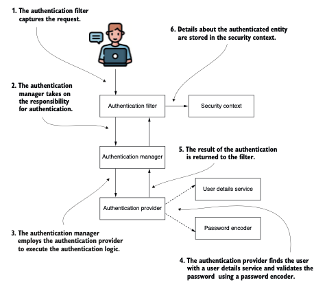
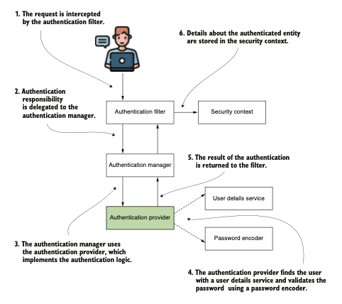

# Parte 2: Hello, Spring Security

`Este capítulo cubre`
- Crear tu primer proyecto con Spring Security
- Diseñar funcionalidades simples utilizando los componentes básicos de autenticación y autorización
- El concepto subyacente y cómo usarlo en un proyecto determinado
- Aplicar los contratos básicos y comprender cómo están relacionados
- Escribir implementaciones personalizadas para responsabilidades principales
- Anular las configuraciones predeterminadas de Spring Boot

Spring Boot apareció como una etapa evolutiva para el desarrollo de aplicaciones con el Framework 
Spring. Al eliminar la necesidad de escribir todas las configuraciones, Spring Boot incluye 
configuraciones predefinidas, de modo que solo puedes anular aquellas que no coinciden con tus 
implementaciones. También llamamos a este enfoque convención sobre configuración. Spring Boot ya no 
es un concepto nuevo, y hoy disfrutamos escribiendo aplicaciones utilizando su tercera versión.

Antes de Spring Boot, los desarrolladores solían escribir docenas de líneas de código repetidamente 
para todas las aplicaciones que tenían que crear. Esta situación era menos evidente en el pasado, 
cuando la mayoría de las arquitecturas se desarrollaban de forma monolítica. Con una arquitectura 
monolítica, solo era necesario escribir esas configuraciones una vez al principio, y rara vez había 
que modificarlas después. Con la evolución de las arquitecturas de software orientadas a servicios, 
comenzamos a notar el problema del código repetitivo que había que escribir al configurar cada 
servicio. Si te parece interesante, puedes consultar el capítulo 3 de Spring in Practice de Willie 
Wheeler con Joshua White (Manning, 2013). Este capítulo describe la creación de una aplicación web 
con Spring 3, lo que te permitirá entender cuántas configuraciones había que escribir para una 
pequeña aplicación web de una sola página. El capítulo está disponible en http://mng.bz/46la.

Por esta razón, con el desarrollo de aplicaciones recientes, especialmente aquellas para 
microservicios, Spring Boot se volvió cada vez más popular. Spring Boot proporciona autoconfiguración 
para tu proyecto y reduce el tiempo necesario para la configuración. Podemos decir que viene con la 
filosofía adecuada para el desarrollo de software actual.

En este capítulo, comenzaremos con nuestra primera aplicación que utiliza Spring Security. Para las 
aplicaciones que desarrolles con el Framework Spring, Spring Security es una excelente opción para 
implementar seguridad a nivel de aplicación. Usaremos Spring Boot y analizaremos las configuraciones
predeterminadas establecidas por convención, con una breve introducción sobre cómo anular estos 
valores predeterminados. Considerar las configuraciones por defecto ofrece una excelente introducción 
a Spring Security, que también ilustra el concepto de autenticación.

Una vez que comencemos con el primer proyecto, discutiremos en mayor detalle las diversas opciones 
de autenticación. En los capítulos 3 al 6, continuaremos con configuraciones más específicas para 
cada una de las responsabilidades que verás en este primer ejemplo. También verás diferentes formas 
de aplicar esas configuraciones, dependiendo de los estilos arquitectónicos. Los pasos que 
discutiremos en el capítulo actual son los siguientes:

1. Crea un proyecto con solo las dependencias de Spring Security y web para observar su 
comportamiento cuando no se agrega ninguna configuración. De esta forma, comprenderás qué esperar de
la configuración predeterminada para autenticación y autorización.
2. Modifica el proyecto para añadir funcionalidad de gestión de usuarios, anulando las configuraciones
predeterminadas para definir usuarios y contraseñas personalizados.
3. Después de observar que la aplicación autentica todos los endpoints por defecto, aprende que esto
también se puede personalizar.
4. Aplica diferentes estilos para las mismas configuraciones con el fin de entender las mejores 
prácticas.

### 2.1 Comenzando tu primer proyecto
Creemos el primer proyecto para tener un ejemplo inicial. Este proyecto es una pequeña aplicación 
web que expone un endpoint REST. Verás cómo, sin hacer mucho, Spring Security protege este endpoint 
utilizando autenticación HTTP Basic. HTTP Basic es un mecanismo mediante el cual una aplicación web 
autentica a un usuario a través de un conjunto de credenciales (nombre de usuario y contraseña) que 
la aplicación obtiene del encabezado de la solicitud HTTP.

`NOTA` Con la configuración predeterminada, la aplicación tiene dos mecanismos de autenticación 
diferentes implementados: HTTP Basic y Form Login. Sin embargo, decidí presentar el ejemplo paso a 
paso y tratar el inicio de sesión mediante formulario (Form Login) en capítulos posteriores. Pero si
intentas acceder a la URL desde un navegador, verás que tu aplicación implementa un formulario 
elegante para la autenticación del usuario y no muestra un cuadro HTTP Basic poco atractivo por esta
razón. No quiero que te confundas en caso de que decidas hacer pruebas con un navegador, pero nos 
centraremos en esto en la sección sobre HTTP Basic. 

Tan solo con crear el proyecto y agregar las dependencias correctas, Spring Boot aplica 
configuraciones predeterminadas, incluyendo un nombre de usuario y una contraseña, cuando se inicia 
la aplicación.

`NOTA` Tienes varias alternativas para crear proyectos Spring Boot. Algunos entornos de desarrollo 
ofrecen la posibilidad de crear el proyecto directamente. Para más detalles, recomiendo Spring Boot:
Up and Running de Mark Heckler (O’Reilly Media, 2021) y Spring Boot in Practice (Manning, 2022) de 
Somnath Musib, o incluso Spring Start Here (Manning, 2021), otro libro que escribí.

Los ejemplos en este libro hacen referencia al código fuente complementario del libro. Con cada 
ejemplo, también se especifican las dependencias que debes agregar al archivo pom.xml. Puedes, y se 
recomienda que lo hagas, descargar los proyectos proporcionados con el libro y el código fuente 
disponible en https://www.manning.com/downloads/2105. Los proyectos te serán de ayuda si te quedas 
atascado en algo. También puedes usarlos para validar tus soluciones finales.

NOTA Los ejemplos en este libro no dependen de la herramienta de construcción que elijas. Puedes usar
tanto `Maven` como `Gradle`. Para mantener la coherencia, todos los ejemplos fueron construidos con 
`Maven.`

El primer proyecto también es el más pequeño. Es una aplicación sencilla que expone un endpoint REST
al que puedes acceder y recibir una respuesta, como se describe en la figura 2.1. Este proyecto es 
suficiente para que aprendas los primeros pasos al desarrollar una aplicación con Spring Security y 
Spring Boot. Presenta los conceptos básicos de la arquitectura de Spring Security para autenticación 
y autorización.


Aprendemos Spring Security creando un proyecto vacío y nombrándolo ssia-ch2-ex1. (Este ejemplo 
también se encuentra con el mismo nombre en otros proyectos proporcionados.) Las únicas dependencias
que necesitas incluir para nuestro primer proyecto son spring-boot-starter-web y 
spring-boot-starter-security, como se muestra en el listado 2.1. Después de crear el proyecto, 
asegúrate de agregar estas dependencias a tu archivo pom.xml. El objetivo principal de trabajar en 
este proyecto es observar el comportamiento de una aplicación configurada por defecto con Spring 
Security. También queremos comprender qué componentes forman parte de esta configuración 
predeterminada, así como su propósito.

```xml
<dependency>
    <groupId>org.springframework.boot</groupId>
    <artifactId>spring-boot-starter-web</artifactId>
</dependency>
<dependency>
    <groupId>org.springframework.boot</groupId>
    <artifactId>spring-boot-starter-security</artifactId>
</dependency>
```

Podríamos iniciar directamente la aplicación ahora. Spring Boot aplica la configuración 
predeterminada del contexto de Spring en función de las dependencias que agregamos al proyecto. 
Sin embargo, no aprenderíamos mucho sobre seguridad si no tuviéramos al menos un endpoint protegido. 
Creemos un endpoint sencillo y llamémoslo para ver qué sucede. Para ello, agregamos una clase al 
proyecto vacío y la llamamos HelloController. Esta clase se añade a un paquete llamado controllers 
dentro del espacio de nombres principal del proyecto Spring Boot.

`NOTA` Spring Boot solo escanea componentes en el paquete (y sus subpaquetes) que contiene la clase 
anotada con @SpringBootApplication. Si anotas clases con cualquiera de los componentes estereotipo 
de Spring fuera del paquete principal, debes declarar explícitamente la ubicación usando la 
anotación @ComponentScan.

En el siguiente listado, la clase HelloController define un controlador REST y un endpoint REST para
nuestro ejemplo. 

```java
@RestController
public class HelloController {
    @GetMapping("/hello")
    public String hello() {
        return "Hello!";
    }
}
```

La anotación @RestController registra el bean en el contexto y le indica a Spring que la aplicación 
use esta instancia como un controlador web. Además, la anotación especifica que la aplicación debe 
establecer el cuerpo de la respuesta HTTP a partir del valor devuelto por el método. La anotación 
@GetMapping mapea la ruta /hello al método implementado mediante una solicitud GET. Una vez que 
ejecutas la aplicación, además de las demás líneas en la consola, deberías ver un mensaje similar a:
`Using generated security password: 93a01cf0-794b-4b98-86ef-54860f36f7f3` 

Cada vez que ejecutas la aplicación, se genera una nueva contraseña y se imprime en la consola, como
se muestra en el fragmento de código anterior. Debes usar esta contraseña para acceder a cualquiera 
de los endpoints de la aplicación mediante autenticación HTTP Basic. Primero, intentemos llamar al 
endpoint sin usar el encabezado de autorización:
`curl http://localhost:8080/hello`

`NOTA` En este libro, usamos cURL para llamar a los endpoints en todos los ejemplos. Considero que 
cURL es la solución más clara y legible. Pero si lo prefieres, puedes usar la herramienta de tu 
elección. Por ejemplo, quizás desees una interfaz gráfica más cómoda. En ese caso, Postman, Insomnia
o Bruno son excelentes opciones. Si el sistema operativo que usas no tiene instalada ninguna de estas
herramientas, probablemente necesites instalarlas tú mismo.

Y la respuesta a la llamada es:
```json
{
"status":401,
"error":"Unauthorized",
"message":"Unauthorized",
"path":"/hello"
}
```
El estado de la respuesta es HTTP 401 Unauthorized. Esperábamos este resultado, ya que no usamos las
credenciales adecuadas para la autenticación. Por defecto, Spring Security espera el nombre de 
usuario predeterminado (user) junto con la contraseña generada (en mi caso, la que comienza con 93a01).
Intentémoslo nuevamente, pero ahora con las credenciales correctas:
`curl -u user:93a01cf0-794b-4b98-86ef-54860f36f7f3 http://localhost:8080/hello`

La respuesta a la llamada es:
`Hello!`

`NOTA` El código de estado HTTP 401 Unauthorized es un poco ambiguo. Por lo general, se utiliza para
representar un error de autenticación, no de autorización. Los desarrolladores lo usan en el diseño 
de la aplicación para casos como la ausencia o credenciales incorrectas. Para un error de 
autorización, probablemente usaríamos el estado 403 Forbidden. En general, un HTTP 403 significa que
el servidor identificó al remitente de la solicitud, pero este no tiene los privilegios necesarios 
para realizar la acción que intenta hacer.

Una vez que enviamos las credenciales correctas, puedes observar en el cuerpo de la respuesta 
exactamente lo que devuelve el método HelloController que definimos anteriormente.

Llamando al endpoint con autenticación HTTP Basic
Con cURL, puedes establecer el nombre de usuario y la contraseña para autenticación HTTP mediante la
opción -u. En segundo plano, cURL codifica la cadena <nombre de usuario>:<contraseña> en Base64 y la 
envía como valor del encabezado Authorization, precedida por la palabra Basic.

Aunque es más sencillo usar la opción -u con cURL, también es importante conocer cómo se ve la 
solicitud real. Por ello, probemos crear manualmente el encabezado Authorization.

En el primer paso, toma la cadena <nombre de usuario>:<contraseña> y codifícala en Base64. Cuando 
tu aplicación realice la llamada, necesitas saber cómo formar el valor correcto para el encabezado 
Authorization. Puedes hacerlo usando la herramienta base64 en una consola Linux. También puedes usar
una página web que codifique cadenas en Base64, como https://www.base64encode.org. Este fragmento 
muestra el comando en una consola Linux o Git Bash (el parámetro -n indica que no se agregue un 
salto de línea al final):

`echo -n user:93a01cf0-794b-4b98-86ef-54860f36f7f3 | base64`

La ejecución de este comando devuelve la siguiente cadena codificada en Base64:

`dXNlcjo5M2EwMWNmMC03OTRiLTRiOTgtODZlZi01NDg2MGYzNmY3ZjM=`

El resultado de la llamada es:
`Hello!`

No hay configuraciones de seguridad significativas que analizar en un proyecto por defecto. 
Principalmente usamos las configuraciones predeterminadas para verificar que las dependencias 
correctas están en su lugar. Hacen poco en cuanto a autenticación y autorización, y esta 
implementación no es adecuada para una aplicación lista para producción. Sin embargo, el proyecto 
por defecto es un excelente punto de partida.

Con este primer ejemplo funcionando, al menos sabemos que Spring Security está activo. El siguiente 
paso es modificar las configuraciones para adaptarlas a los requisitos del proyecto. Primero 
profundizaremos en lo que Spring Boot configura por defecto en términos de Spring Security y luego 
veremos cómo anular estas configuraciones.

### 2.2 La imagen general del diseño de clases en Spring Security
En esta sección, analizamos los principales componentes de la arquitectura que participan en los 
procesos de autenticación y autorización. Es esencial conocer estos elementos, ya que deberás anular
estos componentes preconfigurados para adaptarlos a las necesidades de tu aplicación. Comenzaré 
describiendo cómo funciona la arquitectura de Spring Security para autenticación y autorización, y 
luego aplicaremos este conocimiento a los proyectos de este capítulo. Sería demasiado extenso tratar
todos los aspectos a la vez, por lo que, para reducir el esfuerzo de aprendizaje en este capítulo, 
me centraré en la visión general de cada componente. Detalles específicos sobre cada uno se tratarán
en capítulos posteriores.

En la sección 2.1, viste cierta lógica ejecutándose para autenticación y autorización. Teníamos un 
usuario por defecto y obteníamos una contraseña aleatoria cada vez que iniciábamos la aplicación. 
Pudimos usar este usuario y contraseña predeterminados para llamar a un endpoint. Pero ¿dónde se 
implementa toda esta lógica? Como probablemente ya sepas, Spring Boot configura algunos componentes 
automáticamente según las dependencias que uses (es decir, la convención sobre configuración que 
discutimos al inicio del capítulo). La figura 2.2 muestra una visión general de los principales 
actores (componentes) en la arquitectura de Spring Security y las relaciones entre ellos. Estos 
componentes tienen una implementación preconfigurada en el primer proyecto. En este capítulo, 
demostraré qué configura Spring Boot en tu aplicación en términos de Spring Security y también 
analizaremos las relaciones entre las entidades que forman parte del flujo de autenticación.



1. El authentication filter captura la peticion `"request"`
2. El authentication manager asume la responsabilidad del authentication
3. El authentication manager emplea a authentication provider para ejecutar la lógica de authentication.
4. El authentication provider encuentra al usuario mediante un servicio de detalles de usuario y 
valida la contraseña utilizando un codificador de contraseñas.
5. El resultado del authentication es devuelto al filter.
6. Los detalles sobre la entidad autenticada son guardados en un contexto de seguridad.

Los elementos centrales involucrados en el proceso de autenticación de Spring Security y sus 
interconexiones son el enfoque aquí. Este marco forma la estructura esencial para ejecutar la 
autenticación usando Spring Security. A lo largo del libro, haremos referencia frecuente a esta 
arquitectura al examinar diversas estrategias de autenticación y autorización.

En sintesis:

1. El filtro de autenticación delega la solicitud de autenticación al gestor de autenticación y, 
según la respuesta, configura el contexto de seguridad.
2. El gestor de autenticación utiliza el proveedor de autenticación para procesar la autenticación.
3. El proveedor de autenticación implementa la lógica de autenticación.
4. El servicio de detalles de usuario implementa la responsabilidad de gestión de usuarios, que el 
proveedor de autenticación utiliza en la lógica de autenticación.
5. El codificador de contraseñas implementa la gestión de contraseñas, que el proveedor de 
autenticación utiliza en la lógica de autenticación.
6. El contexto de seguridad mantiene los datos de autenticación tras el proceso de autenticación. 
El contexto de seguridad conservará los datos hasta que finalice la acción. Por lo general, en una 
aplicación con un hilo por solicitud, esto significa hasta que la aplicación envíe la respuesta al 
cliente.

En los siguientes párrafos, analizaré estos beans configurados automáticamente:

- `UserDetailsService`
- `PasswordEncoder`

Un objeto que implementa la interfaz `UserDetailsService` con Spring Security gestiona los detalles 
sobre los usuarios. Hasta ahora, hemos utilizado la implementación predeterminada proporcionada por 
Spring Boot. Esta implementación solo registra las credenciales predeterminadas en la memoria interna
de la aplicación. Estas credenciales predeterminadas son "user" con una contraseña predeterminada 
que es un identificador único universal (UUID). La contraseña predeterminada se genera aleatoriamente
cuando se carga el contexto de Spring (al iniciar la aplicación). En ese momento, la aplicación 
escribe la contraseña en la consola, donde puedes verla. Así, puedes usarla en el ejemplo en el que 
acabamos de trabajar en este capítulo.

Esta implementación predeterminada sirve únicamente como prueba de concepto y nos permite verificar 
que la dependencia está correctamente configurada. La implementación almacena las credenciales en 
memoria: la aplicación no persiste las credenciales. Este enfoque es adecuado para ejemplos o pruebas
de concepto, pero debes evitarlo en una aplicación lista para producción.

Luego tenemos el `PasswordEncoder`. El PasswordEncoder realiza dos funciones:

- Codifica una contraseña (normalmente utilizando un algoritmo de cifrado o hash)
- Verifica si la contraseña coincide con una codificación existente

Aunque no sea tan evidente como el objeto UserDetailsService, el `PasswordEncoder` es obligatorio para
el flujo de autenticación básica. La implementación más simple gestiona las contraseñas en texto 
plano y no las codifica. Discutiremos con más detalle la implementación de este objeto en el capítulo 4. Por ahora, debes saber que existe un PasswordEncoder junto con el UserDetailsService predeterminado. Cuando reemplazamos la implementación predeterminada del UserDetailsService, también debemos especificar un PasswordEncoder.

Spring Boot también elige un método de autenticación al configurar los valores predeterminados: la 
autenticación HTTP Basic. Es el método de autenticación de acceso más sencillo. La autenticación 
básica solo requiere que el cliente envíe un nombre de usuario y una contraseña a través del 
encabezado HTTP Authorization. En el valor del encabezado, el cliente añade el prefijo Basic, seguido 
de la codificación en Base64 de la cadena que contiene el nombre de usuario y la contraseña, 
separados por dos puntos (:). 

`NOTA:` La autenticación HTTP Basic no ofrece confidencialidad de las credenciales. Base64 es solo 
un método de codificación para facilitar la transferencia; no es un método de cifrado ni de hash. 
Durante la transmisión, si se intercepta, cualquiera puede ver las credenciales. En general, no se 
utiliza la autenticación HTTP Basic sin al menos HTTPS para garantizar la confidencialidad. Puedes 
leer la definición detallada de HTTP Basic en RFC 7617 (https://tools.ietf.org/html/rfc7617).

El `AuthenticationProvider` define la lógica de autenticación, delegando la gestión del usuario y la
contraseña. Una implementación predeterminada de `AuthenticationProvider` utiliza las implementaciones
predeterminadas proporcionadas para `UserDetailsService` y `PasswordEncoder`. Implícitamente, tu 
aplicación protege todos los endpoints. Por lo tanto, lo único que necesitamos hacer para nuestro 
ejemplo es agregar el endpoint. Además, solo hay un usuario que puede acceder a todos los `endpoints,`
por lo que en este caso se puede decir que no hay mucho que hacer respecto a la autorización.

`HTTP vs. HTTPS`

Puede que hayas observado que en los ejemplos presentados, solo uso HTTP. En la práctica, sin 
embargo, tus aplicaciones se comunican únicamente mediante HTTPS. Para los ejemplos que discutimos 
en este libro, las configuraciones relacionadas con Spring Security no son diferentes, ya sea que 
usemos HTTP o HTTPS. No configuraremos HTTPS para los endpoints en los ejemplos para que puedas 
concentrarte en los ejemplos relacionados con Spring Security. Pero si lo deseas, puedes habilitar 
HTTPS para cualquiera de los endpoints, como se presenta en este recuadro.

Existen varios patrones para configurar HTTPS en un sistema. En algunos casos, los desarrolladores 
configuran HTTPS a nivel de aplicación; en otros, podrían usar una malla de servicios, o podrían 
optar por establecer HTTPS a nivel de infraestructura. Con Spring Boot, puedes habilitar fácilmente 
HTTPS a nivel de aplicación, como aprenderás en el siguiente ejemplo de este recuadro.

En cualquiera de estos escenarios de configuración, necesitas un certificado firmado por una 
autoridad de certificación (CA). Usando este certificado, el cliente que llama al endpoint sabe si 
la respuesta proviene del servidor de autenticación y que nadie interceptó la comunicación. Puedes 
comprar dicho certificado si lo necesitas. Si solo necesitas configurar HTTPS para probar tu 
aplicación, puedes generar un certificado autofirmado usando una herramienta como `OpenSSL`
(https://www.openssl.org/). Generemos nuestro certificado autofirmado y luego configurémoslo en el 
proyecto:
`openssl req -newkey rsa:2048 -x509 -keyout key.pem -out cert.pem -days 365`

Después de ejecutar el comando openssl en una terminal, se te pedirá una contraseña y detalles sobre 
tu CA. Dado que se trata únicamente de un certificado autofirmado para pruebas, puedes ingresar 
cualquier dato; solo asegúrate de recordar la contraseña. El comando genera dos archivos: key.pem 
(la clave privada) y cert.pem (un certificado público). Utilizaremos estos archivos más adelante 
para generar nuestro certificado autofirmado y habilitar HTTPS. En la mayoría de los casos, el 
certificado sigue el estándar de criptografía de clave pública #12 (PKCS12). Con menos frecuencia, 
se utiliza el formato Java KeyStore (JKS). Continuemos nuestro ejemplo con el formato PKCS12 (para 
una excelente explicación sobre criptografía, recomiendo Real-World Cryptography de David Wong 
[Manning, 2020]):
`openssl pkcs12 -export -in cert.pem -inkey key.pem -out certificate.p12
-name "certificate"`

El segundo comando que utilizamos recibe como entrada los dos archivos generados por el primer 
comando y produce como salida el certificado autofirmado.

Ten en cuenta que si ejecutas estos comandos en un shell Bash en un sistema Windows, es posible que 
necesites agregar winpty antes del comando:

`winpty openssl req -newkey rsa:2048 -x509 -keyout key.pem -out cert.pem
-days 365`

`winpty openssl pkcs12 -export -in cert.pem -inkey key.pem -out
certificate.p12 -name "certificate"`

Finalmente, con el certificado autofirmado, puedes configurar HTTPS para tus endpoints. Copia el 
archivo certificate.p12 en la carpeta resources del proyecto Spring Boot y agrega las siguientes 
líneas al archivo application.properties:

`server.ssl.key-store-type=PKCS12`

`server.ssl.key-store=classpath:certificate.p12`

`server.ssl.key-store-password=12345`

`El valor de la contraseña es el que especificaste al ejecutar el segundo comando para generar el 
archivo del certificado PKCS12.`

La contraseña (en mi caso, 12345) fue solicitada en el mensaje que apareció después de ejecutar el 
comando para generar el certificado. Por eso no la ves incluida en el comando. Ahora agreguemos un 
endpoint de prueba a nuestra aplicación y luego llamémoslo usando HTTPS:

```java
@RestController
public class HelloController {
    @GetMapping("/hello")
    public String hello() {
        return "Hello!";
    }
}
```

Si usas un certificado autofirmado, debes configurar la herramienta que utilizas para realizar la 
llamada al endpoint de forma que omita la verificación de autenticidad del certificado. Si la 
herramienta verifica la autenticidad del certificado, no lo reconocerá como válido y la llamada no 
funcionará. Con cURL, puedes usar la opción -k para omitir la verificación del certificado:

`curl -k -u user:93a01cf0-794b-4b98-86ef-54860f36f7f3 https://localhost:8080/hello`

La respuesta a la llamada es
¡Hola!

Recuerda que, aunque uses HTTPS, la comunicación entre los componentes de tu sistema no es 
completamente infalible. En muchas ocasiones, he escuchado a personas decir: "Ya no cifro esto, 
¡usaré HTTPS!". Aunque es útil para proteger la comunicación, HTTPS es solo uno de los componentes 
de la seguridad de un sistema. Siempre trata la seguridad de tu sistema con responsabilidad y cuida 
todas las capas involucradas.

### 2.3 Sobrescribir configuraciones predeterminadas

Ahora que conoces las configuraciones predeterminadas de tu primer proyecto, es momento de ver cómo
puedes reemplazarlas. Debes entender las opciones disponibles para sobrescribir los componentes 
predeterminados, ya que así podrás integrar tus propias implementaciones y aplicar la seguridad de 
acuerdo con las necesidades de tu aplicación. Como aprenderás en esta sección, el proceso de 
desarrollo también implica escribir configuraciones que mantengan tus aplicaciones altamente 
mantenibles. En los proyectos que trabajaremos, a menudo encontrarás múltiples formas de sobrescribir
una configuración, lo que puede generar confusión. Es común ver mezclas de diferentes estilos para 
configurar distintas partes de Spring Security en una misma aplicación, lo cual no es recomendable. 
Por ello, esta flexibilidad requiere precaución. Necesitas aprender a elegir entre las opciones, por
lo que esta sección también se enfoca en conocer qué alternativas tienes.

En algunos casos, los desarrolladores optan por usar beans en el contexto de Spring para la 
configuración; en otros, sobrescriben diversos métodos con el mismo propósito. La rapidez con la que
ha evolucionado el ecosistema Spring es probablemente uno de los factores principales que generó 
estos múltiples enfoques. Combinar estilos de configuración no es deseable, ya que dificulta la 
comprensión del código y afecta la mantenibilidad de la aplicación. Conocer tus opciones y cómo 
usarlas es una habilidad valiosa que te ayudará a entender mejor cómo configurar la seguridad a nivel
de aplicación.

En esta sección, aprenderás a configurar un `UserDetailsService` y un `PasswordEncoder`. Estos dos 
componentes suelen participar en la autenticación, y la mayoría de las aplicaciones los personalizan
según sus requisitos. Aunque discutiremos los detalles sobre su personalización en los capítulos 3 y
4, es esencial saber cómo integrar una implementación personalizada. Las implementaciones que usamos
en este capítulo son todas proporcionadas por Spring Security.

#### 2.3.1 Personalización de la gestión de detalles de usuario

El primer componente del que hablamos en este capítulo fue UserDetailsService. Como viste, la 
aplicación utiliza este componente en el proceso de autenticación. En esta sección, aprenderás a 
definir un bean personalizado de tipo UserDetailsService para sobrescribir el que Spring Boot 
configura por defecto. Como verás en detalle en el capítulo 3, puedes crear tu propia implementación
o usar una predefinida proporcionada por Spring Security. En este capítulo, no profundizaremos aún 
en las implementaciones de Spring Security ni crearemos una propia. Usaré una implementación 
proporcionada por Spring Security llamada `InMemoryUserDetailsManager`. Con este ejemplo, aprenderás 
cómo integrar este tipo de objeto en tu arquitectura.

`NOTA` Las interfaces en Java definen contratos entre objetos. En el diseño de clases de la aplicación, 
usamos interfaces para desacoplar objetos que se utilizan entre sí. Para reforzar esta característica 
de interfaz al tratar sobre ellas en este libro, me refiero principalmente a ellas como contratos.

Para mostrarte cómo sobrescribir este componente con una implementación que elegimos, cambiaremos lo
que hicimos en el primer ejemplo. Esto nos permitirá tener nuestras propias credenciales gestionadas
para la autenticación. En este ejemplo, no implementaremos nuestra propia clase, sino que usaremos 
una implementación proporcionada por Spring Security.

En este ejemplo, utilizamos la implementación InMemoryUserDetailsManager. Aunque ofrece más 
funcionalidades que un simple `UserDetailsService`, por ahora solo la trataremos desde la perspectiva 
de un `UserDetailsService`. Esta implementación almacena las credenciales en memoria, las cuales 
pueden ser utilizadas posteriormente por Spring Security para autenticar una solicitud.

`NOTA:` Una implementación de InMemoryUserDetailsManager no está pensada para aplicaciones listas 
para producción, pero es una excelente herramienta para ejemplos o pruebas de concepto. En algunos 
casos, todo lo que necesitas son usuarios; no es necesario invertir tiempo en implementar esta parte
de la funcionalidad. En nuestro caso, la usamos para entender cómo sobrescribir la implementación 
predeterminada de `UserDetailsService.`

Comenzamos definiendo una clase de configuración. Generalmente, declaramos las clases de 
configuración en un paquete separado llamado config. La siguiente lista muestra la definición de la 
clase de configuración. También puedes encontrar el ejemplo en el proyecto ssia-ch2-ex2.

```java
@Configuration  //The @Configuration annotation marks the class as a configuration class.
public class ProjectConfig { 
    @Bean  //The @Bean annotation instructs Spring to add the returned value as a bean in the Spring context.
    UserDetailsService userDetailsService() {
        return new InMemoryUserDetailsManager();
    }    
}
```

Anotamos la clase con `@Configuration`. La anotación `@Bean` indica a Spring que agregue la 
instancia devuelta por el método al contexto de Spring. Si ejecutas el código exactamente como está 
ahora, ya no verás la contraseña generada automáticamente en la consola. La aplicación ahora utiliza
la instancia de tipo `UserDetailsService` que agregaste al contexto, en lugar de la implementación 
predeterminada configurada automáticamente. Pero al mismo tiempo, ya no podrás acceder al endpoint 
por dos razones:
- No tienes ningún usuario.
- No tienes un `PasswordEncoder`.

Viste que la autenticación también depende de un `PasswordEncoder`. Resolvamos estos dos problemas 
paso a paso. Necesitamos:

1. Crear al menos un usuario con un conjunto de credenciales (nombre de usuario y contraseña).
2. Agregar el usuario para que sea gestionado por nuestra implementación de UserDetailsService.
3. Definir un bean de tipo PasswordEncoder que la aplicación pueda usar para verificar una 
contraseña dada con la almacenada y gestionada por UserDetailsService.

Primero, declaramos y agregamos un conjunto de credenciales que podamos usar para autenticación a la
instancia de `InMemoryUserDetailsManager`. En el capítulo 3 discutiremos más sobre los usuarios y 
cómo gestionarlos. Por ahora, usemos un constructor predefinido para crear un objeto de tipo 
`UserDetails`.

`NOTA:` A veces verás que uso var en el código. Java 10 introdujo el nombre de tipo reservado var, 
que solo se puede usar para declaraciones locales. Aunque en algunos casos el uso de var en este 
libro podría considerarse un mal enfoque desde la perspectiva de una codificación limpia, se hace 
para acortar la sintaxis y ocultar el tipo de variable. Este enfoque te ayuda a centrarte en lo 
relevante para el ejemplo dado. Discutiremos los tipos ocultos por var en capítulos posteriores, por
lo que no debes preocuparte por ellos hasta que sea el momento de analizarlos adecuadamente.

Al construir la instancia, debemos proporcionar el nombre de usuario, la contraseña y al menos una 
autoridad. La autoridad es una acción permitida para ese usuario, y podemos usar cualquier cadena 
para esto. En el siguiente ejemplo, he llamado a la autoridad "read", pero como no usaremos esta 
autoridad por ahora, el nombre no importa realmente.

Crear un usuario con la clase User builder para `UserDetailsService`
```java
@Configuration
public class ProjectConfig {
    @Bean
    UserDetailsService userDetailsService() {//Construye el usuario con un nombre de usuario, contraseña y lista de autoridades especificados.
        var user = User.withUsername("john")
                .password("12345")
                .authorities("read")
                .build();
        return new InMemoryUserDetailsManager(user);//Agrega el usuario para que sea gestionado por UserDetailsService
    }
}    
```
`NOTA:` Encontrarás la clase User en el paquete org.springframework.security.core.userdetails. Es la
implementación del constructor que usamos para crear el objeto que representa al usuario. Además, 
como regla general en este libro, si no se muestra cómo escribir una clase en un fragmento de código,
significa que Spring Security la proporciona.

Como se presenta en el listado 2.4, debemos proporcionar un valor para el nombre de usuario, uno para
la contraseña y al menos una autoridad. Sin embargo, aún no es suficiente para permitirnos llamar al
endpoint. También necesitamos declarar un `PasswordEncoder`.

Cuando se usa el UserDetailsService predeterminado, un `PasswordEncoder` también se configura 
automáticamente. Dado que hemos reemplazado UserDetailsService, también debemos declarar un 
`PasswordEncoder`. Si se prueba el ejemplo ahora, se verá una excepción al llamar al endpoint. Al 
intentar realizar la autenticación, Spring Security detecta que no sabe cómo gestionar la contraseña
y falla. La excepción será similar a la del siguiente fragmento de código, y deberías verla en la 
consola de tu aplicación. El cliente recibirá un mensaje `HTTP 401 Unauthorized` y un cuerpo de 
respuesta vacío:
curl -u john:12345 http://localhost:8080/hello

El resultado por consola de la peticion es:

java.lang.IllegalArgumentException:

There is no PasswordEncoder mapped for the id "null"
    at

org.springframework.security.crypto.

➥password.DelegatingPasswordEncoder$

➥UnmappedIdPasswordEncoder.matches(

➥DelegatingPasswordEncoder.java:289)

➥~[spring-security-crypto-6.0.0.jar:6.0.0]

at org.springframework.security.crypto.

➥password.DelegatingPasswordEncoder.matches(

➥DelegatingPasswordEncoder.java:237)

➥~[spring-security-crypto-6.0.0.jar:6.0.0]

Para solucionar este problema, podemos agregar un bean de PasswordEncoder en el contexto, tal como 
hicimos con el UserDetailsService. Para este bean, usamos una implementación existente de 
`PasswordEncoder`:

```java
@Bean
public PasswordEncoder passwordEncoder() {
    return NoOpPasswordEncoder.getInstance();
}
```
`NOTA:` La instancia de `NoOpPasswordEncoder` trata las contraseñas como texto plano. No las cifra ni 
aplica hash. Para verificarlas, `NoOpPasswordEncoder` solo compara las cadenas utilizando el método 
equals(Object o) de la clase String. No deberías usar este tipo de `PasswordEncoder` en una aplicación
lista para producción. `NoOpPasswordEncoder` es una buena opción para ejemplos en los que no deseas 
enfocarte en el algoritmo de hash de la contraseña. Por ello, los desarrolladores de la clase la han
marcado como `@Deprecated`, y tu entorno de desarrollo mostrará su nombre tachado.

Puedes ver el código completo de la clase de configuración en el siguiente listado.

La definición completa de la clase de configuración:
```java
@Configuration
public class ProjectConfig {
    @Bean
    UserDetailsService userDetailsService() {
        var user = User.withUsername("john")
                .password("12345")
                .authorities("read")
                .build();
        return new InMemoryUserDetailsManager(user);
    }

    @Bean  //A new method annotated with @Bean to add a PasswordEncoder to the context
    PasswordEncoder passwordEncoder() {
        return NoOpPasswordEncoder.getInstance();
    }
}    
```

Probemos el endpoint con el nuevo usuario que tiene el nombre de usuario john y la contraseña 12345:

curl -u john:12345 http://localhost:8080/hello
Hello!

`NOTA:` Sabiendo la importancia de las pruebas unitarias e integrales, algunos de ustedes podrían 
preguntarse por qué no escribimos pruebas para nuestros ejemplos. En realidad, encontrarás las 
pruebas de integración relacionadas con Spring Security en todos los ejemplos proporcionados en este
libro. Sin embargo, para ayudarte a centrarte en los temas presentados en cada capítulo, he separado
la discusión sobre las pruebas de integración de Spring Security y la detallo en el capítulo 18.

### 2.3.2 Aplicar autorización a nivel de endpoint

Con una nueva gestión de usuarios implementada, como se describió en la sección 2.3.1, ahora podemos
discutir el método de autenticación y la configuración de los endpoints. Aprenderás mucho sobre la 
configuración de autorización en los capítulos 7 a 12. Pero antes de profundizar, debes entender la 
visión general. La mejor forma de lograrlo es con nuestro primer ejemplo. Con la configuración 
predeterminada, todos los endpoints asumen que tienes un usuario válido gestionado por la aplicación.
Además, por defecto, tu aplicación usa autenticación HTTP Basic, aunque esta configuración se puede 
sobrescribir fácilmente.

Como aprenderás en los próximos capítulos, la autenticación HTTP Basic no se ajusta a la mayoría de 
las arquitecturas de aplicaciones. A veces, nos interesa cambiarla para adaptarla a nuestra 
aplicación. De forma similar, no todos los endpoints necesitan estar protegidos, y para aquellos que
sí, podríamos necesitar diferentes métodos de autenticación y reglas de autorización. Para 
personalizar la gestión de autenticación y autorización, necesitaremos definir un bean de tipo 
SecurityFilterChain. Para este ejemplo, continuaré escribiendo el código en el proyecto ssia-ch2-ex3.

Definir un @Bean SecurityFilterChain:
```java
@Configuration
public class ProjectConfig {
    @Bean
    SecurityFilterChain configure(HttpSecurity http)
        throws Exception {
        return http.build();
    }
    // Omitted code
}
```
Podemos entonces alterar la configuración utilizando diferentes métodos del objeto HttpSecurity, 
como se muestra en el siguiente listado.

Usar el parámetro HttpSecurity para modificar la configuración:
```java
@Configuration
public class ProjectConfig {
    @Bean
    SecurityFilterChain configure(HttpSecurity http)
            throws Exception {
        http.httpBasic(Customizer.withDefaults());//App uses HTTP Basic authentication.
        
        http.authorizeHttpRequests(
                c -> c.anyRequest().authenticated()//All the requests require authentication.
        );
        return http.build();
    }
    //Omitted code
}
```
El código configura la autorización de endpoints con el mismo comportamiento que la predeterminada. 
Puedes volver a llamar al endpoint para verificar si se comporta igual que en la prueba anterior de 
la sección 2.3.1. Con un pequeño cambio, puedes hacer que todos los endpoints sean accesibles sin 
necesidad de credenciales. Verás cómo hacerlo en el siguiente listado.

Usar permitAll() para cambiar la configuración de autorización:
```java
@Configuration
public class ProjectConfig {
    @Bean
    public SecurityFilterChain configure(HttpSecurity http)
            throws Exception {
        http.httpBasic(Customizer.withDefaults());
        http.authorizeHttpRequests(
                c -> c.anyRequest().permitAll()
        );
        return http.build();
    }
    //Omitted code
}
```
Ahora podemos llamar al endpoint /hello sin necesidad de credenciales. La llamada a permitAll() en 
la configuración, junto con el método anyRequest(), permite el acceso a todos los endpoints sin 
necesidad de autenticación.

curl http://localhost:8080/hello

El cuerpo de la respuesta de la llamada es
Hello!

En este ejemplo, utilizamos dos métodos de configuración:

- httpBasic(), que nos ayudó a configurar el enfoque de autenticación. Al llamar a este método, 
indicamos a nuestra aplicación que acepte HTTP Basic como método de autenticación.
- authorizeHttpRequests(), que nos ayudó a configurar las reglas de autorización a nivel de endpoint.
Al llamar a este método, indicamos a la aplicación cómo autorizar las solicitudes recibidas en 
endpoints específicos.

Para ambos métodos, tuvimos que usar un objeto `Customizer` como parámetro. `Customizer` es un contrato 
que implementamos para definir la personalización de los elementos de Spring Security que 
configuramos: la autenticación, la autorización o mecanismos de protección específicos como CSRF o 
CORS (que se discutirán en los capítulos 9 y 10). El siguiente fragmento muestra la definición de la 
interfaz `Customizer`. Observa que Customizer es una interfaz funcional (por lo tanto, podemos usar 
expresiones lambda para implementarla), y el método `withDefaults()` que usé en el listado 2.8 es, de 
hecho, solo una implementación de Customizer que no realiza ninguna modificación:

```java
@FunctionalInterface
public interface Customizer<T> {
    void customize(T t);
    static <T> Customizer<T> withDefaults() {
        return (t) -> {
        };
    }
}
```

En versiones anteriores de Spring Security, era posible aplicar configuraciones sin usar un objeto 
`Customizer`, mediante una sintaxis encadenada, como se muestra en el siguiente fragmento de código. 
Observa que, en lugar de proporcionar un objeto Customizer al método `authorizeHttpRequests()`, la 
configuración simplemente continúa después de la llamada al método:
```java
http.authorizeHttpRequests()
    .anyRequest().authenticated()
```
La razón por la que este enfoque ha quedado obsoleto es porque un objeto Customizer ofrece mayor 
flexibilidad para mover la configuración donde sea necesario. Aunque con ejemplos sencillos el uso 
de expresiones lambda resulta cómodo, en aplicaciones reales las configuraciones pueden crecer 
considerablemente. En tales casos, la posibilidad de trasladar estas configuraciones a clases 
separadas ayuda a mantenerlas más organizadas, fáciles de mantener y de probar.

El propósito de este ejemplo es darte una idea de cómo sobrescribir configuraciones predeterminadas.
Entraremos en más detalles sobre autorización en los capítulos 7 a 10.

NOTA: En versiones anteriores de Spring Security, una clase de configuración de seguridad necesitaba
extender una clase llamada `WebSecurityConfigurerAdapter`. `Ya no se utiliza esta práctica`. Si tu 
aplicación usa una base de código más antigua, o necesitas actualizar una base de código antigua, Te
recomiendo que también leas la primera edición de Spring Security in Action.

### 2.3.3 Configurando de diferentes maneras
Uno de los aspectos confusos de crear configuraciones con Spring Security es tener múltiples formas 
de configurar lo mismo. En esta sección, aprenderás alternativas para configurar `UserDetailsService` 
y `PasswordEncoder`. Es esencial conocer las opciones disponibles para poder reconocerlas en los 
ejemplos que encuentres en este libro u otras fuentes como blogs y artículos. También es importante 
que entiendas cómo y cuándo usarlas en tu aplicación. Los capítulos siguientes presentan diferentes 
ejemplos que amplían la información de esta sección.

Tomemos el primer proyecto. Después de crear una aplicación por defecto, logramos sobrescribir 
`UserDetailsService` y `PasswordEncoder` agregando nuevas implementaciones como beans en el contexto 
de Spring. Ahora exploremos otra forma de realizar las mismas configuraciones para `UserDetailsService`
y `PasswordEncoder`.

Podemos usar directamente el bean `SecurityFilterChain` para establecer tanto el `UserDetailsService` 
como el `PasswordEncoder`, como se muestra en el siguiente ejemplo. Puedes encontrar este caso en el 
proyecto ssia-ch2-ex3.

Establecer UserDetailsService con el bean SecurityFilterChain
```java
@Configuration
public class ProjectConfig {
    @Bean
    public SecurityFilterChain configure(HttpSecurity http)
            throws Exception {
        http.httpBasic(Customizer.withDefaults());
        http.authorizeHttpRequests(
                c -> c.anyRequest().authenticated()
        );
        var user = User.withUsername("john") //Define un usuario con todos sus detalles
                .password("12345")
                .authorities("read")
                .build();
        var userDetailsService =  //Declara un UserDetailsService para almacenar los usuarios en 
                // memoria y agrega el usuario para que sea gestionado por nuestro UserDetailsService.
                new InMemoryUserDetailsManager(user);
        http.userDetailsService(userDetailsService);//El UserDetailsService ahora se configura 
                                                    // utilizando el bean SecurityFilterChain.
        return http.build();
    }
    //Ommited code
}
```
Puedes observar que declaramos el UserDetailsService de la misma manera que en el listado 2.5. La 
diferencia es que ahora esto se hace localmente dentro del método del bean que crea el 
`SecurityFilterChain`. También llamamos al método `userDetailsService()` desde `HttpSecurity` para 
registrar la instancia de `UserDetailsService`. El siguiente listado muestra el contenido completo de 
la clase de configuración.

Definición completa de la clase de configuración:
```java
@Configuration
public class ProjectConfig {
    @Bean
    SecurityFilterChain configure(HttpSecurity http)
        throws Exception {
        http.httpBasic(Customizer.withDefaults());
        http.authorizeHttpRequests(
            c -> c.anyRequest().authenticated()
        );
        //Creates a new user
        var user = User.withUsername("john")
            .password("12345")
            .authorities("read")
            .build();
        //Agrega el usuario para que sea gestionado por nuestro UserDetailsService.
        var userDetailsService = new InMemoryUserDetailsManager(user);
        //Configures UserDetailsService
        http.userDetailsService(userDetailsService);
        return http.build();
    }
    @Bean
    PasswordEncoder passwordEncoder() {
        return NoOpPasswordEncoder.getInstance();
    }
}
```

Cualquiera de estas opciones de configuración es correcta. La primera opción, en la que agregamos 
los beans al contexto, te permite inyectar esos valores en otra clase donde podrías necesitarlos. 
Pero si no necesitas eso para tu caso, la segunda opción sería igualmente válida.

### 2.3.4 Definir lógica de autenticación personalizada
Como ya has observado, los componentes de Spring Security ofrecen mucha flexibilidad, brindando 
numerosas opciones para adaptarlos a la arquitectura de nuestras aplicaciones. Hasta ahora, has 
aprendido el propósito de UserDetailsService y PasswordEncoder en la arquitectura de Spring Security,
y también has visto varias formas de configurarlos.

Ahora es momento de aprender cómo personalizar también el componente que delega en estos: 
AuthenticationProvider, como se muestra en la figura 2.3. AuthenticationProvider implementa la lógica
de autenticación y delega en UserDetailsService y PasswordEncoder para la gestión de usuarios y 
contraseñas. Por tanto, podríamos decir que con esta sección profundizamos un paso más en la 
arquitectura de autenticación para aprender cómo implementar una lógica de autenticación 
personalizada con AuthenticationProvider.

Dado que este es el primer ejemplo, solo se muestra una visión general para que entiendas mejor la 
relación entre los componentes en la arquitectura. Sin embargo, se entrará en más detalle en los 
capítulos 3 al 6.

Se recomienda considerar las responsabilidades tal como están diseñadas en la arquitectura de Spring
Security. Esta arquitectura está débilmente acoplada y con responsabilidades bien definidas, lo cual 
es uno de los factores que hacen que Spring Security sea flexible y fácil de integrar con tus 
aplicaciones. Dependiendo de cómo aproveches su flexibilidad, también podrías modificar este diseño,
aunque debes tener cuidado, ya que estos enfoques pueden complicar tu solución. Por ejemplo, podrías
optar por sobrescribir el `AuthenticationProvider` predeterminado de tal forma que ya no necesites un 
`UserDetailsService` ni un `PasswordEncoder`.

Con esto en mente, se muestra cómo crear un proveedor de autenticación personalizado. 
Puedes encontrar este ejemplo en el proyecto ssia-ch2-ex4.



1. La peticion es interceptado por el `Authentication filter`.
2. La responsabilidad de la autenticacion es delegada por el `Authentication manager`.
3. El `Authentication manager` usa el `Authentication provider`, el cual implementa la logica de 
autenticacion.
4. `El Authentication provider` encuentra el usuario con el `user details service` y valida el password 
usando un codificador de contraseña.
5. El resultado de la autenticacion es retornado por el filter.
6. Los detalles sobre la entidad autenticada se almacenan en el contexto de seguridad.

El `AuthenticationProvider` implementa la lógica de autenticación. Recibe la solicitud del 
`AuthenticationManager` y delega la búsqueda del usuario a un `UserDetailsService`, y la verificación
de la contraseña a un `PasswordEncoder`.

Implementar la interfaz AuthenticationProvider:
```java
@Component
public class CustomAuthenticationProvider implements AuthenticationProvider {
    @Override
    public Authentication authenticate (Authentication authentication) throws
        AuthenticationException {
        // authentication logic here
    }
    @Override
    public boolean supports(Class<?> authenticationType) {
        // type of the Authentication implementation here
    }
}
```
El método authenticate(Authentication authentication) representa toda la lógica de autenticación, 
por lo que agregaremos una implementación. Explicaré el uso del método supports() en detalle en el 
capítulo 6. Por ahora, recomiendo que aceptes su implementación como válida. No es esencial para el 
ejemplo actual.

Implementar la lógica de autenticación:
```java
@Override
public Authentication authenticate(Authentication authentication) throws AuthenticationException {
    //El metodo getName() es heredado por Authentication desde la interfaz Principal.
    String username = authentication.getName();
    String password = String.valueOf(authentication.getCredentials());
    //Esta condición generalmente llama a UserDetailsService y PasswordEncoder para probar el nombre
    // de usuario y la contraseña.
    if ("john".equals(username) && "12345".equals(password)) {
        return new UsernamePasswordAuthenticationToken(username, password, Arrays.asList());
    } else {
        throw new AuthenticationCredentialsNotFoundException("Error!");
    }
}
```

Aquí, la condición de la cláusula if-else está reemplazando las responsabilidades de 
`UserDetailsService` y `PasswordEncoder`. No es obligatorio usar estos dos beans, pero si trabajas con 
usuarios y contraseñas para la autenticación, te recomiendo encarecidamente separar la lógica de su 
gestión. Aplícala tal como fue diseñada en la arquitectura de Spring Security, incluso cuando 
sobrescribas la implementación de autenticación.

Puede ser útil reemplazar la lógica de autenticación implementando tu propio `AuthenticationProvider`.
Si la implementación predeterminada no se ajusta completamente a los requisitos de tu aplicación, 
puedes decidir implementar una lógica de autenticación personalizada. La implementación completa de 
`AuthenticationProvider` es como la del siguiente listado.

La implementación completa del proveedor de autenticación:
```java
@Component
public class CustomAuthenticationProvider implements AuthenticationProvider {
    @Override
    public Authentication authenticate(Authentication authentication) 
            throws AuthenticationException {
        String username = authentication.getName();
        String password = String.valueOf(authentication.getCredentials());
        if ("john".equals(username) && "12345".equals(password)) {
            return new UsernamePasswordAuthenticationToken(username, password, Arrays.asList());
        } else {
            throw new AuthenticationCredentialsNotFoundException("Error!");
        }
    }
    @Override
    public boolean supports(Class<?> authenticationType) {
        return UsernamePasswordAuthenticationToken.class.isAssignableFrom(authenticationType);
    }
}
```

En la clase de configuración, puedes registrar el `AuthenticationProvider` utilizando el método 
`authenticationProvider()` de `HttpSecurity` que se muestra en el siguiente listado.

Registrar la nueva implementación de AuthenticationProvider:
```java
@Configuration
public class ProjectConfig {
    private final CustomAuthenticationProvider authenticationProvider;
    public ProjectConfig(CustomAuthenticationProvider authenticationProvider) {
        this.authenticationProvider = authenticationProvider;
    }
    @Bean
    SecurityFilterChain configure(HttpSecurity http) throws Exception {
        http.httpBasic(Customizer.withDefaults());
        http.authenticationProvider(authenticationProvider);
        http.authorizeHttpRequests(c -> c.anyRequest().authenticated()
        );
        return http.build();
    }
}
```

Ahora puedes llamar al endpoint, que es accesible únicamente para el usuario reconocido, definido 
por la lógica de autenticación: john, con la contraseña 12345:

curl -u john:12345 http://localhost:8080/hello

La respuesta será:

Hello!

En el capítulo 6 aprenderás más sobre `AuthenticationProvider` y cómo sobrescribir su comportamiento 
en el proceso de autenticación. En ese mismo capítulo también se analizará la interfaz Authentication 
y sus implementaciones, como `UsernamePasswordAuthenticationToken`.

### 2.3.5 Usar múltiples clases de configuración
En los ejemplos implementados anteriormente, solo usamos una clase de configuración. Sin embargo, es
una buena práctica separar las responsabilidades incluso para las clases de configuración. Necesitamos
esta separación porque la configuración empieza a volverse más compleja. En una aplicación lista para
producción, probablemente tengas más declaraciones que en nuestros primeros ejemplos. También puede 
ser útil tener más de una clase de configuración para hacer el proyecto más legible.

Siempre es buena práctica tener una sola clase por responsabilidad. Para este ejemplo, podemos 
separar la configuración de gestión de usuarios de la configuración de autorización. Hacemos esto 
definiendo dos clases de configuración: UserManagementConfig (definida en la siguiente lista) y 
`WebAuthorizationConfig` (definida en el listado 2.16). Puedes encontrar este ejemplo en el proyecto 
ssia-ch2-ex5.

Definir la clase de configuración para la gestión de usuarios y contraseñas:
```java
@Configuration
public class UserManagementConfig {
    @Bean
    public UserDetailsService userDetailsService() {
        var userDetailsService = new InMemoryUserDetailsManager();
        var user = User.withUsername("john")
            .password("12345")
            .authorities("read")
            .build();
        userDetailsService.createUser(user);
        return userDetailsService;
    }
    @Bean
    public PasswordEncoder passwordEncoder() {
        return NoOpPasswordEncoder.getInstance();
    }
}
```
En este caso, la clase `UserManagementConfig` contiene únicamente los dos beans responsables de la 
gestión de usuarios: `UserDetailsService` y `PasswordEncoder`. El siguiente listado muestra esta 
definición.

Definir la clase de configuración para la gestión de autorización:
```java
@Configuration
public class WebAuthorizationConfig {
    @Bean
    SecurityFilterChain configure(HttpSecurity http) throws Exception {
        http.httpBasic(Customizer.withDefaults());
        http.authorizeHttpRequests(c -> c.anyRequest().authenticated()
        );
        return http.build();
    }
}
```
En este caso, la clase `WebAuthorizationConfig` necesita definir un bean de tipo `SecurityFilterChain` 
para configurar las reglas de autenticación y autorización.

Resumen
- Spring Boot proporciona configuraciones predeterminadas cuando se añade Spring Security a las 
dependencias de la aplicación.
- Implementas los siguientes componentes básicos para autenticación y autorización: 
`UserDetailsService`, `PasswordEncoder` y `AuthenticationProvider`.
- Puedes definir usuarios con la clase User. Un usuario debe tener al menos un nombre de usuario, 
una contraseña y una autoridad. Las autoridades son acciones que permites a un usuario realizar en 
el contexto de la aplicación.
- Una implementación sencilla de `UserDetailsService` que proporciona Spring Security es 
`InMemoryUserDetailsManager`. Puedes añadir usuarios a esta instancia de `UserDetailsService` para 
gestionarlos en la memoria de la aplicación.
- `NoOpPasswordEncoder` es una implementación del contrato `PasswordEncoder` que utiliza contraseñas en 
texto claro. Esta implementación es útil para ejemplos de aprendizaje y (quizás) pruebas de concepto,
pero no para aplicaciones listas para producción.
- Puedes usar el contrato `AuthenticationProvider` para implementar lógica de autenticación 
personalizada en la aplicación.
- Hay varias formas de escribir configuraciones, pero en una sola aplicación debes elegir y mantener
un enfoque. Esto ayuda a que el código sea más limpio y fácil de entender.
