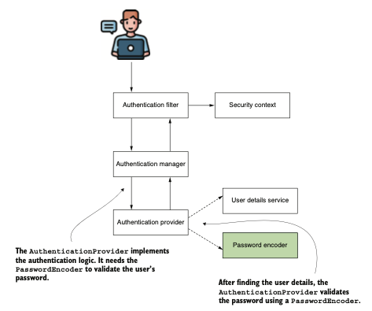
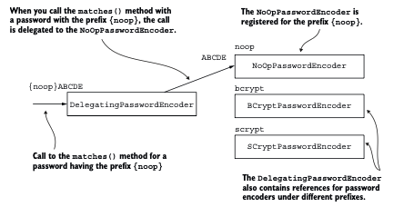
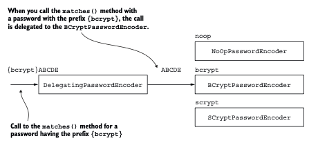

# Gestionando Passwords

#### Este capítulo cubre
- Implementar y trabajar con el PasswordEncoder
- Usar las herramientas ofrecidas por el módulo Crypto de Spring Security

En el capítulo 3, discutimos la gestión de usuarios en una aplicación implementada con Spring 
Security. Pero, ¿qué pasa con las contraseñas? Sin duda, son una pieza esencial del flujo de 
autenticación. En este capítulo, aprenderás cómo gestionar contraseñas y secretos en una aplicación 
implementada con Spring Security. Analizaremos el contrato `PasswordEncoder` y las herramientas que 
ofrece el módulo Crypto de `Spring Security` (SSCM) para la gestión de contraseñas.

## 4.1 Usando codificadores de contraseñas

Del capítulo 3, deberías tener ahora una imagen clara de qué es la interfaz `UserDetails`, así como 
de varias formas de usar su implementación. Pero como aprendiste en el capítulo 2, diferentes 
componentes gestionan la representación del usuario durante los procesos de autenticación y 
autorización. También aprendiste que algunos de estos componentes tienen valores predeterminados, 
como `UserDetailsService` y `PasswordEncoder`. Ahora sabes que puedes sobrescribir estos valores por 
defecto. Continuamos con una comprensión profunda de estos `beans` y formas de implementarlos, por lo
que en esta sección analizaremos el `PasswordEncoder`. Recuerda dónde encaja el `PasswordEncoder` 
en el proceso de autenticación con el siguiente flujo.



1. El `AuthenticationProvider` implementa la lógica de autenticación. Necesita el `PasswordEncoder` 
para validar la contraseña del usuario.
2. Después de encontrar los detalles del usuario, el `AuthenticationProvider` valida la contraseña 
utilizando un `PasswordEncoder`.

El proceso de autenticación de Spring Security. El `AuthenticationProvider` utiliza el 
`PasswordEncoder` para validar la contraseña del usuario en el proceso de autenticación.

Debido a que, en general, un sistema no gestiona contraseñas en texto plano, estas suelen someterse 
a algún tipo de transformación que dificulta su lectura y robo. Para esta responsabilidad, 
Spring Security define un contrato aparte. Para explicarlo de forma sencilla en esta sección, 
proporciono numerosos ejemplos de código relacionados con la implementación de `PasswordEncoder`. 
Comenzaremos comprendiendo el contrato, y luego escribiremos nuestra propia implementación en 
un proyecto. A continuación, en la sección 4.1.3, te proporcionaré una lista de las 
implementaciones de `PasswordEncoder` más conocidas y ampliamente utilizadas que ofrece 
Spring Security.

### 4.1.1 El contrato PasswordEncoder

En esta sección, analizamos la definición del contrato `PasswordEncoder`. Implementas este contrato 
para indicar a Spring Security cómo validar la contraseña de un usuario. En el proceso de 
autenticación, `PasswordEncoder` determina si una contraseña es válida. Cada sistema almacena las 
contraseñas codificadas de alguna manera, preferiblemente mediante funciones de hash, para que no 
puedan leerse. `PasswordEncoder` también puede codificar contraseñas. Los métodos encode() y 
matches(), declarados por el contrato, definen precisamente esta responsabilidad. Ambos forman 
parte del mismo contrato porque están estrechamente relacionados: la forma en que la aplicación 
codifica una contraseña está ligada a cómo se valida. A continuación, revisamos el contenido de 
la interfaz `PasswordEncoder`:
```java
public interface PasswordEncoder {
    String encode(CharSequence rawPassword);
    boolean matches(CharSequence rawPassword, String encodedPassword);
    default boolean upgradeEncoding(String encodedPassword) {
        return false;
    }
}
```
La interfaz define dos métodos abstractos y uno con una implementación por defecto. Los métodos 
abstractos `encode()` y `matches()` son los que más comúnmente se mencionan al trabajar con una 
implementación de `PasswordEncoder`.

El propósito del método `encode(CharSequence rawPassword)` es devolver una transformación de una 
cadena proporcionada. En términos de funcionalidad de Spring Security, se utiliza para proporcionar 
un cifrado o un hash de una contraseña dada. Posteriormente, puedes usar el método 
`matches(CharSequence rawPassword, String encodedPassword)` para comprobar si una cadena codificada 
coincide con una contraseña en texto claro. Se utiliza el método `matches()` en el proceso de 
autenticación para verificar una contraseña proporcionada frente a un conjunto de credenciales 
conocidas.

El tercer método, llamado `upgradeEncoding(CharSequence encodedPassword)`, por defecto devuelve 
false en el contrato. Si lo sobrescribes para que devuelva true, entonces la contraseña codificada
se codificará nuevamente para mejorar la seguridad. En algunos casos, codificar nuevamente la 
contraseña codificada puede dificultar aún más obtener la contraseña en texto claro a partir del 
resultado. En general, este es un tipo de obscuridad que personalmente no me gusta, pero el 
framework ofrece esta posibilidad si consideras que aplica a tu caso.

### 4.1.2 Implementando tu PasswordEncoder

Como has observado, los dos métodos `matches()` y `encode()` tienen una relación estrecha. Si los 
sobrescribes, siempre deben corresponderse funcionalmente: una cadena devuelta por el método 
`encode()` debe poder verificarse siempre con el método `matches()` del mismo `PasswordEncoder`. En 
esta sección, implementarás el contrato `PasswordEncoder` y definirás los dos métodos abstractos 
declarados por la interfaz. Al saber cómo implementar `PasswordEncoder`, puedes elegir cómo la 
aplicación gestiona las contraseñas en el proceso de autenticación. La implementación más sencilla 
es un codificador que trata las contraseñas en texto plano, es decir, que no realiza ninguna 
codificación sobre la contraseña.

Gestionar contraseñas en texto claro es precisamente lo que hace la instancia de 
`NoOpPasswordEncoder`. Usamos esta clase en nuestro primer ejemplo del capítulo 2. Si quisieras 
escribir tu propia implementación, se vería algo como en el siguiente ejemplo.

La implementación más simple de un PasswordEncoder:
```java
public class Sha512PasswordEncoder implements PasswordEncoder {
    @Override
    public String encode(CharSequence rawPassword) {
        return hashWithSHA512(rawPassword.toString());
    }
    @Override
    public boolean matches(CharSequence rawPassword, String encodedPassword) {
        String hashedPassword = encode(rawPassword);
        return encodedPassword.equals(hashedPassword);
    }
// Omitted code
}
```
Utilizamos un método para hacer hash del valor de cadena proporcionado con `SHA-512`. Omite la 
implementación de este método en el anterior codigo, pero puedes encontrarla en el siguiente. 
Llamamos a este método desde el método `encode()`, que ahora devuelve el valor hash de su entrada. 
Para validar un hash frente a una entrada, el método `matches()` hace hash de la contraseña en texto 
claro de su entrada y la compara con el hash contra el cual realiza la validación.

La implementación del método para hacer hash de la entrada con SHA-512:
```java
private String hashWithSHA512(String input) {
    StringBuilder result = new StringBuilder();
    try {
        MessageDigest md = MessageDigest.getInstance("SHA-512");
        byte[] digested = md.digest(input.getBytes());
        for (int i = 0; i < digested.length; i++) {
            result.append(Integer.toHexString(0xFF & digested[i]));
        }
    } catch (NoSuchAlgorithmException e) {
        throw new RuntimeException("Bad algorithm");
    }
    return result.toString();
}
```
Aprenderás opciones mejores para hacer esto en la siguiente sección, así que por ahora no te 
preocupes demasiado por este código.

### 4.1.3 Elegir entre las implementaciones de PasswordEncoder proporcionadas

Aunque es útil saber cómo implementar tu propio PasswordEncoder, también debes tener en cuenta que 
Spring Security ya proporciona algunas implementaciones ventajosas. Si alguna de ellas se adapta 
a tu aplicación, no necesitas volver a escribirla. En esta sección, analizamos las opciones de 
implementación de PasswordEncoder que proporciona Spring Security. Estas son:

- `NoOpPasswordEncoder`: No codifica la contraseña, sino que la mantiene en texto claro. Usamos esta
implementación solo para ejemplos. Dado que no realiza hash de la contraseña, nunca debes usarla 
en un escenario del mundo real.
- `StandardPasswordEncoder`: Usa SHA-256 para hacer hash de la contraseña. Esta implementación ahora
está obsoleta, y no deberías usarla en nuevas implementaciones. Está obsoleta porque utiliza un 
algoritmo de hash que ya no consideramos lo suficientemente seguro, aunque aún podrías encontrarla 
en aplicaciones existentes. Preferiblemente, si la encuentras en aplicaciones existentes, deberías
cambiarla por otro codificador de contraseñas más potente.
- `Pbkdf2PasswordEncoder`: Usa la función de derivación de clave basada en contraseña 2 (PBKDF2).
- `BCryptPasswordEncoder`: Usa una función de hash fuerte bcrypt para codificar la contraseña.
- `SCryptPasswordEncoder`: Usa una función de hash scrypt para codificar la contraseña.

Para obtener más información sobre el hashing y estos algoritmos, puedes encontrar una buena 
discusión en el capítulo 2 de Real-World Cryptography por David Wong (Manning, 2021) 
en http://mng.bz/QRJw.

Echemos un vistazo a algunos ejemplos de cómo crear instancias de estos tipos de implementaciones 
de `PasswordEncoder`. El `NoOpPasswordEncoder` no codifica la contraseña. Tiene una implementación 
similar a la de `PlainTextPasswordEncoder` de nuestro ejemplo. Por esta razón, solo usamos este 
codificador de contraseñas en ejemplos teóricos. Además, la clase `NoOpPasswordEncoder` está 
diseñada como un patrón singleton. No puedes llamar a su constructor directamente desde fuera de 
la clase, pero puedes usar el método `NoOpPasswordEncoder.getInstance()` para obtener la instancia 
de la clase de esta manera:
```java
PasswordEncoder p = NoOpPasswordEncoder.getInstance();
```
La implementación de `StandardPasswordEncoder` proporcionada por Spring Security utiliza `SHA-256` 
para hacer hash de la contraseña. Para `StandardPasswordEncoder`, puedes proporcionar un secreto 
que se usa en el proceso de hash. El valor de este secreto se establece mediante el parámetro del
constructor. Si eliges llamar al constructor sin argumentos, la implementación utiliza una cadena
vacía como valor de la clave. Sin embargo, `StandardPasswordEncoder` ahora está obsoleto, y no se 
recomienda su uso en nuevas implementaciones. Podrías encontrar aplicaciones antiguas o código 
heredado que aún lo utilicen, por lo que es importante que estés al tanto de su existencia. El 
siguiente fragmento de código muestra cómo crear instancias de este codificador de contraseñas:
```java
PasswordEncoder p = new StandardPasswordEncoder();
PasswordEncoder p = new StandardPasswordEncoder("secret");
```
Otra opción ofrecida por Spring Security es la implementación `Pbkdf2PasswordEncoder` que utiliza 
`PBKDF2` para la codificación de contraseñas. Para crear instancias de `Pbkdf2PasswordEncoder`, 
tienes las siguientes opciones:
```java
PasswordEncoder p = new Pbkdf2PasswordEncoder("secret", 16, 310000, Pbkdf2PasswordEncoder.
        SecretKeyFactoryAlgorithm.PBKDF2WithHmacSHA256);
```
`PBKDF2` es una función de hash lenta y bastante sencilla que realiza un `HMAC` tantas veces como lo 
especifique el parámetro de iteraciones. Los primeros tres parámetros recibidos por la última 
llamada son el valor de una clave utilizada en el proceso de codificación, el número de iteraciones
usadas para codificar la contraseña y el tamaño del hash. El segundo y tercer parámetro pueden 
influir en la fortaleza del resultado. El cuarto parámetro indica el ancho del hash. Puedes elegir 
entre las siguientes opciones:

- `PBKDF2WithHmacSHA1`
- `PBKDF2WithHmacSHA256`
- `PBKDF2WithHmacSHA512`

Es posible elegir más o menos iteraciones, así como la longitud del resultado. Cuanto más largo 
sea el hash, más segura será la contraseña (lo mismo aplica para el ancho del hash). Sin embargo, 
ten en cuenta que el rendimiento se ve afectado por estos valores: cuantas más iteraciones, más 
recursos consumirá tu aplicación. Debes encontrar un equilibrio adecuado entre los recursos 
consumidos para generar el hash y la fortaleza necesaria de la codificación.

`NOTA`: En este libro, hago referencia a varios conceptos de criptografía que quizás desees conocer
más a fondo. Para obtener información relevante sobre HMAC y otros detalles criptográficos, 
recomiendo Real-World Cryptography de David Wong (Manning, 2021). El capítulo 3 de ese libro 
proporciona información detallada sobre HMAC. Puedes encontrar el libro en http://mng.bz/XqJG.

Otra excelente opción ofrecida por Spring Security es el `BCryptPasswordEncoder`, que utiliza una 
función de hash fuerte `bcrypt` para codificar la contraseña. Puedes instanciar `BCryptPasswordEncoder` 
llamando al constructor sin argumentos. Sin embargo, también tienes la opción de especificar un 
coeficiente de fuerza que representa las rondas logarítmicas `(log rounds)` utilizadas en el proceso 
de codificación. Además, puedes alterar la instancia de `SecureRandom` utilizada para la codificación:
```java
PasswordEncoder p = new BCryptPasswordEncoder();
PasswordEncoder p = new BCryptPasswordEncoder(4);
SecureRandom s = SecureRandom.getInstanceStrong();
PasswordEncoder p = new BCryptPasswordEncoder(4, s);
```
El valor de rondas logarítmicas que proporcionas afecta al número de iteraciones que utiliza la 
operación de hash. El número de iteraciones se calcula como `2^rondas_log`. Para el cálculo del 
número de iteraciones, el valor de las rondas logarítmicas debe estar entre `4 y 31`. Puedes 
especificarlo mediante uno de los constructores sobrecargados, como se muestra en el fragmento de 
código anterior.

La última opción que te presento es el SCryptPasswordEncoder. Este codificador de contraseñas 
utiliza una función de hash scrypt. Para el ScryptPasswordEncoder, tienes la opción de crear sus 
instancias como se muestra a continuacion.
```java
PasswordEncoder p = new SCryptPasswordEncoder(16384, 8, 1, 32, 64);
/*
      16384 = costo CPU
      8 = costo en memoria
      1 = coeficiente de paralelizacion
      32 = tamaño de la llave
      64 = tamaño de sal termino que significa cuantos bites se agregan entre los bytes  
 */
```
El constructor de `SCryptPasswordEncoder` recibe cinco parámetros y permite configurar el costo de 
CPU, costo de memoria, longitud de clave y longitud de la sal.

### 4.1.4 Estrategias múltiples de codificación con DelegatingPasswordEncoder

En esta sección, se analizan los casos en los que un flujo de autenticación debe aplicar varias 
implementaciones para coincidir con las contraseñas. También aprenderás a usar una herramienta útil
que actúa como `PasswordEncoder` en tu aplicación. En lugar de tener su propia implementación, esta 
herramienta delega en otros objetos que implementan la interfaz `PasswordEncoder`.

En algunas aplicaciones, puede resultar útil tener varios codificadores de contraseñas y elegir 
entre ellos según una configuración específica. Un escenario común en el que se utiliza 
`DelegatingPasswordEncoder` en aplicaciones de producción es cuando se cambia el algoritmo de 
codificación a partir de una versión determinada de la aplicación. Imagina que se descubre una
vulnerabilidad en el algoritmo actual y deseas cambiarlo para los nuevos usuarios, pero sin 
afectar a las credenciales existentes. Así terminas con varios tipos de hashes. ¿Cómo gestionar 
esta situación? Aunque no es la única solución, una buena opción es usar un objeto 
`DelegatingPasswordEncoder`.

`DelegatingPasswordEncoder` es una implementación de la interfaz `PasswordEncoder` que, en lugar de 
implementar su propio algoritmo, delega en otras instancias que sí implementan dicho contrato. 
El hash comienza con un prefijo que indica el algoritmo utilizado (por ejemplo, `{bcrypt}, {noop}`).
`DelegatingPasswordEncoder` delega la validación al `PasswordEncoder` correspondiente según este prefijo.

Aunque suene complicado, un ejemplo lo aclara: `DelegatingPasswordEncoder` contiene una lista de 
implementaciones de `PasswordEncoder` almacenadas en un mapa. A `NoOpPasswordEncoder` se le asigna la 
`clave noop`, y a `BCryptPasswordEncoder` se le asigna `bcrypt`. Si la contraseña tiene el prefijo `{noop}`,
la operación se delega a `NoOpPasswordEncoder`. Si el prefijo es `{bcrypt}`, se delega a 
`BCryptPasswordEncoder`.



1. Llamada al método `matches()` para una contraseña que tiene el prefijo `{noop}`
2. Cuando llamas al método `matches()` con una contraseña que tiene el prefijo `{noop}`, la llamada 
se delega al `NoOpPasswordEncoder`. 
3. El `NoOpPasswordEncoder` está registrado para el prefijo `{noop}`
4. El `DelegatingPasswordEncoder` también contiene referencias a codificadores de contraseñas 
bajo diferentes prefijos `{bcrypt} y {scrypt}`.

En este escenario, `DelegatingPasswordEncoder` utiliza un `NoOpPasswordEncoder` para manejar 
contraseñas con prefijo `{noop}`, un `BCryptPasswordEncoder` para aquellas que comienzan con `{bcrypt}`, 
y un `SCryptPasswordEncoder` para contraseñas que empiezan con `{scrypt}`. Cuando una contraseña 
incluye el prefijo `{noop}`, `DelegatingPasswordEncoder` dirige la tarea a la versión de 
`NoOpPasswordEncoder`.



Aquí, el `DelegatingPasswordEncoder` asigna la tarea de manejar contraseñas con prefijo `{noop}` al 
`NoOpPasswordEncoder`, contraseñas con prefijo `{bcrypt}` al `BCryptPasswordEncoder`, y contraseñas
con prefijo `{scrypt} al SCryptPasswordEncoder`. Si una contraseña lleva el prefijo `{bcrypt}`, el
`DelegatingPasswordEncoder` deriva el proceso al mecanismo del `BCryptPasswordEncoder`.

A continuación, veamos cómo definir un `DelegatingPasswordEncoder`. Comienzas creando una colección 
de instancias de las implementaciones de `PasswordEncoder` que deseas utilizar, y las agrupas en un 
`DelegatingPasswordEncoder`, como se muestra en el siguiente ejemplo:

Creando una instancia de DelegatingPasswordEncoder:
```java
@Configuration
public class ProjectConfig {
    // Omitted code
    @Bean
    public PasswordEncoder passwordEncoder() {
        Map<String, PasswordEncoder> encoders = new HashMap<>();
        encoders.put("noop", NoOpPasswordEncoder.getInstance());
        encoders.put("bcrypt", new BCryptPasswordEncoder());
        encoders.put("scrypt", new SCryptPasswordEncoder());
        return new DelegatingPasswordEncoder("bcrypt", encoders);
    }
}
```
El `DelegatingPasswordEncoder` es simplemente una herramienta que actúa como un `PasswordEncoder`, 
por lo que puedes usarlo cuando necesitas elegir entre varias implementaciones. La instancia 
declarada de `DelegatingPasswordEncoder` contiene referencias a un `NoOpPasswordEncoder`, un 
`BCryptPasswordEncoder` y un `SCryptPasswordEncoder`, y delega la codificación predeterminada a la 
implementación de `BCryptPasswordEncoder`.

Basándose en el prefijo del hash, `DelegatingPasswordEncoder` utiliza la implementación correcta de
`PasswordEncoder` para verificar la contraseña. Este prefijo contiene la clave que identifica el 
codificador a usar dentro del mapa de codificadores. Si no hay ningún prefijo, 
`DelegatingPasswordEncoder` utiliza el codificador predeterminado. El `PasswordEncoder` predeterminado 
es el que se pasa como primer parámetro al construir la instancia de `DelegatingPasswordEncoder`.
En el código anterior, el PasswordEncoder predeterminado es bcrypt.

`NOTA` Las llaves forman parte del prefijo hash, y deben rodear el nombre de la clave.  Por ejemplo,
si el hash proporcionado es {noop}12345, el DelegatingPasswordEncoder delega en el 
`NoOpPasswordEncoder` que registramos para el prefijo noop. Nuevamente, recuerde que las llaves 
son obligatorias en el prefijo.

Si el hash tiene el siguiente aspecto, el codificador de contraseñas es el que asignamos al prefijo
`{bcrypt}`, es decir, `BCryptPasswordEncoder`. Este también es el codificador al que la aplicación 
delegará si no hay ningún prefijo, ya que lo definimos como la implementación predeterminada:

`{bcrypt}$2a$10$xn3LI/AjqicFYZFruSwve.681477XaVNaUQbr1gioaWPn4t1KsnmG`

Por comodidad, Spring Security ofrece una forma de crear un `DelegatingPasswordEncoder` que tenga 
un mapa con todas las implementaciones estándar proporcionadas de PasswordEncoder. La clase 
`PasswordEncoderFactories` proporciona un método estático `createDelegatingPasswordEncoder()`
que devuelve una implementación de `DelegatingPasswordEncoder` con un conjunto completo de mapeos 
de `PasswordEncoder` y `bcrypt` como codificador predeterminado.
```java
PasswordEncoder passwordEncoder =
PasswordEncoderFactories.createDelegatingPasswordEncoder();
```
#### Codificación vs. cifrado vs. hash

La codificación se refiere a cualquier transformación de una entrada dada, sin fines de seguridad. 
Por ejemplo, invertir una cadena "ABCD" produce "DCBA". No se usa clave y es fácilmente reversible 
con el algoritmo adecuado `(como Base64 o UTF-8)`.

El cifrado es un tipo específico de codificación que utiliza una clave junto con la entrada para
generar una salida segura.  Es un proceso bidireccional: con la clave correcta, se puede descifrar 
la salida para recuperar la entrada original. Cuando se usa la misma clave para cifrar y descifrar,
se llama clave simétrica (como en AES).

El hashing (resumen criptográfico) es un proceso unidireccional e irreversible: convierte una 
entrada en una cadena de longitud fija (por ejemplo, SHA-256).  No se usa clave, y no es posible 
recuperar la entrada original a partir del hash. Se usa para verificar integridad de datos o 
almacenar contraseñas de forma segura.

Si tenemos dos claves diferentes para cifrar `((x, k1) -> y)` y descifrar `((y, k2) -> x)`, entonces 
decimos que el cifrado se realiza con claves asimétricas.  En este caso, `(k1, k2)` se denomina 
par de claves.  La clave usada para cifrar, k1, también se conoce como clave pública, mientras que 
k2 se conoce como clave privada.  De este modo, solo el propietario de la clave privada puede 
descifrar los datos.

El `hashing` es un tipo particular de codificación, con la diferencia de que la función es 
unidireccional: a partir de un resultado y de la función hash, no se puede recuperar la entrada x. 
Sin embargo, siempre debe existir una forma de verificar si un resultado y corresponde a una 
entrada x, por lo que se puede entender el hashing como un par de funciones: una para codificar y
otra para comparar. Si el hashing es x -> y, entonces también debe existir una función de 
comparación `(x, y) -> booleano`.

A veces, la función hash puede usar un valor aleatorio añadido a la entrada: `(x, k) -> y`. A este 
valor se le llama sal `(salt)`.  La sal fortalece la función, dificultando aún más la posibilidad de 
invertirla para obtener la entrada a partir del resultado.

Para resumir los contratos que hemos discutido y aplicado hasta ahora en este libro, a continuacion
se describe brevemente cada uno de los componentes.

        Contrato                    |                   Descripcion
    UserDetails                     |   Representa al usuario tal como es visto por Spring Security.
                                    |
    GrantedAuthority                |   Define una acción dentro del propósito de la aplicación 
                                    |   que es permitida al usuario (por ejemplo, leer, escribir, 
                                    |   eliminar, etc.).
                                    |
    UserDetailsService              |   Representa el objeto utilizado para recuperar los detalles 
                                    |   del usuario por nombre de usuario.
                                    |
    UserDetailsManager              |   Un contrato más específico para UserDetailsService. Además 
                                    |   de recuperar al usuario por nombre de usuario, también puede
                                    |   utilizarse para modificar una colección de usuarios o un 
                                    |   usuario específico.
                                    |
    PasswordEncoder                 |   Especifica cómo se cifra o realiza el hash de la contraseña 
                                    |   y cómo verificar si una cadena codificada dada coincide con
                                    |   una contraseña en texto plano.

## 4.2 Aprovechando el módulo Spring Security Crypto

En esta sección, analizamos el módulo `Spring Security Crypto (SSCM)`, que es la parte de Spring 
Security encargada de la criptografía. El lenguaje Java no ofrece funciones integradas para cifrado,
descifrado o generación de claves, lo que limita a los desarrolladores y los obliga a agregar 
dependencias externas que faciliten estas funciones.

Para facilitarnos la vida, Spring Security también ofrece su propia solución, que permite reducir 
las dependencias de los proyectos al eliminar la necesidad de usar una biblioteca externa. Los 
codificadores de contraseñas también forman parte del módulo `Spring Security Crypto (SSCM)`, aunque 
los hayamos tratado por separado en secciones anteriores. En esta sección, analizamos otras opciones
que el SSCM ofrece relacionadas con la criptografía. Veremos ejemplos de cómo usar dos funciones 
esenciales del SSCM:

- Generadores de claves: Objetos utilizados para generar claves para algoritmos de hash y cifrado
- Cifradores (Encryptors): Objetos utilizados para cifrar y descifrar datos

### 4.2.1 Usando generadores de claves

En esta sección, se analizan los generadores de claves. Un generador de claves es un objeto 
utilizado para generar un tipo específico de clave, generalmente requerido por un algoritmo de 
cifrado o hash. Las implementaciones de generadores de claves que ofrece Spring Security son 
excelentes herramientas de utilidad. Preferirá usar estas implementaciones en lugar de agregar otra
dependencia a su aplicación, y por eso le recomiendo que se familiarice con ellas. Veamos algunos 
ejemplos de código sobre cómo crear y aplicar los generadores de claves.
Dos interfaces representan los dos tipos principales de generadores de claves: `BytesKeyGenerator` y 
`StringKeyGenerator`. Podemos construirlos directamente haciendo uso de la clase fábrica 
`KeyGenerators`. Puede usar un generador de claves de cadena, representado por el contrato 
`StringKeyGenerator`, para obtener una clave como una cadena. Usualmente, usamos esta clave como 
valor de sal (salt) para un algoritmo de hash o cifrado. Puede encontrar la definición del contrato
`StringKeyGenerator` en este fragmento de código:
```java
public interface StringKeyGenerator {
    String generateKey();
}
```
El generador tiene únicamente un método `generateKey()` que devuelve una cadena que representa el 
valor de la clave. El siguiente fragmento de código presenta un ejemplo de cómo obtener una 
instancia de StringKeyGenerator y cómo usarla para obtener un valor de sal:
```java
StringKeyGenerator keyGenerator = KeyGenerators.string();
String salt = keyGenerator.generateKey();
```
El generador crea una clave de 8 bytes y la codifica como una cadena hexadecimal. El método 
devuelve el resultado de estas operaciones como una cadena. La segunda interfaz que describe un 
generador de claves es BytesKeyGenerator, que se define de la siguiente manera:
```java
public interface BytesKeyGenerator {
    int getKeyLength();
    byte[] generateKey();
}
```
Además del método `generateKey()` que devuelve la clave como un array de bytes, la interfaz define 
otro método que devuelve la longitud de la clave en número de bytes. Un BytesKeyGenerator 
predeterminado genera claves de longitud de 8 bytes:
```java
BytesKeyGenerator keyGenerator = KeyGenerators.secureRandom();
byte [] key = keyGenerator.generateKey();
int keyLength = keyGenerator.getKeyLength();
```
En el fragmento de código anterior, el generador de claves crea claves de 8 bytes de longitud. Si 
desea especificar una longitud de clave diferente, puede hacerlo al obtener la instancia del 
generador de claves proporcionando el valor deseado al método `KeyGenerators.secureRandom()`:
```java
BytesKeyGenerator keyGenerator = KeyGenerators.secureRandom(16);
```
Las claves generadas por el `BytesKeyGenerator` creado con el método `KeyGenerators.secureRandom()` 
son únicas para cada llamada del método `generateKey()`. En algunos casos, preferimos una 
implementación que devuelva el mismo valor de clave en cada llamada del mismo generador de claves. 
En este caso, podemos crear un `BytesKeyGenerator` con el método `KeyGenerators.shared(int length)`.
En este fragmento de código, `key1 y key2` tienen el mismo valor:
```java
BytesKeyGenerator keyGenerator = KeyGenerators.shared(16);
byte [] key1 = keyGenerator.generateKey();
byte [] key2 = keyGenerator.generateKey();
```
### 4.2.2 Cifrando y descifrando secretos usando cifradores

En esta sección, aplicamos las implementaciones de cifradores que Spring Security ofrece con 
ejemplos de código. Un cifrador es un objeto que implementa un algoritmo de cifrado. Cuando se 
habla de seguridad, el cifrado y el descifrado son operaciones comunes, por lo que es probable que 
los necesite en su aplicación.
A menudo necesitamos cifrar datos ya sea al enviarlos entre componentes del sistema o al 
almacenarlos. Las operaciones proporcionadas por un cifrador son cifrado y descifrado. Existen dos 
tipos de cifradores definidos por el SSCM: BytesEncryptor y TextEncryptor. Aunque tienen 
responsabilidades similares, manejan tipos de datos diferentes. TextEncryptor gestiona los datos 
como una cadena. Sus métodos reciben cadenas como entrada y devuelven cadenas como salida, como se 
puede ver en la definición de su interfaz:
```java
public interface TextEncryptor {
    String encrypt(String text);
    String decrypt(String encryptedText);
}
```
El BytesEncryptor es más genérico. Se proporciona su datos de entrada como un array de bytes:
```java
public interface BytesEncryptor {
    byte[] encrypt(byte[] byteArray);
    byte[] decrypt(byte[] encryptedByteArray);
}
```
Veamos qué opciones tenemos para crear y usar un cifrador. La clase fábrica `Encryptors` nos ofrece 
múltiples posibilidades. Para BytesEncryptor, podríamos usar los métodos `Encryptors.standard()` o 
`Encryptors.stronger()` de esta manera:
```java
String salt = KeyGenerators.string().generateKey();
String password = "secret";
String valueToEncrypt = "HELLO";
BytesEncryptor e = Encryptors.standard(password, salt);
byte [] encrypted = e.encrypt(valueToEncrypt.getBytes());
byte [] decrypted = e.decrypt(encrypted);
```
En segundo plano, el cifrador de bytes estándar utiliza cifrado AES de 256 bits para encriptar la 
entrada. Para crear una instancia más segura del cifrador de bytes, puede llamar al método 
`Encryptors.stronger()`:
```java
BytesEncryptor e = Encryptors.stronger(password, salt);
```
La diferencia es pequeña y ocurre en segundo plano, donde el cifrado AES de 256 bits utiliza el 
modo Galois/Counter Mode (GCM) como modo de operación. El modo estándar usa el encadenamiento de 
bloques de cifrado (CBC), que se considera un método más débil.
Los `TextEncryptor` vienen en tres tipos principales. Estos tres tipos se crean llamando a 
`Encryptors.text()` o `Encryptors.delux()`. Además de estos métodos para crear cifradores, existe 
también un método que devuelve un `TextEncryptor` ficticio, que no cifra el valor. Puede usar el 
`TextEncryptor` ficticio para ejemplos de demostración o en casos en los que desee probar el 
rendimiento de su aplicación sin invertir tiempo en cifrado. El método que devuelve este cifrador 
nulo es `Encryptors.noOpText()`. En el siguiente fragmento de código, encontrará un ejemplo de uso de 
un `TextEncryptor`. Aunque es una llamada a un cifrador, en el ejemplo, `encrypted` y `valueToEncrypt` 
son iguales:
```java
String valueToEncrypt = "HELLO";
TextEncryptor e = Encryptors.noOpText();
String encrypted = e.encrypt(valueToEncrypt);
```
El cifrador Encryptors.text() utiliza el método Encryptors.standard() para gestionar la operación 
de cifrado, mientras que el método Encryptors.delux() utiliza una instancia de Encryptors.stronger()
como esta:
```java
String salt = KeyGenerators.string().generateKey();
String password = "secret";
String valueToEncrypt = "HELLO";

//Crea un objeto TextEncryptor que utiliza una sal y una contraseña.
TextEncryptor e = Encryptors.text(password, salt);
String encrypted = e.encrypt(valueToEncrypt);
String decrypted = e.decrypt(encrypted);
```
Resumen
- El PasswordEncoder tiene una de las responsabilidades más críticas en la lógica de autenticación:
el manejo de contraseñas.
- Spring Security ofrece varias alternativas en cuanto a algoritmos de hash, por lo que la 
implementación se reduce a una elección.
- El módulo Spring Security Crypto (SSCM) ofrece diversas alternativas para las implementaciones de 
generadores de claves y cifradores.
- Los generadores de claves son objetos de utilidad que ayudan a generar claves utilizadas con 
algoritmos criptográficos.
- Los cifradores son objetos de utilidad que ayudan a aplicar cifrado y descifrado de datos.