# A web app’s security begins with filters

### Este capítulo cubre:

- Trabajar con la cadena de filtros
- Definir filtros personalizados
- Usar clases de Spring Security que implementan la interfaz Filter

En Spring Security, los filtros HTTP delegan diferentes responsabilidades en una solicitud HTTP. 
Además, generalmente gestionan cada responsabilidad que debe aplicarse a la solicitud. Así, los 
filtros forman una cadena de responsabilidades. Un filtro recibe una solicitud, ejecuta su lógica 
y eventualmente delega la solicitud al siguiente filtro en la cadena.

La solicitud se pasa a la cadena de filtros. Cada filtro involucra a un gestor para ejecutar una 
lógica específica sobre la solicitud y luego la pasa al siguiente filtro en la cadena.

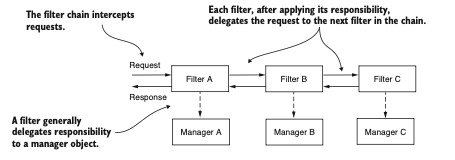

Tomemos una analogía como ejemplo. Cuando vas al aeropuerto, desde que entras en la terminal hasta 
que abordas la aeronave, pasas por múltiples filtros. Primero presentas tu boleto, luego se 
verifica tu pasaporte y posteriormente pasas por seguridad. En la puerta de embarque, podrían 
aplicarse más filtros. Por ejemplo, en algunos casos, justo antes de embarcar, se vuelve a verificar
tu pasaporte y visa. Esta es una excelente analogía para la cadena de filtros en Spring Security. 
De la misma manera, personalizas filtros en una cadena de filtros con Spring Security. Spring 
Security proporciona implementaciones de filtros que agregas a la cadena de filtros mediante 
personalización, pero también puedes definir filtros personalizados.

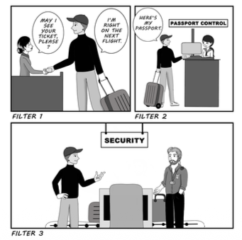

Este capítulo tratará cómo usar Spring Security para personalizar filtros que forman parte de la 
arquitectura de autenticación y autorización en una aplicación web. Por ejemplo, podrías querer 
mejorar la autenticación añadiendo un paso más para el usuario, como verificar su dirección de 
correo electrónico o usar una contraseña de un solo uso. También puedes añadir funcionalidades 
relacionadas con la auditoría de eventos de autenticación. Existen diversos escenarios en los que 
las aplicaciones utilizan la auditoría de autenticación, desde fines de depuración hasta la 
identificación del comportamiento de un usuario. La tecnología actual y los algoritmos de 
aprendizaje automático pueden mejorar las aplicaciones, por ejemplo, aprendiendo el comportamiento 
del usuario y detectando si alguien accedió a su cuenta sin autorización o suplantó su identidad.

Saber cómo personalizar la cadena de filtros HTTP es una habilidad valiosa. En la práctica, las  
aplicaciones tienen diversos requisitos para los cuales las configuraciones predeterminadas ya no 
son suficientes. Necesitarás añadir o reemplazar componentes existentes de la cadena. Con la 
implementación predeterminada, usas el método de autenticación HTTP Basic, que te permite basarte 
en un nombre de usuario y una contraseña. Sin embargo, en escenarios prácticos, hay muchas 
situaciones en las que necesitarás más. Tal vez necesites implementar una estrategia diferente de 
autenticación, notificar a un sistema externo sobre un evento de autorización o registrar una 
autenticación exitosa o fallida que se usará posteriormente para rastreo y auditoría. Sea cual sea 
tu caso, Spring Security te ofrece la flexibilidad de modelar la cadena de filtros exactamente como 
la necesitas.

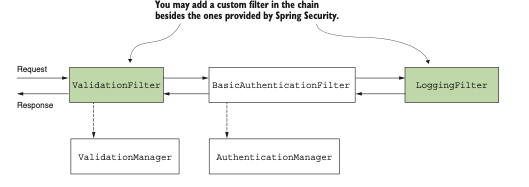

Tiene la opción de personalizar la cadena de filtros insertando nuevos filtros antes, después o en
lugar de los actuales. Al hacerlo, puede adaptar no solo el proceso de autenticación, sino también 
el tratamiento completo de las solicitudes y respuestas.

## 5.1 Implementación de filtros en la arquitectura de Spring Security

Esta sección analiza cómo funcionan los filtros y la cadena de filtros en la arquitectura de Spring
Security. Es necesario comprender esta visión general antes de abordar los ejemplos de 
implementación que se presentan en las siguientes secciones. En los capítulos 2 y 3, aprendimos que
el filtro de autenticación intercepta la solicitud y delega la responsabilidad de autenticación al 
gestor de autorización. Si deseamos ejecutar cierta lógica antes de la autenticación, lo hacemos 
insertando un filtro antes del filtro de autenticación.

Los filtros en la arquitectura de Spring Security son filtros HTTP típicos. Podemos crear filtros 
implementando la interfaz Filter del paquete jakarta.servlet. Al igual que con cualquier otro filtro
HTTP, es necesario sobrescribir el método `doFilter()` para implementar su lógica. Este método recibe 
como parámetros `ServletRequest`, `ServletResponse` y `FilterChain`:

- `ServletRequest`: Representa la solicitud HTTP. Se utiliza el objeto ServletRequest para obtener 
detalles sobre la solicitud.
- `ServletResponse`: Representa la respuesta HTTP. Se utiliza el objeto ServletResponse para modificar
la respuesta antes de enviarla de vuelta al cliente o seguir adelante en la cadena de filtros.
- `FilterChain`: Representa la cadena de filtros. Se utiliza el objeto FilterChain para pasar la 
solicitud al siguiente filtro en la cadena.

NOTA: A partir de Spring Boot 3, `Jakarta EE` reemplaza la antigua especificación `Java EE`. Debido a 
este cambio, observará que algunos paquetes han cambiado su prefijo de "javax" a "jakarta". Por 
ejemplo, tipos como `Filter, ServletRequest y ServletResponse` anteriormente estaban en el paquete 
`javax.servlet`, pero ahora se encuentran en el paquete `jakarta.servlet`.

La cadena de filtros representa una colección de filtros con un orden definido en el que actúan. 
Spring Security proporciona algunas implementaciones de filtros y su orden. Entre los filtros 
proporcionados se incluyen:

- `BasicAuthenticationFilter`: se encarga de la autenticación HTTP Basic, si está presente.
- `CsrfFilter`: se encarga de la protección contra falsificación de solicitudes entre sitios (CSRF), 
tema que se tratará en el capítulo 9.
- `CorsFilter`: se encarga de las reglas de autorización de intercambio de recursos de origen cruzado
(CORS), que también se analizarán en el capítulo 10.
No es necesario conocer todos los filtros, ya que probablemente no los modificará directamente en 
su código, pero sí debe comprender cómo funciona la cadena de filtros y estar al tanto de algunas 
implementaciones. En este libro, solo se explican los filtros esenciales para los diversos temas 
que se tratan.

Es importante entender que una aplicación no necesariamente tiene instancias de todos estos filtros
en la cadena. La longitud de la cadena depende de cómo configure la aplicación. Por ejemplo, en los 
capítulos 2 y 3 se aprendió que debe llamar al método httpBasic() de la clase HttpSecurity si desea 
usar el método de autenticación HTTP Basic. Lo que ocurre es que, al llamar a httpBasic(), se agrega
una instancia de BasicAuthenticationFilter a la cadena. De manera similar, según las configuraciones
que defina, se verá afectada la definición de la cadena de filtros.

Agrega un nuevo filtro a la cadena en relación con otro. O bien, puedes agregar un filtro antes, 
después o en la posición de un filtro conocido. Cada posición es, de hecho, un índice (un número), 
y también puede conocerse como "el orden".

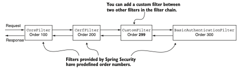

Cada filtro tiene un número de orden, que determina el orden en el que los filtros se aplican a una 
solicitud. Puedes agregar filtros personalizados junto con los filtros proporcionados por Spring 
Security.

Si desea obtener más información sobre los filtros que Spring Security proporciona y su orden de 
configuración, puede consultar el enum SecurityWebFiltersOrder, disponible en http://mng.bz/yZEG.

Puede agregar dos o más filtros en la misma posición. En la sección 5.4, encontraremos 
un caso común en el que esto puede ocurrir, uno que generalmente genera confusión entre los 
desarrolladores.

`NOTA`: Si varios filtros tienen la misma posición, el orden en el que se ejecutan no está definido.

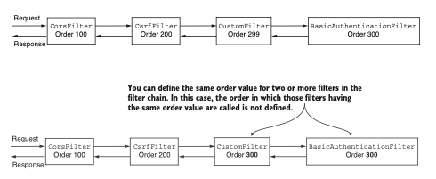

Puede haber múltiples filtros con el mismo valor de orden en la cadena. En este caso, Spring 
Security no garantiza el orden en el que se invocan.

## 5.2 Agregar un filtro antes de uno existente en la cadena

Esta sección trata sobre la aplicación de filtros HTTP personalizados antes de uno existente en la 
cadena de filtros. Puede encontrarse con escenarios en los que esto sea útil. Para abordar este 
problema de forma práctica, trabajaremos en un proyecto como ejemplo, y aprenderá a implementar 
fácilmente un filtro personalizado y aplicarlo antes de uno existente en la cadena de filtros. 
Luego podrá adaptar este ejemplo a cualquier requisito similar que encuentre en una aplicación de 
producción.

Para nuestra primera implementación de filtro personalizado, consideremos un escenario trivial. 
Queremos asegurarnos de que cada solicitud tenga un encabezado llamado Request-Id 
(ver proyecto ssia-ch5-ex1). Suponemos que nuestra aplicación utiliza este encabezado para rastrear 
solicitudes y que este encabezado es obligatorio. Simultáneamente, queremos validar estos supuestos
antes de que la aplicación realice la autenticación. El proceso de autenticación podría implicar 
consultas a la base de datos u otras acciones que consumen recursos que no queremos que la 
aplicación ejecute si el formato de la solicitud no es válido. ¿Cómo hacemos esto? Resolver este 
requisito actual solo toma dos pasos.

Implementar el filtro. Cree una clase `RequestValidationFilter` que verifique que el encabezado 
necesario exista en la solicitud.
Agregar el filtro a la cadena de filtros.  Hágalo en la clase de configuración, utilizando el bean 
`SecurityFilterChain`.

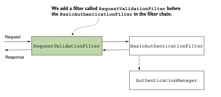

Para nuestro ejemplo, agregamos un `RequestValidationFilter`, que actúa antes del filtro de 
autenticación. El `RequestValidationFilter` asegura que no se realice la autenticación si la 
validación de la solicitud falla. En nuestro caso, la solicitud debe tener un encabezado obligatorio
llamado Request-Id.

Para completar el paso 1 —implementar el filtro—, definimos un filtro personalizado. La siguiente 
lista muestra la implementación.

Implementación de un filtro personalizado:
```java
public class RequestValidationFilter
implements Filter { //Para definir un filtro, esta clase implementa la interfaz Filter y sobrescribe 
                    // el metodo doFilter().
    @Override
    public void doFilter(
            ServletRequest servletRequest,
            ServletResponse servletResponse,
            FilterChain filterChain)
            throws IOException, ServletException {
// ...
    }
}
```
Dentro del método doFilter(), escribimos la lógica del filtro. En nuestro ejemplo, verificamos si 
existe el encabezado Request-Id. Si existe, reenviamos la solicitud al siguiente filtro en la 
cadena llamando al método doFilter(). Si el encabezado no existe, establecemos un estado HTTP 400 
Bad Request en la respuesta sin reenviarla al siguiente filtro en la cadena.

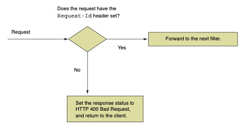

El filtro personalizado que agregamos antes de la autenticación verifica si existe el encabezado 
Request-Id. Si el encabezado está presente en la solicitud, la aplicación reenvía la solicitud para
ser autenticada. Si el encabezado no existe, la aplicación establece el estado HTTP 400 Bad Request
y devuelve la respuesta al cliente.

Implementación de la lógica en el método doFilter():
```java
@Override
public void doFilter(
    ServletRequest request,
    ServletResponse response,
    FilterChain filterChain)
        throws IOException,
            ServletException {
    var httpRequest = (HttpServletRequest) request;
    var httpResponse = (HttpServletResponse) response;
    String requestId = httpRequest.getHeader("Request-Id");
    if (requestId == null || requestId.isBlank()) {
        httpResponse.setStatus(HttpServletResponse.SC_BAD_REQUEST);
        return; //Si el encabezado está ausente, el estado HTTP cambia a 400 Bad Request, y la 
        // solicitud no se reenvía al siguiente filtro en la cadena.
    }
    //Si el encabezado existe, la solicitud se reenvía al siguiente filtro en la cadena.
    filterChain.doFilter(request, response);
}    
```
Para implementar el paso 2, aplicando el filtro dentro de la clase de configuración, utilizamos el 
método `addFilterBefore()` del objeto `HttpSecurity` porque queremos que la aplicación ejecute este 
filtro personalizado antes de la autenticación. Este método recibe dos parámetros:

- Una instancia del filtro personalizado que deseamos agregar a la cadena; en nuestro ejemplo, se 
trata de una instancia de la clase `RequestValidationFilter`.
- El tipo de filtro antes del cual agregamos la nueva instancia; en este caso, dado que el 
requisito es ejecutar la lógica del filtro antes de la autenticación, necesitamos agregar nuestra 
instancia personalizada antes del filtro de autenticación. La clase `BasicAuthenticationFilter` 
define el tipo predeterminado del filtro de autenticación.

Hasta ahora, nos hemos referido al filtro que maneja la autenticación generalmente como el filtro 
de autenticación. En los próximos capítulos descubrirás que Spring Security también configura otros
filtros. En el capítulo 9 discutiremos la protección contra falsificación de solicitudes entre 
sitios (CSRF), y en el capítulo 10 hablaremos sobre el intercambio de recursos de origen cruzado 
(CORS). Ambas funcionalidades también dependen de filtros.

La siguiente lista muestra cómo agregar el filtro personalizado antes del filtro de autenticación 
en la clase de configuración. Para simplificar el ejemplo, usamos el método `permitAll()` para 
permitir todas las solicitudes no autenticadas.

Configuración del filtro personalizado antes de la autenticación:
```java
@Configuration
public class ProjectConfig {
    @Bean
    public SecurityFilterChain securityFilterChain(HttpSecurity http)
            throws Exception {
        //Agrega una instancia del filtro personalizado antes del filtro de autenticación en la 
        // cadena de filtros.
        http.addFilterBefore(
                new RequestValidationFilter(), BasicAuthenticationFilter.class)
                .authorizeRequests(c -> c.anyRequest().permitAll());
        return http.build();
    }
}
```
También necesitamos una clase controladora y un punto final para probar la funcionalidad. La 
siguiente lista define la clase controladora.

La clase Controller:
```java
@RestController
public class HelloController {
    @GetMapping("/hello")
    public String hello() {
        return "Hello!";
    }
}
```
Ahora puedes ejecutar y probar la aplicación. Llamar al punto final sin el encabezado genera una 
respuesta con el estado HTTP 400 Bad Request. Si agregas el encabezado a la solicitud, el estado 
de la respuesta cambia a HTTP 200 OK, y también verás el cuerpo de la respuesta, ¡Hola! Para llamar
al punto final sin el encabezado Request-Id, usamos este comando cURL:

`curl -v http://localhost:8080/hello`

Esta llamada genera la siguiente respuesta (truncada):

...
< HTTP/1.1 400
...

Para llamar al punto final y proporcionar el encabezado Request-Id, usamos este comando cURL:

curl -H "Request-Id:12345" http://localhost:8080/hello

Esta llamada genera el siguiente cuerpo de respuesta:

¡Hello!

## 5.3 Agregar un filtro después de uno existente en la cadena

Esta sección ilustra cómo agregar un filtro después de uno existente en la cadena de filtros. Este 
enfoque se utiliza cuando se desea ejecutar cierta lógica después de algo ya existente en la cadena
de filtros. Supongamos que debe ejecutar cierta lógica después del proceso de autenticación. 
Ejemplos de esto podrían ser notificar a un sistema diferente tras ciertos eventos de autenticación
o simplemente para fines de registro y trazabilidad. Como en la sección 5.1, implementamos un 
ejemplo para mostrar cómo hacerlo. Puede adaptarlo a sus necesidades para un escenario del mundo real.

Para nuestro ejemplo, registramos todos los eventos de autenticación exitosa agregando un filtro 
después del filtro de autenticación (figura 5.8). Consideramos que lo que pasa por el filtro de 
autenticación representa un evento de autenticación exitosa, y queremos registrarlo. Continuando 
con el ejemplo de la sección 5.1, también registramos el ID de solicitud recibido a través del 
encabezado HTTP.

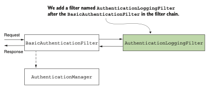

Agregamos el AuthenticationLoggingFilter después del BasicAuthenticationFilter para registrar las 
solicitudes que la aplicación autentica.

La siguiente lista presenta la definición de un filtro que registra las solicitudes que pasan por 
el filtro de autenticación.

Definición de un filtro para registrar solicitudes:
```java
public class AuthenticationLoggingFilter implements Filter {
    private final Logger logger = Logger.getLogger(
            AuthenticationLoggingFilter.class.getName());
    @Override
    public void doFilter(
        ServletRequest request,
        ServletResponse response,
        FilterChain filterChain)
            throws IOException, ServletException {
            var httpRequest = (HttpServletRequest) request;
            //Obtiene el ID de solicitud de los encabezados de la solicitud
            var requestId =
            httpRequest.getHeader("Request-Id");
            //Registra el evento con el valor del ID de solicitud
            logger.info("Successfully authenticated request with id " + requestId);
            //Reenvía la solicitud al siguiente filtro en la cadena
            filterChain.doFilter(request, response);
    }
}
```
Para agregar el filtro personalizado en la cadena después del filtro de autenticación, se llama 
al método addFilterAfter() de HttpSecurity. La siguiente lista muestra la implementación.

Agregar un filtro personalizado después de uno existente en la cadena de filtros:
```java
@Configuration
public class ProjectConfig {
    @Bean
    public SecurityFilterChain securityFilterChain(HttpSecurity http) throws Exception {
        http.addFilterBefore(
                new RequestValidationFilter(),
                BasicAuthenticationFilter.class)
            .addFilterAfter(
                new AuthenticationLoggingFilter(),
                BasicAuthenticationFilter.class)
            .authorizeRequests(c -> c.anyRequest().permitAll());
        return http.build();
    }
}
```
Después de ejecutar la aplicación y llamar al punto final, observamos que por cada llamada exitosa
al punto final, la aplicación imprime una línea de registro en la consola. Para la llamada

`curl -H "Request-Id:12345" http://localhost:8080/hello`

el cuerpo de la respuesta es:

¡Hello!

En la consola, se puede ver una línea similar a:

INFO 5876 --- [nio-8080-exec-2] 
[CA]c.l.s.f.AuthenticationLoggingFilter: 
[CA]Successful authenticated request with id 12345

Añadir un filtro en la ubicación de otro en la cadena
Esta sección trata sobre la adición de un filtro en la ubicación de otro en la cadena de filtros.
Este enfoque puede utilizarse especialmente cuando se proporciona una implementación diferente para
una responsabilidad que ya es asumida por uno de los filtros conocidos por Spring Security. Un 
escenario típico es la autenticación.
Supongamos que, en lugar del flujo de autenticación HTTP Basic, deseas implementar algo diferente. 
En lugar de usar un nombre de usuario y una contraseña como credenciales de entrada en función de 
las cuales la aplicación autentica al usuario, necesitas aplicar otro enfoque. Algunos ejemplos de
escenarios que podrías encontrar son:

- Identificación basada en un valor estático de cabecera para autenticación
- Uso de una clave simétrica para firmar la solicitud con fines de autenticación
- Uso de una contraseña de un solo uso (OTP) en el proceso de autenticación 

En nuestro primer escenario (identificación basada en una clave estática para autenticación), el 
cliente envía una cadena de texto a la aplicación en la cabecera de la solicitud HTTP, que siempre
es la misma. La aplicación almacena estos valores en algún lugar, muy probablemente en una base de 
datos o en un almacén de secretos. A partir de este valor estático, la aplicación identifica al 
cliente.
Este enfoque (figura 5.9) ofrece una seguridad débil en cuanto a autenticación, pero arquitectos 
y desarrolladores a menudo lo eligen en llamadas entre aplicaciones backend por su simplicidad. 
Las implementaciones también se ejecutan rápidamente porque no necesitan realizar cálculos 
complejos, como en el caso de aplicar una firma criptográfica. De esta manera, las claves estáticas
utilizadas para autenticación representan un compromiso en el que los desarrolladores confían más 
en el nivel de infraestructura en términos de seguridad y, al mismo tiempo, no dejan los puntos 
finales completamente desprotegidos.

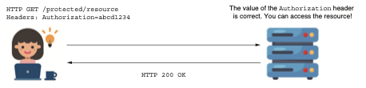

La solicitud contiene una cabecera con el valor de la clave estática. Si este valor coincide con el
conocido por la aplicación, esta acepta la solicitud.

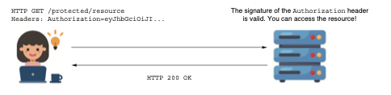

El encabezado Authorization contiene un valor cifrado con una clave compartida entre el cliente y 
el servidor (o cifrado con una clave privada para la cual el servidor posee la clave pública 
correspondiente).
Si la aplicación verifica que la firma es válida, permite que la solicitud continúe.

Finalmente, para nuestro tercer escenario, usar una contraseña de un solo uso (OTP) en el proceso 
de autenticación, el usuario recibe la OTP mediante un mensaje o utilizando una aplicación de 
proveedor de autenticación como Google Authenticator. 

Finalmente, para nuestro tercer escenario, usar una contraseña de un solo uso (OTP) en el proceso 
de autenticación, el usuario recibe la OTP mediante un mensaje o utilizando una aplicación de 
proveedor de autenticación como Google Authenticator. 

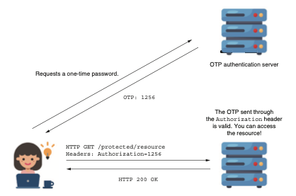

Para acceder al recurso, el cliente debe utilizar una contraseña de un solo uso (OTP). Esta OTP se 
obtiene de un servidor de autenticación externo. Por lo general, las aplicaciones emplean este 
método en procesos de inicio de sesión que requieren autenticación multifactor.

Implementemos un ejemplo para demostrar cómo aplicar un filtro personalizado. Para mantener el caso 
relevante pero sencillo, nos enfocamos en la configuración y consideramos una lógica simple para 
la autenticación. En nuestro escenario, tenemos el valor de una clave estática, que es el mismo 
para todas las solicitudes. Para ser autenticado, el usuario debe agregar el valor correcto de la
clave estática en el encabezado Authorization, como se muestra en la figura 5.12. Puede encontrar 
el código de este ejemplo en el proyecto ssia-ch5-ex2.

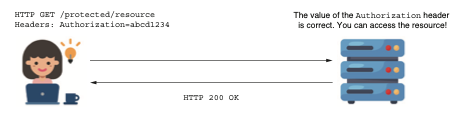

Comenzamos implementando la clase del filtro, denominada `StaticKeyAuthenticationFilter`. Esta 
clase lee el valor de la clave estática desde el archivo de propiedades y verifica si el valor del 
encabezado Authorization es igual a este. Si los valores coinciden, el filtro reenvía la solicitud 
al siguiente componente en la cadena de filtros.
Si no coinciden, el filtro establece el valor 401 Unauthorized en el estado HTTP de la respuesta 
sin reenviar la solicitud en la cadena de filtros. La siguiente lista define la clase 
`StaticKeyAuthenticationFilter`.

La definición de la clase `StaticKeyAuthenticationFilter` es la implementación de un filtro 
personalizado en Spring Security que se encarga de autenticar las solicitudes mediante una clave 
estática. Este filtro lee el valor esperado de la clave desde un archivo de configuración, lo 
compara con el valor proporcionado en el encabezado Authorization de la solicitud HTTP, y si 
coinciden, permite que la solicitud continúe en la cadena de filtros. En caso contrario, devuelve
un estado `HTTP 401 (Unauthorized)` sin avanzar en la cadena.

La definición de la clase `StaticKeyAuthenticationFilter`:
```java
//Para permitirnos inyectar valores desde el archivo de propiedades, se agrega una instancia de 
// la clase en el contexto de Spring.
@Component
public class StaticKeyAuthenticationFilter
    //Define la lógica de autenticación implementando la interfaz Filter y sobrescribiendo el 
        // metodo doFilter().
implements Filter {
    //Obtiene el valor de la clave estática desde el archivo de propiedades utilizando la 
    // anotación @Value.
    @Value("${authorization.key}")
    private String authorizationKey;//Obtiene el valor del encabezado Authorization de la solicitud 
    // para compararlo con la clave estática.

    @Override
    public void doFilter(ServletRequest request,
                         ServletResponse response,
                         FilterChain filterChain)
            throws IOException, ServletException {
        var httpRequest = (HttpServletRequest) request;
        var httpResponse = (HttpServletResponse) response;
        String authentication =
                httpRequest.getHeader("Authorization");
        if (authorizationKey.equals(authentication)) {
            filterChain.doFilter(request, response);
        } else {
            httpResponse.setStatus(
                    HttpServletResponse.SC_UNAUTHORIZED);
        }
    }
}
```
Una vez que definimos el filtro, lo agregamos a la cadena de filtros en la posición de la clase 
`BasicAuthenticationFilter` utilizando el método `addFilterAt()`.

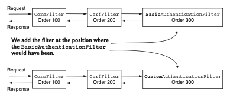

Agregamos nuestro filtro de autenticación personalizado en la ubicación donde se habría colocado la
clase `BasicAuthenticationFilter` si estuviéramos utilizando la autenticación HTTP Basic. Esto 
significa que nuestro filtro personalizado tiene el mismo valor de orden.

Pero recuerda lo que discutimos en la sección 5.1. Al agregar un filtro en una posición específica,
Spring Security no asume que sea el único filtro en esa posición. Podrías agregar más filtros en 
la misma ubicación de la cadena. En este caso, Spring Security no garantiza el orden en el que 
actuarán. Repito esto porque he visto a muchas personas confundidas sobre cómo funciona. Algunos 
desarrolladores piensan que cuando aplicas un filtro en la posición de uno conocido, este será 
reemplazado. ¡Este no es el caso! Debemos asegurarnos de no agregar filtros que no necesitemos.

`NOTA` Te aconsejo que no agregues múltiples filtros en la misma posición de la cadena.  Cuando 
agregas más filtros en la misma ubicación, el orden en el que se utilizan no está definido. Tiene 
sentido tener un orden definido en el que se llamen los filtros. Tener un orden conocido hace que 
tu aplicación sea más fácil de entender y mantener.

Puedes encontrar la definición de la clase de configuración que agrega el filtro. Observa que aquí 
no llamamos al método `httpBasic()` de la clase `HttpSecurity` porque no queremos que la instancia
de `BasicAuthenticationFilter` se agregue a la cadena de filtros.

Agregar el filtro en la clase de configuración:
```java
@Configuration
public class ProjectConfig {
    //Inyecta la instancia del filtro desde el contexto de Spring
    private final StaticKeyAuthenticationFilter filter;
    // omitted constructor
    @Bean
    public SecurityFilterChain securityFilterChain(HttpSecurity http)
            throws Exception {
        //Agrega el filtro en la posición del filtro de autenticación básica en la cadena de filtros
        http.addFilterAt(filter,
                        BasicAuthenticationFilter.class)
                .authorizeRequests(c -> c.anyRequest().permitAll());
        return http.build();
    }    
}
```
Para probar la aplicación, también necesitamos un punto de acceso `(endpoint)`. Para ello, definimos 
un controlador, como en el listado 5.4. Debes agregar un valor para la clave estática en el 
servidor en el archivo application.properties, como se muestra en:

`authorization.key=SD9cICjl1e`

`NOTA` Nunca es una buena idea almacenar contraseñas, claves ni ningún otro dato que no deba ser 
visto por todos en un archivo de propiedades para una aplicación en producción.  En nuestros 
ejemplos, usamos este enfoque por simplicidad y para que puedas centrarte en las configuraciones 
de Spring Security que realizamos. Pero en escenarios reales, asegúrate de usar un almacén de 
secretos `(secrets vault)` para almacenar este tipo de información.

Ya podemos probar la aplicación. Se espera que la aplicación permita las solicitudes que tengan el 
valor correcto en la cabecera Authorization y rechace las demás, devolviendo un estado `HTTP 401 
Unauthorized` en la respuesta. Los fragmentos de código siguientes muestran las llamadas curl 
utilizadas para probar la aplicación. Si usas el mismo valor configurado en el servidor para la 
cabecera Authorization, la llamada será exitosa y verás el cuerpo de la respuesta, Hello! La 
llamada

`curl -H "Authorization:SD9cICjl1e" http://localhost:8080/hello`

devuelve este cuerpo de respuesta:

Hello!

Con la siguiente llamada, si la cabecera Authorization está ausente o es incorrecta, el estado de 
la respuesta será `HTTP 401 Unauthorized`:

`curl -v http://localhost:8080/hello`

El estado de la respuesta es

...
`< HTTP/1.1 401`
...

En este caso, como no configuramos un UserDetailsService, Spring Boot lo configura automáticamente,
como aprendiste en el capítulo 2. Pero en nuestro escenario, no necesitas un UserDetailsService en 
absoluto porque el concepto de usuario no existe. Solo validamos que quien solicita acceder a un 
punto de acceso en el servidor conozca un valor determinado. Los escenarios de aplicación 
normalmente no son tan simples y a menudo requieren un UserDetailsService. Sin embargo, si prevés o
tienes un caso en el que este componente no es necesario, puedes desactivar la autoconfiguración. 
Para desactivar la configuración predeterminada de UserDetailsService, puedes usar el atributo 
exclude de la anotación @SpringBootApplication en la clase principal:
```java
@SpringBootApplication
(exclude = {UserDetailsServiceAutoConfiguration.class })
```

## 5.5 Implementaciones de filtros proporcionadas por Spring Security

Esta sección analiza las clases proporcionadas por Spring Security que implementan la interfaz 
Filter. En los ejemplos, definimos el filtro implementando esta interfaz directamente. Spring 
Security ofrece algunas clases abstractas que implementan la interfaz Filter y que puedes extender 
para tus definiciones de filtro. Estas clases también añaden funcionalidad de la cual se pueden 
beneficiar tus implementaciones al extenderlas. Por ejemplo, puedes extender la clase 
`GenericFilterBean`, que permite usar parámetros de inicialización que definirías en un archivo 
descriptor `web.xml` cuando sea aplicable. Una clase más útil que extiende `GenericFilterBean` es 
`OncePerRequestFilter`. Al agregar un filtro a la cadena, el framework no garantiza que se llame solo
una vez por solicitud. `OncePerRequestFilter`, como su nombre indica, implementa una lógica para 
asegurar que el método `doFilter()` del filtro se ejecute solo una vez por solicitud.

Si necesitas dicha funcionalidad en tu aplicación, utiliza las clases que Spring proporciona. Sin 
embargo, si no las necesitas, siempre recomiendo mantener las implementaciones lo más simples 
posible. Con demasiada frecuencia he visto desarrolladores extender la clase GenericFilterBean en 
lugar de implementar directamente la interfaz Filter, en funcionalidades que no requieren la lógica
personalizada que añade `GenericFilterBean`. Cuando se les pregunta por qué, parece que no lo saben; 
probablemente copiaron la implementación tal como la encontraron en ejemplos de la web.

Para dejarlo completamente claro, veamos un ejemplo. La funcionalidad de registro (logging) que 
implementamos en la sección 5.3 es un excelente candidato para usar `OncePerRequestFilter`. Queremos 
evitar registrar la misma solicitud varias veces. Spring Security no garantiza que el filtro no se 
llame más de una vez, por lo que debemos encargarnos de esto nosotros mismos. La forma más sencilla
es implementar el filtro usando la clase `OncePerRequestFilter`. He escrito esto en un proyecto 
separado llamado ssia-ch5-ex3.

Encontrarás el cambio que hice en la clase `AuthenticationLoggingFilter`. En lugar
de implementar directamente la interfaz Filter, como en el ejemplo de la sección 5.3, ahora 
extiende la clase `OncePerRequestFilter`. El método que anulamos aquí es `doFilterInternal()`. Puedes 
encontrar este código en el proyecto ssia-ch5-ex3.

Extender la clase OncePerRequestFilter:
```java
public class AuthenticationLoggingFilter
    //En lugar de implementar la interfaz Filter, extiende la clase OncePerRequestFilter.
extends OncePerRequestFilter {
private final Logger logger =
Logger.getLogger(
AuthenticationLoggingFilter.class.getName());
    @Override
    //Sobrescribe doFilterInternal(), que reemplaza la función del metodo doFilter() de la 
    // interfaz Filter.
    protected void doFilterInternal(
            //La clase OncePerRequestFilter solo admite filtros HTTP. Es por eso que los parámetros
            // se proporcionan directamente como HttpServletRequest y HttpServletResponse.
            HttpServletRequest request,
            HttpServletResponse response,
            FilterChain filterChain) throws
            ServletException, IOException {
        String requestId = request.getHeader("Request-Id");
        logger.info("Successfully authenticated request with id " +
                requestId);
        filterChain.doFilter(request, response);
    }
}
```
Algunas observaciones breves sobre la clase `OncePerRequestFilter` que podrían serte útiles:

- Solo admite solicitudes HTTP, pero en realidad esto es lo que siempre usamos. La ventaja es que 
realiza la conversión de tipos automáticamente, y recibimos directamente las solicitudes como 
HttpServletRequest y HttpServletResponse. Recuerda que, con la interfaz Filter, debíamos hacer la 
conversión manualmente.

- Puedes implementar lógica para decidir si el filtro se aplica o no. Aunque hayas agregado el 
filtro a la cadena, puedes determinar que no se aplique a ciertas solicitudes. Esto se configura 
sobrescribiendo el método `shouldNotFilter(HttpServletRequest)`. Por defecto, el filtro se aplica a 
todas las solicitudes.

- Por defecto, un `OncePerRequestFilter` no se aplica a solicitudes asíncronas ni a solicitudes de 
despacho de errores. Puedes cambiar este comportamiento sobrescribiendo los métodos 
`shouldNotFilterAsyncDispatch()` y `shouldNotFilterErrorDispatch()`.

Si encuentras útil alguna de estas características del `OncePerRequestFilter` en tu implementación, 
te recomiendo usar esta clase para definir tus filtros.

Resumen

- La primera capa de la arquitectura de una aplicación web, que intercepta las solicitudes HTTP, 
es una cadena de filtros. Al igual que otros componentes de la arquitectura de Spring Security, 
puedes personalizarla según tus necesidades.

- Puedes personalizar la cadena de filtros añadiendo nuevos filtros antes, después o en la posición
de un filtro existente.

- Puedes tener múltiples filtros en la misma posición de un filtro existente. En ese caso, el orden
en que se ejecutan no está definido.

- Modificar la cadena de filtros te ayuda a personalizar la autenticación y autorización según los 
requisitos de tu aplicación.