# Implementing authentications

### `Este capítulo cubre`
- Implementación de la lógica de autenticación utilizando un AuthenticationProvider personalizado
- Uso de los métodos de autenticación HTTP Basic y login basado en formularios
- Comprensión y gestión del SecurityContext component

Los capítulos 3 y 4 cubrieron algunos de los componentes que intervienen en el flujo de 
autenticación. Se analizó `UserDetails` y cómo definir el prototipo para describir un usuario en 
Spring Security. A continuación, se utilizó `UserDetails` en ejemplos que mostraron cómo funcionan 
los contratos `UserDetailsService` y `UserDetailsManager`, y cómo implementarlos. También se 
discutieron y usaron en ejemplos las principales implementaciones de estas interfaces. Finalmente,
aprendiste cómo un `PasswordEncoder` gestiona las contraseñas, cómo usarlo, así como el módulo de 
criptografía de Spring Security (SSCM) con sus encriptadores y generadores de claves.

La capa `AuthenticationProvider`, sin embargo, es la responsable de la lógica de autenticación. 
Es en `AuthenticationProvider` donde se encuentran las condiciones e instrucciones que deciden si 
autenticar una solicitud. El componente que delega esta responsabilidad al `AuthenticationProvider` 
es el `AuthenticationManager`, que recibe la solicitud desde la capa de filtros HTTP, y fue discutido
en el capítulo 5. En este capítulo, veremos el proceso de autenticación, que tiene solo dos 
resultados posibles:

- La entidad que realiza la solicitud no está autenticada. El usuario no es reconocido, y la 
aplicación rechaza la solicitud sin pasar al proceso de autorización. Por lo general, el estado de 
respuesta enviado al cliente en este caso es HTTP 401 Unauthorized.

- La entidad que realiza la solicitud está autenticada. Los detalles sobre el solicitante se 
almacenan para que la aplicación los pueda usar en la autorización. Como descubrirás en este 
capítulo, SecurityContext es el encargado de almacenar los detalles respecto a la solicitud 
autenticada actual.

Para recordarte los actores y los enlaces entre ellos, la figura 6.1 muestra el diagrama que ya 
vimos en el capítulo 2.

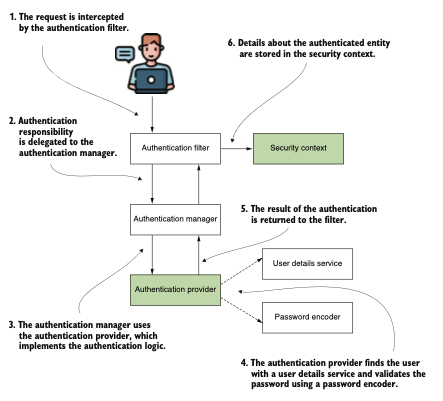

El flujo de autenticación en Spring Security. Este proceso describe el método mediante el cual la
aplicación reconoce a la persona que realiza una solicitud. Los elementos que son el foco de este
capítulo están resaltados. En este contexto, `AuthenticationProvider` es responsable de llevar a 
cabo el procedimiento de autenticación, y `SecurityContext` conserva la información relacionada con 
la solicitud que ha sido autenticada.

Este capítulo cubre las partes restantes del flujo de autenticación (los cuadros sombreados). 
Luego, en los capítulos 7 y 8, aprenderás cómo funciona la autorización, que es el proceso que 
sigue a la autenticación en la solicitud HTTP. Primero, necesitamos discutir cómo implementar la 
interfaz `AuthenticationProvider`. Debes saber cómo entiende Spring Security una solicitud en el 
proceso de autenticación.

Para mostrar una descripción clara de cómo representar una solicitud de autenticación, 
comenzaremos con la interfaz `Authentication`. Una vez que la discutamos, podremos avanzar y 
observar qué sucede con los detalles de una solicitud tras una autenticación exitosa. Entonces 
podremos discutir la interfaz `SecurityContext` y la forma en que Spring Security la gestiona. Cerca 
del final del capítulo, aprenderás cómo personalizar el método de autenticación HTTP Basic. También
discutiremos otra opción de autenticación que puede usarse en nuestras aplicaciones: el inicio de 
sesión basado en formularios.

## 6.1 Comprendiendo el AuthenticationProvider

En aplicaciones empresariales, podrías encontrarte en una situación en la que la implementación 
predeterminada de autenticación basada en nombre de usuario y contraseña no sea aplicable. Además, 
en cuanto a la autenticación, tu aplicación puede requerir la implementación de varios escenarios 
Por ejemplo, podrías querer que el usuario pueda comprobar su identidad usando un código recibido 
por mensaje SMS o mostrado por una aplicación específica. O podrías necesitar implementar 
escenarios de autenticación en los que el usuario deba proporcionar un tipo determinado de clave 
almacenada en un archivo. Incluso podrías necesitar usar una representación de la huella dactilar 
del usuario para implementar la lógica de autenticación. El propósito de un framework es ser lo 
suficientemente flexible para permitirte implementar cualquiera de estos escenarios.

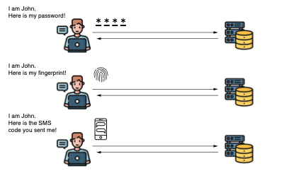

Una aplicación puede requerir varios métodos de implementación de autenticación. Aunque un nombre 
de usuario y una contraseña son suficientes para la mayoría de las situaciones, existen casos en 
los que el proceso de autenticación de un usuario puede ser más complejo.

Un framework generalmente proporciona un conjunto de las implementaciones más utilizadas, pero, 
por supuesto, no puede cubrir todas las opciones posibles. En el caso de Spring Security, puedes 
usar el contrato `AuthenticationProvider` para definir cualquier lógica de autenticación 
personalizada. En esta sección, aprenderás a representar el evento de autenticación implementando 
la interfaz `Authentication` y luego crearás tu lógica de autenticación personalizada con un 
`AuthenticationProvider`. Para alcanzar nuestro objetivo:

- En la sección 6.1.1, analizamos cómo Spring Security representa el evento de autenticación.
- En la sección 6.1.2, discutimos el contrato `AuthenticationProvider`, que es responsable de la 
lógica de autenticación.
- En la sección 6.1.3, escribirás una lógica de autenticación personalizada implementando el 
contrato `AuthenticationProvider` en un ejemplo.

### 6.1.1 Representando la solicitud durante la autenticación.

Esta sección analiza cómo Spring Security entiende una solicitud durante el proceso de 
autenticación. Es importante abordar esto antes de adentrarse en la implementación de una lógica 
de autenticación personalizada. Como aprenderás en la sección 6.1.2, para implementar un 
`AuthenticationProvider` personalizado, primero necesitas entender cómo describir el evento de 
autenticación. Aquí, veremos el contrato que representa la autenticación y discutiremos los métodos 
que debes conocer.

`Authentication` es una de las interfaces esenciales involucradas en el proceso con el mismo nombre. 
La interfaz `Authentication` representa el evento de solicitud de autenticación y contiene los 
detalles de la entidad que solicita acceso a la aplicación. Puedes usar la información relacionada 
con el evento de solicitud de autenticación durante y después del proceso de autenticación. El 
usuario que solicita acceso a la aplicación se denomina principal. Si alguna vez has usado Java 
Security en alguna aplicación, probablemente sepas que una interfaz llamada Principal representa el
mismo concepto. La interfaz `Authentication` de Spring Security extiende este contrato.

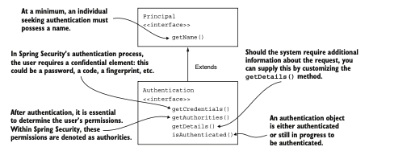

El contrato `Authentication` extiende el contrato Principal. Introduce estipulaciones adicionales, 
como la necesidad de una contraseña o la opción de proporcionar más detalles sobre la solicitud de 
autenticación. Ciertos aspectos, como el conjunto de autoridades, son específicos de Spring Security. 

El contrato `Authentication` en Spring Security no solo representa un principal, sino que también 
agrega información sobre si el proceso de autenticación ha finalizado, así como una colección de 
autoridades. El hecho de que este contrato haya sido diseñado para extender el contrato Principal 
de Java Security es una ventaja en términos de compatibilidad con implementaciones de otros 
frameworks y aplicaciones. Esta flexibilidad permite migraciones más sencillas a Spring Security
desde aplicaciones que implementan la autenticación de otra forma. Descubramos más sobre el diseño
de la interfaz `Authentication` en el siguiente listado.

The Authentication interface as declared in Spring Security:
```java
public interface Authentication extends Principal, Serializable {
    Collection<? extends GrantedAuthority> getAuthorities();
    Object getCredentials();
    Object getDetails();
    Object getPrincipal();
    boolean isAuthenticated();
    void setAuthenticated(boolean isAuthenticated)
        throws IllegalArgumentException;
}
```
Por el momento, los únicos métodos de este contrato que necesitas conocer son los siguientes:

- `isAuthenticated()`: Devuelve true si el proceso de autenticación ha finalizado o false si aún 
está en curso.
- `getCredentials()`: Devuelve la contraseña o cualquier secreto utilizado en el proceso de 
autenticación.
- `getAuthorities()`: Devuelve una colección de autoridades concedidas para la solicitud autenticada.

Los demás métodos del contrato `Authentication` se tratarán en capítulos posteriores, según 
corresponda a las implementaciones analizadas.

### 6.1.2 Implementando lógica de autenticación personalizada.

Esta sección trata sobre la implementación de lógica de autenticación personalizada. Analizamos el 
contrato de Spring Security relacionado con esta responsabilidad para comprender su definición. 
Con estos detalles, puedes implementar una lógica de autenticación personalizada con un ejemplo 
de código en la sección 6.1.3.

El `AuthenticationProvider` en Spring Security se encarga de la lógica de autenticación. 
La implementación predeterminada de la interfaz `AuthenticationProvider` delega la responsabilidad 
de encontrar al usuario del sistema en un `UserDetailsService`. También utiliza el `PasswordEncoder` 
para la gestión de contraseñas en el proceso de autenticación. El siguiente listado muestra la 
definición de `AuthenticationProvider`, que necesitas para definir un proveedor de autenticación 
personalizado para tu aplicación.

The AuthenticationProvider interface:
```java
public interface AuthenticationProvider {
    Authentication authenticate(Authentication authentication)
        throws AuthenticationException;
    boolean supports(Class<?> authentication);
}
```
La responsabilidad de `AuthenticationProvider` está estrechamente ligada al contrato `Authentication`. 
El método `authenticate()` recibe un objeto Authentication como parámetro y devuelve un objeto 
`Authentication`. Implementamos el método `authenticate()` para definir la lógica de autenticación. 
A continuación, se resume brevemente cómo debes implementar el método `authenticate()`:

- El método debe lanzar una excepción `AuthenticationException` si la autenticación falla.
- Si el método recibe un objeto de autenticación no soportado por tu implementación de 
`AuthenticationProvider`, entonces debe devolver null. De esta forma, es posible utilizar múltiples 
tipos de `Authentication` separados a nivel de filtro HTTP.
El método debe devolver una instancia de `Authentication` que represente un objeto completamente 
autenticado. Para esta instancia, el método `isAuthenticated()` devuelve true, y contiene todos los 
detalles necesarios sobre la entidad autenticada. Normalmente, la aplicación también elimina datos 
sensibles, como la contraseña, de esta instancia. Después de una autenticación exitosa, ya no se 
requiere la contraseña, y mantener estos detalles podría exponerlos a miradas no deseadas.
- El segundo método en la interfaz `AuthenticationProvider` es `supports(Class<?> authentication)`. 
Puedes implementar este método para que devuelva true si el `AuthenticationProvider` actual soporta 
el tipo proporcionado como objeto `Authentication`. Observa que, incluso si este método devuelve true
para un objeto, aún existe la posibilidad de que el método `authenticate()` rechace la solicitud 
devolviendo null. Spring Security está diseñado para ser más flexible, permitiendo que los 
usuarios implementen un `AuthenticationProvider` que pueda rechazar una solicitud de autenticación 
basándose en sus detalles, y no solo en su tipo. 

Una analogía de cómo el gestor de autenticación y el proveedor de autenticación trabajan juntos 
para validar o invalidar una solicitud de autenticación es tener una cerradura más compleja para 
tu puerta. Puedes abrir esta cerradura usando ya sea una tarjeta o una llave física tradicional. 
La cerradura en sí es el gestor de autenticación, que decide si se abre la puerta. Para tomar esa 
decisión, delega en los dos proveedores de autenticación: uno que sabe cómo validar la tarjeta y 
otro que sabe cómo verificar la llave física. Si presentas una tarjeta para abrir la puerta, 
el proveedor de autenticación que solo trabaja con llaves físicas indica que no conoce este tipo 
de autenticación. Sin embargo, el otro proveedor sí soporta este tipo de autenticación y verifica 
si la tarjeta es válida para la puerta. Esta es la finalidad de los métodos supports(). 

Además de comprobar el tipo de autenticación, Spring Security añade una capa más de flexibilidad. 
La cerradura de la puerta puede reconocer varios tipos de tarjetas. En este caso, cuando presentas 
una tarjeta, uno de los proveedores de autenticación podría decir: "Entiendo que esto es una 
tarjeta. ¡Pero no es el tipo de tarjeta que puedo validar!". Esto ocurre cuando supports() devuelve
true pero authenticate() devuelve null.

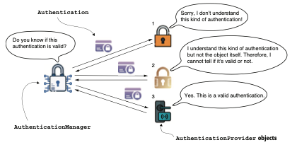

El `AuthenticationManager` delega en uno de los proveedores de autenticación disponibles. El 
`AuthenticationProvider` podría no soportar el tipo de autenticación proporcionado. Sin embargo, si 
sí soporta el tipo de objeto, podría no saber cómo autenticar ese objeto específico. La 
autenticación se evalúa, y un `AuthenticationProvider` que pueda indicar si la solicitud es correcta 
o no responde al `AuthenticationManager`.

A continuacion se muestra El escenario alternativo en el que uno de los objetos 
`AuthenticationProvider` reconoce el `Authentication` pero decide que no es válido, provoca que se 
lance una `AuthenticationException`. Esta excepción se traduce finalmente en un estado HTTP 401 
`Unauthorized` en la respuesta HTTP de la aplicación web.

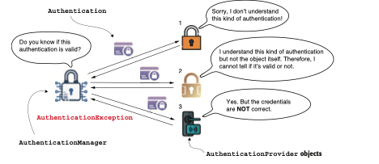

Si ninguno de los objetos `AuthenticationProvider` reconoce el `Authentication` o cualquiera de ellos 
lo rechaza, el resultado es una `AuthenticationException`.

### 6.1.3 Aplicando lógica de autenticación personalizada.

En esta sección, implementamos una lógica de autenticación personalizada. Puedes encontrar este 
ejemplo en el proyecto ssia-ch6-ex1. Con este ejemplo, aplicarás lo aprendido sobre las interfaces
`Authentication` y `AuthenticationProvider` en las secciones 6.1.1 y 6.1.2. En los listados 6.3 y 6.4,
construimos un ejemplo de cómo implementar un `AuthenticationProvider` personalizado. Estos pasos, 
también presentados, son los siguientes:

1. Declarar una clase que implemente el contrato AuthenticationProvider.
2. Decidir qué tipos de objetos Authentication soportará el nuevo AuthenticationProvider.
3. Implementar el método supports(Class<?> c) para especificar qué tipo de autenticación soporta 
el AuthenticationProvider que definimos.
4. Implementar el método authenticate(Authentication a) para implementar la lógica de autenticación.
5. Registrar una instancia de la nueva implementación de AuthenticationProvider con Spring Security.

Overriding the supports() method of the AuthenticationProvider:
```java
@Component
public class CustomAuthenticationProvider
implements AuthenticationProvider {
    // Omitted code
    @Override
    public boolean supports(Class<?> authenticationType) {
        return authenticationType
                .equals(UsernamePasswordAuthenticationToken.class);
    }
}
```
Definimos una nueva clase que implementa la interfaz `AuthenticationProvider`. Anotamos la clase con
`@Component` para tener una instancia de su tipo en el contexto gestionado por Spring. Luego, debemos
decidir qué tipo de implementación de la interfaz `Authentication` soporta este 
`AuthenticationProvider`. Eso depende del tipo que esperamos que se proporcione como parámetro al
método `authenticate()`. Si no personalizamos nada a nivel del filtro de autenticación (como se 
discutió en el capítulo 5), entonces la clase `UsernamePasswordAuthenticationToken` define el tipo. 
Esta clase es una implementación de la interfaz `Authentication` y representa una solicitud de 
autenticación estándar con nombre de usuario y contraseña.

Con esta definición, hicimos que el `AuthenticationProvider` soporte un tipo específico de clave. 
Una vez que hemos especificado el alcance de nuestro `AuthenticationProvider`, implementamos la 
lógica de autenticación sobrescribiendo el método `authenticate()`, como se muestra en el siguiente 
listado.

Implementing the authentication logic:
```java
@Component
public class CustomAuthenticationProvider
implements AuthenticationProvider {
    private final UserDetailsService userDetailsService;
    private final PasswordEncoder passwordEncoder;

    // Omitted constructor
    @Override
    public Authentication authenticate(Authentication authentication) {
        String username = authentication.getName();
        String password = authentication.getCredentials().toString();
        UserDetails u = userDetailsService.loadUserByUsername(username);
        if (passwordEncoder.matches(password, u.getPassword())) {
            return new UsernamePasswordAuthenticationToken(
                    username,
                    password,
                    u.getAuthorities()); //Si la contraseña coincide, devuelve una implementación 
                                        // del contrato Authentication con los detalles necesarios.
        } else {
            throw new BadCredentialsException
                    ("Something went wrong!");
            //Si la contraseña no coincide, se lanza una excepción de tipo AuthenticationException. 
            // BadCredentialsException hereda de AuthenticationException.
        }
    }
// omitted code
}
```
La lógica en el codigo anterior es sencilla, ofrece una representación visual de esta lógica. Usamos 
la implementación de `UserDetailsService` para obtener los `UserDetails`. Si el usuario no existe, 
el método `loadUserByUsername()` debería lanzar una `AuthenticationException`. En ese caso, el proceso 
de autenticación se detiene y el filtro HTTP establece el estado de la respuesta en `HTTP 401 
Unauthorized`. Si el nombre de usuario sí existe, podemos verificar la contraseña del usuario 
mediante el método `matches()` del `PasswordEncoder` del contexto. Si la contraseña no coincide, 
nuevamente se debe lanzar una `AuthenticationException`. Si la contraseña es correcta, el 
`AuthenticationProvider` devuelve una instancia de `Authentication` marcada como "autenticada", que 
contiene los detalles de la solicitud.

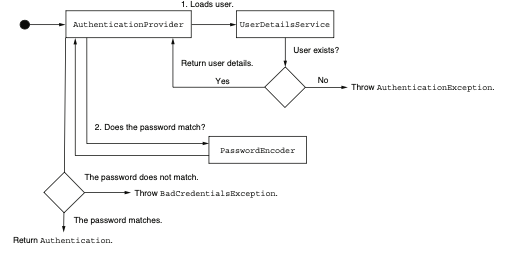

El `AuthenticationProvider` ejecuta un procedimiento de autenticación personalizado. Confirma la 
solicitud de autenticación recuperando los detalles del usuario mediante una implementación 
específica de `UserDetailsService` y valida la contraseña utilizando un `PasswordEncoder` si la 
contraseña es correcta. Si el usuario no se encuentra o la contraseña es incorrecta, el 
`AuthenticationProvider` lanzará una `AuthenticationException`.

Para integrar la nueva implementación del `AuthenticationProvider`, definimos un `@bean`
`SecurityFilterChain`. Esto se muestra en el siguiente codigo.

Registering the AuthenticationProvider in the configuration class:
```java
@Configuration
public class ProjectConfig {
    private final AuthenticationProvider authenticationProvider;

    // Omitted constructor
    @Bean
    public SecurityFilterChain securityFilterChain(HttpSecurity http)
            throws Exception {
        http.httpBasic(Customizer.withDefaults());
        http.authenticationProvider(authenticationProvider);
        http.authorizeHttpRequests(c -> c.anyRequest().authenticated());
        return http.build();
    }
// Omitted code
}
```
`NOTA`: En el codigo, se utiliza la inyección de dependencias con un campo declarado mediante la 
interfaz `AuthenticationProvider`. Spring reconoce a `AuthenticationProvider` como una interfaz 
(que es una abstracción). Sin embargo, Spring sabe que necesita encontrar una instancia de una 
implementación en su contexto para esa interfaz específica. En nuestro caso, la implementación es 
la instancia de `CustomAuthenticationProvider`, que es la única de este tipo que declaramos y 
agregamos al contexto de Spring mediante la anotación `@Component`. Para repasar la inyección de 
dependencias. ¡Eso es todo! Has personalizado con éxito la implementación del 
`AuthenticationProvider`. Ahora puedes personalizar la lógica de autenticación de tu aplicación 
donde lo necesites.

### Cómo fallar en el diseño de aplicaciones

Aplicar un framework de forma incorrecta conduce a una aplicación menos mantenible. Lo que es peor,
a veces quienes fallan al usar el framework creen que es culpa del framework. Déjame contarte una 
historia.

Un invierno, el jefe de desarrollo en una empresa con la que trabajé como consultor me llamó para 
ayudarlos con la implementación de una nueva característica. Necesitaban aplicar un método de 
autenticación personalizado en un componente de su sistema desarrollado con Spring en sus primeros
días. Desafortunadamente, al implementar el diseño de clases de la aplicación, los desarrolladores 
no se apoyaron adecuadamente en la arquitectura fundamental de Spring Security.

Solo usaron la cadena de filtros, reimplementando funciones completas de Spring Security como 
código personalizado.

Los desarrolladores observaron que, con el tiempo, las personalizaciones se volvieron cada vez más 
difíciles. Sin embargo, nadie tomó medidas para rediseñar adecuadamente el componente y usar los 
contratos según lo previsto en Spring Security. Gran parte de la dificultad provenía de no conocer 
las capacidades de Spring. Uno de los desarrolladores principales dijo: “¡Es solo culpa de este
Spring Security! ¡Este framework es difícil de aplicar y es complicado usarlo con cualquier 
personalización”. Me sorprendió un poco su observación. Sé que Spring Security a veces es difícil 
de entender y que se sabe que tiene una curva de aprendizaje pronunciada. ¡Pero nunca he 
experimentado una situación en la que no pudiera encontrar una forma de diseñar una clase fácil 
de personalizar con Spring Security!

Investigamos el problema juntos y me di cuenta de que los desarrolladores de la aplicación usaban 
quizás solo el 10% de lo que Spring Security tiene para ofrecer. Luego organicé un taller de dos 
días sobre Spring Security, centrándome en lo que podíamos hacer para el componente del sistema 
específico que tenían que modificar y cómo hacerlo.

Todo terminó con la decisión de reescribir completamente mucho código personalizado para basarse 
correctamente en Spring Security y así hacer que la aplicación fuera más fácil de extender para 
satisfacer sus necesidades en implementaciones de seguridad. También descubrimos algunos otros 
problemas no relacionados con Spring Security, pero esa es otra historia.

#### Aquí tienes algunas lecciones que puedes extraer de esta historia:

- Un framework, especialmente uno ampliamente utilizado en aplicaciones, es desarrollado por muchas
personas expertas, y es difícil creer que pueda estar mal implementado. Siempre analiza tu 
aplicación antes de concluir que cualquier problema es culpa del framework.
- Cuando decidas usar un framework, asegúrate de entender al menos sus conceptos básicos.
- Ten cuidado con las fuentes que usas para aprender sobre el framework. A veces, los artículos 
encontrados en la web muestran soluciones rápidas, pero no necesariamente la forma correcta de 
implementar un diseño de clases.
- Utiliza múltiples fuentes en tu investigación. Para aclarar malentendidos, crea una prueba de 
concepto cuando no estés seguro de cómo usar algo.
- Si decides usar un framework, utilízalo tanto como sea posible para el propósito para el que fue 
diseñado. Por ejemplo, si usas Spring Security y observas que para implementaciones de seguridad 
tiendes a escribir más código personalizado en lugar de aprovechar lo que ofrece el framework, 
deberías cuestionarte por qué ocurre esto.

Cuando confiamos en funcionalidades implementadas por un framework, disfrutamos de varios 
beneficios. Sabemos que están probadas y tienen menos posibilidades de incluir vulnerabilidades.
Asimismo, un buen framework se basa en abstracciones, lo que te ayuda a crear aplicaciones 
mantenibles. Recuerda que cuando escribes tus propias implementaciones, eres más susceptible de 
introducir vulnerabilidades.

## 6.2 Usando el SecurityContext

Esta sección trata sobre el contexto de seguridad. Analizamos cómo funciona, cómo acceder a los 
datos y cómo la aplicación lo gestiona en diferentes escenarios relacionados con hilos. Una vez que
termines esta sección, sabrás cómo configurar el contexto de seguridad para diversas situaciones. 
De esta forma, podrás usar los detalles sobre el usuario autenticado almacenados por el contexto 
de seguridad para configurar la autorización en los capítulos 7 y 8.

Es probable que necesites detalles sobre la entidad autenticada tras el proceso de autenticación. 
Por ejemplo, podrías necesitar hacer referencia al nombre de usuario o a las autoridades del 
usuario actualmente autenticado. ¿Siguen siendo accesibles estos datos tras finalizar el proceso 
de autenticación? Una vez que AuthenticationManager completa con éxito el proceso de autenticación,
almacena la instancia de Authentication durante el resto de la solicitud. La instancia que almacena 
el objeto Authentication se llama contexto de seguridad.

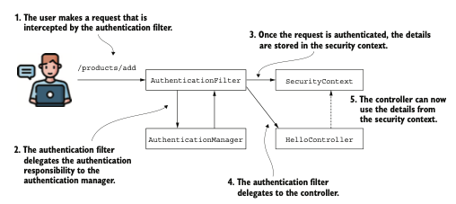

Tras una autenticación exitosa, el filtro de autenticación almacena los detalles de la entidad 
autenticada en el contexto de seguridad. A partir de ahí, el controlador que implementa la acción 
mapeada a la solicitud puede acceder a estos detalles cuando sea necesario.

The SecurityContext interface:
```java
public interface SecurityContext extends Serializable {
    Authentication getAuthentication();

    void setAuthentication(Authentication authentication);
}
```
Como se puede deducir de la definición del contrato, la responsabilidad principal del 
SecurityContext es almacenar el objeto Authentication. Pero ¿cómo se gestiona el propio 
SecurityContext? Spring Security ofrece tres estrategias para gestionar el SecurityContext mediante
un objeto que actúa como administrador, llamado SecurityContextHolder:

- MODE_THREADLOCAL: Permite que cada hilo almacene sus propios detalles en el contexto de seguridad.
En una aplicación web basada en un hilo por solicitud, este es un enfoque común, ya que cada 
solicitud tiene un hilo individual.
- MODE_INHERITABLETHREADLOCAL: Similar a MODE_THREADLOCAL, pero además indica a Spring Security que 
copie el contexto de seguridad al siguiente hilo en caso de un método asincrónico. De esta forma, 
el nuevo hilo que ejecuta el método anotado con @Async hereda el contexto de seguridad.
- MODE_GLOBAL: Hace que todos los hilos de la aplicación vean la misma instancia del contexto de 
seguridad. 

Además de estas tres estrategias para gestionar el contexto de seguridad proporcionadas por Spring 
Security, esta sección también ilustra lo que sucede cuando defines tus propios hilos que no son 
conocidos por Spring. Como aprenderás, para estos casos, necesitas copiar explícitamente los 
detalles del contexto de seguridad al nuevo hilo. Spring Security no puede gestionar 
automáticamente objetos que no están en el contexto de Spring, pero ofrece algunas clases de 
utilidad muy útiles.

### 6.2.1 Usar una estrategia de retención para el contexto de seguridad

La primera estrategia para gestionar el contexto de seguridad es la estrategia `MODE_THREADLOCAL`,
que también es la predeterminada en Spring Security. Con esta estrategia, Spring Security utiliza 
`ThreadLocal` para gestionar el contexto. ThreadLocal es una implementación proporcionada por el JDK 
que actúa como una colección de datos, asegurando que cada hilo de la aplicación solo pueda acceder 
a los datos almacenados en su propia parte de la colección. De esta forma, cada solicitud tiene 
acceso a su propio contexto de seguridad, y ningún hilo puede acceder al contexto de otro. Esto 
significa que, en una aplicación web, cada solicitud solo puede ver su propio contexto de seguridad,
lo cual es generalmente lo deseable en aplicaciones web backend. se muestra un resumen de
esta funcionalidad: cada solicitud (A, B y C) tiene su hilo asignado (T1, T2 y T3), por lo que solo 
puede ver los detalles almacenados en su propio contexto.

Sin embargo, esta estrategia implica que si se crea un nuevo hilo (por ejemplo, al llamar a un 
método asíncrono), este tendrá su propio contexto de seguridad, y los detalles del hilo principal 
no se copiarán automáticamente.

`Nota`: Esta descripción se aplica a aplicaciones servlet tradicionales, donde cada solicitud está 
asociada a un hilo. No se aplica a aplicaciones reactivas, que se tratarán en el capítulo 17.

Como estrategia predeterminada, no requiere configuración explícita. Basta con obtener el contexto 
de seguridad desde el holder mediante el método estático `getContext()` en cualquier punto posterior 
a la autenticación. Se muestra un ejemplo de cómo obtener el contexto de seguridad en un endpoint 
de la aplicación. A partir del contexto de seguridad, se puede acceder al objeto `Authentication`, 
que contiene los detalles de la entidad autenticada. Los ejemplos de esta sección están disponibles
en el proyecto ssia-ch6-ex2.

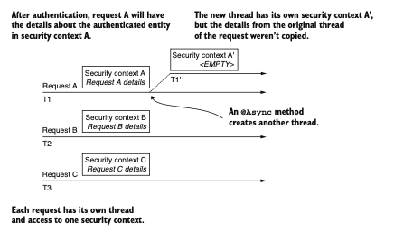

Cada solicitud tiene su propio hilo representado por una flecha. Cada hilo solo tiene acceso a los 
detalles de su propio contexto de seguridad. Cuando se crea un nuevo hilo (por ejemplo, mediante un
método @Async), los detalles del hilo principal no se copian.

Obtaining the SecurityContext from the SecurityContextHolder:
```java
@GetMapping("/hello")
public String hello() {
    SecurityContext context = SecurityContextHolder.getContext();
    Authentication a = context.getAuthentication();
    return "Hello, " + a.getName() + "!";
}
```
Obtener el objeto Authentication desde el contexto es aún más cómodo a nivel de endpoint, ya que 
Spring puede inyectarlo directamente en los parámetros del método. No es necesario acceder 
explícitamente a `SecurityContextHolder` cada vez. Este enfoque, como se muestra en el siguiente 
listado, es preferible. 

Spring injects Authentication value in the parameter of the method:
```java
//Spring Boot inyecta el Authentication actual en el parámetro del metodo.
@GetMapping("/hello")
public String hello(Authentication a) {
    return "Hello, " + a.getName() + "!";
}
```
Cuando se llama al punto de conexión con un usuario correcto, el cuerpo de la respuesta contiene el
nombre de usuario. Por ejemplo:
```http request
curl -u user:99ff79e3-8ca0-401c-a396-0a8625ab3bad http://localhost:8080/hello
Hello, user!
```
### 6.2.2 Usar una estrategia de retención para llamadas asíncronas

Es fácil mantenerse con la estrategia predeterminada para gestionar el contexto de seguridad. En 
muchos casos, es lo único que necesitas. MODE_THREADLOCAL ofrece la capacidad de aislar el contexto 
de seguridad para cada hilo, y hace que el contexto de seguridad sea más natural de entender y 
gestionar. Sin embargo, también hay casos en los que esto no se aplica.

La situación se complica más si tenemos que lidiar con múltiples hilos por solicitud. Observa qué 
sucede si haces que el punto de conexión sea asíncrono. El hilo que ejecuta el método ya no es el 
mismo hilo que atiende la solicitud. Piensa en un punto de conexión como el que se presenta en el 
siguiente codigo.

An @Async method served by a different thread:
```java
@GetMapping("/bye")
@Async //Al ser @Async, el metodo se ejecuta en un hilo separado.
public void goodbye() {
    SecurityContext context = SecurityContextHolder.getContext();
    String username = context.getAuthentication().getName();
// do something with the username
}
```
Para habilitar la funcionalidad de la anotación `@Async`, también he creado una clase de configuración
y la he anotado con `@EnableAsync`: 
```java
@Configuration
@EnableAsync
public class ProjectConfig {}
```
`NOTA` A veces en artículos o foros, las anotaciones de configuración se colocan sobre la clase 
principal. Por ejemplo, podrías encontrar que ciertos ejemplos usan la anotación `@EnableAsync` 
directamente sobre la clase principal. Este enfoque es técnicamente correcto porque anotamos la 
clase principal de una aplicación Spring Boot con la anotación `@SpringBootApplication`, que incluye 
la característica `@Configuration`. Sin embargo, en una aplicación real, preferimos mantener las 
responsabilidades separadas, y nunca usamos la clase principal como clase de configuración. Para 
hacer las cosas lo más claras posible en los ejemplos de este libro, prefiero colocar estas 
anotaciones sobre la clase `@Configuration`, de forma similar a como las encontrarás en escenarios 
prácticos.
Si pruebas el código tal como está ahora, lanzará una `NullPointerException` en la línea que obtiene
el nombre de la autenticación, que es
```java
String username = context.getAuthentication().getName();
```
Esto se debe a que el método ahora se ejecuta en otro hilo que no hereda el contexto de seguridad. 
Por esta razón, el objeto de autorización es nulo y, en el contexto del código presentado, provoca 
una `NullPointerException`. En este caso, podrías resolver el problema utilizando la estrategia 
`MODE_INHERITABLETHREADLOCAL`. Esto puede configurarse llamando al método 
`SecurityContextHolder.setStrategyName()` o usando la propiedad del `sistema spring.security.strategy`.
Al establecer esta estrategia, el framework sabe que debe copiar los detalles del hilo original de
la solicitud al nuevo hilo creado para el método asíncrono. 

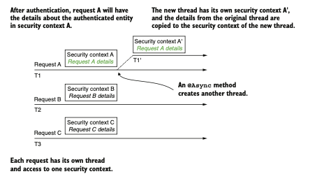

Al usar `MODE_INHERITABLETHREADLOCAL`, el framework copia los detalles del contexto de seguridad del 
hilo original de la solicitud al contexto de seguridad del nuevo hilo.

El siguiente codigo presenta una forma de establecer la estrategia de gestión del contexto de 
seguridad mediante la llamada al método `setStrategyName()`.

Using InitializingBean to set SecurityContextHolder mode:
```java
@Configuration
@EnableAsync
public class ProjectConfig {
    @Bean
    public InitializingBean initializingBean() {
        return () -> SecurityContextHolder.setStrategyName(
                SecurityContextHolder.MODE_INHERITABLETHREADLOCAL);
    }
}
```
Después de llamar al punto de conexión, observarás que Spring propaga correctamente el contexto 
de seguridad al siguiente hilo. Además, Authentication ya no es nulo.

`NOTA` Esto funciona solo cuando el framework crea el hilo por sí mismo (por ejemplo, en el caso de 
un método `@Async`). Si tu código crea el hilo, tendrás el mismo problema incluso con la estrategia 
`MODE_INHERITABLETHREADLOCAL`. Esto sucede porque, en este caso, el framework no conoce el hilo que 
crea tu código. Discutiremos cómo resolver los problemas de estos casos en las secciones 6.2.4 y 6.2.5.

### 6.2.3 Usando una estrategia de contención para aplicaciones independientes

Si lo que necesitas es un contexto de seguridad compartido por todos los hilos de la aplicación,
cambia la estrategia a `MODE_GLOBAL`. No usarías esta estrategia en un servidor web, ya que no se 
ajusta al esquema general de la aplicación. Una aplicación web de backend gestiona de forma 
independiente las solicitudes que recibe, por lo que tiene más sentido tener el contexto de 
seguridad separado por solicitud, en lugar de un único contexto para todas ellas. Sin embargo, 
esta estrategia puede ser adecuada para una aplicación independiente.

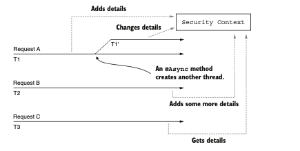

Con la estrategia `MODE_GLOBAL` utilizada para la gestión del contexto de seguridad, todos los 
hilos acceden al mismo contexto de seguridad. Esto implica que todos ellos tienen acceso a los 
mismos datos y pueden modificar esa información. Debido a esto, pueden producirse condiciones de 
carrera, por lo que es necesario tener cuidado con la sincronización.

Como muestra el siguiente fragmento de código, puedes cambiar la estrategia tal como lo hicimos con
`MODE_INHERITABLETHREADLOCAL`. Puedes usar el método `SecurityContextHolder.setStrategyName()` o la 
propiedad del sistema `spring.security.strategy`:
```java
@Bean
public InitializingBean initializingBean() {
    return () -> SecurityContextHolder.setStrategyName(
            SecurityContextHolder.MODE_GLOBAL);
}
```
Asimismo, ten en cuenta que el `SecurityContext` no es seguro para subprocesos `(thread safe)`. Por lo 
tanto, con esta estrategia, en la que todos los hilos de la aplicación pueden acceder al objeto 
`SecurityContext`, debes encargarte de gestionar el acceso concurrente.

### 6.2.4 Transfiriendo el contexto de seguridad con DelegatingSecurityContextRunnable

Has aprendido que puedes gestionar el contexto de seguridad con tres modos proporcionados por 
Spring Security: MODE_THREADLOCAL, MODE_INHERITABLETHREADLOCAL y MODE_GLOBAL. Por defecto, el 
framework se asegura únicamente de proporcionar un contexto de seguridad para el hilo de la 
solicitud, y este contexto de seguridad solo es accesible para ese hilo. Sin embargo, el framework 
no se encarga de los hilos recién creados (por ejemplo, en el caso de un método asíncrono). Además,
has aprendido que, para esta situación, debes establecer explícitamente un modo diferente para la 
gestión del contexto de seguridad. Pero aún existe un caso particular: ¿qué sucede cuando tu código
inicia nuevos hilos sin que el framework tenga conocimiento de ellos? A veces llamamos a estos 
hilos autogestionados porque somos nosotros quienes los gestionamos, no el framework. En esta 
sección, aplicamos algunas herramientas de utilidad proporcionadas por Spring Security que te 
ayudan a propagar el contexto de seguridad a los hilos recién creados.

Ninguna estrategia específica de `SecurityContextHolder` ofrece una solución para hilos 
autogestionados. En este caso, debes encargarte tú mismo de la propagación del contexto de seguridad.
Una solución para esto es usar `DelegatingSecurityContextRunnable` para decorar las tareas que 
deseas ejecutar en un hilo separado. `DelegatingSecurityContextRunnable` extiende `Runnable`. Puedes 
usarlo cuando se ejecuta una tarea y no se espera un valor de retorno. Si tienes un valor de 
retorno, entonces puedes usar la alternativa Callable, que es `DelegatingSecurityContextCallable`. 
Ambas clases representan tareas ejecutadas de forma asíncrona, como cualquier otro `Runnable` o 
`Callable`. Además, estas se aseguran de copiar el contexto de seguridad actual al hilo que ejecuta 
la tarea. Estos objetos decoran las tareas originales y copian el contexto de seguridad a los nuevos
hilos. 

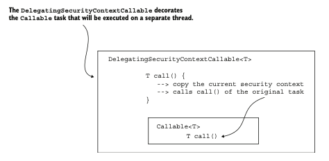

DelegatingSecurityContextCallable está diseñado como un decorador del objeto Callable. Al crear 
este objeto, se proporciona la tarea Callable que la aplicación ejecuta de forma asíncrona. 
DelegatingSecurityContextCallable copia los detalles del contexto de seguridad al nuevo hilo y 
luego ejecuta la tarea.

El siguiente codigo muestra el uso de `DelegatingSecurityContextCallable`. Comencemos definiendo un 
método de punto de acceso simple que declara un objeto `Callable`. La tarea `Callable` devuelve el 
nombre de usuario del contexto de seguridad actual.

Defining a Callable object and executing it as a task on a separate thread:
```java
@GetMapping("/ciao")
public String ciao() throws Exception {
    Callable<String> task = () -> {
        SecurityContext context = SecurityContextHolder.getContext();
        return context.getAuthentication().getName();
    };
// Omitted code
}
```
Continuamos el ejemplo enviando la tarea a un `ExecutorService`. La respuesta de la ejecución se 
recupera y se devuelve como cuerpo de la respuesta por el punto de acceso.

Defining an ExecutorService and submitting the task:
```java
@GetMapping("/ciao")
public String ciao() throws Exception {
    Callable<String> task = () -> {
        SecurityContext context = SecurityContextHolder.getContext();
        return context.getAuthentication().getName();
    };
    ExecutorService e = Executors.newCachedThreadPool();
    try {
    } finally {
        e.shutdown();
        return "Ciao, " + e.submit(task).get() + "!";
    }
}
```
Si ejecutas la aplicación tal como está, no obtienes más que una `NullPointerException`. Dentro del 
hilo recién creado para ejecutar la tarea `callable`, la autenticación ya no existe y el contexto 
de seguridad está vacío. Para resolver este problema, decoramos la tarea con 
`DelegatingSecurityContextCallable`, que proporciona el contexto actual al nuevo hilo, como se 
muestra en el siguiente listado. 

Running the task decorated by DelegatingSecurityContextCallable:
```java
@GetMapping("/ciao")
public String ciao() throws Exception {
    Callable<String> task = () -> {
        SecurityContext context = SecurityContextHolder.getContext();
        return context.getAuthentication().getName();
        ExecutorService e = Executors.newCachedThreadPool();
    };
    try {
        var contextTask = new DelegatingSecurityContextCallable<>(task);
        return "Ciao, " + e.submit(contextTask).get() + "!";
    } finally {
        e.shutdown();
    }
}
```
Al llamar al punto de acceso ahora, puedes observar que Spring propagó el contexto de seguridad al 
hilo en el que se ejecutan las tareas:

`curl -u user:2eb3f2e8-debd-420c-9680-48159b2ff905 http://localhost:8080/ciao`

El cuerpo de la respuesta para esta llamada es

`Ciao, user!`

### 6.2.5 Transfiriendo el contexto de seguridad con DelegatingSecurityContextExecutorService

Cuando se trata de hilos que nuestro código inicia sin notificar al framework, debemos gestionar la
propagación de los datos del contexto de seguridad al siguiente hilo. En la sección 6.2.4, 
aplicaste una técnica para copiar los datos del contexto de seguridad utilizando la propia tarea. 
Spring Security proporciona algunas clases de utilidad como `DelegatingSecurityContextRunnable` y 
`DelegatingSecurityContextCallable`. Estas clases decoran las tareas que ejecutas de forma asíncrona 
y también se encargan de copiar los datos del contexto de seguridad para que tu implementación 
pueda acceder a ellos desde el hilo recién creado. Sin embargo, tenemos una segunda opción para 
gestionar la propagación del contexto de seguridad a un nuevo hilo: hacerlo desde el grupo de hilos
`(thread pool)` en lugar de desde la tarea misma. En esta sección, aprenderás cómo aplicar esta 
técnica utilizando otras clases de utilidad proporcionadas por Spring Security.

Una alternativa a decorar las tareas es usar un tipo específico de Executor. En el siguiente 
ejemplo, puedes observar que la tarea sigue siendo un `Callable<T>` simple, pero el hilo aún gestiona
el contexto de seguridad. La propagación del contexto de seguridad ocurre porque una implementación 
llamada `DelegatingSecurityContextExecutorService` decora el `ExecutorService`. 
`DelegatingSecurityContextExecutorService` también se encarga de la propagación del contexto de 
seguridad.

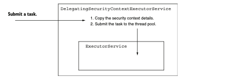

`DelegatingSecurityContextExecutorService` decora un `ExecutorService` y propaga los detalles del 
contexto de seguridad al siguiente hilo antes de enviar la tarea.

El código en el siguiente listado muestra cómo usar un `DelegatingSecurityContextExecutorService` 
para decorar un `ExecutorService` de forma que, cuando envíe la tarea, se encargue de propagar los 
detalles del contexto de seguridad.

Propagating the SecurityContext:
```java
@GetMapping("/hola")
public String hola() throws Exception {
    Callable<String> task = () -> {
        SecurityContext context = SecurityContextHolder.getContext();
        return context.getAuthentication().getName();
    };
    ExecutorService e = Executors.newCachedThreadPool();
    e = new DelegatingSecurityContextExecutorService(e);
    try {
        return "Hola, " + e.submit(task).get() + "!";
    } finally {
        e.shutdown();
    }
}
```
Llame al punto de conexión para comprobar que `DelegatingSecurityContextExecutorService` delegó
correctamente el contexto de seguridad:

`curl -u user:5a5124cc-060d-40b1-8aad-753d3da28dca http://localhost:8080/hola`

El cuerpo de la respuesta para esta llamada es `Hola, user!`

`NOTA` De las clases relacionadas con el soporte de concurrencia para el contexto de seguridad, debe 
tener en cuenta las presentadas en la tabla 6.1.

Spring ofrece varias implementaciones de clases de utilidad que se pueden usar en su aplicación 
para gestionar el contexto de seguridad al crear sus propios hilos. En la sección 6.2.4, implementó
`DelegatingSecurityContextCallable`. En esta sección, usamos `DelegatingSecurityContextExecutorService`.
Si necesita implementar la propagación del contexto de seguridad para una tarea programada, le 
complacerá saber que Spring Security también le ofrece un decorador llamado 
`DelegatingSecurityContextScheduledExecutorService`. Este mecanismo es similar al 
`DelegatingSecurityContextExecutorService` presentado en esta sección, con la diferencia de que 
decora un `ScheduledExecutorService`, lo que le permite trabajar con tareas programadas.

Además, para obtener mayor flexibilidad, Spring Security le ofrece una versión más abstracta de un 
decorador llamado `DelegatingSecurityContextExecutor`. Esta clase decora directamente un `Executor`,
que es el contrato más abstracto de esta jerarquía de grupos de hilos. Puede elegirla para el 
diseño de su aplicación cuando desee poder reemplazar la implementación del grupo de hilos por 
cualquiera de las opciones que proporciona el lenguaje.

Objetos responsables de delegar el contexto de seguridad a un hilo separado:

| Class                                             | Description                                                                                                                                                                                                                                       |
|---------------------------------------------------|---------------------------------------------------------------------------------------------------------------------------------------------------------------------------------------------------------------------------------------------------|
| DelegatingSecurityContextExecutor                 | Implementa la interfaz Executor y está diseñada para decorar un objeto Executor con la capacidad de reenviar el contexto de seguridad a los hilos creados por su grupo                                                                            |
| DelegatingSecurityContextExecutorService          | Implementa la interfaz ExecutorService y está diseñada para decorar un objeto ExecutorService con la capacidad de reenviar el contexto de seguridad a los hilos creados por su grupo.                                                             |
| DelegatingSecurityContextScheduledExecutorService | Implementa la interfaz ScheduledExecutorService y está diseñada para decorar un objeto ScheduledExecutorService con la capacidad de reenviar el contexto de seguridad a los hilos creados por su grupo.                                           |
| DelegatingSecurityContextRunnable                 | Implementa la interfaz Runnable y representa una tarea que se ejecuta en un hilo diferente sin devolver una respuesta. Además de un Runnable normal, también puede propagar un contexto de seguridad para usar en el nuevo hilo.                  |
| DelegatingSecurityContextCallable                 | Implementa la interfaz Callable y representa una tarea que se ejecuta en un hilo diferente y que eventualmente devolverá una respuesta. Además de un Callable normal, también puede propagar un contexto de seguridad para usar en el nuevo hilo. |

## 6.3 Hasta ahora, solo hemos utilizado HTTP Basic como método de autenticación 

Pero a lo largo de este libro aprenderás que también existen otras posibilidades. El método de 
autenticación HTTP Basic es sencillo, lo que lo convierte en una excelente opción para ejemplos, 
fines demostrativos o pruebas de concepto. Pero por la misma razón, podría no adaptarse a todos los
escenarios del mundo real que necesites implementar.

En esta sección, aprenderás más sobre configuraciones relacionadas con HTTP Basic. Además, 
hablaremos de un nuevo método de autenticación llamado formLogin. En el resto del libro, 
analizaremos otros métodos de autenticación que se ajustan bien a diferentes tipos de arquitecturas.
Los compararemos para que puedas comprender las mejores prácticas, así como los anti-patrones en 
autenticación.

### 6.3.1 Usar y configurar HTTP Basic
Sabes que HTTP Basic es el método de autenticación predeterminado, y hemos visto cómo funciona en 
varios ejemplos en el capítulo 3. En esta sección, agregamos más detalles sobre la configuración de
este método de autenticación.

Para escenarios teóricos, los valores predeterminados que trae HTTP Basic son adecuados. Sin 
embargo, en una aplicación más compleja, podrías necesitar personalizar algunos de estos ajustes. 
Por ejemplo, es posible que desees implementar una lógica específica para el caso en que falle el 
proceso de autenticación, o incluso necesites establecer valores personalizados en la respuesta 
enviada al cliente. Consideraremos estos casos con ejemplos prácticos para entender cómo 
implementarlos. Nuevamente, quiero señalar cómo puedes establecer este método explícitamente, como
se muestra en el siguiente listado. Puedes encontrar este ejemplo en el proyecto ssia-ch6-ex3. 

Setting the HTTP Basic authentication method:
```java
@Configuration
public class ProjectConfig {
    @Bean
    public SecurityFilterChain configure(HttpSecurity http)
            throws Exception {
        http.httpBasic(Customizer.withDefaults());
        return http.build();
    }
}
```
Puedes llamar al método `httpBasic()` de la instancia `HttpSecurity` con un parámetro de tipo 
`Customizer`. Este parámetro permite configurar aspectos relacionados con el método de autenticación,
por ejemplo, el realmName, como se muestra en el siguiente codigo. Puedes pensar en el realmName
como un espacio de protección que utiliza un método específico de autenticación. Para una 
descripción completa, consulta la RFC 2617 en `https://tools.ietf.org/html/rfc2617`.

Configuring the realm name for the response of failed authentications:
```java
@Bean
public SecurityFilterChain configure(HttpSecurity http)
throws Exception {
    http.httpBasic(c -> {
        c.realmName("OTHER");
        c.authenticationEntryPoint(new CustomEntryPoint());
    });
    http.authorizeHttpRequests(c -> c.anyRequest().authenticated());
    return http.build();
}
```
Presenta un ejemplo de cambio del nombre del realm. La expresión lambda utilizada es, de hecho, un 
objeto de tipo `Customizer<HttpBasicConfigurer<HttpSecurity>>`. El parámetro de tipo 
`HttpBasicConfigurer<HttpSecurity>` nos permite llamar al método `realmName()` para cambiar el nombre 
del realm. Puedes usar cURL con la `opción -v` para obtener una `respuesta HTTP` detallada en la que 
el nombre del realm efectivamente ha cambiado. Sin embargo, ten en cuenta que encontrarás el 
encabezado `WWW-Authenticate` en la respuesta solo cuando el estado `HTTP sea 401 Unauthorized`, y 
no cuando el estado sea `200 OK`. Esta es la llamada a cURL:

`curl -v http://localhost:8080/hello`

La respuesta de la llamada es:

`/
...
< WWW-Authenticate: Basic realm="OTHER"
...`

Además, mediante el uso de un Customizer, podemos personalizar la respuesta cuando la autenticación
falla. Esto es necesario si el cliente de tu sistema espera algo específico en la respuesta en caso
de autenticación fallida. Podrías necesitar agregar o eliminar uno o más encabezados, o incluso 
implementar una lógica que filtre el cuerpo para asegurarte de que la aplicación no exponga datos 
sensibles al cliente.

`NOTA` Ten siempre cuidado con los datos que expones fuera del sistema. Uno de los errores más 
comunes (que además forma parte de las diez principales vulnerabilidades de OWASP; consulta 
`https://owasp.org/www-project-top-ten/`) es exponer datos sensibles. Trabajar con los detalles que
la aplicación envía al cliente tras una autenticación fallida es siempre un punto de riesgo para 
revelar información confidencial.

Para personalizar la respuesta cuando falla la autenticación, podemos implementar un 
`AuthenticationEntryPoint`. Su método `commence()` recibe el `HttpServletRequest`, el 
`HttpServletResponse` y la `AuthenticationException` que provocaron el fallo de autenticación. 
El siguiente codigo muestra una forma de implementar `AuthenticationEntryPoint`, que agrega un 
encabezado a la respuesta y establece el estado `HTTP en 401 Unauthorized`.

`NOTA` Es un poco ambiguo que el nombre de la interfaz `AuthenticationEntryPoint` no refleje su uso en
caso de fallo de autenticación. En la arquitectura de Spring Security, esta interfaz es utilizada
directamente por un componente llamado `ExceptionTranslationFilter`, que maneja cualquier 
`AccessDeniedException` y `AuthenticationException` lanzada dentro de la cadena de filtros. Puedes ver 
a `ExceptionTranslationFilter` como un puente entre las excepciones de Java y las `respuestas HTTP`.

Implementing an AuthenticationEntryPoint:
```java
public class CustomEntryPoint
implements AuthenticationEntryPoint {
    @Override
    public void commence(
            HttpServletRequest httpServletRequest,
            HttpServletResponse httpServletResponse,
            AuthenticationException e)
            throws IOException, ServletException {
        httpServletResponse
                .addHeader("message", "Luke, I am your father!");
        httpServletResponse
                .sendError(HttpStatus.UNAUTHORIZED.value());
    }
}
```
Puedes registrar entonces el `CustomEntryPoint` con el método HTTP Basic en la clase de configuración.
El siguiente listado muestra la clase de configuración para el punto de entrada personalizado.

Setting the custom AuthenticationEntryPoint:
```java
@Bean
public SecurityFilterChain configure(HttpSecurity http)
throws Exception {
    http.httpBasic(c -> {
        c.realmName("OTHER");
        c.authenticationEntryPoint(new CustomEntryPoint());
    });
    http.authorizeHttpRequests().anyRequest().authenticated();
    return http.build();
}
```
Si ahora realizas una llamada a un punto de conexión de forma que la autenticación falle, deberías
encontrar el encabezado recién agregado en la respuesta:

`curl -v http://localhost:8080/hello`

La respuesta de la llamada es:

`...
< HTTP/1.1 401
< Set-Cookie: JSESSIONID=459BAFA7E0E6246A463AD19B07569C7B; Path=/; HttpOnly
< message: ¡Luke, yo soy tu padre!
...`

### 6.3.2 Implementación de la autenticación con login basado en formulario

Al desarrollar una aplicación web, probablemente desees presentar un formulario de inicio de 
sesión amigable donde los usuarios puedan ingresar sus credenciales. Además, podrías querer que 
los usuarios autenticados puedan navegar por las páginas web después de iniciar sesión y que tengan
la posibilidad de cerrarla. Para una aplicación web pequeña, puedes aprovechar el método de login 
basado en formulario. En esta sección, aprenderás a aplicar y configurar este método de 
autenticación en tu aplicación. Para lograrlo, escribiremos una pequeña aplicación web que utiliza
el login basado en formulario. a continuacion se describe el flujo que implementaremos. Los ejemplos 
de esta sección forman parte del proyecto ssia-ch6-ex4.

`NOTA` Asocio este método a una aplicación web pequeña porque, de esta manera, usamos una sesión 
del lado del servidor para gestionar el contexto de seguridad. Para aplicaciones más grandes que 
requieren escalabilidad horizontal, el uso de una sesión del lado del servidor para gestionar el 
contexto de seguridad no es recomendable. Trataremos estos aspectos con más detalle en los 
capítulos 12 al 15 al tratar con OAuth 2.

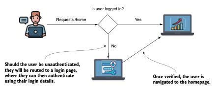

Un usuario que aún no ha sido autenticado es redirigido a un formulario para iniciar sesión con sus
credenciales. Después de que la aplicación haya verificado su identidad, se le dirige a la página 
principal de la aplicación.

Para cambiar el método de autenticación a login basado en formulario, en lugar de httpBasic(), 
llama al método `formLogin()` del parámetro `HttpSecurity` en el objeto `SecurityFilterChain`. El 
siguiente listado muestra este cambio.

Changing the authentication method to a form-based login:
```java
@Configuration
public class ProjectConfig {
    @Bean
    public SecurityFilterChain securityFilterChain(HttpSecurity http)
            throws Exception {
        http.formLogin(Customizer.withDefaults());
        http.authorizeHttpRequests(c -> c.anyRequest().authenticated());
        return http.build();
    }
}
```
Incluso con esta configuración mínima, Spring Security ya ha configurado un formulario de inicio de
sesión, así como una página de cierre de sesión para tu proyecto. Al iniciar la aplicación y 
acceder a ella mediante el navegador, deberías ser redirigido a una página de login.


La página de inicio de sesión predeterminada configurada automáticamente por Spring Security 
al usar el método `formLogin()`.

Puedes iniciar sesión usando las credenciales predeterminadas proporcionadas, siempre que no hayas 
registrado tu propio `UserDetailsService`. Estas credenciales son, como vimos en el capítulo 2, el 
nombre de usuario user y una contraseña `UUID` que se muestra en la consola al iniciar la aplicación.
Como no hay otra página definida, después de un inicio de sesión exitoso se te redirige a una 
página de error predeterminada. La aplicación se basa en la misma arquitectura de autenticación 
que vimos en ejemplos anteriores. Por lo tanto, como ya se muestro, necesitas implementar un 
controlador para la página principal de la aplicación. La diferencia es que, en lugar de tener 
una respuesta simple en formato `JSON`, queremos que el punto de acceso devuelva HTML que pueda ser
interpretado por el navegador como nuestra página web. Debido a esto, optamos por seguir el flujo
de `Spring MVC` y que la vista se renderice desde un archivo tras la ejecución de la acción definida 
en el controlador. A continiuacion se presenta el flujo de `Spring MVC` para renderizar la página 
principal de la aplicación. 

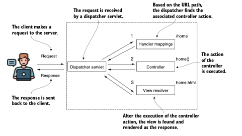

Una representación sencilla del flujo de Spring MVC. El despachador encuentra la acción del 
controlador asociada a la ruta dada (/home en este caso). Después de ejecutar la acción del 
controlador, se renderiza la vista y la respuesta se envía de vuelta al cliente.

Para añadir una página sencilla a la aplicación, primero debes crear un archivo HTML en la carpeta
`resources/static` del proyecto. Llamo a este archivo `home.html`. Dentro de él, escribe un texto que 
luego puedas encontrar en el navegador. Puedes simplemente añadir un encabezado (por ejemplo, 
`<h1>Bienvenido</h1>`). Después de crear la página HTML, el controlador debe definir el mapeo desde 
la ruta hasta la vista. El siguiente codigo presenta la definición del método de acción para la 
página home.html en la clase del controlador.

Defining the action method of the controller for the home.html page:
```java
@Controller
public class HelloController {
    @GetMapping("/home")
    public String home() {
        return "home.html";
    }
}
```
Recuerda que no es un `@RestController`, sino un `@Controller` simple. Por esta razón, Spring no envía 
el valor devuelto por el método en la `respuesta HTTP`, sino que busca y renderiza la vista con el
nombre `home.html`.

Al intentar acceder a la ruta /home, ahora primero se te pedirá que inicies sesión. Después de un 
inicio de sesión exitoso, serás redirigido a la página principal, donde aparecerá el mensaje de 
bienvenida. Ahora puedes acceder a la ruta /logout, y esto te redirigirá a una página de cierre 
de sesión.


La página de cierre de sesión configurada por Spring Security para la autenticación basada en 
formulario.

Después de intentar acceder a una ruta sin haber iniciado sesión, el usuario es redirigido 
automáticamente a la página de inicio de sesión. Tras un inicio de sesión exitoso, la aplicación 
redirige al usuario de vuelta a la ruta que intentó acceder originalmente. Si esa ruta no existe, 
la aplicación muestra una página de error predeterminada. El método `formLogin()` devuelve un objeto 
de tipo `FormLoginConfigurer<HttpSecurity>`, que permite realizar personalizaciones. Por ejemplo, 
puedes hacerlo llamando al método `defaultSuccessUrl()`, como se muestra en el siguiente listado.

Setting a default success URL for the login form:
```java
@Bean
public SecurityFilterChain securityFilterChain(HttpSecurity http)
throws Exception {
    http.formLogin(c -> c.defaultSuccessUrl("/home", true));
    http.authorizeHttpRequests(c -> c.anyRequest().authenticated());
    return http.build();
}
```
Si necesitas profundizar aún más, el uso de los objetos `AuthenticationSuccessHandler` y 
`AuthenticationFailureHandler` ofrece un enfoque de personalización más detallado. Estas interfaces 
te permiten implementar un objeto mediante el cual puedes definir la lógica que se ejecuta durante
la autenticación. Si deseas personalizar la lógica para una autenticación exitosa, puedes definir
un `AuthenticationSuccessHandler`. El método `onAuthenticationSuccess()` recibe como parámetros la 
solicitud del `servlet`, la respuesta del `servlet` y el objeto `Authentication`. En el siguiente 
codigo, encontrarás un ejemplo de implementación del método `onAuthenticationSuccess()` para 
realizar redirecciones diferentes según los permisos otorgados al usuario autenticado.

Implementing an AuthenticationSuccessHandler:
```java
@Component
public class CustomAuthenticationSuccessHandler
implements AuthenticationSuccessHandler {
    @Override
    public void onAuthenticationSuccess(
            HttpServletRequest httpServletRequest,
            HttpServletResponse httpServletResponse,
            Authentication authentication)
            throws IOException {
        var authorities = authentication.getAuthorities();
        var auth =
                authorities.stream()
                        .filter(a -> a.getAuthority().equals("read"))
                        //Devuelve un objeto Optional vacío si no existe el permiso de "lectura".
                        .findFirst();
        //Si existe la autoridad "read", redirige a /home.
        if (auth.isPresent()) {
            httpServletResponse
                    .sendRedirect("/home");
        } else {
            httpServletResponse
                    .sendRedirect("/error");
        }
    }
}
```

Existen situaciones en escenarios prácticos en las que un cliente espera un cierto formato de la
respuesta en caso de autenticación fallida. Podrían esperar un código de estado HTTP diferente al 
401 No autorizado o información adicional en el cuerpo de la respuesta. El caso más típico que he 
encontrado en aplicaciones implica el envío de un identificador de solicitud. Este identificador 
tiene un valor único utilizado para rastrear la solicitud entre múltiples sistemas, y la aplicación
puede enviarlo en el cuerpo de la respuesta en caso de autenticación fallida. Otra situación es 
cuando se desea sanitizar la respuesta para asegurarse de que la aplicación no exponga datos 
sensibles fuera del sistema. Podría desearse definir lógica personalizada para la autenticación 
fallida simplemente registrando el evento para una investigación posterior.

Si desea personalizar la lógica que la aplicación ejecuta cuando la autenticación falla, puede 
hacerlo de forma similar con una implementación de `AuthenticationFailureHandler`. Por ejemplo, si 
desea agregar un encabezado específico para cualquier autenticación fallida, podría hacer algo 
como lo que se muestra en el siguiente codigo. Por supuesto, también podría implementar cualquier
lógica aquí. Para el `AuthenticationFailureHandler`, `onAuthenticationFailure()` recibe la solicitud, 
la respuesta y el objeto `Authentication`. 

Implementing an AuthenticationFailureHandler:
```java
@Component
public class CustomAuthenticationFailureHandler
implements AuthenticationFailureHandler {
    @Override
    public void onAuthenticationFailure(
            HttpServletRequest httpServletRequest,
            HttpServletResponse httpServletResponse,
            AuthenticationException e) {
        try {
            httpServletResponse.setHeader("failed",
                    LocalDateTime.now().toString());
            httpServletResponse.sendRedirect("/error");
        } catch (IOException ex) {
            throw new RuntimeException(ex);
        }
    }
}
```
Para utilizar los dos objetos, debe registrarlos en el método `securityFilterChain()` en el objeto 
`FormLoginConfigurer` devuelto por el método `formLogin()`. El siguiente codigo muestra cómo hacerlo.

Registering the handler objects in the configuration class:
```java
@Configuration
public class ProjectConfig {
    private final CustomAuthenticationSuccessHandler
            authenticationSuccessHandler;
    private final CustomAuthenticationFailureHandler
            authenticationFailureHandler;

    // Omitted constructor
    @Bean
    public UserDetailsService uds() {
        var uds = new InMemoryUserDetailsManager();
        uds.createUser(
                User.withDefaultPasswordEncoder()
                        .username("john")
                        .password("12345")
                        .authorities("read")
                        .build()
        );
        uds.createUser(
                User.withDefaultPasswordEncoder()
                        .username("bill")
                        .password("12345")
                        .authorities("write")
                        .build()
        );
        return uds;
    }

    @Bean
    public SecurityFilterChain configure(HttpSecurity http)
            throws Exception {
        http.formLogin(c ->
                c.successHandler(authenticationSuccessHandler)
                        .failureHandler(authenticationFailureHandler)
        );
        http.authorizeHttpRequests(c -> c.anyRequest().authenticated());
        return http.build();
    }
}
```
Por ahora, si intenta acceder a la ruta `/home` utilizando `HTTP Basic` con el nombre de usuario y la 
contraseña correctos, se recibe una respuesta con el estado `HTTP 302 Found`. Así es como la 
aplicación indica que está intentando realizar una redirección. Incluso si ha proporcionado el 
nombre de usuario y la contraseña correctos, no los tendrá en cuenta y en su lugar intentará 
enviarlo al formulario de inicio de sesión según lo solicitado por el método formLogin. Sin embargo,
puede cambiar la configuración para admitir tanto el método de inicio de sesión `HTTP Basic` como el 
basado en formularios, como se muestra en el siguiente codigo.

Using form-based login and HTTP Basic together:
```java
@Bean
public SecurityFilterChain securityFilterChain(HttpSecurity http)
throws Exception {
    http.formLogin(c ->
            c.successHandler(authenticationSuccessHandler)
                    .failureHandler(authenticationFailureHandler)
    );
    http.httpBasic(Customizer.withDefaults());
    http.authorizeHttpRequests(c -> c.anyRequest().authenticated());
    return http.build();
}
```
Acceder a la ruta /home ahora funciona con ambos métodos de autenticación: mediante formulario y 
HTTP Basic:

`curl -u user:cdd430f6-8ebc-49a6-9769-b0f3ce571d19 http://localhost:8080/home`

La respuesta de la llamada es

`<h1>Bienvenido</h1>`

### Resumen

- El `AuthenticationProvider` es el componente que permite implementar lógica de autenticación 
personalizada.
- Al implementar lógica de autenticación personalizada, es buena práctica mantener las 
responsabilidades desacopladas. Para la gestión de usuarios, el `AuthenticationProvider` delega en 
un `UserDetailsService`, y para la validación de contraseñas, delega en un `PasswordEncoder`.
- El `SecurityContext` almacena los detalles de la entidad autenticada tras una autenticación exitosa.
- Se pueden usar tres estrategias para gestionar el contexto de seguridad: `MODE_THREADLOCAL`, 
`MODE_INHERITABLETHREADLOCAL` y `MODE_GLOBAL`. El acceso desde diferentes hilos al contexto de 
seguridad funciona de forma distinta según el modo elegido.
- Recuerde que al usar el modo `MODE_THREADLOCAL` compartido, solo se aplica a hilos gestionados 
por Spring. El framework no copia el contexto de seguridad para hilos que no están bajo su control.
- Spring Security ofrece clases de utilidad para gestionar hilos creados por su código, de los 
cuales el framework no es consciente. Para gestionar el `SecurityContext` en los hilos que cree, 
puede usar:
    1. `DelegatingSecurityContextRunnable`
    2. `DelegatingSecurityContextCallable`
    3. `DelegatingSecurityContextExecutor`
- Spring Security configura automáticamente un formulario de inicio de sesión y una opción de 
cierre de sesión con el método de autenticación basado en formularios, `formLogin()`. Es sencillo de
usar al desarrollar aplicaciones web pequeñas.
- El método de autenticación `formLogin` es altamente personalizable. Además, puede usar este tipo 
de autenticación junto con el método `HTTP Basic`.
