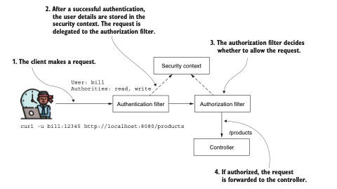
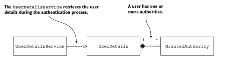
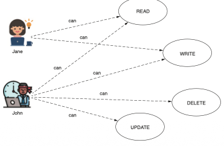
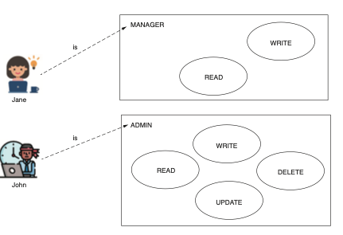
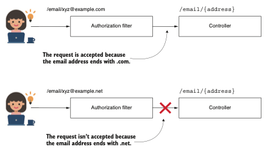
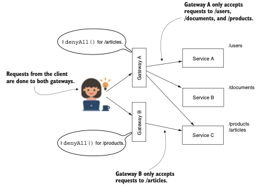

# PARTE 3: CONFIGURING AUTHORIZATION

Una vez que una aplicación determina su identidad, comienza la fase crucial de decidir sus permisos:
la autorización. Implementarla correctamente es fundamental, ya que errores pueden comprometer la 
privacidad del usuario y la integridad de los datos. En esta parte del libro, le guiaré a través de 
las complejas capas de autorización y de cómo protegerse contra vulnerabilidades comunes.

El capítulo 7 profundiza en el ámbito de las restricciones de acceso, centrándose en las autoridades
y roles del usuario, y ofrece ideas sobre cómo aplicar estas restricciones de forma universal.

El capítulo 8 continúa el recorrido, presentando métodos avanzados, como `requestMatchers()`, para 
seleccionar y aplicar restricciones de autorización. También introduce el uso de expresiones 
regulares para un control más detallado.

El capítulo 9 aborda la preocupación urgente de la falsificación de solicitudes entre sitios `(CSRF)`.
Al comprender su mecanismo en Spring Security, estará en condiciones de aplicar y personalizar 
eficazmente la protección `CSRF`.

El capítulo 10 introduce el concepto de intercambio de recursos de origen cruzado (`CORS`), 
explicando cómo funciona y guiándolo a través de la aplicación de políticas `CORS` mediante 
anotaciones y CorsConfigurer.

El capítulo 11 explora la seguridad a nivel de método, asegurando que las funciones individuales
dentro de su aplicación cumplan estrictos principios de autorización. Esto incluye reglas de pre y 
postautorización, así como configuraciones avanzadas de permisos para métodos.


# Configuración de la autorización a nivel de puntos de conexión: restringir el acceso

### Este capítulo cubre
- Definición de autoridades y roles
- Aplicación de reglas de autorización en puntos de conexión

Hace algunos años, esquiaba en las hermosas montañas de los Cárpatos cuando fui testigo de una 
escena divertida. Unas 10, quizás 15 personas estaban haciendo cola para subir a la cabaña que 
llevaba a la cima de la pista de esquí. Llegó un conocido artista pop, acompañado por dos 
guardaespaldas. Avanzó con confianza, esperando saltarse la cola por ser famoso. Al llegar al 
frente, se llevó una sorpresa. "¡El ticket, por favor!", dijo la persona que gestionaba la subida, 
quien luego tuvo que explicar: "Bueno, primero necesitas un ticket, y segundo, no hay una cola de 
prioridad para esta subida, lo siento. La cola termina allí". Señaló hacia el final de la fila. A 
menudo en la vida, no importa quién seas. Podemos decir lo mismo sobre las aplicaciones de software.
¡No importa quién seas al intentar acceder a una funcionalidad o datos específicos!

Hasta ahora, solo hemos hablado de autenticación, que es, como aprendiste, el proceso mediante el 
cual la aplicación identifica al solicitante de un recurso. En ejemplos anteriores, no implementamos
ninguna regla para decidir si aprobar o no una solicitud. Solo nos importaba si el sistema conocía 
al usuario o no. En la mayoría de las aplicaciones, no ocurre que todos los usuarios identificados 
por el sistema puedan acceder a cada recurso dentro de él. En este capítulo, discutiremos la 
autorización. La autorización es el proceso durante el cual el sistema decide si un cliente 
identificado tiene permiso para acceder al recurso solicitado.

La autorización es el proceso mediante el cual la aplicación decide si una entidad autenticada tiene
permitido acceder a un recurso. La autorización siempre ocurre después de la autenticación.

En Spring Security, una vez que la aplicación finaliza el flujo de autenticación, delega la 
solicitud a un filtro de autorización. El filtro permite o rechaza la solicitud según las reglas de 
autorización configuradas.



Al iniciarse la solicitud del cliente, el filtro de autenticación verifica la identidad del usuario.
Tras una verificación exitosa, el filtro de autenticación coloca los detalles del usuario en el 
contexto de seguridad y pasa la solicitud al filtro de autorización. Este filtro luego evalúa si se 
debe permitir la solicitud, tomando esta decisión utilizando la información del usuario 
proporcionada en el contexto de seguridad.

Para cubrir todos los aspectos esenciales sobre autorización, en este capítulo:

- Comprenderemos qué es una autoridad y aplicaremos reglas de acceso a todos los puntos de conexión
según las autoridades del usuario
- Aprenderemos a agrupar autoridades en roles y cómo aplicar reglas de autorización según los roles 
del usuario

En el capítulo 8, continuaremos seleccionando puntos de conexión a los cuales aplicaremos las reglas
de autorización. Por ahora, analicemos las autoridades y los roles, y cómo estos pueden restringir 
el acceso a nuestras aplicaciones.

## 7.1 Restringir el acceso basado en autoridades y roles

En esta sección, aprenderá sobre los conceptos de autoridades y roles. Estos se utilizan para 
proteger todos los puntos de conexión de su aplicación. Es necesario comprender estos conceptos 
antes de poder aplicarlos en escenarios del mundo real, donde diferentes usuarios tienen diferentes
permisos. Según los privilegios que tenga el usuario, solo podrá ejecutar una acción específica. La 
aplicación proporciona los privilegios en forma de autoridades y roles.

En el capítulo 3, implementó la interfaz `GrantedAuthority`. Este contrato se introdujo cuando 
analizamos otro componente esencial: la interfaz UserDetails. En aquel momento no trabajamos con 
`GrantedAuthority` porque, como aprenderá en este capítulo, esta interfaz está principalmente 
relacionada con el proceso de autorización. Ahora podemos regresar a `GrantedAuthority` para examinar 
su propósito. a continuacion se presenta la relación entre el contrato `UserDetails` y la interfaz 
`GrantedAuthority`. Una vez que terminemos de analizar este contrato, aprenderá cómo usar estas 
reglas individualmente o para solicitudes específicas.



Un usuario posee una o más autoridades (acciones permitidas). Durante la fase de autenticación, el 
`UserDetailsService` recupera detalles completos sobre el usuario, incluyendo sus autoridades. Tras 
una autenticación exitosa, la aplicación utiliza estas autoridades, representadas por la interfaz 
`GrantedAuthority`, para llevar a cabo la autorización.

El siguiente codigo Muestra la definición del contrato `GrantedAuthority`. Una autoridad es una 
acción que un usuario puede realizar sobre un recurso del sistema. Una autoridad tiene un nombre 
que el método `getAuthority()` del objeto devuelve como una cadena de texto `(String)`. Utilizamos el 
nombre de la autoridad al definir una regla de autorización personalizada. A menudo, una regla de 
autorización puede tener este aspecto: `«Jane tiene permitido eliminar los registros de productos»` 
o `«John tiene permitido leer los registros de documentos»`. En estos casos, delete `(eliminar)` y read
`(leer)` son las autoridades otorgadas. La aplicación permite a los usuarios `Jane y John` realizar 
estas acciones, que suelen tener nombres como `read, write o delete`.

The GrantedAuthority contract:
```java
public interface GrantedAuthority extends Serializable {
    String getAuthority();
}
```
`UserDetails`, que es el contrato que describe al usuario en Spring Security, tiene una colección de 
instancias `GrantedAuthority`. Puede otorgar a un usuario uno o más privilegios. El método 
`getAuthorities()` devuelve la colección de instancias GrantedAuthority. Puede revisar este método 
en el contrato `UserDetails`. Implementamos este método para que devuelva todas las autoridades 
concedidas al usuario. Una vez finalizada la autenticación, las autoridades pasan a formar parte 
de los detalles del usuario que inició sesión, que la aplicación puede utilizar para otorgar permisos.

The getAuthorities() method from the UserDetails contract:
```java
public interface UserDetails extends Serializable {
    Collection<? extends GrantedAuthority> getAuthorities();
// Omitted code
}
```
### 7.1.1 Restringir el acceso a todos los puntos de conexión según las autoridades del usuario

Esta sección trata sobre cómo limitar el acceso a puntos de conexión para usuarios específicos. 
Hasta ahora, en nuestros ejemplos, cualquier usuario autenticado podía invocar cualquier punto de 
conexión de la aplicación. Ahora aprenderá a personalizar este acceso. En las aplicaciones que se 
encuentran en producción, puede acceder a algunos de los puntos de conexión incluso si no está 
autenticado, mientras que para otros se necesitan privilegios especiales. Escribiremos varios 
ejemplos para que aprenda diversas formas de aplicar estas restricciones con Spring Security. 



Las autoridades definen las operaciones permitidas que los usuarios pueden ejecutar dentro de la 
aplicación. Estas operaciones sirven de base para la creación de protocolos de autorización, 
restringiendo ciertas solicitudes a puntos de conexión solo a usuarios con autoridades designadas. 
Por ejemplo, a `Jane` se le limita la lectura y escritura en el punto de conexión, mientras que `Juan` 
tiene la capacidad de leer, escribir, eliminar y modificar en ese punto de conexión.

Ahora que puede recordar los contratos `UserDetails` y `GrantedAuthority` y la relación entre ellos, 
es momento de escribir una pequeña aplicación que aplique una regla de autorización. Con este 
ejemplo, aprenderá varias alternativas para configurar el acceso a puntos de conexión según las 
autoridades del usuario. Iniciamos un nuevo proyecto que he nombrado ssia-ch7-ex1. Le mostraré tres
formas de configurar el acceso utilizando estos métodos:

- `hasAuthority()` — Recibe como parámetro una única autoridad para la cual la aplicación configura 
las restricciones. Solo los usuarios que posean esa autoridad pueden invocar el punto de conexión.
- `hasAnyAuthority()` — Puede recibir más de una autoridad para las cuales la aplicación configura 
las restricciones. Recuerdo a este método como `«tiene cualquiera de las autoridades indicadas»`. 
El usuario debe tener al menos una de las autoridades especificadas para realizar la solicitud.

Recomiendo usar este método o `hasAuthority()`, según la cantidad de privilegios que asigne, ya que 
son fáciles de leer en la configuración y hacen que el código sea más comprensible.

- `access()` Ofrece posibilidades ilimitadas para configurar el acceso, ya que la aplicación 
construye las reglas de autorización basadas en un objeto personalizado llamado `AuthorizationManager`
que usted implementa. Puede proporcionar cualquier implementación del contrato `AuthorizationManager`,
dependiendo del caso. Spring Security también ofrece algunas implementaciones, siendo la más común 
`WebExpressionAuthorizationManager`, que permite aplicar reglas de autorización basadas en `Spring 
Expression Language (SpEL).` Sin embargo, usar el método `access()` puede hacer que las reglas de 
autorización sean más difíciles de leer y entender, por lo que lo recomiendo solo cuando no pueda 
usar `hasAnyAuthority() o hasAuthority()`.

Las únicas dependencias necesarias en su archivo pom.xml son spring-boot-starter-web y 
spring-boot-starter-security. Estas dependencias son suficientes para implementar las tres 
soluciones mencionadas. Puede encontrar este ejemplo en el proyecto ssia-ch7-ex1:
```xml
<dependency>
<groupId>org.springframework.boot</groupId>
<artifactId>spring-boot-starter-security</artifactId>
</dependency>
<dependency>
<groupId>org.springframework.boot</groupId>
<artifactId>spring-boot-starter-web</artifactId>
</dependency>
```
También agregamos un punto de conexión en la aplicación para probar nuestra configuración de 
autorización:
```java
@RestController
public class HelloController {
    @GetMapping("/hello")
    public String hello() {
        return "Hello!";
    }
}
```
En una clase de configuración, declaramos un `InMemoryUserDetailsManager` como nuestro 
`UserDetailsService` y agregamos dos usuarios, `John y Jane`, para que sean gestionados. Cada usuario 
tiene una autoridad diferente. Puede ver cómo hacerlo en el siguiente codigo.

Declaring the UserDetailsService and assigning users:
```java
@Configuration
public class ProjectConfig {
    @Bean  //El UserDetailsService devuelto por el metodo se agrega al Spring Context.
    public UserDetailsService userDetailsService() {
        //Declara un InMemoryUserDetailsManager que almacena un par de usuarios.
        var manager = new InMemoryUserDetailsManager();
        //el primer usuario tiene autorizacion de lectura
        var user1 = User.withUsername("john")
                .password("12345")
                .authorities("READ")
                .build();
        //el segundo tiene autirizacion de escritura
        var user2 = User.withUsername("jane")
                .password("12345")
                .authorities("WRITE")
                .build();
        //Los usuarios son agregados y gestionados por el UserDetailsService.
        manager.createUser(user1);
        manager.createUser(user2);
        return manager;
    }
    //No olvides que también se necesita un PasswordEncoder.
    @Bean
    public PasswordEncoder passwordEncoder() {
        return NoOpPasswordEncoder.getInstance();
    }
}    
```
Lo siguiente que hacemos es agregar la configuración de autorización. En el capítulo 2, cuando 
trabajamos en el primer ejemplo, viste cómo podíamos hacer que todos los endpoints fueran 
accesibles para todos. Para hacer eso, creamos un bean `SecurityFilterChain` en el contexto de la 
aplicación, similar a lo que se presenta en el siguiente codigo.

Making all the endpoints accessible for everyone without authentication:
```java
@Configuration
public class ProjectConfig {
    // Omitted code
    @Bean
    public SecurityFilterChain securityFilterChain(HttpSecurity http)
            throws Exception {
        http.httpBasic(Customizer.withDefaults());
        http.authorizeHttpRequests(
                c -> c.anyRequest().permitAll()
        );  //Permitir acceso para todas las peticiones
        return http.build();
    }
}
```

El método `authorizeHttpRequests()` nos permite continuar especificando reglas de autorización en los
`endpoints`. El método `anyRequest()` indica que la regla se aplica a todas las solicitudes, 
independientemente de la URL o del método HTTP utilizado. El método `permitAll()` permite el acceso a
todas las solicitudes coincidentes, autenticadas o no.

Supongamos que queremos asegurarnos de que solo los usuarios con la autoridad `WRITE` puedan acceder 
a todos los `endpoints`. Para nuestro ejemplo, esto significa solo `Jane`. Podemos lograr nuestro 
objetivo y restringir el acceso esta vez en función de las autoridades del usuario. Echa un vistazo
al siguiente código.

Restricting access to only users having WRITE authority:
```java
@Configuration
public class ProjectConfig {
    // Omitted code
    @Bean
    public SecurityFilterChain securityFilterChain(HttpSecurity http)
            throws Exception {
        http.httpBasic(Customizer.withDefaults());
        http.authorizeHttpRequests(
                c -> c.anyRequest()
                        .hasAuthority("WRITE")
        ); //Especifica la condición en la que el usuario tiene acceso a los endpoints.
        return http.build();
    }
}
```
Puedes ver que el método `permitAll()` fue reemplazado por el método `hasAuthority()`. Proporcionas el
nombre de la autoridad permitida al usuario como parámetro del método `hasAuthority()`. La aplicación
primero debe autenticar la solicitud y luego, en función de las autoridades del usuario, decide si
permite la llamada.

Ahora podemos comenzar a probar la aplicación llamando al endpoint con cada uno de los dos usuarios.
Cuando llamamos al `endpoint` con la usuaria Jane, el estado de la respuesta `HTTP es 200 OK` y vemos 
el cuerpo de la respuesta `"Hello!"`. Cuando lo hacemos con el usuario `John`, el estado de la 
respuesta `HTTP es 403 Forbidden` y obtenemos un cuerpo de respuesta vacío.

Por ejemplo, al llamar a este endpoint con la usuaria Jane:

`curl -u jane:12345 http://localhost:8080/hello`

obtenemos esta respuesta:

`Hello!`

Al llamar al endpoint con el usuario John:

`curl -u john:12345 http://localhost:8080/hello`

obtenemos esta respuesta:
```json
{
  "status":403,
  "error":"Forbidden",
  "message":"Forbidden",
  "path":"/hello"
}
```
De forma similar, podemos usar el método `hasAnyAuthority()`. Este método tiene el parámetro varargs,
lo que le permite recibir múltiples nombres de autoridades. La aplicación permite la solicitud si 
el usuario tiene al menos una de las autoridades proporcionadas como parámetro al método. Puedes 
reemplazar `hasAuthority()` en el listado anterior con `hasAnyAuthority("WRITE")`, en cuyo caso la 
aplicación funciona exactamente de la misma manera.

Si, sin embargo, reemplazas `hasAuthority()` con `hasAnyAuthority("WRITE", "READ")`, entonces se 
aceptan las solicitudes de usuarios que tengan cualquiera de esas autoridades. En nuestro caso, la 
aplicación permite las solicitudes tanto de `John` como de `Jane`. El siguiente codigo muestra cómo 
aplicar el método `hasAnyAuthority()`.

Applying the `hasAnyAuthority()` method:
```java
@Configuration
public class ProjectConfig {
    // Omitted code
    @Bean
    public SecurityFilterChain securityFilterChain(HttpSecurity http)
            throws Exception {
        http.httpBasic(Customizer.withDefaults());
        http.authorizeHttpRequests(
                c -> c.anyRequest()
                        .hasAnyAuthority("WRITE", "READ")
        ); //Permite solicitudes de usuarios con ambas autoridades, WRITE y READ.
        return http.build();
    }
}
```
Ahora puedes llamar al endpoint correctamente con cualquiera de nuestros dos usuarios. Esta es la 
llamada para

`curl -u john:12345 http://localhost:8080/hello`

El cuerpo de la respuesta es

`Hello!`

Y la llamada para Jane es

`curl -u jane:12345 http://localhost:8080/hello`

El cuerpo de la respuesta es

`Hello!`

Para especificar el acceso basado en las autoridades del usuario, la tercera forma que se encuentra 
en la práctica es el método `access()`. El método `access()` es más general, sin embargo. Recibe como 
parámetro una implementación de `AuthorizationManager`. Puedes proporcionar cualquier implementación 
para este objeto que pueda aplicar cualquier tipo de lógica que defina las reglas de autorización. 
Este método es potente y no se refiere únicamente a autoridades. Sin embargo, también hace que el 
código sea más difícil de leer y entender. Por esta razón, lo recomiendo como última opción, y 
solo si no puedes aplicar alguno de los métodos `hasAuthority()` o `hasAnyAuthority()` presentados 
anteriormente en esta sección.

Para hacer este método más fácil de entender, primero lo presento como una alternativa para 
especificar autoridades con los métodos `hasAuthority()` y `hasAnyAuthority()`. En este ejemplo, 
usarás una implementación de `AuthorizationManager` en la que debes proporcionar una expresión `SpEL`
como parámetro. La regla de autorización que definimos se vuelve más difícil de leer, y por eso no
recomiendo este enfoque para reglas simples. Sin embargo, el método `access()` tiene la ventaja de 
permitirte personalizar reglas a través de la implementación de `AuthorizationManager` que 
proporciones como parámetro. ¡Y esto es realmente potente! Al igual que con las expresiones `SpEL`,
básicamente puedes definir cualquier condición.

`NOTA`: En la mayoría de los casos, las restricciones requeridas se pueden implementar con los 
métodos `hasAuthority()` y `hasAnyAuthority()`, y recomiendo que los uses. Usa el método `access() `
solo si las otras dos opciones no son adecuadas y deseas implementar reglas de autorización más 
genéricas.

Comenzamos con un ejemplo simple para cumplir con el mismo requisito que en los casos anteriores. 
Si solo tienes que comprobar si el usuario tiene autoridades específicas, la expresión que necesitas
usar con el método `access()` puede ser una de las siguientes:

- `hasAuthority('WRITE')` Estipula que el usuario necesita la autoridad WRITE para llamar al endpoint.
- `hasAnyAuthority('READ', 'WRITE')` Especifica que el usuario necesita una de las autoridades `READ`
o `WRITE`. Con esta expresión, puedes enumerar todas las autoridades para las que deseas permitir el acceso.

Using the access() method to configure access to the endpoints:
```java
@Configuration
public class ProjectConfig {
    // Omitted code
    @Bean
    public SecurityFilterChain securityFilterChain(HttpSecurity http)
            throws Exception {
        http.httpBasic(Customizer.withDefaults());
        http.authorizeHttpRequests(
                c -> c.anyRequest()
                        .access("hasAuthority('WRITE')")
        );  //Autoriza solicitudes de usuarios con la autoridad WRITE.
    
        return http.build();
    }
}
```
El ejemplo presentado en el anterior codigo demuestra cómo el método `access()` complica la sintaxis 
si se utiliza para requisitos sencillos. En tal caso, deberías usar directamente los métodos 
`hasAuthority()` o `hasAnyAuthority()`. Pero el método `access()` no es del todo negativo. Como se 
indicó anteriormente, ofrece flexibilidad. Encontrarás situaciones en escenarios reales en las 
que podrías usarlo para escribir expresiones más complejas, según las cuales la aplicación concede 
acceso. No podrías implementar estos escenarios sin el método `access()`.

En el anterior codigo, puedes encontrar el método `access()` aplicado con una expresión que no sería 
fácil de escribir de otro modo. Concretamente, la configuración presentada en el codigo anterior 
define dos usuarios, `John y Jane`, que tienen diferentes autoridades. El usuario `John` tiene solo 
autoridad de `lectura`, mientras que `Jane` tiene autoridades de `lectura`, escritura y eliminación. El 
endpoint debería ser accesible para aquellos usuarios que tengan autoridad de `lectura`, pero no para
aquellos que tengan autoridad de `eliminación`.

`NOTA`: En aplicaciones Spring, se encuentran varios estilos y convenciones para nombrar autoridades.
Algunos desarrolladores usan solo mayúsculas, mientras que otros usan solo minúsculas. En mi 
opinión, todas estas opciones son válidas siempre que se mantengan de forma consistente en tu 
aplicación. En este libro, uso diferentes estilos en los ejemplos para que puedas observar más 
enfoques que podrías encontrar en escenarios del mundo real.

Se trata de un ejemplo hipotético, por supuesto, pero lo suficientemente sencillo para ser fácil
de entender y lo suficientemente complejo como para demostrar por qué el método `access()` es más 
potente. Para implementarlo con el método `access()`, puedes usar una implementación de 
`AuthorizationManager` que tome una expresión `SpEL`. La expresión `SpEL` debe reflejar el requisito. 
Por ejemplo:

`"hasAuthority('read') and !hasAuthority('delete')"`

El siguiente listado ilustra cómo aplicar el método `access()` con una expresión más compleja. Puedes
encontrar este ejemplo en el proyecto denominado ssia-ch7-ex2.

Applying the access() method with a more complex expression:
```java
@Configuration
public class ProjectConfig {
    @Bean
    public UserDetailsService userDetailsService() {
        var manager = new InMemoryUserDetailsManager();
        var user1 = User.withUsername("john")
                .password("12345")
                .authorities("read")
                .build();
        var user2 = User.withUsername("jane")
                .password("12345")
                .authorities("read", "write", "delete")
                .build();
        manager.createUser(user1);
        manager.createUser(user2);
        return manager;
    }

    @Bean
    public PasswordEncoder passwordEncoder() {
        return NoOpPasswordEncoder.getInstance();
    }

    @Bean
    public SecurityFilterChain securityFilterChain(HttpSecurity http)
            throws Exception {
        http.httpBasic(Customizer.withDefaults());
        //Indica que el usuario debe tener la autoridad read pero no la autoridad delete.
        String expression =
                """hasAuthority('read') and
                        !hasAuthority('delete')
                        """;
        http.authorizeHttpRequests(
                c -> c.anyRequest()
                        .access(new WebExpressionAuthorizationManager(expression))
        );
        return http.build();
    }
}
```
Probemos nuestra aplicación ahora llamando al endpoint /hello para el usuario `John`:

`curl -u john:12345 http://localhost:8080/hello`

El cuerpo de la respuesta es

`Hello!`

Y al llamar al endpoint con la usuaria `Jane`

`curl -u jane:12345 http://localhost:8080/hello`

el cuerpo de la respuesta es

`Hello!`
```json
  "status":403,
  "error":"Forbidden",
  "message":"Forbidden",
  "path":"/hello"
```
El usuario John solo tiene autoridad de lectura y puede llamar al endpoint con éxito. Sin embargo,
Jane también tiene autoridad de eliminación y no está autorizada para llamar al endpoint. El estado
HTTP para la llamada de Jane es 403 Forbidden.

Con estos ejemplos, puedes ver cómo establecer restricciones respecto a las autoridades que un 
usuario necesita tener para acceder a ciertos endpoints. Por supuesto, aún no hemos tratado la 
selección de qué solicitudes se deben proteger según la ruta o el método HTTP. En cambio, hemos 
aplicado las reglas a todas las solicitudes, independientemente del endpoint expuesto por la 
aplicación. Una vez que terminemos de ejecutar la misma configuración para los roles de usuario, 
discutiremos cómo seleccionar los endpoints a los que aplicar las configuraciones de autorización.

### 7.1.2 Restringir el acceso a todos los endpoints según los roles de usuario

En esta sección, se analiza la restricción de acceso a endpoints basada en roles. Los roles son 
otra forma de referirse a lo que un usuario puede hacer. También se encuentran en aplicaciones del 
mundo real, por eso es importante entender los roles y la diferencia entre roles y autoridades.
En esta sección, se aplican varios ejemplos usando roles para que conozcas todos los escenarios 
prácticos en los que la aplicación los utiliza y cómo escribir configuraciones para estos casos.



Los roles son granulares. Cada usuario con un rol específico solo puede realizar las acciones 
permitidas por ese rol. Al aplicar esta filosofía en la autorización, se permite una solicitud 
según el propósito del usuario en el sistema. Solo los usuarios que tienen un rol específico pueden 
llamar a un determinado endpoint.

Spring Security entiende las autoridades como privilegios granulares sobre los que se aplican 
restricciones. Los roles son como insignias para los usuarios. Estos otorgan a un usuario 
privilegios para un grupo de acciones. Algunas aplicaciones siempre proporcionan los mismos grupos
de autoridades a usuarios específicos. Imagina que en tu aplicación un usuario solo puede tener 
autoridad de lectura o tener todas las autoridades `(lectura, escritura y eliminación)`. En este 
caso, podría ser más cómodo pensar que aquellos usuarios que solo pueden leer tienen un rol 
llamado `READER`, mientras que los demás tienen el rol `ADMIN`. Tener el rol `ADMIN` significa que la 
aplicación te otorga privilegios de `lectura, escritura, actualización y eliminación`. Potencialmente
podrías tener más `roles`. Por ejemplo, si en algún momento los requisitos indican que también 
necesitas un usuario que solo pueda `leer y escribir`, puedes crear un tercer rol llamado `MANAGER` 
para tu aplicación.

`NOTA`: Cuando se utiliza un enfoque con roles en la aplicación, ya no tendrás que definir 
autoridades. Las autoridades existen, en este caso como un concepto, y pueden aparecer en los 
requisitos de implementación. Pero en la aplicación, solo tienes que definir un rol para cubrir 
una o más acciones para las que el usuario tenga privilegios.

Los nombres que das a los roles son como los nombres para las autoridades: es tu propia elección. 
Podríamos decir que los roles son granulares en comparación con las autoridades. Detrás de escena,
de todos modos, los roles se representan usando el mismo contrato en Spring Security, 
`GrantedAuthority`. Al definir un rol, su nombre debe comenzar con el prefijo `ROLE_`. A nivel de 
implementación, este prefijo especifica la diferencia entre un rol y una autoridad. Puedes encontrar
el ejemplo en el que trabajamos en esta sección en el proyecto ssia-ch7-ex3. En el siguiente 
codigo, echemos un vistazo al cambio que hice en el ejemplo anterior.

Setting roles for users:
```java
@Configuration
public class ProjectConfig {
    @Bean
    public UserDetailsService userDetailsService() {
        var manager = new InMemoryUserDetailsManager();
        var user1 = User.withUsername("john")
                .password("12345")
                //Al tener el prefijo ROLE_, GrantedAuthority ahora representa un rol.
                .authorities("ROLE_ADMIN")
                .build();
        var user2 = User.withUsername("jane")
                .password("12345")
                .authorities("ROLE_MANAGER")
                .build();
        manager.createUser(user1);
        manager.createUser(user2);
        return manager;
    }
// Omitted code
}
```
Para establecer restricciones según los roles de usuario, puedes usar uno de los siguientes métodos:
- `hasRole()` Recibe como parámetro el nombre del rol para el cual la aplicación autoriza la solicitud.
- `hasAnyRole()` Recibe como parámetros los nombres de los roles para los cuales la aplicación 
aprueba la solicitud.
- `access()` Utiliza un AuthorizationManager para especificar el o los roles para los cuales la 
aplicación autoriza las solicitudes. En cuanto a roles, podrías usar `hasRole()` o `hasAnyRole()` como 
expresiones `SpEL` junto con la implementación `WebExpressionAuthorizationManager`.

Como puedes observar, los nombres son similares a los métodos presentados en la sección 7.1.1. Se 
usan de la misma manera, pero para aplicar configuraciones para roles en lugar de autoridades. Mis
recomendaciones también son similares: usa los métodos `hasRole()` o `hasAnyRole()` como primera 
opción, y recurre al uso de `access()` solo cuando los dos anteriores no sean aplicables. El 
siguiente codigo muestra cómo queda ahora el método `securityFilterChain()`.

Configuring the app to accept only requests from admins:
```java
@Configuration
public class ProjectConfig {
    // Omitted code
    @Bean
    public SecurityFilterChain securityFilterChain(HttpSecurity http)
            throws Exception {
        http.httpBasic(Customizer.withDefaults());
        http.authorizeHttpRequests(
                c -> c.anyRequest().hasRole("ADMIN")
        ); //El metodo hasRole() ahora especifica los roles para los cuales se permite el acceso al 
        // endpoint. Ten en cuenta que el prefijo ROLE_ no aparece aquí.
        return http.build();
    }
}
```
`NOTA`: Una cosa fundamental a tener en cuenta es que el prefijo `ROLE_` solo se utiliza para declarar 
el rol. Pero cuando se usa el rol, se hace únicamente por su nombre.
Al probar la aplicación, deberías observar que el usuario John puede acceder al endpoint, mientras 
que Jane recibe un error `HTTP 403 Forbidden`. Para llamar al endpoint con el usuario John, usa

`curl -u john:12345 http://localhost:8080/hello`

El cuerpo de la respuesta es

`Hello!`

Y para llamar al endpoint con la usuaria Jane, usa

`curl -u jane:12345 http://localhost:8080/hello`

El cuerpo de la respuesta es
```json
    "status":403,
    "error":"Forbidden",
    "message":"Forbidden",
    "path":"/hello"
```
Al crear usuarios con la clase User builder, como hicimos en el ejemplo de esta sección, se 
especifica el rol utilizando el método `roles()`. Este método crea el objeto `GrantedAuthority` y 
agrega automáticamente el prefijo `ROLE_` a los nombres que proporcionas.

`NOTA`: Asegúrate de que el parámetro que proporcionas al método `roles()` no incluya el prefijo 
`ROLE_`. Si ese prefijo se incluye accidentalmente en el parámetro de `role()`, el método lanzará una 
excepción. En resumen, al usar el método `authorities()`, incluye el prefijo `ROLE_`; al usar el método 
`roles()`, no lo incluyas.
En el siguiente codigo, puedes ver la forma correcta de usar el método `roles()` en lugar del método 
`authorities()` cuando diseñas el acceso basado en `roles`. También puedes comparar este codigo con 
el anterior para observar la diferencia entre usar `autoridades y roles`.

Setting up roles with the roles() method:
```java
@Configuration
public class ProjectConfig {
    @Bean
    public UserDetailsService userDetailsService() {
        var manager = new InMemoryUserDetailsManager();
        var user1 = User.withUsername("john")
                .password("12345")
                //El metodo roles() especifica los roles del usuario.
                .roles("ADMIN")
                .build();
        var user2 = User.withUsername("jane")
                .password("12345")
                .roles("MANAGER")
                .build();
        manager.createUser(user1);
        manager.createUser(user2);
        return manager;
    }
    //omitted code
}
```
### Más sobre el método access()

En las secciones 7.1.1 y 7.1.2, aprendiste a usar el método `access()` para aplicar reglas de 
autorización relacionadas con autoridades y roles. En general, en una aplicación, las restricciones
de autorización están relacionadas con autoridades y roles. Sin embargo, es importante recordar 
que el método `access()` es genérico y depende únicamente de la implementación del contrato 
`AuthorizationManager` que proporciones como parámetro. Además, en nuestros ejemplos, solo usamos 
la implementación `WebExpressionAuthorizationManager`, que aplica restricciones de autorización 
basadas en una expresión `SpEL`. Con los ejemplos presentados, me enfoco en enseñarte cómo aplicarlo
para autoridades y roles, pero en la práctica,`WebExpressionAuthorizationManager` puede recibir 
cualquier expresión `SpEL`, sin necesidad de que esté relacionada con autoridades o roles.

Un ejemplo sencillo sería configurar el acceso al endpoint para que solo se permita después de las 
12:00. Para resolver algo así, puedes usar la siguiente expresión `SpEL`:

`T(java.time.LocalTime).now().isAfter(T(java.time.LocalTime).of(12, 0))`

Para más información sobre expresiones `SpEL`, consulta la documentación de Spring Framework: 
`http://mng.bz/M9J7` Podría decirse que con el método `access()` puedes implementar prácticamente 
cualquier tipo de regla. Las posibilidades son infinitas. Solo no olvides que, en las aplicaciones,
siempre se busca mantener la sintaxis lo más simple posible. Complica tus configuraciones solo 
cuando no tengas otra opción. Puedes encontrar este ejemplo aplicado en el proyecto ssia-ch7-ex4.

### 7.1.3 Restringir el acceso a todos los endpoints

En esta sección, se analiza la restricción del acceso a todas las solicitudes. Aprendiste en la 
sección 5.2 que, mediante el uso del método `permitAll()`, puedes permitir el acceso a todas las 
solicitudes. También aprendiste que puedes aplicar reglas de acceso basadas en autoridades y roles.
Pero lo que también puedes hacer es denegar todas las solicitudes. El método `denyAll()` es justo lo 
opuesto al método `permitAll()`. En el siguiente codigo, puedes ver cómo usar el método `denyAll()`.

Using the denyAll() method to restrict access to endpoints:
```java
@Configuration
public class ProjectConfig {
    // Omitted code
    @Bean
    public SecurityFilterChain securityFilterChain(HttpSecurity http)
            throws Exception {
        http.httpBasic(Customizer.withDefaults());
        http.authorizeHttpRequests(
                c -> c.anyRequest().denyAll()
        );  //Utiliza denyAll() para restringir el acceso para todos.
        return http.basic();
    }
}
```
¿Dónde podrías usar tal restricción? No es tan común como otros métodos, pero existen casos donde 
los requisitos lo hacen necesario. Por ejemplo, se puede usar `denyAll()` para bloquear completamente
el acceso a ciertas rutas, como APIs internas o archivos sensibles `(por ejemplo, bloquear cualquier
solicitud que termine en .xhtml)`. También es útil como regla predeterminada para denegar acceso a 
todos los endpoints no especificados explícitamente, asegurando que solo las rutas permitidas sean 
accesibles. Esto es común en escenarios donde se desea una política de "denegación por defecto", 
mejorando la seguridad al requerir que cada acceso sea definido explícitamente. 

Supongamos que tienes un endpoint que recibe una dirección de correo electrónico como variable de 
ruta. Quieres permitir solicitudes cuyo valor en la variable termine en .com. No deseas que la 
aplicación acepte ningún otro formato para la dirección de correo. `(Aprenderás en el próximo 
capítulo cómo aplicar restricciones a un grupo de solicitudes según la ruta, el método HTTP e 
incluso variables de ruta)`. Para este requisito, puedes usar una expresión regular para agrupar 
las solicitudes que coincidan con tu regla y luego usar el método `denyAll()` para indicar a tu 
aplicación que rechace todas estas solicitudes.



Cuando el usuario llama al endpoint con un valor del parámetro que termina en .com, la aplicación 
acepta la solicitud. Cuando el usuario llama al endpoint y proporciona una dirección de correo que 
termina en .net, la aplicación rechaza la llamada. Para lograr este comportamiento, puedes usar el
método `denyAll()` para todos los endpoints cuyo valor del parámetro no termine con .com.

También puedes imaginar una aplicación diseñada como en la siguiente figura. Varios servicios implementan
los casos de uso de la aplicación, a los que se accede mediante endpoints disponibles en diferentes
rutas. Pero para llamar a un endpoint, el cliente realiza la solicitud a otro servicio que podemos 
llamar pasarela `(gateway)`. En esta arquitectura, hay dos servicios de pasarela independientes.
los he denominado `Pasarela A` y `Pasarela B`. El cliente solicita la `Pasarela A` si desea acceder a 
la ruta `/products`. Pero para la ruta `/articles`, el cliente debe solicitar la `Pasarela B`. 
Cada uno de los servicios de pasarela está diseñado para denegar todas las solicitudes
a otras rutas que no sirven. Este escenario simplificado puede ayudarte a entender fácilmente el 
método `denyAll()`. En una aplicación de producción, podrías encontrar casos similares en 
arquitecturas más complejas.



El acceso se realiza a través de las Pasarelas A y B. Cada una de las pasarelas atiende únicamente 
solicitudes para rutas específicas y deniega todas las demás.

Las aplicaciones en producción enfrentan diversos requisitos arquitectónicos, que a veces pueden 
parecer extraños. Un framework debe permitir la flexibilidad necesaria para cualquier situación que 
pueda surgir. Por esta razón, el método `denyAll()` es tan importante como todas las demás opciones 
que has aprendido en este capítulo.

Resumen 
- La autorización es el proceso mediante el cual la aplicación decide si una solicitud autenticada 
tiene permiso para acceder. La autorización siempre ocurre después de la autenticación. 
- Configuras cómo la aplicación autoriza las solicitudes según las autoridades y roles de un 
usuario autenticado. 
- En tu aplicación, también puedes especificar que ciertas solicitudes sean posibles para usuarios 
no autenticados. 
- Puedes configurar tu aplicación para rechazar cualquier solicitud, usando el método `denyAll()`, o 
permitir cualquier solicitud, usando el método `permitAll()`.