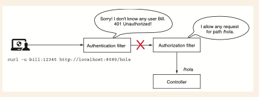
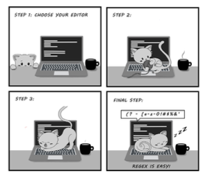

# Configuración de la autorización a nivel de punto final:
# Aplicación de restricciones

### Este capítulo cubre
- Seleccionar solicitudes para aplicar restricciones utilizando métodos matcher
- Conocer los mejores casos para cada método matcher 

En el capítulo 7 aprendiste cómo configurar el acceso basado en autoridades y roles. Pero solo 
aplicamos las configuraciones a todos los puntos finales. En este capítulo, aprenderás cómo aplicar
restricciones de autorización a un grupo específico de solicitudes. En aplicaciones de producción, 
es menos probable que apliques las mismas reglas a todas las solicitudes. Tienes puntos finales que 
solo pueden ser invocados por usuarios específicos, mientras que otros puntos finales podrían ser 
accesibles para todos. Dependiendo de los requisitos del negocio, cada aplicación tiene su propia 
configuración personalizada de autorización. Discutamos las opciones disponibles para referirnos a 
diferentes solicitudes cuando escribimos configuraciones de acceso.

Aunque no le prestamos atención, el primer método matcher que usaste fue el método `anyRequest()`. 
Y como se usó en capítulos anteriores, ahora sabes que se refiere a todas las solicitudes, 
independientemente de la ruta o del método HTTP. Es la forma de decir "cualquier solicitud" o, a 
veces, "cualquier otra solicitud".

Primero, hablemos de seleccionar solicitudes por ruta; luego también podemos agregar el método HTTP
al escenario. Para elegir las solicitudes a las que aplicamos la configuración de autorización, 
usamos el método `requestMatchers()`.

## 8.1 Usando el método `requestMatchers()` para seleccionar endpoints

En esta sección, aprenderás cómo usar el método `requestMatchers()` en general, para que en las 
secciones 8.2 a 8.4 podamos seguir describiendo varios enfoques para seleccionar las solicitudes 
HTTP a las que necesitas aplicar restricciones de autorización. Al final de este capítulo, podrás 
aplicar el método `requestMatchers()` en cualquier configuración de autorización que puedas necesitar 
escribir según los requisitos de tu aplicación. Comencemos con un ejemplo sencillo.
Creamos una aplicación que expone dos puntos finales: /hello y /ciao. Queremos
asegurarnos de que solo los usuarios con el rol `ADMIN` puedan llamar al punto `final /hello`. De manera
similar, queremos asegurarnos de que solo los usuarios con el rol `MANAGER` puedan llamar al punto 
`final /ciao`. Puedes encontrar este ejemplo en el proyecto ssia-ch8-ex1. La siguiente lista define 
la clase controladora.

The definition of the controller class:
```java
@RestController
public class HelloController {
    @GetMapping("/hello")
    public String hello() {
        return "Hello!";
    }

    @GetMapping("/ciao")
    public String ciao() {
        return "Ciao!";
    }
}
```
En la clase de configuración, declaramos un `InMemoryUserDetailsManager` como nuestra instancia de 
`UserDetailsService` y agregamos dos usuarios con diferentes roles. `El usuario John tiene el rol 
ADMIN`, mientras que `Jane tiene el rol MANAGER`. Para especificar que solo los usuarios con el rol 
`ADMIN puedan llamar al endpoint /hello` al autorizar solicitudes, utilizamos el método 
`requestMatchers()`. La siguiente lista presenta la definición de la clase de configuración.

The definition of the configuration class:
```java
@Configuration
public class ProjectConfig {
    @Bean
    public UserDetailsService userDetailsService() {
        var manager = new InMemoryUserDetailsManager();
        var user1 = User.withUsername("john")
                .password("12345")
                .roles("ADMIN")
                .build();
        var user2 = User.withUsername("jane")
                .password("12345")
                .roles("MANAGER")
                .build();
        manager.createUser(user1);
        manager.createUser(user2);
        return manager;
    }

    @Bean
    public PasswordEncoder passwordEncoder() {
        return NoOpPasswordEncoder.getInstance();
    }

    @Bean
    public SecurityFilterChain securityFilterChain(HttpSecurity http)
            throws Exception {
        http.httpBasic(Customizer.withDefaults());
        http.authorizeHttpRequests(
                c -> c.requestMatchers("/hello").hasRole("ADMIN")// solo llama la direccion /hello
                        .requestMatchers("/ciao").hasRole("MANAGER")// solo llama la direccion /ciao
        );
        return http.build();
    }
}
```
Puedes ejecutar y probar esta aplicación. Cuando llamas al endpoint `/hello` con el usuario John, 
obtienes una respuesta exitosa. Pero si llamas al mismo endpoint con la usuaria Jane, el estado 
de la respuesta devuelve un HTTP 403 Forbidden. De manera similar, para el endpoint `/ciao`, solo 
puedes usar a Jane para obtener un resultado exitoso. Para el usuario John, el estado de la 
respuesta devuelve un `HTTP 403 Forbidden`. Puedes ver los ejemplos de llamadas usando cURL en los 
fragmentos de código que siguen. Para llamar al endpoint `/hello` con el usuario John, usa

`curl -u john:12345 http://localhost:8080/hello`

El cuerpo de la respuesta es

`Hello!`

Para llamar al endpoint /hello con la usuaria Jane, usa

`curl -u jane:12345 http://localhost:8080/hello`

El cuerpo de la respuesta es
```json
{
  "status":403,
  "error":"Forbidden",
  "message":"Forbidden",
  "path":"/hello"
}
```
To call the endpoint /ciao for user Jane, use

`curl -u jane:12345 http://localhost:8080/ciao`

The response body is

`Ciao!`

To call the endpoint /ciao for user John, use

`curl -u john:12345 http://localhost:8080/ciao`

The response body is
```json
{
  "status":403,
  "error":"Forbidden",
  "message":"Forbidden",
  "path":"/ciao"
}
```
Cuando accedes a este nuevo punto final, verás que es accesible con o sin un usuario válido. Los 
fragmentos de código que siguen muestran este comportamiento. Para llamar al endpoint `/hola` sin 
autenticar, usa

`curl http://localhost:8080/hola`

El cuerpo de la respuesta es

`Hola!`

Para llamar al endpoint `/hola` con el usuario John, usa

`curl -u john:12345 http://localhost:8080/hola`

El cuerpo de la respuesta es

`Hola!`

Puedes hacer este comportamiento más evidente si lo deseas, utilizando el método `permitAll()`. Esto 
se hace usando el método `anyRequest()` al final de la cadena de configuración para la autorización 
de solicitudes, como se muestra en el codigo.

`NOTA`: Es una buena práctica hacer explícitas todas tus reglas. El siguiente codigo indica clara y 
explícitamente la intención de permitir solicitudes a los puntos finales para todos, excepto para 
los puntos finales /hello y /ciao.

Marcar explícitamente solicitudes adicionales como accesibles sin autenticación:
```java
@Configuration
public class ProjectConfig {
    // Omitted code
    @Bean
    public SecurityFilterChain securityFilterChain(HttpSecurity http)
            throws Exception {
        http.httpBasic(Customizer.withDefaults());
        http.authorizeHttpRequests(
                c -> c.requestMatchers("/hello").hasRole("ADMIN")
                        .requestMatchers("/ciao").hasRole("MANAGER")
                        .anyRequest().permitAll() // permite acceso a todos los endpoints sin autenticacion
        );
        return http.build();
    }
}
```
`NOTA`: Cuando usas matchers para referirte a solicitudes, el orden de las reglas debe ir de lo 
particular a lo general. Por eso, el método `anyRequest()` no puede llamarse antes que un método 
`requestMatchers()` más específico.

#### No autenticado vs. autenticación fallida
Si has diseñado un punto final para que sea accesible por cualquiera, puedes llamarlo sin 
proporcionar un nombre de usuario ni una contraseña para la autenticación. En este caso, Spring 
Security no realizará la autenticación. Sin embargo, si proporcionas un nombre de usuario y una 
contraseña, Spring Security los evaluará durante el proceso de autenticación. Si son incorrectos 
`(desconocidos por el sistema)`, la autenticación fallará y el estado de la respuesta será `401 
Unauthorized`. Para ser más precisos, si llamas al endpoint `/hola` con la configuración presentada
en el codigo anterior, la aplicación devuelve el cuerpo `Hola!` como se esperaba, y el estado de la 
respuesta es `200 OK`. Por ejemplo:

`curl http://localhost:8080/hola`

El cuerpo de la respuesta es
`Hola!`

Sin embargo, si llamas al endpoint con credenciales inválidas, el estado de la respuesta es `401 
Unauthorized`. En la siguiente llamada, uso una contraseña inválida:

`curl -u bill:abcde http://localhost:8080/hola`

El cuerpo de la respuesta es
```json
{
  "status":401,
  "error":"Unauthorized",
  "message":"Unauthorized",
  "path":"/hola"
}
```
Este comportamiento podría parecer extraño, pero tiene sentido, ya que el framework evalúa cualquier
nombre de usuario y contraseña si se proporcionan en la solicitud. Como aprendiste en el capítulo 7,
la aplicación siempre realiza la autenticación antes que la autorización, tal como muestra esta figura.



El filtro de autorización permite cualquier solicitud al endpoint `/hola`. Sin embargo, dado que la 
aplicación primero ejecuta la lógica de autenticación, la solicitud nunca se reenvía al filtro de 
autorización. En cambio, el filtro de autenticación responde con un `HTTP 401 Unauthorized`.

En conclusión, cualquier situación en la que falle la autenticación generará una respuesta con el 
estado `401 Unauthorized`, y la aplicación no reenviará la llamada al endpoint. El método 
`permitAll()` se refiere únicamente a la configuración de autorización, y si la autenticación falla, 
la llamada no será permitida.

Por supuesto, podrías decidir hacer que todos los demás endpoints sean accesibles solo para 
usuarios autenticados. Para ello, cambiarías el método `permitAll()` por `authenticated()`, como se 
muestra en el siguiente codigo. De manera similar, podrías incluso denegar todas las demás 
solicitudes utilizando el método `denyAll()`.

Hacer que otras solicitudes sean accesibles para todos los usuarios autenticados:
```java
@Configuration
public class ProjectConfig {
    // Omitted code
    @Bean
    public SecurityFilterChain securityFilterChain(HttpSecurity http)
            throws Exception {
        http.httpBasic(Customizer.withDefaults());
        http.authorizeHttpRequests(
                c -> c.requestMatchers("/hello").hasRole("ADMIN")
                        .requestMatchers("/ciao").hasRole("MANAGER")
                        .anyRequest().authenticated()// todas las peticiones son accesibles solo para usuarios autenticados
        );
        return http.build();
    }
}
```
Te has familiarizado con el uso de métodos matchers para referirte a solicitudes para las cuales 
deseas configurar restricciones de autorización. Ahora debemos profundizar en las sintaxis que 
puedes utilizar.

En la mayoría de los escenarios prácticos, múltiples puntos finales pueden tener las mismas reglas 
de autorización, por lo que no es necesario configurarlos uno por uno. Además, a veces necesitas 
especificar el método HTTP, no solo la ruta, como hemos hecho hasta ahora. Otras veces, solo 
necesitas configurar reglas para un endpoint cuando su ruta se llama con `HTTP GET`. En ese caso, 
deberías definir reglas diferentes para `HTTP POST y HTTP DELETE`. En la siguiente sección, 
analizaremos cada tipo de método matcher y discutiremos estos aspectos en detalle.

## 8.2 Seleccionar solicitudes para aplicar restricciones de autorización

En esta sección, profundizamos en la configuración de request matchers. Usar el método 
requestMatchers() es un enfoque común para referirse a solicitudes a las que se aplica la 
configuración de autorización. Por tanto, es probable que tengas muchas oportunidades de usar este 
método para referirte a solicitudes en las aplicaciones que desarrolles.
Este matcher utiliza la sintaxis ANT estándar (tabla 8.1) para referirse a rutas. La sintaxis es 
la misma que se usa al escribir mapeos de puntos finales con anotaciones como @RequestMapping, 
@GetMapping, @PostMapping, etc. Los dos métodos que puedes usar para declarar MVC matchers son:

- `requestMatchers(HttpMethod method, String... patterns)`  Te permite especificar tanto el método 
HTTP al que se aplican las restricciones como las rutas. Este método es útil si deseas aplicar 
diferentes restricciones para diferentes métodos HTTP en la misma ruta.

- `requestMatchers(String... patterns)`  Más simple y fácil de usar si solo necesitas aplicar 
restricciones de autorización basadas en rutas. Las restricciones se pueden aplicar automáticamente
a cualquier método HTTP usado con la ruta.
En esta sección, exploramos múltiples formas de usar los métodos `requestMatchers()`. Para 
demostrarlo, comenzamos escribiendo una aplicación que expone múltiples endpoints. Por primera
vez, escribimos endpoints que se pueden llamar con otros métodos HTTP además de GET. Es posible
que hayas observado que hasta ahora he evitado usar otros métodos HTTP. La razón es que Spring 
Security, por defecto, aplica protección contra falsificación de solicitudes entre sitios (CSRF). 
En el capítulo 9, discutiremos cómo Spring Security mitiga esta vulnerabilidad usando tokens CSRF. 
Pero para simplificar el ejemplo actual y poder llamar a todos los endpoints, incluidos los 
expuestos con `POST, PUT o DELETE`, necesitamos deshabilitar la protección CSRF en nuestro método 
`securityFilterChain()`.
```java
http.csrf(c -> c.disable());
```
`NOTA`: Deshabilitamos la protección CSRF ahora solo para permitirte centrarte por el momento en el
tema tratado: los métodos matchers. Pero no consideres apresuradamente que esta es una buena 
práctica. En el capítulo 9, hablaremos en detalle sobre la protección CSRF proporcionada por 
Spring Security.

Comenzamos definiendo cuatro puntos finales para usar en nuestras pruebas:
- /a utilizando el método HTTP GET
- /a utilizando el método HTTP POST
- /a/b utilizando el método HTTP GET
- /a/b/c utilizando el método HTTP GET
Con estos puntos finales, podemos considerar diferentes escenarios para la configuración de 
autorización. El siguiente listado proporciona las definiciones de estos endpoints. Puedes 
encontrar este ejemplo en el proyecto ssia-ch8-ex2.

Definición de los cuatro puntos finales para los cuales configuramos autorización:
```java
@RestController
public class TestController {
    @PostMapping("/a")
    public String postEndpointA() {
        return "Works!";
    }

    @GetMapping("/a")
    public String getEndpointA() {
        return "Works!";
    }

    @GetMapping("/a/b")
    public String getEnpointB() {
        return "Works!";
        @GetMapping("/a/b/c")
        public String getEnpointC () {
            return "Works!";
        }
    }
}
```
También necesitamos algunos usuarios con diferentes roles. Para mantener las cosas simples, 
continuamos usando un InMemoryUserDetailsManager. En el siguiente listado, puedes ver la definición 
de UserDetailsService en la clase de configuración.

The definition of the UserDetailsService:
```java
@Configuration
public class ProjectConfig {
    @Bean
    public UserDetailsService userDetailsService() {
        var manager = new InMemoryUserDetailsManager();//Define un InMemoryUserDetailsManager para almacenar usuarios
        var user1 = User.withUsername("john")
                .password("12345")
                .roles("ADMIN") //usuario john tiene role ADMIN
                .build();
        var user2 = User.withUsername("jane")
                .password("12345")
                .roles("MANAGER")  // usuario jane tiene role MANAGER
                .build();
        manager.createUser(user1);
        manager.createUser(user2);
        return manager;
    }
    @Bean
    public PasswordEncoder passwordEncoder() { // No olvides que también necesitas agregar un PasswordEncoder.
        return NoOpPasswordEncoder.getInstance();
    }
}
```

Comencemos con el primer escenario. Para las solicitudes realizadas mediante el método `HTTP GET` en 
la ruta `/a`, la aplicación necesita autenticar al usuario. Para la misma ruta, las solicitudes que 
utilizan el método `HTTP POST` no requieren autenticación. La aplicación deniega todas las demás 
solicitudes. El siguiente listado muestra las configuraciones que debes escribir para lograr esta
configuración.

Authorization configuration for the first scenario, /a:
```java
@Configuration
public class ProjectConfig {
    // Omitted code
    @Bean
    public SecurityFilterChain securityFilterChain(HttpSecurity http)
            throws Exception {
        http.httpBasic(Customizer.withDefaults());
        http.authorizeHttpRequests(
                c -> c.requestMatchers(HttpMethod.GET, "/a")
                        .authenticated()
                        .requestMatchers(HttpMethod.POST, "/a")
                        .permitAll()
                        .anyRequest()
                        .denyAll()
        );
        http.csrf(
                c -> c.disable()
        );
        return http.build();
    }
}
```
En los fragmentos de código que siguen, analizamos los resultados de las llamadas a los puntos 
finales para la configuración presentada en el anterior codigo. Para la llamada a la ruta `/a` utilizando
el método `HTTP POST` sin autenticar, usa este comando cURL:

`curl -XPOST http://localhost:8080/a`

El cuerpo de la respuesta es

`Works!`

Al llamar a la ruta /a utilizando HTTP GET sin autenticar, usa

`curl -XGET http://localhost:8080/a`

La respuesta es
```json
{
  "status":401,
  "error":"Unauthorized",
  "message":"Unauthorized",
  "path":"/a"
}
```
Si desea cambiar la respuesta a una exitosa, necesita autenticarse con un usuario válido. Para la 
siguiente llamada:

`curl -u john:12345 -XGET http://localhost:8080/a`

el cuerpo de la respuesta es:

`¡Funciona!`

Sin embargo, el usuario John no tiene permiso para acceder a la ruta /a/b, por lo que autenticarse 
con sus credenciales para esta llamada genera un error 403 Prohibido:

`curl -u john:12345 -XGET http://localhost:8080/a/b`

La respuesta es
```json
{
  "status":403,
  "error":"Forbidden",
  "message":"Forbidden",
  "path":"/a/b"
}
```
Con este ejemplo, ya sabe cómo diferenciar solicitudes según el método HTTP. Pero, ¿qué sucede si 
varias rutas tienen las mismas reglas de autorización? Por supuesto, podemos enumerar todas las 
rutas a las que aplicamos reglas de autorización; sin embargo, si tenemos demasiadas rutas, esto 
hace que leer el código sea incómodo. Además, podríamos saber desde el principio que un grupo de 
rutas con el mismo prefijo siempre tiene las mismas reglas de autorización. Queremos asegurarnos de 
que agregar una nueva ruta al mismo grupo no requiera también cambiar la configuración de 
autorización. Para gestionar estos casos, usamos expresiones de ruta. Demostremos esto con un ejemplo.

Para el proyecto actual, queremos garantizar que se apliquen las mismas reglas a todas las 
solicitudes para rutas que comiencen con /a/b. Estas rutas en nuestro caso son /a/b y /a/b/c. Para 
lograrlo, usamos el operador **.  Puede encontrar este ejemplo en el proyecto ssia-ch8-ex3.

Changes in the configuration class for multiple paths:
```java
@Configuration
public class ProjectConfig {
    // Omitted code
    @Bean
    public void configure(HttpSecurity http)
            throws Exception {
        http.httpBasic(Customizer.withDefaults());
        http.authorizeHttpRequests(
                c -> c.requestMatchers("/a/b/**").authenticated() //La expresión /a/b/** hace referencia a todas las rutas con prefijo /a/b
                        .anyRequest().permitAll()
        );
        http.csrf(
                c -> c.disable()
        );
        return http.build();
    }
}
```
Con la configuración indicada en el anterior codigo, puede llamar a la ruta /a sin necesidad de 
autenticarse, pero para todas las rutas con prefijo /a/b, la aplicación necesita autenticar al 
usuario. Los siguientes fragmentos de código muestran los resultados de llamar a los puntos finales
/a, /a/b y /a/b/c. Primero, para llamar a la ruta /a sin autenticar, use:

`curl http://localhost:8080/a`

El cuerpo de la respuesta es:

`¡Funciona!`

Para llamar a la ruta /a/b sin autenticar, use:

`curl http://localhost:8080/a/b`

La respuesta es
```json
{
  "status":401,
  "error":"Unauthorized",
  "message":"Unauthorized",
  "path":"/a/b"
}
```
Para llamar a la ruta /a/b/c sin autenticar, use:

`curl http://localhost:8080/a/b/c`

La respuesta es
```json
{
  "status":401,
  "error":"Unauthorized",
  "message":"Unauthorized",
  "path":"/a/b/c"
}
```
Como se presentó en los ejemplos anteriores, el operador ** hace referencia a cualquier número de 
segmentos de ruta.  Puede usarlo como lo hemos hecho en el último ejemplo, para hacer coincidir 
solicitudes con rutas que tengan un prefijo conocido. También puede usarlo en medio de una ruta para
referirse a cualquier número de segmentos o para hacer coincidir rutas que terminen con un patrón 
específico, como /a/**/c.  Por lo tanto, /a/**/c coincidiría no solo con /a/b/c, sino también con 
/a/b/d/c y /a/b/c/d/e/c, etc. Si solo desea hacer coincidir un segmento de ruta, puede usar un 
solo *.  Por ejemplo, a/*/c coincidiría con a/b/c y a/d/c, pero no con a/b/d/c.

Dado que generalmente se usan variables de ruta, estos patrones pueden ser útiles para aplicar 
reglas de autorización a dichas solicitudes. Incluso puede aplicar reglas que hagan referencia al 
valor de la variable de ruta. ¿Recuerda la discusión de la sección 8.1 sobre el método `denyAll()` y
la restricción de todas las solicitudes?

Pasemos ahora a un ejemplo más adecuado de lo que ha aprendido en esta sección. Tenemos un punto de 
acceso con una variable de ruta, y queremos denegar todas las solicitudes que utilicen un valor 
para la variable de ruta que contenga algo distinto de dígitos. Puede encontrar este ejemplo en el
proyecto ssia-ch8-ex4. La siguiente lista presenta el controlador.

La definición de un punto de acceso con una variable de ruta en una clase controladora:
```java
@RestController
public class ProductController {
    @GetMapping("/product/{code}")
    public String productCode(@PathVariable String code) {
        return code;
    }
}
```
La siguiente lista muestra cómo configurar la autorización para que solo se permitan las llamadas 
que tengan un valor que contenga únicamente dígitos, mientras que todas las demás llamadas son 
denegadas.

Configuración de la autorización para permitir solo dígitos específicos:
```java
@Configuration
public class ProjectConfig {
    @Bean
    public SecurityFilterChain securityFilterChain(HttpSecurity http)
            throws Exception {
        http.httpBasic(Customizer.withDefaults());
        http.authorizeHttpRequests(
                c -> c.requestMatchers("/product/{code:^[0-9]*$}")// La expresión regular hace referencia a cadenas de cualquier longitud que contengan cualquier dígito.
                        .permitAll()
                        .anyRequest()
                        .denyAll()
        );
        return http.build();
    }
}
```
`NOTA` Al usar expresiones de parámetros con una expresión regular, asegúrese de no dejar un espacio 
entre el nombre del parámetro, los dos puntos (:) y la expresión regular, como se muestra en el 
codigo.

Al ejecutar este ejemplo, puede ver el resultado tal como se presenta en los siguientes fragmentos 
de código. La aplicación solo acepta la llamada cuando el valor de la variable de ruta contiene 
únicamente dígitos. Para llamar al punto de acceso utilizando el valor 1234a, use

`curl http://localhost:8080/product/1234a`

La respuesta es
```json
{
  "status":401,
  "error":"Unauthorized",
  "message":"Unauthorized",
  "path":"/product/1234a"
}
```
Para llamar al punto de acceso con el valor 12345, use

`curl http://localhost:8080/product/12345`

La respuesta es
12345

Hemos discutido ampliamente e incluido numerosos ejemplos sobre cómo hacer referencia a solicitudes
utilizando el método `requestMatchers()`. La siguiente tabla  es un repaso de las expresiones de 
ruta utilizadas en esta sección. Puede consultarla más adelante cuando desee recordar alguna de 
ellas.

Expresiones comunes utilizadas para la coincidencia de rutas con los matchers MVC:


| Expression       | Description                                                                                                                                   |
|------------------|-----------------------------------------------------------------------------------------------------------------------------------------------|
| /a               | only path /a                                                                                                                                  |
| /a/*             | The * operator replaces one pathname. In this case, it matches /a/b or /a/c, but not /a/b/c.                                                  |
| /a/**            | The ** operator replaces multiple pathnames. In this case, /a, /a/b, and /a/b/c are a match for this expression.                              |
| /a/{param}       | This expression applies to the path /a with a given path parameter.                                                                           |
| /a/{param:regex} | his expression applies to the path /a with a given path parameter only when the value of the parame-ter matches the given regular expression. |

## 8.3 Usar expresiones regulares con los matchers de solicitudes

Esta sección trata sobre expresiones regulares (regex). Debería saber ya qué son las expresiones 
regulares, pero no necesita ser un experto en el tema. Cualquiera de los libros recomendados en 
`https://www.regular-expressions.info/books.html` son excelentes recursos donde puede aprender más 
sobre el tema. Para escribir expresiones regulares, también suelo usar generadores en línea como
`https://regexr.com/` (siguiente figura).



Dejar que su gato juegue con el teclado no es la mejor solución para generar expresiones regulares 
(regex). Para aprender a generar expresiones regulares, puede utilizar un generador en línea como 
`https://regexr.com/`. 

Las secciones 8.2 y 8.3 mostraron que en la mayoría de los casos es posible usar sintaxis de 
expresiones de ruta para referirse a solicitudes a las que se aplican configuraciones de 
autorización. Sin embargo, en algunos casos podría tener requisitos más específicos que no se 
pueden resolver con expresiones de ruta. Un ejemplo de este tipo de requisito podría ser: "Denegar 
todas las solicitudes cuando las rutas contengan símbolos o caracteres específicos". Para estos 
escenarios, necesita usar una expresión más potente, como una expresión regular (regex).

Puede usar expresiones regulares para representar cualquier formato de cadena, por lo que ofrecen 
posibilidades ilimitadas para este propósito. Sin embargo, tienen la desventaja de ser difíciles de
leer, incluso cuando se aplican a escenarios simples. Por esta razón, podría preferir usar 
expresiones de ruta y recurrir a expresiones regulares solo cuando no tenga otras opciones. Para 
implementar un comparador de solicitudes basado en expresiones regulares, puede usar el método 
`requestMatchers()` con una implementación de `RegexRequestMatcher` como parámetro.

Para mostrar cómo funcionan los comparadores basados en expresiones regulares, los pondremos en 
acción construyendo una aplicación que ofrece contenido de video a sus usuarios. La aplicación que 
presenta el video obtiene su contenido mediante el punto de acceso /video/{country}/{language}. A 
efectos del ejemplo, la aplicación recibe el país e idioma en dos variables de ruta desde donde el 
usuario realiza la solicitud. Consideramos que cualquier usuario autenticado puede ver el contenido
del video si la solicitud proviene de Estados Unidos, Canadá o el Reino Unido, o si utiliza el 
idioma inglés.

Puede encontrar este ejemplo implementado en el proyecto ssia-ch8-ex5. El punto de acceso que 
necesitamos proteger tiene dos variables de ruta, como se muestra en el siguiente listado. 
Esto hace que el requisito sea complicado de implementar con comparadores de solicitudes.

The definition of the endpoint for the controller class:
```java
@RestController
public class VideoController {
    @GetMapping("/video/{country}/{language}")
    public String video(@PathVariable String country,
                        @PathVariable String language) {
        return "Video allowed for " + country + " " + language;
    }
}
```
Para una condición sobre una única variable de ruta, podemos escribir una expresión regular (regex)
directamente en la expresión de la ruta. Hicimos referencia a un ejemplo de este tipo en la 
sección 8.2, pero en aquel momento no entré en detalles porque no estábamos tratando las 
expresiones regulares.

Supongamos que tienes el punto de acceso (endpoint) /email/{email}. Deseas aplicar una regla 
mediante un comparador (matcher) únicamente a las solicitudes que envíen una dirección que termine 
en .com como valor del parámetro email. En ese caso, escribes un comparador de solicitudes como se 
muestra en el siguiente fragmento de código. Puedes encontrar el ejemplo completo en el proyecto
ssia-ch8-ex6:
```java
http.authorizeHttpRequests(
c -> c.requestMatchers("/email/{email:.*(?:.+@.+\\.com)}" ).permitAll()
.anyRequest().denyAll();
);
```
Si pruebas dicha restricción, puedes observar que la aplicación solo acepta correos electrónicos 
que terminen en .com. Por ejemplo, para llamar al punto de acceso con jane@example.com, puedes usar

`curl http://localhost:8080/email/jane@example.com`

El cuerpo de la respuesta es

`Allowed for email jane@example.com`

Y para llamar al punto de acceso con jane@example.net, usas

`curl http://localhost:8080/email/jane@example.net`

El cuerpo de la respuesta es
```json
{
  "status":401,
  "error":"Unauthorized",
  "message":"Unauthorized",
  "path":"/email/jane@example.net"
}
```
Es bastante sencillo y hace aún más evidente por qué encontramos los comparadores de expresiones 
regulares (regex) con menos frecuencia. Sin embargo, como dije anteriormente, los requisitos a 
veces son complejos. Te resultará más práctico usar comparadores de expresiones regulares cuando 
te encuentres con algo como lo siguiente:

- Configuraciones específicas para todas las rutas que contengan números de teléfono o direcciones 
de correo electrónico.
- Configuraciones específicas para todas las rutas que tengan un cierto formato, incluyendo lo que 
se envía a través de todas las variables de ruta.

De vuelta al ejemplo de los comparadores de expresiones regulares (ssia-ch8-ex6): cuando necesitas 
escribir una regla más compleja, que eventualmente haga referencia a varios patrones de ruta y a 
múltiples valores de variables de ruta, es más fácil utilizar un comparador de expresiones 
regulares. El siguiente codigo presenta la definición de la clase de configuración que utiliza un 
comparador de expresiones regulares para cumplir con el requisito dado para la ruta 
/video/{country}/{language}. Además, agregamos dos usuarios con diferentes autoridades para probar 
la implementación.

The configuration class using a regex matcher:
```java
@Configuration
public class ProjectConfig {
    @Bean
    public UserDetailsService userDetailsService() {
        var uds = new InMemoryUserDetailsManager();
        var u1 = User.withUsername("john")
                .password("12345")
                .authorities("read")
                .build();
        var u2 = User.withUsername("jane")
                .password("12345")
                .authorities("read", "premium")
                .build();
        uds.createUser(u1);
        uds.createUser(u2);
        return uds;
    }

    @Bean
    public PasswordEncoder passwordEncoder() {
        return NoOpPasswordEncoder.getInstance();
    }

    @Bean
    public SecurityFilterChain securityFilterChain(HttpSecurity http)
            throws Exception {
        http.httpBasic(Customizer.withDefaults());
        http.authorizeHttpRequests(
                //Utilizamos una expresión regular para hacer coincidir las rutas para las cuales 
                // el usuario solo necesita estar autenticado.
                c -> c.regexMatchers(".*/(us|uk|ca)+/(en|fr).*")
                        .authenticated()
                        .anyRequest()
                        .hasAuthority("premium")// Configura las demás rutas para las cuales el usuario necesita tener acceso premium
        );
    }
}
```

Ejecutar y probar los puntos de acceso confirma que la aplicación aplicó correctamente las 
configuraciones de autorización. El usuario John puede llamar al punto de acceso con el código de 
país US y el idioma en, pero no puede llamar al punto de acceso para el código de país FR y el 
idioma fr debido a las restricciones que configuramos. Llamar al punto de acceso /video y autenticar
al usuario John para la región de EE.UU. y el idioma inglés es así:

`curl -u john:12345 http://localhost:8080/video/us/en`

El cuerpo de la respuesta es

`Video allowed for us en`

Llamar al punto de acceso /video y autenticar al usuario John para la región FR y el idioma francés
es así:

`curl -u john:12345 http://localhost:8080/video/fr/fr`

El cuerpo de la respuesta es
```json
"status":403,
"error":"Forbidden",
"message":"Forbidden",
"path":"/video/fr/fr"
```
Al tener autoridad premium, la usuaria Jane realiza ambas llamadas con éxito. Para la primera llamada

curl -u jane:12345 http://localhost:8080/video/us/en

el cuerpo de la respuesta es

Video allowed for us en

Para la segunda llamada

curl -u jane:12345 http://localhost:8080/video/fr/fr

el cuerpo de la respuesta es

Video allowed for fr fr

Las expresiones regulares son herramientas potentes. Puedes usarlas para hacer referencia a rutas 
según cualquier requisito dado. Sin embargo, dado que las expresiones regulares son difíciles de 
leer y pueden volverse bastante largas, deberían ser tu última opción. Úsalas solo si las 
expresiones de ruta no te ofrecen una solución a tu problema.

En esta sección, he utilizado el ejemplo más sencillo que podía imaginar para que la expresión 
regular necesaria fuera corta. Pero en escenarios más complejos, la expresión regular puede 
volverse mucho más larga. Por supuesto, encontrarás expertos que digan que cualquier expresión 
regular es fácil de leer. Por ejemplo, una expresión regular utilizada para hacer coincidir una 
dirección de correo electrónico podría parecerse a la del siguiente fragmento de código. ¿Puedes 
leerla y entenderla fácilmente?

(?:[a-z0-9!#$%&'*+/=?^_`{|}~-]+(?:\.[a-z0-9!#$%&'*+/=?^_`{|}~-
]+)*|"(?:[\x01-\x08\x0b\x0c\x0e-\x1f\x21\x23-\x5b\x5d-\x7f]|\\[\x01-
\x09\x0b\x0c\x0e-\x7f])*")@(?:(?:[a-z0-9](?:[a-z0-9-]*[a-z0-9])?\.)+[a-z0
-9](?:[a-z0-9-]*[a-z0-9])?|\[(?:(?:25[0-5]|2[0-4][0-9]|[01]?[0-9][0
-9]?)\.){3}(?:25[0-5]|2[0-4][0-9]|[01]?[0-9][0-9]?|[a-z0-9-]*[a-z0
-9]:(?:[\x01-\x08\x0b\x0c\x0e-\x1f\x21-\x5a\x53-\x7f]|\\[\x01-
\x09\x0b\x0c\x0e-\x7f])+)\])

### Resumen
- En escenarios reales, se aplican diferentes reglas de autorización según la solicitud.
- Las solicitudes a las que se configuran reglas de autorización se especifican según la ruta y el 
método HTTP. Para ello, se utiliza el método `requestMatchers()`.
- Cuando los requisitos son demasiado complejos para resolverse con expresiones de ruta, se pueden 
implementar usando expresiones regulares más potentes.