# Configuración de la protección CSRF

### Este capítulo cubre
- Entendiendo los ataques CSRF
- Implementando protección CSRF
- Personalizando la protección CSRF

Has aprendido sobre la cadena de filtros y su propósito en la arquitectura de Spring Security. 
Trabajamos en varios ejemplos en el capítulo 5, donde personalizamos la cadena de filtros. Pero
Spring Security también agrega sus propios filtros a la cadena. Este capítulo discute el filtro que 
configura la protección `CSRF` (falsificación de solicitudes entre sitios). Aprenderás a personalizar
los filtros para que se ajusten perfectamente a tus escenarios.

Probablemente hayas observado que en la mayoría de los ejemplos hasta ahora, solo implementamos 
nuestros puntos finales con `HTTP GET`. Además, cuando necesitábamos configurar `HTTP POST`, 
también teníamos que agregar una instrucción adicional a la configuración para desactivar la 
protección `CSRF`. La razón por la que no puedes llamar directamente a un punto final con `HTTP POST`
es debido a la protección `CSRF`, que está habilitada por defecto en Spring Security.

Ahora discutiremos la protección `CSRF` y cuándo usarla en tus aplicaciones. `CSRF` es un tipo común
de ataque, y las aplicaciones vulnerables pueden forzar a los usuarios a ejecutar acciones no 
deseadas en una aplicación web tras la autenticación. No querrás que las aplicaciones que 
desarrollas sean vulnerables a CSRF y permitan que atacantes engañen a tus usuarios para que 
ejecuten acciones no deseadas.

Dado que es esencial entender cómo mitigar estas vulnerabilidades, comenzaremos revisando qué es `CSRF`
y cómo funciona. Luego discutiremos el mecanismo de token CSRF que Spring Security utiliza para 
mitigar estas vulnerabilidades. Continuaremos obteniendo un token y usándolo para llamar a un endpoint
con el método `HTTP POST`. Demostraremos esto usando una pequeña aplicación con puntos finales `REST`. 
Una vez que aprendas cómo Spring Security implementa su mecanismo de token `CSRF`, discutiremos cómo
usarlo en escenarios de aplicaciones del mundo real. Finalmente, aprenderás posibles 
personalizaciones del mecanismo de `token CSRF en Spring Security`. 

## 9.1 Cómo funciona la protección CSRF en Spring Security.

Esta sección explica cómo Spring Security implementa la protección `CSRF`. Es esencial comprender 
primero el mecanismo subyacente de esta protección. Me encuentro con muchas situaciones en las que 
el malentendido sobre cómo funciona la protección `CSRF` lleva a su uso incorrecto, ya sea porque se 
desactiva en escenarios donde debería estar activada o viceversa. Como cualquier otra característica
en un framework, debes usarla correctamente para aportar valor a tus aplicaciones.

Por ejemplo, considera este escenario (siguiente imagen): estás en el trabajo, usando una herramienta 
web para almacenar y gestionar tus archivos. Con esta herramienta, en una interfaz web, puedes 
agregar nuevos archivos, nuevas versiones para tus registros e incluso eliminarlos. Recibes un 
correo electrónico pidiéndote que abras una página por una razón específica (por ejemplo, una 
promoción en tu tienda favorita). Abres la página, pero esta está en blanco o te redirige a un sitio
conocido (la tienda online de tu tienda favorita). Vuelves a tu trabajo y descubres que todos tus 
archivos han desaparecido.

¿Qué ocurrió? Estabas conectado a tu aplicación laboral para poder gestionar tus archivos. Cuando 
añades, cambias o eliminas un archivo, la página web con la que interactúas llama a algunos endpoints 
del servidor para ejecutar estas operaciones. Cuando abriste la página externa al hacer 
clic en el enlace desconocido del correo, esa página llamó al backend de tu aplicación y ejecutó 
acciones en tu nombre (es decir, eliminó tus archivos).

Pudo hacerlo porque habías iniciado sesión previamente, por lo que el servidor confiaba en que las 
acciones provenían de ti. Quizás pienses que alguien no podría engañarte tan fácilmente para que 
hagas clic en un enlace de un correo o mensaje desconocido, pero créeme, esto le ocurre a muchas 
personas. La mayoría de los usuarios de aplicaciones web no son conscientes de los riesgos de 
seguridad. Por eso es más sensato que tú, que conoces todos los trucos, protejas a tus usuarios y
construyas aplicaciones seguras, en lugar de depender de que los usuarios de tus aplicaciones se 
protejan por sí mismos.

Los ataques `CSRF` suponen que un usuario ha iniciado sesión en una aplicación web. El atacante 
engaña a los usuarios para que abran una página que contiene scripts que ejecutan acciones en la 
misma aplicación en la que el usuario estaba trabajando. Como el usuario ya ha iniciado sesión 
(como hemos supuesto desde el principio), el código de falsificación puede ahora suplantar al 
usuario y realizar acciones en su nombre. 

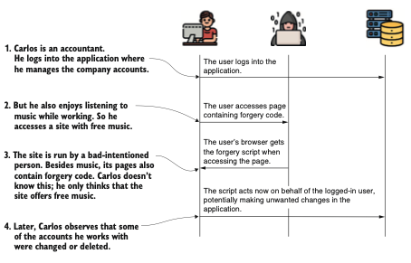

Después de que el usuario inicia sesión en su cuenta, accede a una página que contiene código de 
falsificación. Este código suplanta al usuario y puede ejecutar acciones no deseadas en su nombre.

`¿Cómo protegemos a nuestros usuarios de tales escenarios?` La protección CSRF tiene como objetivo 
garantizar que solo el frontend de las aplicaciones web pueda realizar operaciones que modifiquen 
datos (por convención, métodos HTTP distintos de `GET, HEAD, TRACE u OPTIONS`). De esta forma, una 
página externa, como la del ejemplo, no puede actuar en nombre del usuario.

`¿Cómo podemos lograrlo?` Lo que se sabe con certeza es que, antes de poder realizar cualquier acción 
que pueda cambiar datos, el usuario debe enviar una solicitud mediante `HTTP GET` para ver la página 
web al menos una vez. Cuando esto ocurre, la aplicación genera un token único. A partir de ese 
momento, la aplicación solo acepta solicitudes para operaciones de modificación `(POST, PUT, DELETE,
etc.)` que contengan este valor único en la cabecera.

La aplicación considera que conocer el valor del token es una prueba de que es la propia aplicación
la que realiza la solicitud de modificación, y no otro sistema. Cualquier página que contenga 
llamadas de modificación, como `POST, PUT, DELETE, etc.`, debe recibir el `token CSRF` en la respuesta, 
y la página debe usar este token al realizar llamadas que modifiquen el estado.

El punto de partida de la protección `CSRF` es un filtro en la cadena de filtros llamado `CsrfFilter`.
El `CsrfFilter` intercepta las solicitudes y permite todas aquellas que utilizan estos métodos `HTTP: 
GET, HEAD, TRACE y OPTIONS`. Para todas las demás solicitudes, el filtro espera recibir una cabecera 
que contenga un token. Si esta cabecera no existe o contiene un valor de token incorrecto, la 
aplicación rechaza la solicitud y establece el estado de la respuesta en `HTTP 403 Prohibido`.

`¿Qué es este token, y de dónde proviene?` Estos tokens no son más que valores de cadena. Debes 
agregar el token en la cabecera de la solicitud cuando uses cualquier método distinto de `GET, HEAD,
TRACE u OPTIONS`. Si no haces esto, la aplicación no acepta la solicitud, como se muestra en la 
siguiente figura.

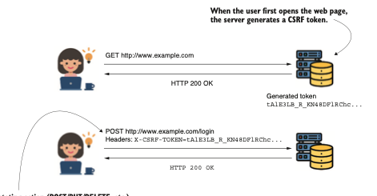

Para realizar una solicitud POST, el cliente necesita agregar una cabecera que contenga el token 
`CSRF`. La aplicación genera un token `CSRF` cuando se carga la página (mediante una solicitud GET), y 
el token se añade a todas las solicitudes que se pueden realizar desde la página cargada. De esta 
manera, solo la página cargada puede realizar solicitudes que modifiquen el estado.

El `CsrfFilter` (siguiente figura) utiliza un componente llamado `CsrfTokenRepository` para gestionar los 
valores del token `CSRF`, generar nuevos tokens, almacenarlos y, eventualmente, invalidarlos. Por 
defecto, `CsrfTokenRepository` almacena el token en la sesión `HTTP` y genera los tokens como valores 
de cadena aleatorios. En la mayoría de los casos, esto es suficiente, pero como aprenderás en la 
sección 9.3, puedes usar tu propia implementación de `CsrfTokenRepository` si la predeterminada no se
ajusta a los requisitos que necesitas implementar.

En esta sección, he explicado cómo funciona la protección `CSRF` en Spring Security con abundante 
texto y figuras. Pero quiero reforzar tu comprensión con un pequeño ejemplo de código también. 
Encontrarás este código como parte del proyecto llamado ssia-ch9-ex1. Vamos a crear una aplicación
que exponga dos puntos finales. Podemos llamar a uno de ellos con `HTTP GET y al otro con HTTP POST`.

Como ya sabes, no puedes llamar a puntos finales con `POST` directamente sin desactivar la protección
`CSRF`. En este ejemplo, aprenderás cómo llamar al endpoint POST sin desactivar la protección `CSRF`.
Necesitas obtener el token `CSRF` para poder usarlo en la cabecera de la llamada, lo cual haces con 
`HTTP POST`.

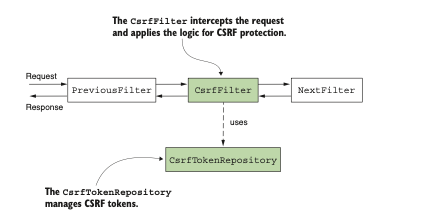

El `CsrfFilter` es uno de los filtros en la cadena de filtros. Recibe la solicitud y eventualmente la 
reenvía al siguiente filtro en la cadena. Para gestionar los tokens `CSRF`, `CsrfFilter` utiliza un 
`CsrfTokenRepository`.

Como se aprende de este ejemplo, el `CsrfFilter` agrega el token `CSRF` generado al atributo de la 
solicitud HTTP llamado _csrf (siguiente figura). Si conocemos esto, sabemos que después del `CsrfFilter`, 
podemos encontrar este atributo y obtener el valor del token.

Para esta pequeña aplicación, elegimos agregar un filtro personalizado después del `CsrfFilter`, como
aprendiste en el capítulo 5. Usas este filtro personalizado para imprimir el token `CSRF` en la 
consola de la aplicación que genera la aplicación cuando llamamos al punto final usando `HTTP GET`. 
Luego podemos copiar el valor del token desde la consola y usarlo para hacer la llamada de 
modificación con `HTTP POST`. En el siguiente codigo, puedes encontrar la definición de la clase 
controlador con los dos puntos finales que usamos para una prueba.

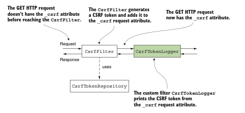

The controller class with two endpoints:
```java
@RestController
public class HelloController {
    @GetMapping("/hello")
    public String getHello() {
        return "Get Hello!";
    }

    @PostMapping("/hello")
    public String postHello() {
        return "Post Hello!";
    }
}
```
En el anterior codigo se define el filtro personalizado que usamos para imprimir el valor del token 
`CSRF` en la consola. He nombrado al filtro personalizado `CsrfTokenLogger`. Cuando se llama, el 
filtro obtiene el valor del `token CSRF` del atributo de la solicitud _csrf e imprime ese valor en la
consola. El nombre del atributo de la solicitud, _csrf, es donde el `CsrfFilter` establece el valor 
del `token CSRF` generado como una instancia de la clase `CsrfToken`. Esta instancia de `CsrfToken` 
contiene el valor en forma de cadena del `token CSRF`. Puedes obtenerlo llamando al método `getToken()`.

The definition of the custom filter class:
```java
public class CsrfTokenLogger implements Filter {
    private Logger logger =
            Logger.getLogger(CsrfTokenLogger.class.getName());

    @Override
    public void doFilter(
            ServletRequest request,
            ServletResponse response,
            FilterChain filterChain)
            throws IOException, ServletException {
        //Obtiene el valor del token del atributo de la solicitud _csrf e imprime ese valor en la consola.
        CsrfToken o =
                (CsrfToken) request.getAttribute("_csrf");
        logger.info("CSRF token " + token.getToken());
        filterChain.doFilter(request, response);
    }
}
```
En la clase de configuración, agregamos el filtro personalizado. El siguiente listado presenta la 
clase de configuración. Observe que no desactivo la protección CSRF en el listado.

Adding the custom filter in the configuration class:
```java
@Configuration
public class ProjectConfig {
    @Bean
    public SecurityFilterChain configure(HttpSecurity http)
            throws Exception {
        http.addFilterAfter(
                        new CsrfTokenLogger(), CsrfFilter.class)
                .authorizeHttpRequests(
                        c -> c.anyRequest().permitAll()
                );
        return http.build();
    }
}
```
Ahora podemos probar los endpoints. Comenzamos llamando al endpoint con `HTTP GET`. Dado que 
la implementación predeterminada de la interfaz `CsrfTokenRepository` utiliza la sesión HTTP para 
almacenar el valor del token en el lado del servidor, también necesitamos recordar el ID de sesión.
Por esta razón, agrego la bandera -v a la llamada para poder ver más detalles de la respuesta, 
incluido el ID de sesión. Llamar al endpoint.

`curl -v http://localhost:8080/hello`

devuelve esta respuesta (truncada):

`...
< Set-Cookie: JSESSIONID=21ADA55E10D70BA81C338FFBB06B0206;
...
Get Hello!`

Después de la solicitud, en la consola de la aplicación, puedes encontrar una línea de registro que
contiene el `token CSRF`:

`INFO 21412 --- [nio-8080-exec-1] c.l.ssia.filters.CsrfTokenLogger : CSRF token tAlE3LB_R_KN48DFlRChc…`

NOTA: Es posible que te preguntes cómo los clientes obtienen el `token CSRF`. No pueden adivinarlo ni 
leerlo en los registros del servidor. Diseñé este ejemplo para que te sea más fácil entender cómo 
funciona la implementación de la protección CSRF. Como verás en la sección 9.2, la aplicación 
backend tiene la responsabilidad de agregar el valor del `token CSRF` en la respuesta HTTP para que 
el cliente lo utilice.

Si llama al punto final utilizando el método HTTP POST sin proporcionar el token CSRF, el estado 
de la respuesta es `403 Prohibido`, como muestra esta línea de comandos:

`curl -XPOST http://localhost:8080/hello`

El cuerpo de la respuesta es
```json
{
  "status":403,
  "error":"Forbidden",
  "message":"Forbidden",
  "path":"/hello" 
}
```
Pero si proporciona el valor correcto para el token CSRF, la llamada es exitosa. También debe especificar el ID de sesión (JSESSIONID), porque la implementación predeterminada de CsrfTokenRepository almacena el valor del token CSRF en la sesión:

`curl -X POST http://localhost:8080/hello \
-H 'Cookie: JSESSIONID=21ADA55E10D70BA81C338FFBB06B0206' \
-H 'X-CSRF-TOKEN: tAlE3LB_R_KN48DFlRChc…'`

El cuerpo de la respuesta es
Post Hello!

## 9.2 Usar la protección CSRF en escenarios prácticos.

En esta sección, discutimos la aplicación de la protección `CSRF` en situaciones reales. Ahora que 
sabes cómo funciona la protección `CSRF` en Spring Security, necesitas saber dónde debes usarla en el
mundo real. `¿Qué tipo de aplicaciones necesitan utilizar la protección CSRF?`

Utilizas la protección `CSRF` para aplicaciones web que se ejecutan en un navegador, donde se espera 
que operaciones que modifican el estado sean realizadas por el navegador que carga el contenido
mostrado de la aplicación. El ejemplo más básico que puedo proporcionar aquí es una aplicación web 
sencilla desarrollada con el flujo estándar de `Spring MVC`. Ya creamos una aplicación así al hablar 
del inicio de sesión con formulario en el capítulo 6, y esa aplicación web en realidad usaba 
`protección CSRF`. `¿Te diste cuenta de que la operación de inicio de sesión en esa aplicación usaba 
HTTP POST?` Entonces, `¿por qué no tuvimos que hacer nada explícitamente sobre CSRF en ese caso?` La 
razón por la que no lo observamos fue porque no desarrollamos ninguna operación que modificara el 
estado allí.

Para el inicio de sesión con formulario por defecto, Spring Security aplica correctamente la 
protección `CSRF` por nosotros. El framework se encarga de agregar el `token CSRF` a la solicitud de 
inicio de sesión. Ahora vamos a desarrollar una aplicación similar para analizar más de cerca cómo 
funciona la `protección CSRF`. Como muestra la siguiete figura, en esta sección:

- Crearemos un ejemplo de aplicación web con un formulario de inicio de sesión
- Veremos cómo la implementación predeterminada del inicio de sesión utiliza `tokens CSRF`
- Implementaremos una llamada `HTTP POST` desde la página principal

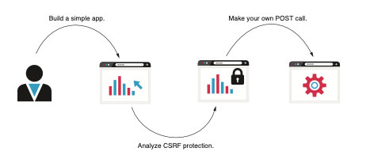

El plan. En esta sección, comenzamos construyendo y analizando una aplicación sencilla para entender
cómo Spring Security aplica la `protección CSRF`, y luego escribimos nuestra propia llamada POST.
En esta aplicación de ejemplo, notarás que la llamada `HTTP POST` no funcionará hasta que usemos 
correctamente los `tokens CSRF`, y aquí aprenderás cómo aplicar los `tokens CSRF` en un formulario en 
dicha página web. Para implementar esta aplicación, comenzamos creando un nuevo proyecto Spring Boot.
Puedes encontrar este ejemplo en el proyecto ssia-ch9-ex2. El siguiente fragmento de código presenta
las dependencias necesarias:
```xml
<dependency>
    <groupId>org.springframework.boot</groupId>
    <artifactId>spring-boot-starter-security</artifactId>
</dependency>
<dependency>
    <groupId>org.springframework.boot</groupId>
    <artifactId>spring-boot-starter-thymeleaf</artifactId>
</dependency>
<dependency>
    <groupId>org.springframework.boot</groupId>
    <artifactId>spring-boot-starter-web</artifactId>
</dependency>
```

A continuación, por supuesto, necesitamos configurar el inicio de sesión con formulario y al menos 
un usuario. El siguiente listado presenta la clase de configuración, que define el 
`UserDetailsService`, agrega un usuario y configura el método `formLogin`.

The definition of the configuration class:
```java
public class ProjectConfig {
    @Bean
    public UserDetailsService uds() {
        var uds = new InMemoryUserDetailsManager();
        var u1 = User.withUsername("mary")
                .password("12345")
                .authorities("READ")
                .build();
        uds.createUser(u1);
        return uds;
    }

    @Bean
    public PasswordEncoder passwordEncoder() {
        return NoOpPasswordEncoder.getInstance();
    }

    @Bean
    public SecurityFilterChain securityFilterChain(HttpSecurity http)
            throws Exception {
        http.formLogin(
                c -> c.defaultSuccessUrl("/main", true)
        );
        http.authorizeHttpRequests(
                c -> c.anyRequest().authenticated()
        );
        return http.build();
    }
}
```
Agregamos una clase controlador para la página principal en un paquete llamado `controllers` y un 
archivo `main.html` en la carpeta `resources/templates` del proyecto Maven. El archivo `main.html` puede 
permanecer vacío por ahora porque en la primera ejecución de la aplicación, nos enfocamos únicamente
en cómo la página de inicio de sesión utiliza los `tokens CSRF`. El siguiente listado presenta la 
clase `MainController`, que sirve la página principal.

The definition of the MainController class:
```java
@Controller
public class MainController {
    @GetMapping("/main")
    public String main() {
        return "main.html";
    }
}
```
Después de ejecutar la aplicación, puedes acceder a la página de inicio de sesión predeterminada. 
Si inspeccionas el formulario utilizando la función de inspección de elementos de tu navegador, 
puedes observar que la implementación predeterminada del formulario de inicio de sesión envía el
`token CSRF`. ¡Por eso tu inicio de sesión funciona con la `protección CSRF` habilitada incluso si 
utiliza una solicitud `HTTP POST!` La siguiente figura muestra cómo el formulario de inicio de 
sesión envía el `token CSRF` a través de un campo de entrada oculto.

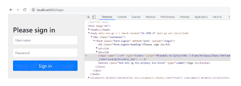

El inicio de sesión con formulario predeterminado utiliza un campo oculto para enviar el `token CSRF`
en la solicitud. Por eso, la solicitud de inicio de sesión que usa el método `HTTP POST` funciona con 
la `protección CSRF` habilitada.

Pero, `¿qué pasa con desarrollar nuestros propios puntos finales que usan POST, PUT o DELETE como 
métodos HTTP?` Para estos, debemos encargarnos de enviar el valor del `token CSRF` si la protección 
`CSRF` está habilitada. Para probar esto, agreguemos un endpoint que use `HTTP POST` a nuestra 
aplicación. Llamamos a este endpoint desde la página principal, y creamos un segundo `controlador`
para esto, llamado `ProductController`. Dentro de este controlador, definimos un endpoint, 
`/product/add`, que usa `HTTP POST`. A continuación, usamos un formulario en la página principal para 
llamar a este punto final. El siguiente listado define la clase `ProductController`.

The definition of the ProductController class:
```java
@Controller
@RequestMapping("/product")
public class ProductController {
    private Logger logger =
            Logger.getLogger(ProductController.class.getName());

    @PostMapping("/add")
    public String add(@RequestParam String name) {
        logger.info("Adding product " + name);
        return "main.html";
    }
}
```
El endpoint recibe un parámetro de solicitud e imprime su valor en la consola de la aplicación. 
El siguiente codigo muestra la definición del formulario definido en el archivo `main.html`.

The definition of the form in the main.html page:
```html
<form action="/product/add" method="post">
    <span>Name:</span>
    <span><input type="text" name="name" /></span>
    <span><button type="submit">Add</button></span>
</form>
```
Ahora puedes volver a ejecutar la aplicación y probar el formulario. Observarás que al enviar la 
solicitud, se muestra una página de error predeterminada, lo que confirma un estado `HTTP 403` 
Prohibido en la respuesta del servidor (siguiente imagen). La razón de este estado es la ausencia del 
`token CSRF`.

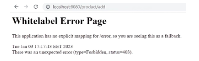

Si no se incluye el `token CSRF`, el servidor rechazará cualquier solicitud realizada mediante el 
método `HTTP POST`. El usuario será redirigido a una página de error estándar que muestra un estado 
`HTTP 403` Prohibido en la respuesta.

Para resolver este problema y permitir que el servidor acepte la solicitud, debemos agregar el
`token CSRF` a la solicitud realizada a través del formulario. Una forma sencilla de hacerlo es 
utilizar un campo de entrada oculto, como viste en el formulario de inicio de sesión predeterminado.
Esto puede implementarse como se presenta en el siguiente listado.

Agregar el token CSRF a la solicitud realizada a través del formulario:
```html
<form action="/product/add" method="post">
    <span>Name:</span>
    <span><input type="text" name="name" /></span>
    <span><button type="submit">Add</button></span>
    <!-- Utiliza un campo de entrada oculto para agregar el token CSRF a la solicitud. El prefijo 
    "th" permite a Thymeleaf imprimir el valor del token. -->
    <input type="hidden"
        th:name="${_csrf.parameterName}"
        th:value="${_csrf.token}" />
</form>
```
`NOTA`: En el ejemplo, usamos `Thymeleaf` porque proporciona una manera sencilla de obtener el valor 
del atributo de la solicitud en la vista. En nuestro caso, necesitamos imprimir el `token CSRF`. 
Recuerda que `CsrfFilter` agrega el valor del token en el atributo `_csrf` de la solicitud. No es 
obligatorio hacerlo con `Thymeleaf`; puedes usar cualquier alternativa de tu elección para imprimir 
el valor del token en la respuesta.
Después de volver a ejecutar la aplicación, puedes probar el formulario nuevamente. Esta vez, el 
servidor acepta la solicitud y la aplicación imprime la línea de registro en la consola, lo que 
demuestra que la ejecución fue exitosa. Además, si inspeccionas el formulario, puedes encontrar el 
campo de entrada oculto con el valor del `token CSRF` (siguiente figura).

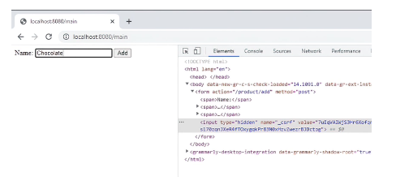

El formulario definido en la página principal ahora envía el valor del `token CSRF` en la solicitud. 
De esta manera, el servidor permite la solicitud y ejecuta la acción del controlador. En el código 
fuente de la página, ahora puedes encontrar el campo de entrada oculto que utiliza el formulario 
para enviar el `token CSRF` en la solicitud.
Después de enviar el formulario, deberías encontrar en la consola de la aplicación una línea similar
a esta:

`INFO 20892 --- [nio-8080-exec-7] c.l.s.controllers.ProductController : Agregando producto Chocolate`

Por supuesto, para cualquier acción o solicitud JavaScript asíncrona que tu página use para invocar 
una acción que modifique datos, necesitas enviar un `token CSRF válido`. Esta es la forma más común 
que utiliza una aplicación para asegurarse de que la solicitud no proviene de un tercero. Una 
solicitud de terceros podría intentar suplantar al usuario para ejecutar acciones en su nombre.
Los `tokens CSRF` funcionan bien en una arquitectura donde el mismo servidor es responsable tanto 
del frontend como del backend, principalmente por su simplicidad. Pero los `tokens CSRF` no funcionan 
bien cuando el cliente es independiente de la solución de backend que consume. Este escenario 
ocurre cuando tienes una aplicación móvil como cliente o un frontend web desarrollado 
independientemente. Un cliente web desarrollado con un framework como Angular, ReactJS o Vue.js es 
muy común en las arquitecturas de aplicaciones web, y por eso necesitas saber cómo implementar el 
enfoque de seguridad también para estos casos. Discutiremos este tipo de diseños en la parte 4 de 
este libro.
En los capítulos 13 al 16, aprenderás a implementar la especificación OAuth 2, que tiene excelentes
ventajas al desacoplar los componentes. Esto separa la autenticación de los recursos para los cuales
la aplicación autoriza al cliente.

`NOTA`: Puede parecer un error trivial, pero en mi experiencia, lo veo demasiadas veces en 
aplicaciones: nunca uses `HTTP GET` con operaciones que modifican datos! No implementes 
comportamientos que cambien datos y permitan que se invoquen mediante un endpoint `HTTP GET`. 
Recuerda que las llamadas a `endpoints HTTP GET` no requieren un `token CSRF`.

## 9.3 Personalización de la protección CSRF

En esta sección, aprenderás a personalizar la solución de `protección CSRF` ofrecida por Spring 
Security. Dado que las aplicaciones tienen diversos requisitos, cualquier implementación 
proporcionada por un framework debe ser lo suficientemente flexible para adaptarse fácilmente a 
diferentes escenarios. El mecanismo de `protección CSRF` en Spring Security no es una excepción. En 
esta sección, los ejemplos te permitirán aplicar las necesidades más comunes que surgen al 
personalizar el mecanismo de `protección CSRF`. Estas son:

- Configurar las rutas a las que se aplica CSRF
- Gestionar los tokens CSRF

Utilizamos la `protección CSRF` solo cuando la página que consume recursos generados por el servidor 
es ella misma generada por el mismo servidor. Puede tratarse de una aplicación web donde los 
endpoints consumidos están expuestos por un origen diferente, como se discutió en la sección 9.2, 
o de una aplicación móvil. En el caso de aplicaciones móviles, puedes utilizar el `flujo OAuth 2`, 
que se tratará en los capítulos 13 al 16.

Por defecto, la `protección CSRF` se aplica a cualquier ruta para endpoints llamados con métodos 
`HTTP distintos de GET, HEAD, TRACE u OPTIONS.` Ya sabes del capítulo 5 cómo deshabilitar 
completamente la `protección CSRF`. Pero, `¿qué sucede si deseas deshabilitarla solo para algunas 
rutas de tu aplicación?` Puedes realizar esta configuración rápidamente con un objeto `Customizer`, 
de forma similar a cómo personalizamos `HTTP Basic` para métodos de inicio de sesión con formulario 
en el capítulo 6.

Aquí, creamos un nuevo proyecto y agregamos solo las dependencias web y de seguridad, como se 
presenta en el siguiente fragmento de código. Puedes encontrar este ejemplo en el proyecto 
ssia-ch9-ex3. A continuación se muestran las dependencias:
```xml
<dependency>
    <groupId>org.springframework.boot</groupId>
    <artifactId>spring-boot-starter-security</artifactId>
</dependency>
<dependency>
    <groupId>org.springframework.boot</groupId>
    <artifactId>spring-boot-starter-web</artifactId>
</dependency>
```
En esta aplicación, agregamos dos endpoints llamados con `HTTP POST`, pero queremos excluir uno de 
ellos de la protección CSRF (siguiente figura). El siguiente codigo define la clase controladora 
para esto, que he denominado `HelloController`.

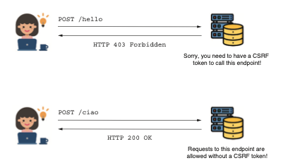

La aplicación requiere un `token CSRF` para el endpoint `/hello` llamado con `HTTP POST`, pero permite 
solicitudes `HTTP POST` al endpoint `/ciao` sin un `token CSRF`.

The definition of the HelloController class:
```java
@RestController
public class HelloController {
    //La ruta /hello permanece bajo protección CSRF. No puedes llamar al endpoint sin un token CSRF válido.
    @PostMapping("/hello")
    public String postHello() {
        return "Post Hello!";
    }

    @PostMapping("/ciao")
    //La ruta /ciao puede ser llamada sin un token CSRF.
    public String postCiao() {
        return "Post Ciao";
    }
}
```
Para realizar personalizaciones en la `protección CSRF`, puedes utilizar el método `csrf()` del objeto 
`HttpSecurity` en el método `securityFilterChain()` junto con un objeto `Customizer`. El siguiente codigo
presenta este enfoque.

A Customizer object for the configuration of CSRF protection:
```java
@Configuration
public class ProjectConfig {
    @Bean
    public SecurityFilterChain securityFilterChain(HttpSecurity http)
            throws Exception {
        //El parámetro de la expresión lambda es un CsrfConfigurer. Al llamar a sus métodos, puedes
        // configurar la protección CSRF de varias formas.
        http.csrf(c -> {
            c.ignoringRequestMatchers("/ciao");
        });
        http.authorizeHttpRequests(
                c -> c.anyRequest().permitAll()
        );
        return http.build();
    }
}
```
Al llamar al método `ignoringRequestMatchers(String paths)`, puedes especificar las expresiones de 
ruta que representan las rutas que deseas excluir del mecanismo de `protección CSRF`. Un enfoque más 
general es usar un `RequestMatcher`. Esto te permite aplicar las reglas de exclusión con expresiones 
de ruta regulares, así como con expresiones regulares (regex). Al usar el método 
`ignoringRequestMatchers()` del objeto `CsrfCustomizer`, puedes proporcionar cualquier `RequestMatcher` 
como parámetro. El siguiente fragmento de código muestra cómo usar el método 
`ignoringRequestMatchers()` con un `MvcRequestMatcher` en lugar de usar `ignoringRequestMatchers()` con
una ruta dada como valor de tipo String:
```java
HandlerMappingIntrospector i = new HandlerMappingIntrospector();
MvcRequestMatcher r = new MvcRequestMatcher(i, "/ciao");
c.ignoringRequestMatchers(r);
```
O puedes usar de forma similar un comparador de expresiones regulares (regex):
```java
String pattern = ".*[0-9].*";
String httpMethod = HttpMethod.POST.name();
RegexRequestMatcher r = new RegexRequestMatcher(pattern, httpMethod);
c.ignoringRequestMatchers(r);
```
Otra necesidad que a menudo se encuentra en los requisitos de la aplicación es personalizar la 
gestión de los `tokens CSRF`. Como has aprendido, por defecto, la aplicación almacena los `tokens CSRF`
en la sesión HTTP del lado del servidor. Este enfoque sencillo es adecuado para aplicaciones 
pequeñas, pero no es ideal para aplicaciones que manejan un gran número de solicitudes y requieren 
escalabilidad horizontal. La sesión HTTP es con estado y reduce la escalabilidad de la aplicación.

Supongamos que deseas cambiar la forma en que la aplicación gestiona los tokens y almacenarlos en 
una base de datos en lugar de en la sesión HTTP. Spring Security ofrece tres contratos que debes 
implementar para lograrlo: 

- CsrfToken: describe el token CSRF en sí
- CsrfTokenRepository: describe el objeto que crea, almacena y carga los tokens CSRF
- CsrfTokenRequestHandler: describe el objeto que gestiona cómo se establece el token CSRF generado 
en la solicitud HTTP

El objeto CsrfToken tiene tres características principales que debes especificar al implementar el 
contrato (el siguiente codigo define el contrato CsrfToken):

- El nombre del encabezado en la solicitud que contiene el valor del token CSRF (por defecto 
llamado X-CSRF-TOKEN)
- El nombre del atributo de la solicitud que almacena el valor del token (por defecto llamado _csrf)
- El valor del token

The definition of the CsrfToken interface:
```java
public interface CsrfToken extends Serializable {
    String getHeaderName();

    String getParameterName();

    String getToken();
}
```
Generalmente, solo necesitas una instancia del tipo `CsrfToken` para almacenar los tres detalles en 
los atributos de la instancia. Para esta funcionalidad, Spring Security ofrece una implementación 
llamada `DefaultCsrfToken` que también usamos en nuestro ejemplo. `DefaultCsrfToken` implementa el 
contrato `CsrfToken` y crea instancias inmutables que contienen los valores requeridos: el nombre 
del atributo y del encabezado de la solicitud, y el propio token.

La interfaz `CsrfTokenRepository` es el contrato que representa el componente que gestiona los 
`tokens CSRF`. Para cambiar la forma en que la aplicación maneja los tokens, necesitas implementar 
la interfaz `CsrfTokenRepository`, lo que te permite integrar tu propia implementación personalizada
en el framework. Vamos a modificar la aplicación actual que usamos en esta sección para agregar
una nueva implementación de `CsrfTokenRepository`, que almacene los tokens en una base de datos. 
La siguiente figura presenta los componentes que implementamos para este ejemplo y la relación 
entre ellos.

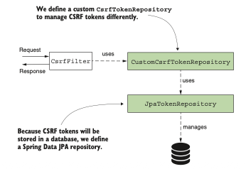

El `CsrfToken` utiliza una implementación personalizada de `CsrfTokenRepository`. Esta implementación 
personalizada utiliza un `JpaRepository` para gestionar los `tokens CSRF` en una base de datos.

En nuestro ejemplo, utilizamos una tabla en una base de datos para almacenar los `tokens CSRF`. 
Suponemos que el cliente tiene un ID para identificarse de forma única. La aplicación necesita 
este identificador para obtener el `token CSRF` y validarlo. Generalmente, este ID único se obtendría
durante el inicio de sesión y debería ser diferente cada vez que el usuario inicie sesión. Esta 
estrategia de gestión de tokens es similar a almacenarlos en memoria; en ese caso, se utiliza un 
ID de sesión. Así, el nuevo identificador en este ejemplo simplemente reemplaza al ID de sesión.

Una alternativa a este enfoque sería usar `tokens CSRF` con una duración definida. Con este método, 
los tokens expiran tras un tiempo determinado. Puedes almacenar los tokens en la base de datos sin
vincularlos a un ID de usuario específico. Solo necesitas verificar si un token proporcionado 
mediante una solicitud HTTP existe y no ha expirado para decidir si permites esa solicitud.

`EJERCICIO`: Una vez que termines con este ejemplo, donde usamos un identificador al que asignamos 
el `token CSRF`, implementa el segundo enfoque, en el que usas `tokens CSRF` que expiran.

Para acortar nuestro ejemplo, nos enfocamos únicamente en la implementación de `CsrfTokenRepository`,
y debemos considerar que el cliente ya tiene un identificador generado. Para trabajar con la base 
de datos, necesitamos agregar algunas dependencias más al archivo pom.xml:
```xml
<dependency>
    <groupId>org.springframework.boot</groupId>
    <artifactId>spring-boot-starter-data-jpa</artifactId>
</dependency>
<dependency>
    <groupId>com.mysql</groupId>
    <artifactId>mysql-connector-j</artifactId>
</dependency>
```
En el archivo application.properties, debemos agregar las propiedades para la conexión a la base 
de datos:
```properties
spring.datasource.url=jdbc:mysql://localhost/spring
➥?useLegacyDatetimeCode=false&serverTimezone=UTC
spring.datasource.username=root
spring.datasource.password=
spring.sql.init.mode=always
```
Para permitir que la aplicación cree la tabla necesaria en la base de datos al iniciar, puedes 
agregar el archivo schema.xml en la carpeta de recursos del proyecto. Este archivo debe contener 
la consulta para crear la tabla:
```sql
CREATE TABLE IF NOT EXISTS `spring`.`token` (
    `id` INT NOT NULL AUTO_INCREMENT,
    `identifier` VARCHAR(45) NULL,
    `token` TEXT NULL,
PRIMARY KEY (`id`));
```
Utilizamos Spring Data con una implementación `JPA` para conectarnos a la base de datos, por lo tanto,
necesitamos definir la clase de la entidad y la clase `JpaRepository`. En un paquete denominado 
`entities`, definimos la entidad `JPA` como se presenta en el siguiente listado.

The definition of the JPA entity class:
```java
@Entity
public class Token {
    @Id
    @GeneratedValue(strategy = GenerationType.IDENTITY)
    private int id;
    //El identificador del cliente.
    private String identifier;
    //El token CSRF generado por la aplicación para el cliente
    private String token;
// Omitted code
}
```
El `JpaTokenRepository`, que es nuestro contrato `JpaRepository`, puede definirse como se muestra en 
el siguiente listado. El único método que necesitas es `findTokenByIdentifier()`, que obtiene el 
`token CSRF` de la base de datos para un cliente específico.

The definition of the JpaTokenRepository interface:
```java
public interface JpaTokenRepository
extends JpaRepository<Token, Integer> {
    Optional<Token> findTokenByIdentifier(String identifier);
}
```
Con acceso a la base de datos implementada, ahora podemos comenzar a escribir la implementación de
`CsrfTokenRepository`, a la que llamo `CustomCsrfTokenRepository`. La siguiente lista define esta 
clase, que anula los tres métodos de `CsrfTokenRepository`.

The implementation of the CsrfTokenRepository contract:
```java
@Component
public class CustomCsrfTokenRepository implements CsrfTokenRepository {
    private final JpaTokenRepository jpaTokenRepository;

    // Omitted constructor
    @Override
    public CsrfToken generateToken(
            HttpServletRequest httpServletRequest) {
// ...
    }

    @Override
    public void saveToken(
            CsrfToken csrfToken,
            HttpServletRequest httpServletRequest,
            HttpServletResponse httpServletResponse) {
// ...
    }

    @Override
    public CsrfToken loadToken(
            HttpServletRequest httpServletRequest) {
// ...
    }
}
```
`CustomCsrfTokenRepository` inyecta una instancia de `JpaTokenRepository` desde el contexto de Spring 
para acceder a la base de datos. `CustomCsrfTokenRepository` utiliza esta instancia para recuperar o 
guardar los `tokens CSRF` en la base de datos. El mecanismo de `protección CSRF` llama al método 
`generateToken()` cuando la aplicación necesita generar un nuevo token. El siguiente codigo ilustra la 
implementación de este método para nuestro ejercicio. Usamos la clase UUID para generar un nuevo 
valor UUID aleatorio, y mantenemos los mismos nombres para el encabezado y el atributo de la 
solicitud, X-CSRF-TOKEN y _csrf, como en la implementación predeterminada ofrecida por 
Spring Security.

The implementation of the generateToken() method:
```java
@Override
public CsrfToken generateToken(HttpServletRequest httpServletRequest) {
    String uuid = UUID.randomUUID().toString();
    return new DefaultCsrfToken("X-CSRF-TOKEN", "_csrf", uuid);
}
```
El método `saveToken()` guarda un token generado para un cliente específico. En el caso de la 
implementación predeterminada de la `protección CSRF`, la aplicación utiliza la sesión HTTP para 
identificar el `token CSRF`. En nuestro caso, asumimos que el cliente tiene un identificador único. 
El cliente envía el valor de su ID único en la solicitud mediante el encabezado llamado 
`X-IDENTIFIER`. En la lógica del método, verificamos si el valor existe en la base de datos. Si 
existe, actualizamos la base de datos con el nuevo valor del token. Si no, creamos un nuevo 
registro para este ID con el nuevo valor del `token CSRF`. El siguiente listado presenta la 
implementación del método `saveToken()`.

The implementation of the saveToken() method:
```java
@Override
public void saveToken(
CsrfToken csrfToken,
HttpServletRequest httpServletRequest,
HttpServletResponse httpServletResponse) {
    String identifier =
            httpServletRequest.getHeader("X-IDENTIFIER");
    //Obtiene el token desde la base de datos mediante el ID del cliente
    Optional<Token> existingToken =
            jpaTokenRepository.findTokenByIdentifier(identifier);
    //Si el ID existe, actualiza el valor del token con un valor recién generado.
    if (existingToken.isPresent()) {
        Token token = existingToken.get();
        token.setToken(csrfToken.getToken());
    //Si el ID no existe, crea un nuevo registro para el ID con un valor generado para el token CSRF.
    } else {
        Token token = new Token();
        token.setToken(csrfToken.getToken());
        token.setIdentifier(identifier);
        jpaTokenRepository.save(token);
    }
}
```
El método `loadToken()` implementado carga los detalles del token (si estos existen) o devuelve null
en caso contrario. El siguiente listado muestra esta implementación.

The implementation of the loadToken() method:
```java
@Override
public CsrfToken loadToken(
HttpServletRequest httpServletRequest) {
    String identifier = httpServletRequest.getHeader("X-IDENTIFIER");
    Optional<Token> existingToken =
            jpaTokenRepository
                    .findTokenByIdentifier(identifier);
    if (existingToken.isPresent()) {
        Token token = existingToken.get();
        return new DefaultCsrfToken(
                "X-CSRF-TOKEN",
                "_csrf",
                token.getToken());
    }
    return null;
}
```
Usamos una implementación personalizada de `CsrfTokenRepository` para declarar un bean en la clase de
configuración. Luego, integramos el bean en el mecanismo de `protección CSRF` mediante el método 
`csrfTokenRepository()` de `CsrfConfigurer`. El siguiente listado define esta clase de configuración.

The configuration class for the custom CsrfTokenRepository:
```java
@Configuration
public class ProjectConfig {
    private final CustomCsrfTokenRepository customTokenRepository;

    // Omitted constructor
    @Bean
    public SecurityFilterChain securityFilterChain(HttpSecurity http)
            throws Exception {
        http.csrf(c -> {
            //Utiliza el objeto Customizer<CsrfConfigurer> para integrar la nueva implementación 
            // de CsrfTokenRepository en el mecanismo de protección CSRF.
            c.csrfTokenRepository(customTokenRepository);
        });
        http.authorizeHttpRequests(
                c -> c.anyRequest().permitAll()
        );
        return http.build();
    }
}
```
La última pieza que necesitamos integrar para que todo funcione correctamente es un 
`CsrfTokenRequestHandler`. Afortunadamente, podemos usar una implementación que proporciona Spring 
Security: `CsrfTokenRequestAttributeHandler`. Esta implementación simplemente usa el método 
`generateToken()` de `CsrfTokenRepository` para generar un nuevo token cuando se llama a un endpoint 
mediante el método `HTTP GET`. Luego, agrega el `CsrfToken` generado a la solicitud como un atributo.

Puedes personalizar el comportamiento simple del objeto `CsrfTokenRequestAttributeHandler` 
extendiendo su clase. Por ejemplo, la implementación predeterminada que usa Spring Security 
`(llamada XorCsrfTokenRequestAttributeHandler)` tiene un comportamiento más complejo. Esta 
implementación genera un valor aleatorio usando un objeto `SecureRandom` y luego mezcla su arreglo 
de bytes con el token generado por `CsrfTokenRepository` usando una operación `lógica XOR`.

Sin embargo, para evitar agregar demasiada complejidad a nuestro ejemplo y permitirte centrarte 
en la parte de configuración, configuraremos un `CsrfTokenRequestAttributeHandler` simple para 
manejar la gestión del `token CSRF` en el objeto de solicitud HTTP. El siguiente codigo muestra 
cómo configurar el `CsrfTokenRequestAttributeHandler` en la clase de configuración.

The configuration class for the custom CsrfTokenRepository:
```java
@Configuration
public class ProjectConfig {
    private final CustomCsrfTokenRepository customTokenRepository;

    // Omitted constructor
    @Bean
    public SecurityFilterChain securityFilterChain(HttpSecurity http)
            throws Exception {
        http.csrf(c -> {
            c.csrfTokenRepository(customTokenRepository);
            c.csrfTokenRequestHandler(
                    //Configuración del objeto CsrfTokenRequestAttributeHandler para gestionar la 
                    // configuración del token CSRF en la solicitud HTTP.
                    new CsrfTokenRequestAttributeHandler()
            );
        });
        http.authorizeHttpRequests(
                c -> c.anyRequest().permitAll()
        );
        return http.build();
    }
}
```
En la definición de la clase controladora presentada en el siguiente codigo, también agregamos un 
endpoint que utiliza el método `HTTP GET`. Necesitamos este método para obtener el `token CSRF` al 
probar nuestra implementación:
```java
@GetMapping("/hello")
public String getHello() {
    return "Get Hello!";
}
```
Ahora puedes iniciar la aplicación y probar la nueva implementación para gestionar el token. 
Llamamos al endpoint usando HTTP GET para obtener un valor para el token CSRF. Al hacer la llamada,
debemos usar el ID del cliente dentro del encabezado X-IDENTIFIER, según lo asumido en el requisito.
Se genera un nuevo valor para el token CSRF y se almacena en la base de datos. Esta es la llamada:

`curl -H "X-IDENTIFIER:12345" http://localhost:8080/hello`

Get Hello!

Si buscas en la tabla de tokens en la base de datos, verás que la aplicación ha agregado un nuevo 
registro para el cliente con el identificador 12345. En mi caso, el valor generado para el 
token CSRF, que puedo ver en la base de datos, es 2bc652f5-258b-4a26-b456-928e9bad71f8.

Usamos este valor para llamar al endpoint /hello con el método HTTP POST, como muestra el siguiente
fragmento de código. Por supuesto, también debemos proporcionar el ID del cliente que la aplicación
usa para recuperar el token de la base de datos y compararlo con el que proporcionamos en la 
solicitud:

`curl -XPOST -H "X-IDENTIFIER:12345" -H "X-CSRF-TOKEN:2bc652f5-258b-4a26-b456-928e9bad71f8" 
http://localhost:8080/hello`

Post Hello!

La siguiente figura describe el flujo.
Si intentamos llamar al endpoint /hello con POST sin proporcionar los encabezados necesarios, 
obtenemos una respuesta con el estado HTTP 403 Forbidden. Para confirmarlo, llama al endpoint con:

`curl -XPOST http://localhost:8080/hello`

El cuerpo de la respuesta es
```json
{
  "status":403,
  "error":"Forbidden",
  "message":"Forbidden",
  "path":"/hello"
}
```
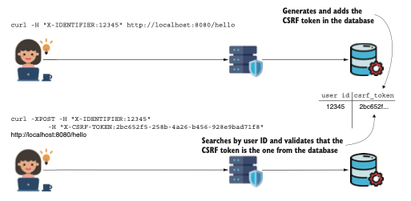

Primero, la solicitud GET genera el token CSRF y almacena su valor en la base de datos. Cualquier 
solicitud POST posterior debe enviar este valor. Luego, CsrfFilter verifica si el valor en la 
solicitud corresponde al que está en la base de datos. Según esto, la solicitud se acepta o rechaza.

### Resumen

- Un CSRF es un tipo de ataque en el que se engaña al usuario para que acceda a una página que 
contiene un script falsificado. Este script puede suplantar a un usuario registrado en una 
aplicación y ejecutar acciones en su nombre.
- La protección CSRF está habilitada por defecto en Spring Security.
- El punto de entrada de la lógica de protección CSRF en la arquitectura de Spring Security es un 
filtro HTTP.
- Puedes personalizar la funcionalidad de protección CSRF. Spring Security ofrece tres contratos 
simples que puedes implementar e integrar para definir capacidades personalizadas de protección CSRF:

    1. CsrfToken: describe el propio token CSRF
    2. CsrfTokenRepository: describe el objeto que crea, almacena y carga los tokens CSRF
    3. CsrfTokenRequestHandler: describe el objeto que gestiona la forma en que el token CSRF generado 
    se establece en la solicitud HTTP